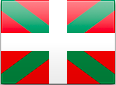

[✔]: assets/images/checkbox-small-blue.png

# Node.js-ren praktika onak

<h1 align="center">
  
</h1>

<br/>

<div align="center">
    
</div>

<br/>

[](https://twitter.com/nodepractices/) **Hemen ere bagaude!** [**@nodepractices**](https://twitter.com/nodepractices/)

<br/>

Irakurri beste hizkuntza batzuetan: [**EN**](./README.md), [**CN**](./README.chinese.md), [**BR**](./README.brazilian-portuguese.md), [**RU**](./README.russian.md), [**PL**](./README.polish.md),[**JA**](./README.japanese.md) [(**ES**, **FR**, **HE**, **KR** eta **TR** aribidean!)](#itzulpenak)

<br/>

###### Gure [Zuzendaritza Batzordeak ](#zuzendaritza-batzordea) eta [laguntzaileek](#Languntzaileak) eraiki eta mantentzen dute webgune hau

# Azken praktika onak eta albisteak

- ** Euskarazko itzulpena!:** wow gure euskal irakurleek ere gida hau bere ama-hizkuntzan irakur dezakete! [Ane Diaz de Tuesta](https://github.com/anediaz) eta Joxefe Diaz de Tuestaren eskutik

- **🇯🇵 Japonierazko itzulpena:** hemendik aurrera japonieraz erabili daiteke gure gida, [YukiOta](https://github.com/YukiOta) eta [Yuta Azumi](https://github.com/YA21) gure laguntzaile ikaragarriei esker

- **🎊 60.000 izar!**: Gure biltegiak 60.100 garatzaileren aitortza eta konfiantza jaso ditu. Hitzik gabe gaude

<br/><br/>

# Ongi etorri! Hasi aurretik jakin beharreko 3 gauza

**1. Hemen dozenaka artikulu dauzkazu, onenetarikoak Node.jsri buruz egindakoetan:** alegia, bilduma honek Node.jsren praktika onak jasotzen ditu, edukien arabera sailkatuta

**2. Dagoen bildumarik handiena da, eta astetik astera handiagoa da:** une honetan 80tik gora praktika, estilo eskuliburu eta arkitektura aholku dauzkagu bilduta. Gustura asko jasoko genituzke zure ekarpenak bilduma hau eguneratuta edukitzeko, bai kode akatsak konponduz, bai itzulpenak eginez, bai ideia berriak proposatuz egin ditzakezunak: izan zaitez Node.jsren praktika onen liburuko partaide. Ikusi gure [idazketa jarraibideak](./.operations/writing-guidelines.basque.md)

**3. Jarraibide gehienek informazio gehigarria dute.** Jarraibideko puntu bakoitzaren ondoan **🔗Informazio gehiago** esteka aurkituko duzu, jarraibidea osatzen duena kode adibideekin, blogetako aipu hautatuekin eta informazio osagarri gehiagorekin

<br/><br/>

## Edukien aurkibidea

1. [Proiektuaren egitura (5)](#1-proiektuaren-egitura)
2. [Erroreen kudeaketa (12) ](#2-erroreen-kudeaketa)
3. [Kode estiloa (12) ](#3-kode-estiloa)
4. [Probak eta kalitate orokorra (13) ](#4-probak-eta-kalitate-orokorra)
5. [Ekoizpena (19) ](#5-ekoizpena)
6. [Segurtasuna (25)](#6-segurtasuna)
7. [Errendimendua (2) (Aribidean ✍️)](#7-zirriborroa-errendimendua)
8. [Docker, praktika onak (15)](#8-docker-praktika-onak)

<br/><br/>

# `1. Proiektuaren egitura`

## ![✔] 1.1 Antolatu zure proiektua atal eta osagai txikiagotan

**TL;PL:** aplikazio handien oztoporik handiena kode base erraldoi bat mantendu beharra da, ehundaka lotura eta menpekotasun dituena. Horrelako lan monolitikoek programatzaileen lana motelarazten dute, funtzionalitate berriak gehitzen saiatzen dira eta. Hori gerta ez dadin, zatitu zure kodea osagai txikiagotan, bakoitza bere datuekin karpeta banatan, eta bermatu osagai bakoitza laburra eta sinplea izatea. Bisitatu hemen behean dagoen “Informazio gehiago” esteka, proiektu egoki baten egitura zuzenaren adibideak ikusteko

**Bestela:** funtzionalitate berriak programatzean, garatzaileek zailtasun handiak izaten dituzte aldaketa horien eragina atzemateko, eta beldur izaten dira funtzionalitateon menpeko osagaiak hautsiko ote dituzten. Ondorioz, inplementazioak motelagoak eta arriskutsuagoak izaten dira. Oro har, zailagoa izaten da aplikazio baten kodea luzatzea negozio unitateak banatuta ez daudenean

🔗 [**Informazio gehiago: antolatu zure proiektua osagai txikiagotan**](./sections/projectstructre/breakintcomponents.basque.md)

<br/><br/>

## ![✔] 1.2 Antolatu zure aplikazioa geruzatan eta mantendu webaren geruza bere esparruaren barruan

**TL;PL:** osagai bakoitzak «geruzak» izan beharko lituzke: hau da, berariaz weberako egindako objektu bat; beste bat, logikarako; eta beste bat, datuen sarbidearen koderako. Horrek, zati bakoitzaren funtzioak ondo bereizteko aukera eskaintzeaz gainera, sistema errazago simulatu eta testatzea ahalbidetzen du. Modelo hau oso ohikoa bada ere, APIen garatzaileek joera izaten dute geruzak nahasteko, webeko objektu espezifikoa (Express req, res) logika operatiboaren eta datuen geruzetara pasatuz, eta, ondorioz bai aplikazioa bai sarbidea Expressen menpeko bihurtzen dira

**Bestela:** aplikazio batean webeko objektuak beste geruzekin nahastuta badaude, ezingo da bertara sartu testak, CRON atazak eta Express middleware-ak baino erabiliz

🔗 [**Informazio gehiago: antolatu zure aplikazioa geruzatan**](./sections/projectstructre/createlayers.basque.md)

<br/><br/>

## ![✔] 1.3 Kokatu baliabide komunak npm paketetan

**TL;PL:** datu base askok osatzen duten aplikazio handi bat prestatzen dugunean, geruza guztietan lan egiten duten zeharkako tresna bakoitzak –erregistragailuak, zifragailuak eta beste– bere kodearen barruan egon behar du, npm pakete pribatu moduan, tresna horiek hainbat proiektutan partekatu ahal izatea ahalbidetzen duena

**Bestela:** zuk zeuk asmatu beharko duzu zeure inplementazioa eta menpekotasun gurpila

🔗 [**Informazio gehiago: antolatu funtzioen arabera**](./sections/projectstructre/wraputilities.basque.md)

<br/><br/>

## ![✔] 1.4 Banandu Express 'aplikazioa' eta 'zerbitzaria'

**TL;PL:** ekidin [Express](https://expressjs.com/) aplikazioa artxibo handi batean oso-osorik definitzeko ohitura desegokia. Banandu Express aplikazioaren definizioa bi artxibotan gutxienez: batetik, APIaren definizioa (app.js); eta, bestetik, sarearen ezaugarriak (WWW). Are gehiago, egitura egokiagoa izan dadin, jarri APIaren definizioa osagaiekin batera

**Bestela:** probak egiteko, HTTP deien bidez baino ezingo da zure APIra sartu. Sarbide hori motelagoa da eta asko zailtzen du estaldura txostenak egitea. Gainera, ziur aski, ez da bat ere atsegina izango ehundaka lerro dituen kodea mantentzea

🔗 [**Informazio gehiago: banandu Express 'aplikazioa' eta 'zerbitzaria'**](./sections/projectstructre/separateexpress.basque.md)

<br/><br/>

## ![✔] 1.5 Erabili ingurunea errespetatzen duen konfigurazio seguru eta hierarkiko bat

**TL;PL:** akatsik gabeko konfigurazio perfektu batek bermatu behar du (a) giltzak fitxategietatik eta inguruneko aldagaietatik irakurri ahal izatea, (b) sekretuak iturri kodetik kanpo gordeta egotea, eta, (c), bilaketak errazte aldera, konfigurazioa hierarkikoa izatea. Hori dena lortzeko badira paketeak, hala nola, [rc](https://www.npmjs.com/package/rc), [nconf](https://www.npmjs.com/package/nconf), [config](https://www.npmjs.com/package/config) eta [convict](https://www.npmjs.com/package/convict)

**Bestela:** konfiguazioa egitean baldintza horietarikoren bat betetzen ez baduzu, lana moteldu egingo da, bai garapen taldearena, bai devops taldearena

🔗 [**Informazio gehiago: konfigurazio praktika onak**](./sections/projectstructre/configguide.basque.md)

<br/><br/><br/>

<p align="right"><a href="#edukien-aurkibidea">⬆ Itzuli hasierara</a></p>

# `2. Erroreen kudeaketa`

## ![✔] 2.1 Erabili Async-Await edo errore asinkronoak kudeatzeko promesak

**TL;PL:** errore asinkronoak callback erabiliz kudeatzen badituzu, infernurako biderik azkarrena hartuko duzu edo galbiderako piramidean sartuko zara. Zure kodeari opari on bat egin nahi badiozu, erabili agintzen liburutegi ezagun bat edo async-await, try-catch erakoa adibidez kode sintaxis askoz trinkoago eta ohikoago bat eskaintzen duena

**Bestela:** Node.jsren callback teknika (“err, response” prozedura) erabiltzen baduzu, kode ez jasangarriak sortuko dituzu, batera suertatuko baitira kode arrunta duten erroreen kudeaketa, habiaratze sarriegiak eta kodetze eredu ez erosoak

🔗 [**Informazio gehiago: ekidin callback prozedurak**](./sections/errorhandling/asyncerrorhandling.basque.md)

<br/><br/>

## ![✔] 2.2 Erabili soilik “Errorea” objektu kapsulatua

**TL;PL:** maiz, erroreak kate gisa edo modu pertsonalizatuan agertzen dira, erroreak kudeatzeko logika zaildu eta moduluen arteko elkarreragingarritasuna oztopatzen duena. Agintza bat baztertu zein salbuespen bat ezarri edo errore ohar bat argitaratzen duzunean, soilik “Errorea” objektu kapsulatua –edo “Errore txertatua“ objektua zabaltzen duen objektua– erabiliz lortuko duzu bermatzea bateratasuna handitu eta informazioa ez galtzea

**Bestela:** osagairen bati deitzean erroreak zein motatakoak diren jakin gabe, askoz zailagoa da eurak kontrolatzea. Are okerrago, erroreak deskribatzeko modu pertsonalizatuak erabiltzeak errore kritikoen informazioa galtzea ekar dezake, pilaren aztarna, besteak beste

🔗 [**Informazio gehiago: erabili soilik “Errorea” objektu kapsulatua**](./sections/errorhandling/useonlythebuiltinerror.basque.md)

<br/><br/>

## ![✔] 2.3 Bereizi eragiketa erroreak eta programatze erroreak

**TL; PL:** eragiketa erroreek (adibidez, APIak balio gabeko sarrera jasotzea) agerian jartzen dituzten arazoak ezagunak izaten dira, eta, haien eragina guztiz ulertu eta kontuz kudeatzeko modukoak izaten dira. Bestetik, programatze erroreak (adibidez, zehaztu gabeko aldagaia irakurtzen saiatzea) aplikazioa berrabiarazteko agindua ematen duten kode hutsegite ezezagunak izaten dira

**Bestela:** beti berrabiaraz dezakezu aplikazioa errore bat agertzen denean. Baina zergatik utzi 5.000 erabiltzaile offline iragarri daitekeen errore funtzional txiki batengatik? Kontrakoa ere ez da egokia: arazo ezezagun bat gertatzen denean -programatze errore bat, esaterako- aplikazioa martxan mantentzeak ezusteko jokaerak eragin ditzake. Biak bereizteak aukera ematen du kontuz jokatzeko eta ikuspegi orekatu bat aplikatzeko testuinguruan oinarrituz

🔗 [**Informazio gehiago: eragiketa erroreak vs programatze erroreak**](./sections/errorhandling/operationalvsprogrammererror.basque.md)

<br/><br/>

## ![✔] 2.4 Kudeatu erroreak gune bakar batean, Express middleware erabili partez

**TL;PL:** erroreak kudeatzeko logika -hala nola, haien erregistroa eramatea eta administratzaileari mezuak bidaltzea- objektu dedikatu zentralizatu batean kapsulatu behar da, erroreren bat gertatzen denean helmuga guztiek (adibidez, Express middlewarea, cron atazak, atalkako egiaztatzeak) hara deitu dezaten

**Bestela:** erroreak toki bakarrean ez kudeatzeak kodea bikoiztea eragiten du eta, ziur aski, erroreak gaizki kudeatzea ere bai

🔗 [**Informazio gehiago: kudeatu erroreak gune bakar batean**](./sections/errorhandling/centralizedhandling.basque.md)

<br/><br/>

## ![✔] 2.5 Dokumentatu aplikazioaren erroreak Swagger edo GraphQL-ren laguntzarekin

**TL;PL:** jakinaren gainean jarri aplikazioaren deitzaileak erroreak berriro gerta daitezkeela, errore horiek behar bezala konpondu ahal izateko hutsik egin gabe. RESTful aplikazioetan Swagger bezalako dokumentazio esparruak erabiltzen dira. GraphQL erabiltzen baduzu, zeure eskema eta azalpenak erabil ditzakezu

**Bestela:** aplikazio baten bezeroak erabaki dezake aplikazioa itxi eta berrabiaraztea, ulertzen ez duen errore baten abisua jaso duelako soil-soilik. Oharra: zu zeu izan zaitezke zure aplikaziotik deitzen duena (oso ohikoa mikrozerbitzu inguruneetan)

🔗 [**Informazio gehiago: dokumentatu aplikazioaren erroreak Swagger edo GraphQLren laguntzarekin**](./sections/errorhandling/documentingusingswagger.basque.md)

<br/><br/>

## ![✔] 2.6 Irten prozesutik elegantziarekin kanpoko norbait iristen denean hirira

**TL;PL:** errore ezezagun bat gertatzen denean (programazio errore bat, ikusi 2.3 praktika ona), zalantza izaten da era egokian lanean ote dabilen aplikazioa. Kasu horietan, oso ohikoa izaten da prozesuak kudeatzeko tresna bat erabiltzea [Forever](https://www.npmjs.com/package/forever), [PM2](http://pm2.keymetrics.io/) edo antzekoren bat– prozesua berriro hasteko

**Bestela:** ezagutzen ez duzun zerbait gertatzen denean, izan daiteke objekturen batzuk egoera txarrean daudelako (esaterako, globalki erabiltzen den gertaera igorle bat, barneko erroreren batengatik ondo ez dabilena) eta gerta daiteke aurrerantzean abisuek huts egitea edo modu ero samarrean funtzionatzea

🔗 [**Informazio gehiago: gelditu prozesua**](./sections/errorhandling/shuttingtheprocess.basque.md)

<br/><br/>

## ![✔] 2.7 Erabili erregistratze tresna helduak erroreen ikusgaitasuna handitzeko

**TL;PL:** erregistratze tresna helduen sortak erabiltzen badituzu –[Pino](https://github.com/pinojs/pino) edo [Log4js](https://www.npmjs.com/package/log4js), adibidez–, erroreak lehenago atzeman eta ulertuko dituzu. Beraz, utzi alde batera console.log

**Bestela:** console.log-ak arakatu behar badituzu edo testua desordenatua duen artxibo batean erroreak eskuz, kontsulta tresnarik gabe edo erregistratze bisore ganorazkorik gabe bilatu behar badituzu, ordu asko emango dituzu lanean gaueko ordu txikiak arte

🔗 [**Informazio gehiago: erabili erregistratze tresna helduak**](./sections/errorhandling/usematurelogger.basque.md)

<br/><br/>

## ![✔] 2.8 Testeatu erroreen fluxua zure test framework gustukoena erabiliz

**TL;PL:** kalitate profesionaleko kontrol tresna automatizatu bat izan zein programatzaileentzako eskuzko test soil bat izan, bermatu zure kodeak ez duela egoera positiboetan bakarrik lan egiten, baizik eta errore zuzenak ere kudeatu eta birbidaltzen dituela. Mocha eta Chai bezalako unitate test frameworkek erraz egin dezakete lan hori (ikusi “Gist leiho”ko kode adibideak)

**Bestela:** automatikoki zein eskuz probarik egin gabe ezin duzu konfiantzarik izan zure kodeak benetako erroreak atzemango dituen. Errore adierazgarririk gabe ez dago erroreak kudeatzerik

🔗 [**Informazio gehiago: testeatu erroreen fluxua**](./sections/errorhandling/testingerrorflows.basque.md)

<br/><br/>

## ![✔] 2.9 Aurkitu erroreak eta jardunik gabeko uneak APM produktuak erabiliz

**TL;PL:** monitorizazio eta errendimendu produktuek (APM, ingelesezko siglen arabera) modu proaktiboan ebaluatzen dute zure kode basea edo aplikazioa automatikoki aurkitu ahal izan ditzaten erroreak, blokeoak eta atzeman ezin dituzun eraginkortasun txikiko atalak

**Bestela:** denbora asko pasa zenezake zure aplikazioaren errendimendua eta jardunik gabeko uneak neurtzen, eta, hala ere, ez zenuke aurkituko zeintzuk diren zure kodearen zatirik motelenak egoera errealetan eta ez zenuke inoiz jakingo nola eragiten dioten erabiltzailearen lanari

🔗 [**Informazio gehiago: APM produktuen erabilera**](./sections/errorhandling/apmproducts.basque.md)

<br/><br/>

## ![✔] 2.10 Atzeman kudeatu gabeko agintzen arbuioak

**TL;PL:** agintza baten barruan dauden salbuespenak xurgatuak eta baztertuak izango dira programatzaileak modu esplizituan kudeatzen ez baditu, haren kodea `process.uncaughtException`-ari atxikia egonda ere. Ekidin hori `process.unhandledRejection` erabiliz

**Bestela:** zure erroreak xurgatuak izango dira eta ez da haien arrastorik geratuko. Ez duzu zertaz kezkatu

🔗 [**Informazio gehiago: atzeman kudeatu gabeko aginduen arbuioak**](./sections/errorhandling/catchunhandledpromiserejection.basque.md)

<br/><br/>

## ![✔] 2.11 Huts egin azkar, balidatu argudioak liburutegi dedikatu baten laguntzarekin

**TL;PL:** Express erabiltzen duzunean, zure praktika onetako bat izan beharko litzateke aplikazioaren sarbidea kontrolatzea, ustegabeko erroreak ekiditeko, aurrerago erroreak atzematea askoz zailagoa izaten da eta. Balidazio kodea gogaikarria izan ohi da, [ajv](https://www.npmjs.com/package/ajv) eta [Joi](https://www.npmjs.com/package/joi) bezalako laguntza liburutegi moderno bat erabili ezean

**Bestela:** pentsatu zure funtzioa agintza numeriko baten zain dagoela, adibidez «deskontua», eskatzaileak bidaltzea ahaztu duena; geroago, haren kodeak baieztatzen du « deskontua! = 0 (baimendutako deskontua zero baino handiagoa da)», eta horrek ahalmena ematen dio erabiltzaileari deskontua izateko. Ene, nolako errore arriskutsua! Konturatzen zara?

🔗 [**Informazio gehiago: huts eragin azkar**](./sections/errorhandling/failfast.basque.md)

<br/><br/><br/>

## ![✔] 2.12 Agintzen zain egon beti itzuli aurretik, pilak arrastorik uztea saihesteko

**TL; PL:** beti egin `return await` promesa bat itzultzean, pila osoaren jarraipena egin ahal izateko. Funtzio batek promesa bat itzultzen badu, funtzio hori `async`, hau da, asinkronotzat jo behar da, eta esplizituki `await`, itxaron agintza, itzuli aurretik

**Bestela:** itxaron gabe agintza itzultzen duen funtzioa ez da pilaren arrastoan agertuko. Galdutako fotograma horiek akatsa eragingo duen fluxua ulertzea zailduko lukete, batez ere portaera anormalaren zergatia falta den funtzioaren barruan baldin badago

🔗 [**Informazio gehiago: agintzak itzultzea**](./sections/errorhandling/returningpromises.basque.md)

<br/><br/><br/>

<p align="right"><a href="#edukien-aurkibidea">⬆ Itzuli hasierara</a></p>

# `3. Kode estiloa`

## ![✔] 3.1 Erabili ESLint

**TL;PL:** [ESLint](https://eslint.org) da gerta daitezkeen kode erroreak egiaztatzeko eta kodearen estiloa zuzentzeko estandarra. Ez da soilik erabiltzen tarteen arazoak identifikatzeko, baizik eta kodearen antipatroi kritikoak atzemateko ere, hala nola garatzaileen errore ez-sailkatuak. ESLint kode estiloak automatikoki zuzentzeko gai bada ere, badira beste tresna batzuk eraginkorragoak direnak zuzenketak egiten –esaterako, [prettier](https://www.npmjs.com/package/prettier) eta [beautify](https://www.npmjs.com/package/js-beautify)– eta, gainera, ESLintekin batera egiten dute lan

**Bestela:** garatzaileek arreta jarriko dute hain gogaikarriak diren arazo batzuk konpontzen –kodearen tarteak eta lerroaren luzera–, eta denbora gehiegi gal dezakete proiektuaren kode estiloa aztertzen

🔗 [**Informazio gehiago: erabili ESLint eta Prettier**](./sections/codestylepractices/eslint_prettier.basque.md)

<br/><br/>

## ![✔] 3.2 Node.jsrentzako plugin espezifikoak

**TL;PL:** ESLintek Vanilla JavaScript babesteko dituen arau estandarretatik aparte, komeni da Node.jsren osagai espeziko batzuk erabiltzea, hala nola [eslint-plugin-node](https://www.npmjs.com/package/eslint-plugin-node), [eslint-plugin-mocha](https://www.npmjs.com/package/eslint-plugin-mocha) eta [eslint-plugin-node-security](https://www.npmjs.com/package/eslint-plugin-security)

**Bestela:** Node.jsren arau akastun batzuek radarraren kontrolari ihes egin ahal diote. Esaterako, garatzaileek sarbide moduan aldagai jakin baten beharra izan dezakete (require(variableCommeChemin)), edozein JS script erabiltzeko aukera ematen diena erasotzaileei. Node.jsren linterrek patroi horiek atzeman ditzakete eta garaiz jo alarma

<br/><br/>

## ![✔] 3.3 Jarri kode multzo baten giltzak lerro bakarrean

**TL;PL:** kode bloke baten hasierako parentesiak irekiera instrukzioaren lerroan egon behar du

### Kode adibidea

```javascript
// Egin
function edozeinFuntzio() {
  // kode blokea
}

// Baztertu
function edozeinFuntzio()
{
  // kode blokea
}
```

**Bestela:** praktika on hau ez erabiltzeak ustekabeko emaitzak eragin ditzake, behean dagoen StackOverflow-en eztabaida harian ikus daitekeen bezala:

🔗 [**Informazio gehiago:** “Zergatik aldatzen dira emaitzak giltzen kokapenaren arabera?” (StackOverflow)](https://stackoverflow.com/questions/3641519/why-does-a-results-vary-based-on-curly-brace-placement)

<br/><br/>

## ![✔] 3.4 Bereizi instrukzioak modu egokian

Ez dio axola instrukzioak bereizteko puntu eta koma erabiltzen duzun edo ez, ohiko lerro jauzi okerrak edo koma txertatze automatikoak ezagutzeak lagundu egingo dizu ohiko errore sintaktikoak ez egiten

**TL;PL:** erabili ESLint bereizketetan izaten diren erroreez jabetzeko. [Prettier](https://prettier.io/) edo [Standardjs](https://standardjs.com/) erabiliz automatikoki konpon ditzakezu arazo horiek

**Bestela:** aurreko atalean esan bezala, JavaScripteko interpreteak automatikoki “puntu eta koma” gehitzen du instrukzio baten amaieran “puntu eta koma”rik ez badago edo instrukzioa behar den tokian ez dela amaitu eta horrek okerreko emaitzak eragin ditzakeela pentsatzen badu. Ustekabeko errore gehienak ekiditeko, esleipenak erabil ditzakezu eta, horrela, berehala deitutako funtzio adierazpenak erabiltzea saihestuko duzu

### Kode Adibidea

```javascript
// Egin
function eginZerbait() {
    // ...
}

eginZerbait()

// Egin

const items = [1, 2, 3]
items.forEach(console.log)

// Baztertu — salbuespen bat jaurtitzen du
const m = new Map()
const a = [1,2,3]
[...m.values()].forEach(console.log)
> [...m.values()].forEach(console.log)
>  ^^^
> SyntaxError: Unexpected token ...

// egin zerbait — salbuespen bat jaurtitzen du
const count = 2 // 2() burutzen saiatzen da, baina 2() ez da funtzio bat
(function egin zerbait() {
  // egin zerbait paregabea
}())
// jarri puntu eta koma berehala deitutako funtzioa baino lehen, const definizioaren ostean, funtzio anonimoak bueltatutako balioa aldagarri batean gorde edo baztertu IIFE guztiak
```

🔗 [**Informazio gehiago:** "Semi ESLint araua"](https://eslint.org/docs/rules/semi)
🔗 [**Informazio gehiago:** "Ez dago ustekabeko ESLint arau lerroaniztunik"](https://eslint.org/docs/rules/no-unexpected-multiline)

<br/><br/>

## ![✔] 3.5 Izendatu funtzio guztiak

**TL;PL:** izendatu funtzio guztiak, itxierak eta deiak. Saihestu funtzio anonimoak. Hau bereziki erabilgarria da node aplikazio bat profilatzerakoan. Funtzio guztiak izendatzeak memoria argazkia egiaztatzean aukera emango dizu zer bilatzen ari zaren ulertzen

**Bestela:** zaila izan liteke ekoizpen arazoak araztea memoria erregistroak erabiliz (memoria argazkia), funtzio anonimoetako memoria kontsumoa handia denean

<br/><br/>

## ![✔] 3.6 Erabili izen deskriptiboak aldagaiak, konstanteak, funtzioak eta klaseak izendatzeko

**TL;PL:** Erabili **_lowerCamelCase_** konstanteak, aldagaiak eta funtzioak izendatzean eta **_UpperCamelCase_** (maiuskulazko lehen letra ere) klaseak izendatzean. Horrek lagunduko dizu aldagai/funtzio arruntak eta instantziazioa behar duten klaseak erraz bereizten. Erabili izen deskriptiboak, baina saiatu laburrak izan daitezen

**Bestela:** Javascript munduko hizkuntza bakarra da eraikitzailea ("Klasea") zuzenean deitzea ahalbidetzen duena aurretik eskatu/instantziatu gabe. Horrenbestez, klaseak eta funtzio eraikitzaileak bereizten dira UpperCamelCase-tik hasita

### 3.6 Kode eredua

```javascript
// funtzioa izendatzeko UpperCamelCase erabiltzen dugu
class KlaseBatenAdibidea {}

// konstanteak izendatzeko const hitz gakoa eta lowerCamelCase erabiltzen ditugu
const config = {
  key: "balioa",
};

// aldagaiak eta funtzioak izendatzeko lowerCamelCase erabiltzen dugu
let aldagaiBatenAdibidea = "balioa";
function eginZerbait() {}
```

<br/><br/>

## ![✔] 3.7 Aukeratu const, let ordez. Ez erabili var

**TL;PL:** `const` erabiltzeak esan nahi du behin aldagai bat esleituta ezin dela berriro esleitu. Beraz, erabilera desberdinetarako aldagai bakarra erabiltzeko joera baztertzen lagunduko dizu `const` erabiltzeak, bai eta kodea garbitzen ere. Aldagai bat behin baino gehiagotan esleitu behar baduzu –for begizta batean, adibidez– erabili `let`, garbiagoa da eta. Leten beste alderdi garrantzitsu bat da definitu duzun blokearen eremuan bakarrik eskura dezakezula deklaratutako aldagia. `var` funtzioen eremukoa da, ez blokearena, eta [ez da ES6n erabili behar](https://hackernoon.com/why-you-shouldnt-use-var-anymore-f109a58b9b70), `const` eta `let` erabiltzeko aukera duzu eta

**Bestela:** arazketa askoz ere astunagoa da, maiz aldatzen den aldagai baten jarraipena egitean

🔗 [**Informazio gehiago: JavaScript ES6 +: var, let, edo const?** ](https://medium.com/javascript-scene/javascript-es6-var-let-or-const-ba58b8dcde75)

<br/><br/>

## ![✔] 3.8 Erabili moduluak lehenengo, barne funtzioen partez

**TL;PL:** moduluak fitxategi bakoitzaren hasieran erabili behar dira, edozein funtzioren aurretik eta kanpo. Praktika on eta sinple honek lagunduko dizu fitxategiaren menpekotasunak erraz eta azkar atzematen haren eskuineko goi aldean, baita arazo posible batzuk ekiditen ere

**Bestela:** Node.jsk aldi berean exekutatzen ditu require-ak. Funtzio batek dei egiten badie, egoera kritikoago batean dauden beste eskaera batzuk blokea daitezke. Gainera, deitutako moduluetako batek edo haren menpeko ataza batek errore bat izanez gero, komeni da lehenbailehen haren berri jakitea, eta agian ezingo da hori egin, modulu horri funtzio batek deitzen badio

<br/><br/>

## ![✔] 3.9 Inportatu moduluak karpetaka eta ez artxiboak zuzenean

**TL;PL:** modulua/liburutegia karpeta batean garatzean, sartu index.js fitxategia, moduluaren barruko osagarriak agerian jarri eta erabiltzaile guztiek bertara joko dute eta. Hori eginez gero, moduluaren 'interfaze' gisa lan egiten du, eta geroago egin beharreko aldaketak errazten ditu kontratua hautsi gabe

**Bestela:** fitxategien barne egitura edo sinadura aldatzeak erabiltzaileen interfazea apur dezake

### 3.9 Kodea adibidea

```javascript
// Egin
module.exports.SMSProvider = require("./SMSProvider");
module.exports.SMSNumberResolver = require("./SMSNumberResolver");

// Baztertu
module.exports.SMSProvider = require("./SMSProvider/SMSProvider.js");
module.exports.SMSNumberResolver = require("./SMSNumberResolver/SMSNumberResolver.js");
```

<br/><br/>

## ![✔] 3.10 Erabili `===` eragilea

**TL;PL:** hobetsi berdintasunaren eragile zorrotza `===` berdintasun abstraktuaren eragile ahulagoa baino `==`. `==` eragileak bi aldagai alderatuko ditu, behin aldagai arrunt bihurtu ondoren. `===` eragileak ez du aldagai motaren bihurketarik egiten, eta bi aldagaiek mota berekoak izan behar dute berdinak izateko

**Bestela:** `==` eragileak, berdinak ez diren aldagaiak alderatuz gero, berdinak direlako mezua helaraz dezake

### 3.10 Kode adibidea

```javascript
"" == "0"; // false
0 == ""; // true
0 == "0"; // true

false == "false"; // false
false == "0"; // true

false == undefined; // false
false == null; // false
null == undefined; // true

" \t\r\n " == 0; // true
```

Aurreko azalpen guztiak faltsuak izango lirateke `===` eragilea erabili izan balitz

<br/><br/>

## ![✔] 3.11 Erabili Async Await, ekidin callbackak

**TL;PL:** Node 8 LTS erabat bateragarria da orain Async-awaitekin, eta, horrela kode asinkronikoa kudeatzeko aukera ematen du, callbackik eta agintzarik erabili gabe. Async-awaitek ez du blokeorik eragiten, eta kode asinkronikoak sinkroniko bihurtzen ditu. Zure kodeari egin ahal diozun oparirik onena async-await erabiltzea da, eskaintzen duen kode sintaxia askoz ere trinkoagoa eta ezagunagoa da eta

**Bestela:** gaizki pasatu eta infernura joateko biderik azkarrena hartu nahi baduzu, erabili callbackak errore asinkronoak kudeatzeko, seguruenik, infernura joateko biderik azkarrena aukeratuko duzu. Estilo honek gune guztietako erroreak egiaztatzera behartzen du, eta, gainera, kode habiaratze beti deserosoaren kudeaketa eta kode fluxua ulertzea zailtzen du

🔗[**Informazio gehiago:** async-await 1.0ren gida](https://github.com/yortus/asyncawait)

<br/><br/>

## ![✔] 3.12 Erabili gezi funtzioak (=>)

**TL;PL:** agintzak eta callbackak onartzen dituzten API zaharrekin async-await erabiltzea eta funtzio parametroak ekiditea gomendarria bada ere, gezi funtzioek kodearen egitura trinkotu egiten dute eta erro funtzioaren testuinguru lexikoa bermatu (hau da, `this`)

**Bestela:** (ES5 funtzioetan) kode luzeek erroreak izateko joera handiagoa dute, eta, gainera, irakurtzeko astunak dira

🔗 [**Informazio gehiago: gezi funtzioak erabiltzeko garaia da**](https://medium.com/javascript-scene/familiarity-bias-is-holding-you-back-its-time-to-embrace-arrow-functions-3d37e1a9bb75)

<br/><br/><br/>

<p align="right"><a href="#edukien-aurkibidea">⬆ Itzuli hasierara</a></p>

# `4. Probak eta kalitate orokorra`

## ![✔] 4.1 Idatzi APIaren probak (osagaia), gutxienez

**TL;PL:** proiektu gehienei ez zaie proba automatikorik egiten denbora gutxian egiten direlako edo, maiz, 'proba proiektua' kontroletik kanpo geratu eta bertan behera uzten delako. Hori dela eta, lehentasuna eman API probei eta hasi beraiek egiten; izan ere, hori da idazteko erarik errazena eta, gainera, proba unitarioek baino estaldura handiagoa eskaintzen dute; are gehiago, API probak sor ditzakezu, [Postman](https://www.getpostman.com/) bezalako tresnak erabiliz. Ondoren, baliabide eta denbora gehiago edukiz gero, jarraitu proba aurreratuak egiten, hala nola proba unitarioak, datu baseen probak, errendimendu probak, etab.

**Bestela:** luzaroan aritu zintezke proba unitarioak idazten, azkenean soilik %20ko estaldura lortu duzula jakiteko

<br/><br/>

## ![✔] 4.2 Erabili 3 zati proba izen bakoitzean

**TL;PL:** proba adierazgarria izan behar da eskakizunen mailan, barne kodearekin lan egiten ohituta ez dauden QAko ingeniariek eta garatzaileek berez eta erraz uler dezaten. Probaren izenean adierazi zer ari den probatzen (probapean dagoen unitatea), zer egoeratan eta zer emaitza espero den

**Bestela:** inplementazio batek huts egin du, “Gehitu produktua“ izeneko proba batek huts egin du. Esaten dizu horrek zehazki zer dabilen gaizki?

🔗 [**Informazio gehiago: erabili 3 zati proba izen bakoitzean**](./sections/testingandquality/3-parts-in-name.basque.md)

<br/><br/>

## ![✔] 4.3 Egitura probak AAA ereduaren arabera

**TL;PL:** egituratu zure probak ondo bereizitako 3 ataletan: antolatu, aritu eta baieztatu (AAA). Lehenengo atalean probaren konfigurazioa egin behar da; ondoren proba egikaritu behar da; eta, azkenik, baieztapen fasea dator. Egitura horri jarraitzeak bermatzen du irakurleak garuneko PUZik ez gastatzea proba plana ulertzen

**Bestela:** kode nagusia ulertzen egunero orduak eta orduak pasatzeaz gainera, orain zure garuna trebatzen pasatzen duzu bestela eguneko zatirik lasaiena izan behar zuena (probak)

🔗 [**Informazio gehiago: egitura probak AAA ereduaren arabera**](./sections/testingandquality/aaa.basque.md)

<br/><br/>

## ![✔] 4.4 Antzeman kodeko arazoak linter bat erabiliz

**TL;PL:** erabili kode linterra oinarrizko kalitatea egiaztatzeko eta antiereduak garaiz atzemateko. Exekutatu edozein proba baino lehen eta gehitu aurre-commit-a git kako moduan, edozein arazo berrikusteko eta zuzentzeko behar den denbora minimizatu ahal izateko. Era berean, egiaztatu [3. atala](#3-kode-estiloa), kodearen estilo praktikei dagokienez

**Bestela:** kode antiereduren bat zuzendu gabe utz dezakezu, zure ekoizpen ingurunean ahula izan litekeena

<br/><br/>

## ![✔] 4.5 Saihestu datu globalak, gehitu datu pertsonalizatuak proba bakoitzean

**TL;PL:** probak akopla daitezen ekiditeko eta proben fluxuari buruz erraz arrazoitzeko, proba bakoitzak bere datu baseko lerroen multzoan lan egin beharko luke. Proba batek datu baseko datu batzuk ba ote diren jakin nahi duenean edo haien beharra duen bakoitzean, berariaz erantsi behar dira datu horiek eta eragotzi beste erregistroren bat mutatzea

**Bestela:** probek huts egin dutela eta, inplementazioa bertan behera utzi beharra izan duzula pentsatu. Egoera horretan, lan taldeak denbora asko pasatuko du porrotaren zergatiak aztertzen, azkenean, ondorio tamalgarri honetara iristeko: sistema ondo dabil; probek, ordea, elkarri eragiten diote eta egitura hausten dute

🔗 [**Informazio gehiago: saihestu datu globalak**](./sections/testingandquality/avoid-global-test-fixture.basque.md)

<br/><br/>

## ![✔] 4.6 Etengabe ikuskatu menpekotasun ahulak

**TL;PL:** Express bezalako menpekotasun ospetsuenek ere ahultasun ezagunak dituzte, erraz gaindi daitezkeenak tresna komunitarioak eta komertzialak erabiliz, esaterako 🔗 [npm auditoria](https://docs.npmjs.com/cli/audit) eta 🔗 [snyk.io](https://snyk.io), zure CItik dei ditzakezunak konpilazio bakoitzean

**Bestela:** zure kodeak ahultasunik ez izatea lortzeko tresna dedikaturik erabili gabe, etengabe begiratu beharko duzu mehatxu berriei buruz onlinen zer argitaratzen den eta haren jarraipena egin

<br/><br/>

## ![✔] 4.7 Etiketatu zure probak

**TL;PL:** egin beharreko probak desberdinak dira eszenatokiaren arabera; ke lasterrak, input-output gabekoak, garatzaileek artxibo bat gorde edo commit egiten dutenean erabiltzen diren testak, hasieratik amaierarainoko test erabatekoak presio eskaera berri bat bidaltzen denean egikaritzen direnak, etab. Hori lor daiteke #cold #api #sanity bezalako gako hitzak erabiliz probak etiketatzean, aukera izan dezazun zure proba tresnak erabiltzeko eta behar duzun azpimultzoari deitzeko. Adibidez, honela deitu ahal izango zenioke zentzutasun proba multzoari [Mocha](https://mochajs.org/) erabiliz: mocha --grep 'sanity'

**Bestela:** garatzaile batek aldaketa txiki bat egiten duen bakoitzean oso motela izan daiteke proba guztiak exekutatzea, datu baseak kontsultatzen dituzten probak barne. Horrelako kasuetan, garatzaileei etsigarria gertatuko zaie probak egitea

<br/><br/>

## ![✔] 4.8 Egiaztatu zure proben estaldura, proba eredu okerrak identifikatzen laguntzen du eta

**TL;PL:** [Istanbul](https://github.com/istanbuljs/istanbuljs)/[NYC](https://github.com/istanbuljs/nyc) bezalako estaldura tresnak oso aproposak dira 3 arrazoirengatik: dohainik dira, hau da, ez da lanik egin behar txostenak lortzeko; proben estaldura gutxitu den identifikatzen laguntzen dute; eta, azkenik, baina ez garrantzi txikiagokoa, proben desdoikuntzak agerian jartzen dituzte. Koloretako kode estalduraren txostenak aztertzean, baliteke harrapaketa kapsula moduan sekula testatzen ez diren kode arloak ikustea, adibidez. Horrek esan nahi du probek bide arrakastatsuak besterik ez dituztela atzematen eta ez aplikazioak nola jokatzen duen erroreak gertatzen direnean. Konfiguratu zure probak estaldura maila batetik behera jaisten denean erroreak eragiteko

**Bestela:** ez da inolako neurgailu automatizaturik egongo zure kodearen zati handi bat proben estalduratik kanpo dagoela esango dizuna

<br/><br/>

## ![✔] 4.9 Ikuskatu pakete zaharkituak

**TL;PL:** erabili zure tresnarik gogokoena (adibidez, 'npm outdated' edo [npm-check-updates](https://www.npmjs.com/package/npm-check-updates) zaharkituta dauden paketeak atzemateko, ezarri kontrol hau zure IEren bideetan eta, are gehiago, eragin konpilazio batek huts egitea ingurune kritikoetan. Adibidez, agertoki kritikoa izan daiteke instalatutako pakete batek 5 adabaki baieztatuak dituenean (adibidez, bertsio lokala 1.3.1 da eta biltegi bertsioa 1.3.8) edo haren egileak zaharkitu etiketa jarri dionean. Kasu horretan, ezabatu konpilazioa eta ekidin bertsio hori erabiltzea

**Bestela:** modu esplizituan arriskutsutzat etiketatuta dauden paketeak egikarituko ditu zure produkzioak

<br/><br/>

## ![✔] 4.10 Erabili production bezalako inguruneak e2e probetarako

**TL;PL:** zuzeneko datuak erabiltzen dituen hasieratik amaierarainoko proba (e2e) lehen IEren prozesuko katebegirik ahulena izaten zen, datu baseak bezalako zerbitzu astun askoren menpean dago eta. Erabili zure ekoizpen errealetik ahalik eta hurbilen dagoen ingurunea

**Bestela:** docker-compose erabili ezean, taldeek ingurune bakoitzeko proben datu baseak mantendu behar izaten dituzte, garatzaileen makinak barne. Mantendu beti datu base horiek sinkronizatuta, proben emaitzak alda ez daitezen ingurune batetik bestera

<br/><br/>

## ![✔] 4.11 Eguneratu probak aldizka analisi estatikoko tresnak erabiliz

**TL;PL:** analisi estatikoko tresnak erabiltzeak lagundu egiten dizu kodearen kalitatea hobetzeko modu objektiboak lortzen eta zure kodea jasangarri izaten. Analisirako tresna estatikoak gehitu ahal dizkiozu zure IE konpilazioari, huts egingo duen susmoa duzuenean. Estaldurari dagokionean, bere aldeko puntu nagusiak dira kalitatea ikuskatzeko gaitasuna dutela fitxategi anitzen testuinguruan (adibidez, bikoizketak atzematea), azterketa aurreratuak egitea (adibidez, kodearen konplexutasuna hautematea), eta kode arazoen historiaren eta aurrerapenaren jarraipena egitea. Horretarako, bi tresna hauek erabil ditzakezu: [Sonarqube](https://www.sonarqube.org/) (2.600+ [izar](https://github.com/SonarSource/sonarqube)) eta [Code Climate](https://codeclimate.com/) (1.500+ [izar](https://github.com/codeclimate/codeclimate))

**Bestela:** kodearen kalitatea txarra denean, erroreek eta errendimenduak beti emango dituzte arazoak, azken belaunaldiko ezaugarriak dituen liburutegi berri distiratsu batek ere konpontzerik izango ez dituenak

🔗 [**Informazio gehiago: berregituratu!**](./sections/testingandquality/refactoring.basque.md)

<br/><br/>

## ![✔] 4.12 Aukeratu arretaz zure IE plataforma (Jenkins vs CircleCI vs Travis vs gainerako mundua)

**TL;PL:** zure integrazio jarraituaren plataformak (CICD) kalitateko tresna guztiak (adib. testak, lintak) ostatatu behar ditu, eta, beraz, indartsua izan beharko du bere pluginen ekosistemak. Aspaldian [Jenkins](https://jenkins.io/) proiektu askoren balio lehenetsia izan ohi zen, komunitaterik handiena eta oso plataforma indartsua baititu, ordainetan konfigurazio konplexu samarra eta ikaste kurba pikoa baditu ere. Gaur egun, askoz errazagoa da IE irtenbide bat sortzea [CircleCI](https://circleci.com) eta haren antzeko SaaS tresnak erabiliz. Tresna horiek IE hodi malgu bat sortzea ahalbidetzen dute azpiegitura osoa kudeatzeko zama hartu beharra izan gabe. Azken batean, sendotasuna eta abiaduraren arteko oreka lortzea da kontua. Egin zure aukera arretaz

**Bestela:** hornitzaile espezializatu bat aukeratzeak blokeatu zaitzake, pertsonalizazio aurreratu bat behar duzunean. Bestalde, Jenkins erabiltzeak denbora asko eska dezake azpiegitura konfiguratzean

🔗 [**Informazio gehiago: aukeratu IE plataforma**](./sections/testingandquality/citools.basque.md)

<br/><br/>

## ![✔] 4.13 Probatu zure middlewareak eurak bakarrik

**TL;PL:** middlewareak eskaera askori erantzuten dion logika sendo bat duenean, merezi du middlewarea probatzea bera bakarrik, web esparru osoa aktibatu gabe. Hori erraz lor daiteke {req, res, next} objektuak atzemanez eta behatuz

**Bestela:** middleware Expressean === errorea izanez gero, errorea gertatuko zaizu eskaera guztietan edo gehienetan

🔗 [**Informazio gehiago: probatu zure middlewareak eurak bakarrik**](./sections/testingandquality/test-middlewares.basque.md)

<br/><br/><br/>

<p align="right"><a href="#edukien-aurkibidea">⬆ Itzuli hasierara</a></p>

# `5. Ekoizpena`

## ![✔] 5.1. Monitorizazioa

**TL;PL:** bezeroek baino lehenago arazoak aurkitzeko joku bat da monitorizazioa. Jakina, garrantzi handia eman behar zaio. Merkatua eskaintzez gainezka dago, eta, beraz, komeni zaizu zehazten hastea zeintzuk diren hartu behar dituzun oinarrizko neurriak (hemen dituzu nire iradokizunak); ondoren, pentsatu zer neurri osagarri ezarri behar dituzun; eta, azkenik, aukeratu hipotesi guztiak kontuan hartzen dituen soluzioa. Egin klik soluzioen ikuspegi orokorra izateko

**Bestela:** hutsegitea === bezero zapuztuak

🔗 [**Informazio gehiago: monitorizazioa!**](./sections/production/monitoring.basque.md)

<br/><br/>

## ![✔] 5.2. Gardentasuna handitu erregistratze plataforma adimendunak erabiliz

**TL;PL:** erregistroak arazketa adierazpen hutsalen biltegia izan daitezke edo zure aplikazioaren historia kontatzen duen aginte mahai praktikoa. Planifikatu zure erregistratze plataforma lehenengo egunetik: hau da, nola bildu, gorde eta aztertuko dituzun erregistroak, nahi duzun informazioa benetan eskura daitekeela bermatzeko (adibidez, zein den errore tasa, zerbitzu eta zerbitzarien bidez transakzio oso bat egin ondoren, eta abar)

**Bestela:** kutxa beltz batekin amaituko duzu, eta zaila izango zaizu han jasotako ezarpenen zergatia aurkitzea. Azkenean, erregistro adierazpen guztiak idazten hasiko zara informazio osagarria gehitzeko

🔗 [**Informazio gehiago: gardentasuna handitu erregistratze plataforma adimendunak erabiliz**](./sections/production/smartlogging.basque.md)

<br/><br/>

## ![✔] 5.3. Delegatu ahal den guztia alderantzizko proxy batean (adibidez, gzip, SSL)

**TL;PL:** Node izugarri txarra da PUZen zeregin intentsiboak egiten, esate baterako, gzipping, SSL termination. Haien partez benetako middleware zerbitzuak erabili behar dituzu –hala nola nginx eta Haproxy–
edo hornitzaileen lainoko zerbitzuak

**Bestela:** zure hari bakarra lanpetuta egongo da azpiegitura lanak egiten, zure aplikazioaren guneari kasu egin beharrean, eta, ondorioz, haren errendimenduak behera egingo du

🔗 [**Informazio gehiago: delegatu ahal den guztia alderantzizko proxy batean (adibidez, gzip, SSL)**](./sections/production/delegatetoproxy.basque.md)

<br/><br/>

## ![✔] 5.4. Blokeatu menpekotasunak

**TL;PL:** zure kodeak berdin-berdina izan behar du ingurune guztietan, baina harrigarria bada ere npm lehenetsita dago menpekotasunei ingurune batetik bestera pasatzen uzteko. Instalatzen dituzunean paketeak hainbat ingurunetan, paketeen azken bertsioa eskuratzen saiatzen da. Hori saihesteko, erabili npm edo .npmrc konfigurazio artxiboak, ingurune bakoitzean dagokion paketearen zein bertsio zehatz (eta ez derrigorrez berriena) komeni zaizun adieraziko dizu eta. Bestela, kontrola fintze aldera, erabili `npm shrinkwrap`. \*Eguneratzea: NPM5 bertsiotik aurrera, menpekotasunak defektuz blokeatzeko konfiguratuta dator. Yarn pakete kudeatzaile berria ere lehenetsita dago horrela lan egiteko

**Bestela:** QAk kodea xeheki probatuko du eta onartuko duen bertsioak desberdin jokatuko du produkzioan. Are okerrago, produkzio talde bereko zerbitzarien kodeak desberdinak izan litezke

🔗 [**Informazio gehiago: blokeatu menpekotasunak**](./sections/production/lockdependencies.basque.md)

<br/><br/>

## ![✔] 5.5. Babestu prozesuaren erabilgarritasuna tresna egokiak erabiliz

**TL;PL:** prozesuak huts eginez gero, aurrera egin eta berrabiarazi beharra dago. Egoera arruntetan, nahikoak izan daitezke PM2 bezalako prozesuak kudeatzeko tresnak, baina gaur egungo mundu ”docker”-izatuan, taldeak kudeatzeko tresnak ere kontuan hartu behar dira

**Bestela:** estrategia argirik gabe dozenaka eskaera exekutatzeak DevOpsa nahaste-borrastera eraman dezake, hartarako aldi berean tresna gehiegi (talde kudeaketa, dockerra, PM2) erabiliz gero

🔗 [**Informazio gehiago: babestu prozesuaren erabilgarritasuna tresna egokiak erabiliz**](./sections/production/guardprocess.basque.md)

<br/><br/>

## ![✔] 5.6. Erabili PUZeko nukleo guztiak

**TL;PL:** Noderen oinarrizko bertsioa PUZeko nukleo bakar batean exekutatzen da, eta beste nukleo guztiak geldi geratzen dira. Beharrezkoa da Noderen prozesua erreplikatzea PUZ guztiak erabiliz: aplikazio txiki eta ertainekin, Node Cluster edo PM2 erabil dezakezu; aplikazio handi samarrekin, berriz, saiatu erabiltzen Docker tankerako talderen bat (adibidez, K8S, ECS) edo Linux hasieratze sisteman oinarritutako garatze idazkerak (adibidez, systemd)

**Bestela:** seguruenik, zure aplikazioak erabilgarri dituen baliabideen %25a besterik ez du erabiltzen (!), edo gutxiago, agian. Kontuan izan ohiko zerbitzariek gutxienez lau nukleo dituztela PUZen, eta Node.jsren garatzaile soilak bat bakarra erabiltzen duela (AWS beanstalk bezalako PaaS zerbitzuekin lan egiten duenean ere)

🔗 [**Informazio gehiago: erabili PUZeko nukleo guztiak**](./sections/production/utilizecpu.basque.md)

<br/><br/>

## ![✔] 5.7. Sortu ‘mantentze lanen amaiera puntua‘

**TL;PL:** API seguru batean, jarri agerian sistemarekin lotutako informazio multzo bat, hala nola, memoriaren erabilera eta REPL, etab. Nahiz eta gomendagarria den proba estandarretan eta tresna arruntetan oinarritzea, zenbait informazio eta eragiketa baliotsu errazago egiten dira kodea erabiliz

**Bestela:** konturatuko zara “diagnostiko-inplementazio“ asko egiten ari zarela, eta kodea produkziora bidaltzen duzula soilik informazioa lortzeko diagnostikoa egite aldera

🔗 [**Informazio gehiago: sortu ‘mantentze lanen amaiera puntua‘**](./sections/production/createmaintenanceendpoint.basque.md)

<br/><br/>

## ![✔] 5.8. Aurkitu erroreak eta geldialdiak APM produktuak erabiliz

**TL;PL:** aplikazioen jarraipen eta errendimendu produktuek (APM deritzona) modu proaktiboan neurtzen dituzte kode basea eta APIa, modu automatikoan ohiko jarraipenetik haratago joateko eta erabiltzaileen esperientzia arrunta zerbitzu eta maila guztietan neurtzeko. Adibidez, APM produktu batzuek agerian jarri dezakete azken erabiltzaileen aldean motelegi kargatzen dela transakzio bat, sakoneko arrazoia iradokitzen duten bitartean

**Bestela:** APIaren errendimendua eta geldialdiak neurtzeko ahalegin handia egin zenezake, eta, ziurrenik, ez zinateke jabetuko zein diren zure kodearen atalik motelenak mundu errealeko eszenatokian eta nola eragiten dioten zure erabiltzaile esperientziari

🔗 [**Informazio gehiago: aurkitu erroreak eta geldialdiak APM produktuak erabiliz**](./sections/production/apmproducts.basque.md)

<br/><br/>

## ![✔] 5.9. Prestatu zure kodea ekoizpenerako

**TL;PL:** programatu helburua kontuan izanik; planifikatu produkzioa lehenengo egunetik hasita. Horrek lausoa eta zehazgabea ematen duenez, produkzioaren mantentzeari estu-estu lotuta dauden garatze aholku batzuk bildu ditut (egin klik hemen behean dagoen Gist estekan)

**Bestela:** IT / DevOps arloko munduko txapeldun batek ere ez du salbatuko gaizki idatzita dagoen sistema

🔗 [**Informazio gehiago: prestatu zure kodea ekoizpenerako**](./sections/production/productioncode.basque.md)

<br/><br/>

## ![✔] 5.10. Neurtu eta babestu memoriaren erabilera

**TL;PL:** Node.jsk harreman gatazkatsuak ditu memoriarekin: v8 motorrak muga leunak dauzka memoria erabiltzean (1,4 GB) eta ezaguna da zein bidetatik galtzen duen Noderen kodeak memoria. Beraz, ezinbestekoa da Noderen prozesu memoriari erreparatzea. Aplikazio txikietan memoria aldizka neur dezakezu geruza komandoak erabiliz; baina aplikazio ertainetan eta handietan aztertu beharko zenuke ez ote zaizun komeni zure memoria erlojua kontrol sistema sendo baten erara erabiltzea

**Bestela:** zure memoria prozesuak 100 bat megabyte gal dezake egunean, [Walmart](https://www.joyent.com/blog/walmart-node-js-memory-leak)-i gertatu zitzaion bezala

🔗 [**Informazio gehiago: neurtu eta babestu memoriaren erabilera**](./sections/production/measurememory.basque.md)

<br/><br/>

## ![✔] 5.11. Atera zure frontend modulu aktiboak Nodetik

**TL;PL:** prestatu frontend edukia middleware dedikatu bat erabiliz (adibidez, nginx, S3, CDN), zeren Noderen errendimenduak behera egiten baitu artxibo estatiko askorekin lan egiten duenean, bera azpiprozesu bakarrekoa da eta

**Bestela:** Node eduki dinamikoa eskaintzeko sortu zen arren, haren hari bakarra lanpetuta egongo da html / images / angular / react erako ehunka fitxategi bidaltzen, bera egiteko sortua izan zen zereginei esleitu barik bere baliabide guztiak

🔗 [**Informazio gehiago: atera zure frontend/interfazeko modulu aktiboak Nodetik**](./sections/production/frontendout.basque.md)

<br/><br/>

## ![✔] 5.12. Izan aberrigabea, hil zerbitzariak ia egunero

**TL;PL:** gorde edozein datu mota (adibidez, erabiltzaile saioak, cacheak, kargatutako fitxategiak) kanpoko datu biltegietan; eta aztertu ez ote zenituzkeen zure zerbitzari guztiak aldian behin “hil” beharko edo “zerbitzaririk gabe”ko plataformaren bat erabili (adibidez, AWS Lambda), berariaz aberrigabe (stateless) jokaera duena

**Bestela:** zerbitzari jakin batek huts eginez gero, makina akastun bat hil beharrean, aplikazioen geldialdia eragingo du. Gainera, gero eta zailagoa izango da mailaketaren elastikotasuna, zerbitzari jakin baten menpeko izanda

🔗 [**Informazio gehiago: izan aberrigabea, hil zerbitzariak ia egunero**](./sections/production/bestateless.basque.md)

<br/><br/>

## ![✔] 5.13. Erabili menpekotasunak automatikoki atzematen dituzten tresnak

**TL;PL:** menpekotasun ezagunenek ere –Express, adibidez– badituzte (noizean behin) ahulezia ezagunak, sistema arriskuan jar ditzaketenak. Horrek konponbide erraza du, ordea, tresna komunitario eta komertzialak erabiliz gero, ahuleziak etengabe kontrolatu eta haien berri ematen dute eta (bertan edo GitHub-en)

**Bestela:** zure kodea ahulezia eta zaurgarritasunetatik garbi mantentzeko tresna dedikaturik gabe, jarraipen estua egin beharko diezu mehatxu berriei buruz linean egiten diren argitalpenei, bide batez esanda, aspergarri samarra izaten dena

🔗 [**Informazio gehiago: erabili menpekotasunak automatikoki atzematen dituzten tresnak**](./sections/production/detectvulnerabilities.basque.md)

<br/><br/>

## ![✔] 5.14. Esleitu transakzio identifikazio bana adierazpen erregistro bakoitzari

**TL;PL:** esleitu identifikatzaile bera –transakzio-: {balioren bat}– erregistro sarrera bakoitzari eskaera bakar baten barruan. Ondoren, erregistroetako erroreak ikuskatzean, erraz konturatuko zara zer gertatu zen aurretik eta ondoren. Zoritxarrez, hori ez da erraz lortzen Noden, haren izaera asinkronoa da eta. Ikusi kodearen adibideak beheko estekan

**Bestela:** produkzioko erroreen erregistroa testuingururik gabe ikustean – aurretik gertatu zena, alegia –, askoz zailagoa eta motelagoa da arazoa aztertzea

🔗 [**Informazio gehiago: esleitu transakzio identifikazio bana adierazpen erregistro bakoitzari**](./sections/production/assigntransactionid.basque.md)

<br/><br/>

## ![✔] 5.15. Ezarri NODE_ENV = produkzioa

**TL;PL:** ezarri NODE_ENV ingurune aldagaia ‘produkzioa‘ edo ‘garapena‘ ataletan produkzioaren optimizazioak aktibatu beharra dagoen adierazteko; npm pakete askok uneko ingurunea zehazten dute eta haren kodea optimizatzen dute ekoizpenerako

**Bestela:** ezaugarri soil hori gabe errendimendua asko jaits liteke. Adibidez, Express erabiltzean zerbitzarira bideratzeko `NODE_ENV` gabe, errendimendua heren bat moteltzen da

🔗 [**Informazio gehiago: Ezarri NODE_ENV = produkzioa**](./sections/production/setnodeenv.basque.md)

<br/><br/>

## ![✔] 5.16. Diseinatu inplementazio automatizatuak, atomikoak eta geldialdi gabekoak

**TL;PL:** ikerketek frogatu dute inplementazio ugari egiten dituzten taldeek ekoizpen arazo kritikoak izateko probabilitatea txikiagotzen dutela. Eskuz egin beharreko urrats arriskutsurik eta zerbitzuen geldialdirik ez duten inplementazio azkar eta automatizatuek nabarmen hobetzen dute inplementazio prozesua. Baliteke hori bera lortzea Docker eta IE tresnak, biak batera, erabiliz, inplementazio sinplifikatuari dagokionez industriaren estandarra bihurtu dira eta

**Bestela:** inplementazio luzeak -> produkzioaren geldialdia eta gizakiak eragindako erroreak -> inplementazioan konfiantzarik ez duen taldea -> inplementazio eta funtzio gutxiago egitea

<br/><br/>

## ![✔] 5.17. Erabili Node.jsren LTS bertsio berria

**TL;PL:** ziurtatu Node.jsren LTS bertsioa erabiltzen ari zarela errore kritikoen zuzenketak, segurtasun eguneratzeak eta errendimenduaren hobekuntzak jasotzeko

**Bestela:** aurkitu berri diren erroreak edo ahuleziak erabil litezke produkzioan exekutatzen den aplikazio bat ustiatzeko eta baliteke zure aplikazioa ez izatea bateragarria hainbat modulurekin eta zailagoa gertatzea hura mantentzea

🔗 [**Informazio gehiago: Erabili NTS.jsren LTS bertsioa**](./sections/production/LTSrelease.basque.md)

<br/><br/>

## ![✔] 5.18. Ez bideratu erregistrorik aplikazioaren barruan

**TL;PL:** garatzaileek ez dituzte erregistroen helmugak aplikazio kodearen barruan kodetu behar, aplikazioa exekutatzen den inguruneak berak definitu beharko ditu eta. Garatzaileek `stdout`-ean idatzi behar dituzte erregistroak erregistratze tresna bat erabiliz, eta gero exekuzio inguruneak (edukiontzia, zerbitzaria eta abar) bideratuko du `stdout` korrontea helmuga egokira (hau da, Splunk, Graylog, ElasticSearch eta abar)

**Bestela:** aplikazioen kudeaketaren erregistroak bideratzea === zaila da eskalatzen, erregistroen galera dakar, eskasa izaten da kezken bereizketa

🔗 [**Informazio gehiago: erregistroen bideraketa**](./sections/production/logrouting.basque.md)

<br/><br/>

## ![✔] 5.19. Instalatu zure paketeak `npm ci` erabiliz

**TL;PL:** ziurtatu ekoizpen kodeak erabiltzen duela probak egiteko erabili dituzun paketeen bertsio berdina. Exekutatu `npm ci` zure package.json eta package-lock.json paketen menpekotasunen instalazio garbia egiteko

**Bestela:** QAk kodea sakonki probatuko du eta produkzioan modu desberdinean jokatuko duen bertsioa onartuko du. Are okerrago, produkzio talde bateko hainbat zerbitzarik kode desberdinak exekuta ditzake

🔗 [**Informazio gehiago: erabili npm ci**](./sections/production/installpackageswithnpmci.basque.md)

<br/><br/><br/>

<p align="right"><a href="#edukien-aurkibidea">⬆ Itzuli hasierara</a></p>

# `6. Segurtasuna`

<div align="center">

</div>

## ![✔] 6.1. Erabili linter segurtasun arauak

<a href="https://www.owasp.org/index.php/Top_10-2017_A1-Injection" target="_blank"></a> <a href="https://www.owasp.org/index.php/Top_10-2017_A7-Cross-Site_Scripting_(XSS)" target="_blank"></a>

**TL;PL:** erabili segurtasunarekin lotutako linter pluginak, [eslint-plugin-security](https://github.com/nodesecurity/eslint-plugin-security) bezalako segurtasun ahuleziak eta arazoak lehenbailehen atzemateko, ahal bada kodetzen ari diren bitartean. Horrek segurtasun ahuleziak atzematen lagun dezake, hala nola eval erabiltzea, bigarren mailako prozesu bat deitzea edo modulu bat inportatzea kate literal batekin (adibidez, erabiltzailearen sarrera). Egin klik 'Informazio gehiago' atalean segurtasun liner batek atzematen dituen kode adibideak ikusteko

**Bestela:** garapenean zehar segurtasun ahulezia zuzena izan zitekeena produkzioaren arazo nagusia bihurtzen da. Gainera, baliteke proiektuak kodeen segurtasun praktika koherenterik ez jarraitzea, ahuleziak sartzea edo urruneko biltegietan sartutako sekretu konfidentzialak sortzea

🔗 [**Informazio gehiago: lint arauak**](./sections/security/lintrules.basque.md)

<br/><br/>

## ![✔] 6.2. Mugatu aldi baterako eskaerak middlewareak erabiliz

<a href="https://www.owasp.org/index.php/Denial_of_Service" target="_blank"></a>

**TL;PL:** DOS erasoak oso ezagunak dira, eta nahiko erraz eragin daitezke. Ezarri abiadura muga kanpoko zerbitzu bat erabiliz, hala nola hodeiko karga orekatzaileak, hodeiko suebakiak, nginx, [abiadura-mugatzaile-malgua](https://www.npmjs.com/package/rate-limiter-flexible) (rate-limiter-flexible) edo (aplikazio txikiagoak eta ez hain kritikoetarako) abiadura mugatzeko middleware bat (adibidez, [express-rate-limit](https://www.npmjs.com/package/express-rate-limit), express abiadura mugatzailea)

**Bestela:** aplikazio batek erasoak jasan ahal ditu, haren erabiltzaileei ukatzen bazaie jaso beharko luketen zerbitzua, aplikazioa egoera txarrean dagoelako edo eskuragarri ez dagoelako

🔗 [**Informazio gehiago: ezarri abiadura muga**](./sections/security/limitrequests.basque.md)

<br/><br/>

## ![✔] 6.3 Kendu sekretuak konfigurazio fitxategietatik edo erabili paketeak enkriptatzeko

<a href="https://www.owasp.org/index.php/Top_10-2017_A6-Security_Misconfiguration" target="_blank"></a> <a href="https://www.owasp.org/index.php/Top_10-2017_A3-Sensitive_Data_Exposure" target="_blank"></a>

**TL;PL:** ez gorde inoiz testu arrunteko sekreturik konfigurazio fitxategietan edo iturburu kodean. Horren ordez, erabili sekretuak kudeatzeko sistemak, hala nola Vault produktuak, Kubernetes / Docker Secrets edo ingurune aldagaiak. Azken baliabide gisa, iturburuko kontrolean gordetako sekretuak enkriptatu eta kudeatu egin behar dira (gako birakariak, iraungitzeak, ikuskaritza, etab.). Erabili aurre-commit/push kakoak, ustekabean sekreturik gordetzea saihesteko

**Bestela:** iturburu kodearen kontrola publiko egin daiteke akats baten ondorioz, biltegi pribatuetan ere, eta orduan sekretu guztiak agerian geratzen dira. Kanpoko norbaitek iturburuko kontrolaren sarbidea ezagutzeak nahi gabe eragingo du erlazionatutako sistemetarako sarbideak ere ezagutzea (datu baseak, APIak, zerbitzuak, etab.)

🔗 [**Informazio gehiago: kudeaketa sekretua**](./sections/security/secretmanagement.basque.md)

<br/><br/>

## ![✔] 6.4. Saihestu kontsultak injektatzeko ahultasunak ORM / ODM liburutegiekin

<a href="https://www.owasp.org/index.php/Top_10-2017_A1-Injection" target="_blank"></a>

**TL;PL:** SQL / NoSQL injekzioa eta beste eraso maltzur batzuk ekiditeko, erabili beti ORM / ODM edo datuetatik ihes egiten duen datu baseen liburutegia, edo kontsulta parametro izendatuak edo indexatuak onartzen dituena eta espero diren erabiltzaileen sarrera balioztatzen duena. Inoiz ez erabili JavaScript txantiloien kateak edo katearen kateatzea balioak kontsultetan txertatzeko, horrek zure aplikazioa ahultasunen espektro zabalera irekitzen baitu. Node.js entzute handiko datuen liburutegi guztiek injekzio erasoen aurkako babesa dute (adibidez, [Sequelize](https://github.com/sequelize/sequelize), [Knex](https://github.com/tgriesser/knex), [mongoose](https://github.com/Automattic/mongoose))

**Bestela:** balidatu gabeko edo baimendu gabeko erabiltzaileen sarrerak operadorearen injekzioa ekar dezake NoSQLrako MongoDB-rekin lan egitean, eta saneamendu sistema edo ORM egokia ez erabiltzeak SQL injekzio erasoak ahalbidetuko ditu, ahultasun erraldoia sortuz

🔗 [**Informazio gehiago: kontsulten injekzioaren prebentzioa ORM / ODM liburutegiak erabiliz**](./sections/security/ormodmusage.basque.md)

<br/><br/>

## ![✔] 6.5. Segurtasuneko praktika onen bilduma

**TL;PL:** Node.jsrekin zuzenean loturarik ez duen segurtasuneko aholku bilduma bat da: Noderen inplementazioa ez da hain desberdina beste edozein hizkuntzaren inplementazioaren aldean. Egin klik “Informazio gehiago” botoian sakontzeko

🔗 [**Informazio gehiago: ohiko segurtasun praktika onak**](./sections/security/commonsecuritybestpractices.basque.md)

<br/><br/>

## ![✔] 6.6. Doitu HTTP erantzunen izenburuak segurtasun hobea lortzeko

<a href="https://www.owasp.org/index.php/Top_10-2017_A6-Security_Misconfiguration" target="_blank"></a>

**TL;PL:** zure aplikazioak izenburu seguruak erabili beharko lituzke erasotzaileek gune arteko scriptak (XSS), clickjacking-a eta beste eraso maltzur arruntak egitea saihesteko. Horiek erraz konfigura daitezke [helmet](https://www.npmjs.com/package/helmet) bezalako moduluak erabiliz

**Bestela:** erasotzaileek zure aplikazioaren erabiltzaileen aurkako eraso zuzenak egin ditzakete, segurtasun ahultasun handiak sortuz

🔗 [**Informazio gehiago: erabili izenburu seguruak zure aplikazioan**](./sections/security/secureheaders.basque.md)

<br/><br/>

## ![✔] 6.7. Etengabe eta automatikoki ikuskatu ba ote dagoen erasotzen errazak diren menpekotasunak

<a href="https://www.owasp.org/index.php/Top_10-2017_A9-Using_Components_with_Known_Vulnerabilities" target="_blank"></a>

**TL;PL:** npm ekosistemarekin ohikoa da proiektu batek menpekotasun ugari izatea. Menpekotasunak beti kontrolatuta egon behar dira ahultasun berriak aurkitzen diren heinean. Erabili [npm audit](https://docs.npmjs.com/cli/audit) edo [snyk](https://snyk.io/) bezalako tresnak, erasotzen errazak diren menpekotasunen jarraipena egiteko, kontrolatzeko eta adabakiak jartzeko. Tresna horiek zure IE konfigurazioarekin integratu, erasotzen errazak diren menpekotasunenak atzemateko ekoizpenera iritsi aurretik

**Bestela:** erasotzaile batek zure web esparrua detektatu eta ageriko ahultasun guztiei eraso ahal die

🔗 [**Informazio gehiago: menpekotasunen segurtasuna**](./sections/security/dependencysecurity.basque.md)

<br/><br/>

## ![✔] 6.8. Babestu erabiltzaileen pasahitzak / sekretuak BCrypt edo Script erabiliz

<a href="https://www.owasp.org/index.php/Top_10-2017_A2-Broken_Authentication" target="_blank"></a>

**TL;PL:** pasahitzak eta sekretuak (adibidez API giltzak) gorde behar dira hash + gatz funtzio seguru bat erabiliz, esaterako, `bcrypt`edo `scrypt`; eta kasurik okerrenean, `pbkdf2`

**Bestela:** funtzio segururik erabili gabe gordetzen diren pasahitzak eta sekretuak bortxaz erasotuak izan daitezke edo hiztegi erasoak jasan ditzakete. Azkenean agerian gera daitezke, bai eta agian zabaldu ere

🔗 [**Informazio gehiago: erabiltzaileen pasahitzak**](./sections/security/userpasswords.basque.md)

<br/><br/>

## ![✔] 6.9. Ekidin HTML, JS eta CSS irteerak

<a href="https://www.owasp.org/index.php/Top_10-2017_A7-Cross-Site_Scripting_(XSS)" target="_blank"></a>

**TL;PL:** arakatzailera bidaltzen diren datu ez fidagarriak bistaratu beharrean exekutatu egin daitezke, normalean cross-site-scripting (XSS) erasoa deritzona. Arindu hori datuak inoiz exekutatu behar ez diren eduki huts gisa (hau da, kodetu, ihes)esplizituki markatzen dituzten liburutegi espezializatuak erabiliz

**Bestela:** erasotzaile batek JavaScript kodeketa kaltegarria gorde dezake zure DBn, gero bezero gizajoei dagoen moduan bidaliko zaiena

🔗 [**Informazio gehiago: ihes irteera**](./sections/security/escape-output.basque.md)

<br/><br/>

## ![✔] 6.10. Balidatu sarrerako JSON eskemak

<a href="https://www.owasp.org/index.php/Top_10-2017_A7-Cross-Site_Scripting_(XSS)" target="_blank"></a> <a href="https://www.owasp.org/index.php/Top_10-2017_A8-Insecure_Deserialization" target="_blank"></a>

**TL;PL:** balidatu sarrerako eskaeren gorputzeko zama erabilgarria eta ziurtatu zure itxaropenak betetzen dituela; eta, haiek bete ezean, huts eragin. Ibilbide bakoitzaren balioztatze kodetze neketsua saihesteko JSONen oinarritutako balioztatze eskema arinak erabil ditzakezu, hala nola [jsonschema](https://www.npmjs.com/package/jsonschema) edo [joi](https://www.npmjs.com/package/joi)

**Bestela:** zure eskuzabaltasunak eta ikuspegi permisiboak asko handitzen dute erasoaren tamainua, eta erasotzailea sarrera asko probatzera bultzatzen du, aplikazioa kraskatzeko konbinazio bat aurkitu arte

🔗 [**Informazio gehiago: balidatu sarrerako JSON eskemak**](./sections/security/validation.basque.md)

<br/><br/>

## ![✔] 6.11. Onartu JWTen zerrenda beltzak

<a href="https://www.owasp.org/index.php/Top_10-2017_A2-Broken_Authentication" target="_blank"></a>

**TL;PL:** JSON web fitxak erabiltzean (adibidez, [Passport.js](https://github.com/jaredhanson/passport))-rekin), lehenespenez ez dago igorritako fitxen sarbidea ezeztatzeko mekanismorik. Erabiltzaileen jarduera maltzurren bat aurkitu ondoren, ez dago modurik sistemara sartzea eragozteko, baliozko fitxaren bat duten bitartean. Konpondu hori eskaera bakoitzean balioztatuko diren fitxa ezfidagarrien zerrenda beltza erabiliz

**Bestela:** edozeinek erabil litzake iraungitako edo gaizki kokatutako fitxak, maltzurki aplikazio batera sartzeko eta fitxaren jabea ordezkatzeko

🔗 [**Informazio gehiago: JSON web fitxen zerrenda beltzak**](./sections/security/expirejwt.basque.md)

<br/><br/>

## ![✔] 6.12. Aurrea hartu baimenaren aurkako eraso basatiei

<a href="https://www.owasp.org/index.php/Top_10-2017_A2-Broken_Authentication" target="_blank"></a>

**TL;PL:** oso teknika sinple eta eraginkorra da baimen saiakerak mugatzea bi metrika erabiliz:

1. Lehenengoa, erabiltzaile beraren ID / izen eta IP helbide bakarrak jarraian huts egin duen saiakera kopurua
2. Bigarrena, IP helbide batek denbora tarte luze batean huts egin duen saiakera kopurua. Adibidez, blokeatu IP helbide bat, egun batean 100 saiakera huts egiten baditu

**Bestela:** erasotzaile batek pasahitz automatizatuen saiakera mugagabeak egin ditzake aplikazio bateko kontu pribilegiatuetara sartzeko

🔗 [**Informazio gehiago: mugatu saioa hasteko abiadura**](./sections/security/login-rate-limit.basque.md)

<br/><br/>

## ![✔] 6.13. Exekutatu Node.js erabiltzaile ez-erro gisa

<a href="https://www.owasp.org/index.php/Top_10-2017_A5-Broken_Access_Control" target="_blank"></a>

**TL;PL:** eszenatoki arrunt batean Node.js baimen mugagabeak dituen erro erabiltzaile gisa exekutatzen da. Hori da, adibidez, Docker edukiontzietako portaera lehenetsia. Gomendagarria da erro ez den erabiltzaile bat sortzea eta Docker irudian sartzea (behean azaltzen dira adibideak) edo prozesua erabiltzaile horren izenean abiaraztea "-u username" marka duen edukiontzia deituz

**Bestela:** zerbitzarian script bat exekutatzea lortzen duten erasotzaileek botere mugagabea lortzen dute makina lokalaren gainean (adibidez, iptable aldatu eta trafikoa beren zerbitzarira bideratzea)

🔗 [**Informazio gehiago: exekutatu Node.js erabiltzaile ez-erro gisa**](./sections/security/non-root-user.basque.md)

<br/><br/>

## ![✔] 6.14. Mugatu kargaren tamaina alderantzizko proxy edo middlewareak erabiliz

<a href="https://www.owasp.org/index.php/Top_10-2017_A8-Insecure_Deserialization" target="_blank"></a> <a href="https://www.owasp.org/index.php/Top_10-2017_A1-Injection" target="_blank"></a>

**TL;PL:** zenbat eta gorputzaren karga handiagoa izan, orduan eta zailagoa da zure hari bakarra lan egitea hura prozesatzean. Hori da erasotzaileek zerbitzariak belauniko jartzeko aukera ona eskaera kopuru izugarririk egin gabe (DOS / DDOS erasoak). Murriztu arriskua ertzean jasotako eskaeren gorputzaren tamaina mugatuz (adibidez, suebakia, ELB) edo [express body parser](https://github.com/expressjs/body-parser) konfiguratuz tamaina txikiko kargak bakarrik onartzeko

**Bestela:** zure aplikazioak eskaera handiei aurre egin beharko die, eta ezingo du prozesatu egin behar duen beste lan garrantzitsua, ondorioz errendimendua gutxituz eta DOS erasoekiko ahulduz

🔗 [**Informazio gehiago: mugatu kargaren tamaina**](./sections/security/requestpayloadsizelimit.basque.md)

<br/><br/>

## ![✔] 6.15. Saihestu JavaScripten eval adierazpenak

<a href="https://www.owasp.org/index.php/Top_10-2017_A7-Cross-Site_Scripting_(XSS)" target="_blank"></a> <a href="https://www.owasp.org/index.php/Top_10-2017_A1-Injection" target="_blank"></a> <a href="https://www.owasp.org/index.php/Top_10-2017_A4-XML_External_Entities_(XXE)" target="_blank"></a>

**TL;PL:** `eval` arriskutsua da, exekutatzeko garaian JavaScript kode pertsonalizatua exekutatzea baimentzen baitu. Hori ez da errendimendu arazo bat bakarrik, baizik eta segurtasun arazo garrantzitsua, erabiltzaileen sarreratik JavaScript kode gaiztoa lor daiteke eta. Halaber, `new Function constructor` ere saihestu beharra dago; eta, azkenik, `setTimeout` eta `setInterval`, ez dira inoiz pasatu behar, ezta JavaScript kode dinamikoa ere

**Bestela:** Javascript kode gaiztoak bidea aurkitzen du `eval` testura edo JavaScript hizkuntzak denbora errealean ebaluatzeko dituen funtzioetara sartzeko, eta sarbide osoa lortuko du JavaScripten orrialdeko baimenetara. Ahultasun hori XSS eraso gisa agertzen da askotan

🔗 [**Informazio gehiago: saihestu JavaScript eval adierazpenak**](./sections/security/avoideval.basque.md)

<br/><br/>

## ![✔] 6.16. Saihestu RegEx gaiztoak zure exekuzio hari bakarra gainkargatzea

<a href="https://www.owasp.org/index.php/Denial_of_Service" target="_blank"></a>

**TL;PL:** adierazpen erregularrak, oso erabilgarriak izan arren, benetako mehatxua dira JavaScript aplikazioentzat, oro har, eta Node.js plataformarentzat, bereziki. Erabiltzaile baten sarrera prozesatzeko testuarekin bat etor dadin, gerta liteke PUZeko ziklo kopuru handia behar izatea. RegExen prozesamenduaren eraginkortasuna hain txikia izan daiteke, ezen 10 hitz balioztatzen dituen eskaera bakar batek blokea baitezake gertaeren begizta osoa 6 segundoz, eta PUZa su hartzeko moduan jarri 🔥. Hori dela eta, erasotzen errazak diren ohiko adierazpen ahulen txantiloiak atzemateko erabili hirugarrenen balidazio paketeak -esaterako, [validator.js](https://github.com/chriso/validator.js)-, zuk zeure Regex ereduak idatzi edo [safe-regex](https://github.com/substack/safe-regex) erabili gabe

**Bestela:** gaizki idatzitako ohiko adierazpenek Regular Expression DoSen erasoak jasan ditzakete, gertaeren begizta erabat blokeatuko dutenak. Adibidez, 2017ko azaroan, RegExen erabilera gaiztoak agerian jarri zuen `moment` pakete ezagunaren ahultasuna

🔗 [**Informazio gehiago: saihestu RegEx gaiztoa erabiltzea**](./sections/security/regex.basque.md)

<br/><br/>

## ![✔] 6.17. Saihestu moduluak kargatzea aldagai bat erabiliz

<a href="https://www.owasp.org/index.php/Top_10-2017_A7-Cross-Site_Scripting_(XSS)" target="_blank"></a> <a href="https://www.owasp.org/index.php/Top_10-2017_A1-Injection" target="_blank"></a> <a href="https://www.owasp.org/index.php/Top_10-2017_A4-XML_External_Entities_(XXE)" target="_blank"></a>

**TL;PL:** bide bat erabiltzailea sartu ondoren sortua ote den kezka baduzu eta horregatik parametro gisa ezarri baduzu, saihestu bide hori erabiltzea beste fitxategi bat deitzeko / inportatzeko. Arau hori, oro har, edozein fitxategitara sartzeko erabil daiteke (hau da, `fs.readFile()`) edo erabiltzailea sartu ondoren sortutako aldagai dinamikoak dituen beste baliabide konfidentzialetara sartzeko. [Eslint-plugin-security](https://www.npmjs.com/package/eslint-plugin-security) linterrek eredu horiek atzeman eta nahikoa goiz ohartaraz dezake

**Bestela:** erabiltzaile gaiztoen sarrerak manipulatutako fitxategiak deitzeko erabiltzen den parametro batera jo dezake, adibidez, aurretik fitxategi sisteman kargatutako fitxategietara edo lehendik sisteman bazeuden fitxategietara sartzeko

🔗 [**Informazio gehiago: moduluaren karga segurua**](./sections/security/safemoduleloading.basque.md)

<br/><br/>

## ![✔] 6.18. Exekutatu kode ez segurua sandbox batean

<a href="https://www.owasp.org/index.php/Top_10-2017_A7-Cross-Site_Scripting_(XSS)" target="_blank"></a> <a href="https://www.owasp.org/index.php/Top_10-2017_A1-Injection" target="_blank"></a> <a href="https://www.owasp.org/index.php/Top_10-2017_A4-XML_External_Entities_(XXE)" target="_blank"></a>

**TL;PL:** exekuzio garaian ematen den kanpoko kodea exekutatu behar duzunean (adibidez, plugina), erabili kode nagusia isolatu eta pluginetik babesten duen 'sandbox' tankerako edozein exekuzio ingurune mota. Hori lor daiteke prozesu dedikatu baten bidez (adibidez, `cluster.fork()`), zerbitzaririk gabeko ingurune bat erabiliz edo sandbox bat balitz bezala jokatzen duten npm pakete dedikatuak erabiliz

**Bestela:** plugin batek bide ugari erabil ditzake erasotzeko, hala nola begizta infinituak erabiliz, memoria gainkargatuz eta prozesu ingurune eraso errazen aldagaiak eskuratuz

🔗 [**Informazio gehiago: exekutatu kode ez segurua sandbox batean**](./sections/security/sandbox.basque.md)

<br/><br/>

## ![✔] 6.19. Kontu handia izan bigarren mailako prozesuekin lan egitean

<a href="https://www.owasp.org/index.php/Top_10-2017_A7-Cross-Site_Scripting_(XSS)" target="_blank"></a> <a href="https://www.owasp.org/index.php/Top_10-2017_A1-Injection" target="_blank"></a> <a href="https://www.owasp.org/index.php/Top_10-2017_A4-XML_External_Entities_(XXE)" target="_blank"></a>

**TL;PL:** ahal dela, saihestu bigarren mailako prozesuak, eta, hala behar izanez gero, balioztatu eta garbitu sarrera, shell injekzioko erasoak arintzeko. Hobetsi `child_process.execFile` fitxategia, definizioz komando bakarra exekutatuko duena atributu multzo batekin eta shell parametroen hedapena onartuko ez duena

**Bestela:** bigarren mailako prozesuak ganorarik gabe erabiltzeak urruneko komandoen exekuzioa edo shell injekzioko erasoak eragin ditzake, desinfektatu gabeko sistema komando batera erabiltzaile gaiztoren bat sartu dela eta

🔗 [**Informazio gehiago: kontuz ibili bigarren mailako prozesuekin lan egitean**](./sections/security/childprocesses.basque.md)

<br/><br/>

## ![✔] 6.20. Ezkutatu bezeroari erroreen xehetasunak

<a href="https://www.owasp.org/index.php/Top_10-2017_A6-Security_Misconfiguration" target="_blank"></a>

**TL;PL:** errore integratuen kudeatzaile lasterrek lehenespenez ezkutatzen dituzte erroreen xehetasunak. Haatik, aukera handia dago inplementa dezan errore pertsonalizatuak dituzten objektuak kudeatzeko berak daukan logika (batzuen ustez praktika ona dena). Hala eginez gero, ziurtatu bezeroari errorearen objektu osoa ez itzultzea, horrek aplikazioen datu sentikorrak izan litzake eta

**Bestela:** aplikazioaren xehetasun sentikorrak —hala nola, zerbitzariko fitxategien bideak, erabiltzen ari diren hirugarrenen moduluak eta erasotzaile batek balia ditzakeen aplikazioaren barneko beste lan fluxuak— atera daitezke pila aztarna batean aurkitutako informazioetatik

🔗 [**Informazio gehiago: ezkutatu bezeroari erroreen xehetasunak**](./sections/security/hideerrors.basque.md)

<br/><br/>

## ![✔] 6.21. Konfiguratu 2FA npm edo Yarn-entzat

<a href="https://www.owasp.org/index.php/Top_10-2017_A6-Security_Misconfiguration" target="_blank"></a>

**TL;PL:** garapen katearen edozein urrats MFArekin (faktore anitzeko autentifikazioarekin) babestu behar da. Iza ere, npm / Yarn aukera paregabea da garatzaile batzuen pasahitza eskuratu nahi duten erasotzaileentzat. Garatzaileen egiaztagiriak erabiliz, erasotzaileek kode gaiztoa txerta dezakete proiektu eta zerbitzuetan instalatuta dauden liburutegietan, eta, agian, sarean bertan ere, jendaurrean argitarauta badago. npm-n autentifikazioa 2 faktore bidez egin beharra ezartzeak ia zero aukera uzten die erasotzaileei zure pakete kodea aldatzeko

**Bestela:** [ba al duzu pasahitza bahitu zuten eslint garatzailearen berri?](https://medium.com/@oprearocks/eslint-backdoor-what-it-is-and-how-to-fix-the-issue-221f58f1a8c8)

<br/><br/>

## ![✔] 6.22. Aldatu saioko middlewarearen ezarpenak

<a href="https://www.owasp.org/index.php/Top_10-2017_A6-Security_Misconfiguration" target="_blank"></a>

**TL;PL:** web esparru eta teknologia bakoitzak bere ahulguneak ditu: erasotzaileei esatea zein web esparru erabiltzen dugun laguntza handia da haientzat. Saioaren middlewareen ezarpen lehenetsiak erabiltzeak eragin dezake zure moduluko eta esparruko berariazko bahiketa erasoak izatea zure aplikazioak, `X-Powered-By` izenburukoaren antzekoak. Saiatu ezkutatzen zure pila teknologkoa identifikatzen eta agerian uzten duen edozein gauza (adibidez, Node.js, express)

**Bestela:** cookieak segurtasunik gabeko konexioen bidez bidal litezke, eta erasotzaile batek saioaren identifikazioa erabil lezake web aplikazioaren barruko esparrua eta moduluen berariazko ahultasunak ere identifikatzeko

🔗 [**Informazio gehiago: cookieak eta saioaren segurtasuna**](./sections/security/sessions.basque.md)

<br/><br/>

## ![✔] 6.23. Saihestu DOS erasoak prozesuak noiz huts egin behar duen berariaz ezarriz

<a href="https://www.owasp.org/index.php/Denial_of_Service" target="_blank"></a>

**TL;PL:** Node prozesuak huts egingo du akatsak kudeatzen ez direnean. Praktika onetako askok irtetea gomendatzen dute, akats bat atzeman eta kudeatuta badago ere. Expressek, adibidez, huts egiten du errore asinkronoren bat izanez gero –blokeatze klausula batekin ibilbideak biltzen ez badituzu behintzat. Horrek oso eraso bide aproposa irekitzen die erasotzaileei, zer informaziok eragiten duen prozesuaren blokeoa jakinda, behin eta berriz eskaera bera bidaltzen baitute prozesua blokeatzea lortu arte. Horretarako ez dago berehalako erremediorik, baina teknika batzuek mina arindu dezakete: abisatu zorroztasun kritikoarekin, kontrolatu gabeko errore baten ondorioz prozesuak huts egiten duen bakoitzean, balioztatu sarrera eta saihestu prozesua blokeatuta gelditzea erabiltzailearen sarrera baliogabea delako, bildu ibilbide guztiak cacth batekin eta kontuan hartu prozesuak ez duela huts egin behar eskaera batean errore bat sortzen denean (oro har, gertatzen denaren kontra)

**Bestela:** hau uste oneko suposizio soil bat besterik ez da. Node.js aplikazio asko edukiz gero, JSON gorputz huts bat POST eskaera guztietara pasatzen saiatzen bagara, zenbait aplikazio blokeatu egingo dira. Une horretan, eskaera bera berbidal dezakegu, aplikazioak erraz ezabatzeko

<br/><br/>

## ![✔] 6.24. Saihestu birbideratze ez seguruak

<a href="https://www.owasp.org/index.php/Top_10-2017_A1-Injection" target="_blank"></a>

**TL;PL:** erabiltzaileen sarrerak balioztatzen ez dituzten birbideratzeek ahalbidetzen dute erasotzaileek phishing iruzurrak abiatzea, erabiltzaileen egiaztagiriak lapurtzea eta beste ekintza kaltegarri batzuk burutzea

**Bestela:** erasotzailea ohartzen bada erabiltzaileek emandako kanpo sarrerarik ez dela balioztatzen, ahultasun hori balia dezake foroetan, sare sozialetan eta beste toki publiko batzuetan hartarako bereziki sortutako estekak argitaratzean, erabiltzaileek bertan klik egin dezaten

🔗 [**Informazio gehiago: saihestu birbideratze ez seguruak**](./sections/security/saferedirects.basque.md)

<br/><br/>

## ![✔] 6.25. Saihestu sekretuak npm erregistroan argitaratzea

<a href="https://www.owasp.org/index.php/Top_10-2017_A6-Security_Misconfiguration" target="_blank"></a>

**TL;PL:** neurriak hartu behar dira npm erregistro publikoetan sekretuak nahi gabe argitaratzeko arriskua ekiditeko. Erabil daiteke `.npmignore` fitxategi bat karpeta edo fitxategi espezikoak zerrenda beltz batean jartzeko eta `files` matrizea `package.json` artxiboarekin erabil daiteke zerrenda zuri moduan lan egin dezan

**Bestela:** arriskua dago norbaitek zure proiektuaren API giltzak, pasahitzak edo beste sekretu batzuk aurkitu eta erasoak egiten saiatzeko, eta horrek galera ekonomikoak, nortasun arazoak eta bestelako arriskuak sor ditzake

🔗 [**Informazio gehiago: saihestu sekretuak argitaratzea**](./sections/security/avoid_publishing_secrets.basque.md)
<br/><br/><br/>

<p align="right"><a href="#edukien-aurkibidea">⬆ Itzuli hasierara</a></p>

# `7. Zirriborroa: errendimendua`

## Gure laguntzaileak lanean ari dira atal honetan. [Parte hartu nahi zenuke?](https://github.com/goldbergyoni/nodebestpractices/issues/256)

<br/><br/>

## ![✔] 7.1. Ez blokeatu gertaeren begizta

**TL;PL:** saihestu PUZen zeregin intentsiboak, gertaeren begizta blokeatuko baitute. Izan ere, gertaera horietako gehienak azpiprozesu bakarrekoak dira, eta deskargatuak izango baitira azpiprozesu dedikatu batean, prozesu batean edo teknologia desberdinetan, dauden testuinguruaren arabera

**Bestela:** gertaeren begizta blokeatuta dagoenez, Node.jsk ezin izango du beste eskaera bat kudeatu eta, ondorioz, atzerapena eragin diezaieke erabiltzaileei. **3000 erabiltzaile erantzunaren zain daude, edukia zerbitzatzeko prest dago, baina eskaera bakar batek emaitzak berriro bidaltzea galarazten dio zerbitzariari**

🔗 [**Informazio gehiago: ez blokeatu gertaeraren begizta**](./sections/performance/block-loop.basque.md)

<br /><br /><br />

## ![✔] 7.2. Hobetsi jatorrizko JS metodoak Lodash bezalako erabiltzaileen baliabideak baino

**TL;PL:** askotan zorrotzagoa da `lodash` eta `underscore` bezalako baliabide liburutegiak erabiltzea jatorrizko metodoak baino, beharrezkoak ez diren menpekotasunak eragin eta abiadura moteltzen baitu. Gogoan izan, V8 motor berria ES estandar berriekin batera, bertako metodoak hobetu egin zirela, eta gaur egun baliabide liburutegiak % 50 inguru eraginkorragoak direla liburutegi publikoak baino

**Bestela:** errendimendu txikiagoko proiektuak mantendu beharko zenituzke, non **dagoeneko** eskura zenuena erabili beharko baitzenuke edo, fitxategi batzu gehiagoren truke, beste zenbait lerro landu

🔗 [**Informazio gehiago: erabiltzaileen jatorrizko baliabideak**](./sections/performance/nativeoverutil.basque.md)

<br/><br/><br/>

<p align="right"><a href="#edukien-aurkibidea">⬆ Itzuli hasierara</a></p>

# `8. Docker, praktika onak`

🏅 Mila esker [Bret Fisher](https://github.com/BretFisher)-i, ondorengo praktika hauetako asko ikasi baikenituen berarengandik

<br/><br/>

## ![✔] 8.1 Erabili etapa anitzeko konpilazioak Docker irudi sinpleagoak eta seguruagoak lortzeko

**TL;PL:** erabili etapa anitzeko konpilazioak beharrezko produkzio objektuak soilik kopiatzeko. Konpilazio menpekotasun eta fitxategi asko ez dira beharrezkoak zure aplikazioa exekutatzeko. Etapa anitzeko konpilazioak erabiliz gero, baliabide horiek konpilazioan zehar erabil daitezke, denboraren exekuzio inguruneak beharrezko baliabideak besterik ez duen bitartean. Etapa anitzeko konpilazioak oso modu erraza dira gehiegizko pisua kendu eta segurtasun mehatxuak saihesteko

**Bestela:** irudi handiagoek denbora gehiago beharko dute konpilatzeko eta zabaltzeko. Eraikitzeko soilik diren tresnek ahultasunak eduki ditzakete eta eraikitze faserako soilik gordetako sekretuak filtratu daitezke

### Etapa anitzeko eraikuntzetarako Dockerfile fitxategiaren adibidea

```dockerfile
FROM node:14.4.0 AS build

COPY . .
RUN npm ci && npm run build


FROM node:slim-14.4.0

USER node
EXPOSE 8080

COPY --from=build /home/node/app/dist /home/node/app/package.json /home/node/app/package-lock.json ./
RUN npm ci --production

CMD [ "node", "dist/app.js" ]
```

🔗 [**Informazio gehiago: erabili etapa anitzeko konpilazioak**](./sections/docker/multi_stage_builds.basque.md)

<br /><br /><br />

## ![✔] 8.2. Abiarazi edukiontzia node komandoa erabiliz, saihestu npm

**TL;PL:** erabili `CMD ['node','server.js']` aplikazioa abiarazteko, saihestu OS seinaleak kodera pasatzen ez dituzten npm scriptak erabiltzea. Horrek arazoak izatea ekiditen du bigarren mailako prozesuetan, seinaleak kudeatzean, itxiera seguruetan eta prozesu zonbietan

**Bestela:** seinalerik pasatzen ez denean, zure kodeak ez du inoiz izango itzalaldien berri, eta, hori gabe, ez da behar bezala itxiko, unean uneko eskaerak eta / edo datuak galduz

[**Informazio gehiago: abiarazi edukiontzia 'node' komandoa erabiliz, saihestu npm abiatzea**](./sections/docker/bootstrap-using-node.basque.md)

<br /><br /><br />

## ![✔] 8.3. Utzi Dockeren egikaritze denborari erreplikatu eta jardueraren iraupena kudeatzen

**TL;PL:** Dockerren exekuzio denboraren orkestratzailea erabiltzen duzunean (adibidez, Kubernetes), deitu Node.js prozesua zuzenean, prozesua errepikatzen duten bitarteko prozesuen kudeatzailerik edo koderik pertsonalizatu gabe (adibidez, PM2, Cluster modulua). Exekuzio denboraren plataformak datu kopuru eta ikusgarritasun handiena dauzka kokapenari buruzko erabakiak hartzeko: badaki zenbat prozesu behar diren, nola antolatu prozesuok eta zer egin huts eginez gero

**Bestela:** edukiontziak huts egiten jarraituko du baliabide faltagatik, eta prozesuen kudeatzaileak behin eta berriro berrabiaraziko du, gelditu gabe. Kubernetes horretaz jabetuko balitz, beste toki zabal batera lekualda lezake

🔗 [**Informazio gehiago: utzi Dockeren exekuzio denborari erreplikatu eta jardueraren iraupena kudeatzen**](./sections/docker/restart-and-replicate-processes.basque.md)

<br/><br /><br />

## ![✔] 8.4. Erabili .dockerignore sekretuak filtratzea ekiditeko

**TL;DR**: erabili `.dockerignore` fitxategia, fitxategi sekretu arruntak eta garapeneko objektuak iragazten ditu eta. Horrela, sekretuak irudira ez sartzea lor dezakezu. Eta onura gehigarri bat izango duzu: eraikitzeko denbora nabarmen murriztuko da. Gainera, ziurtatu fitxategi guztiak ez direla behin eta berriro kopiatzen eta berariaz aukeratu zer kopiatu behar den Dockerren

**Bestela**: irudira sarbidea duen edonorekin partekatuko dira `.env`, `.aws` eta `.npmrc` bezalako fitxategi sekretu pertsonal arruntak (adibidez, Docker biltegia)

🔗 [**Informazio gehiago: erabili .dockerignore**](./sections/docker/docker-ignore.basque.md)

<br /><br /><br />

## ![✔] 8.5. Garbitu menpekotasunak ekoizpenaren aurretik

**TL;PL:** nahiz eta dev-menpekotasunak (dev-dependencies) batzuetan eraikuntza eta probako bizitza zikloan zehar beharrezkoak izan, azkenean ekoizpenera bidaltzen den irudiak ahalik eta txikiena izan behar du eta ez du garapeneko menpekotasunik eduki behar. Hori eginez gero, beharrezko kodea soilik bidaliko dela eta balizko erasoen kopurua (hau da, erasoaren azalera) minimizatuko dela bermatzen da, eta, hori lor daiteke menpekotasun guztiak lehenik instalatuz eta azkenean `npm ci --production` exekutatuz, beti ere etapa anitzeko eraikuntza erabiltzen denean (ikusi buleta dedikatua)

**Bestela:** npm segurtasun arau hauste ezagun asko garapen paketeen barruan aurkitu izan dira (adibidez, [eslint-scope](https://eslint.org/blog/2018/07/postmortem-for-malicious-package-publishes))

🔗 Informazio gehiago: [ezabatu garapen menpekotasunak](./sections/docker/install-for-production.basque.md)

<br /><br /><br />

## ![✔] 8.6. Itzali arazorik gabe eta dotore

**TL;PL:** kudeatu prozesuaren SIGTERM gertaera eta garbitu lehendik dauden konexio eta baliabide guztiak. Hori etengabeko eskaerei erantzutean egin behar da. Dockerized exekutatzen den bitartean edukiontziak ixtea ez da arraroa, baizik eta ohiko lanaren zati gisa maiz gertatzen den zerbait. Hori lortzeko ondo pentsatutako kodea prestatu beharra dago hainbat elementu koordinatuz: karga orekatzailea, mantentze konexioak, HTTP zerbitzaria eta beste baliabide batzuk

**Bestela:** berehala hiltzeak etsita dauden milaka erabiltzaileri ez erantzutea ekarriko du

🔗 [**Informazio gehiago: itzalaldi dotorea**](./sections/docker/graceful-shutdown.basque.md)

<br /><br /><br />

## ![✔] 8.7. Ezarri memoria mugak Docker eta v8 erabiliz

**TL;PL:** konfiguratu beti memoria muga bai Docker bai JavaScript exekuzio adierazgailak erabiliz. Dockerren muga beharrezkoa da edukiontzien kokapena erabakitzeko; --v8ren bandera max-old-space beharrezkoa da GC garaiz abiarazteko eta memoria erabiltzea saihesteko. Praktikan, ezarri v8rren espazio memoria zaharra edukiontziaren muga baino apur bat txikiagoa izan dadin

**Bestela:** Dockerren definizioa beharrezkoa da eskalatutako erabakiak burutzeko eta beste herritarrak gosez hiltzea ekiditeko. V8rren mugak zehaztu gabe ere, edukiontziaren baliabideak erabiliko ditu. Argibide espliziturik gabe, baliabideen %50-60a erabiltzean huts egiten du

🔗 [**Informazio gehiago: ezarri memoria mugak Docker erabiliz soilik**](./sections/docker/memory-limit.basque.md)

<br /><br /><br />

## ![✔] 8.8. Baliatu cachea konpilazio denbora murrizteko

**TL;PL:** Dockerren irudi osoa cache-tik berreraikitzea ia berehalakoa izan daiteke, zuzen eginez gero. Eguneratu ez diren argibideek Dockerfile fitxategiaren goialdean egon behar dute, eta etengabe aldatzen ari direnek (aplikazioaren kodea, esate baterako) beheko aldean egon behar dute

**Bestela:** Docker eraikitzeak oso luze jo dezake eta baliabide asko kontsumituko ditu, nahiz eta aldaketa txikiak egin

🔗 [**Informazio gehiago: baliatu cachea konpilazio denborak murrizteko**](./sections/docker/use-cache-for-shorter-build-time.basque.md)

<br /><br /><br />

## ![✔] 8.9. Erabili irudiaren erreferentzia esplizitua, saihestu "azken" (`latest`) etiketa

**TL;PL:** zehaztu irudi laburpen esplizitu bat edo etiketa baten bertsioa, inoiz ez aipatu `latest`. Garatzaileek sarritan uste izaten dute, `latest` adieraziz gero, biltegiko azken irudia eskuratuko dutela, baina ez da horrela. Laburpena erabiltzeak zerbitzuaren instantzia guztiek kode bera exekutatuko dutela bermatzen du

Gainera, irudi etiketa bat aipatzen bada, oinarrizko irudia aldatu egin daiteke, ez baitago irudi etiketekin fidatzerik instalazio determinista bat egiteko orduan. Horren ordez, instalazioa determinista izanez gero, SHA256 laburpena erabil daiteke irudi zehatza erreferentziatzeko

**Bestela:** oinarrizko irudi baten bertsio berri bat erabiliz gero, aldaketa handiak gerta litezke produkzioan, horrek aplikazioaren nahigabeko portaera sortuz

🔗 [**Informazio gehiago: ulertu irudi etiketak eta erabili "azken" (`latest`) etiketa kontu handiz**](./sections/docker/image-tags.basque.md)

<br /><br /><br />

## ![✔] 8.10. Hobetsi Docker oinarrizko irudi txikiagoak

**TL;PL:** irudi handiek ahultasun gehiago izateko arriskua handitu eta baliabideen kontsumoa areagotzen dute. Docker irudi arinagoak erabiltzeak, Slim eta Alpine Linux aldaerak adibidez, arazo hori arindu egiten du

**Bestela:** batetik, denbora gehiago beharko da irudiak eraiki, txertatu eta ateratzeko; bestetik, erabiltzaile maltzurrek eraso bektore ezezagunak erabil ditzakete; eta, azkenik, baliabide gehiago beharko dira

🔗 [**Informazio gehiago: hobetsi irudi txikiagoak**](./sections/docker/smaller_base_images.basque.md)

<br /><br /><br />

## ![✔] 8.11. Garbitu eraikitze faseko sekretuak, saihestu sekretuak argudioetan

**TL;PL:** saihestu Dockerren konpilazio inguruneko sekretuak agerian geratzea. Docker irudi bat IE bezalako ingurune anitzetan eta ekoizpena bezain garbituta ez dauden erregistroetan partekatzen da normalean. Adibide tipikoa npm giltza (tokena) da, normalean dockerfile fitxategi batera pasatzen dena argumentu gisa. Giltza hori irudiaren barruan geratzen da denbora luzez beharrezkoa izateari utzi ondoren ere, eta erasotzaileari npm erregistro pribatura sartzeko aukera ematen dio. Hori ekidin daiteke sekretua `.npmrc` bezalako fitxategi batean kopiatuz, eta, ondoren, sekretu hori kenduz etapa anitzeko eraikuntza bat erabiliz (kontuz, eraikitze historia ere ezabatu beharko litzateke) edo bat ere aztarnarik uzten dituen Docker build-kit funtzio sekretua erabiliz

**Bestela:** IE eta docker erregistroan sartzeko aukera duten guztiek erakundearen sekretu preziatuak ere eskuratzeko aukera izango dute onura gehigarri gisa

🔗 [**Informazio gehiago: garbitu eraikitze faseko sekretuak**](./sections/docker/avoid-build-time-secrets.basque.md)

<br /><br /><br />

## ![✔] 8.12. Eskaneatu ahultasun geruza anitzeko irudiak

**TL;PL:** kode menpekotasunen ahultasunak egiaztatzeaz gain, eskaneatu ekoizpenera bidalitako azken irudia ere. Dockerren irudien eskanerrek kodeen menpekotasunak egiaztatzen dituzte, baina baita sistema eragilearen binarioak ere. E2E segurtasun eskaneatze horrek eremu handiago bat hartzen du eta egiaztatzen du inongo erabiltzaile maltzurrak ez duela maltzurkeriatik egin eraikitze aldian zerbait injektatuz. Ondorioz, hau exekutatzea gomendatzen da hedapenaren aurreko azken urrats gisa. Mordoska bat eskaner doako eta komertzial dago CI / CD pluginak ere eskaintzen dituztenak

**Bestela:** baliteke zure kodeak ahultasunik ez izatea. Hala ere, baliteke oraindik ere hackeatua izatea, aplikazioek normalean erabiltzen dituzten sistema eragilearen mailako binarioen bertsioak ahultasunak dituelako (adibidez, OpenSSL, TarBall)

🔗 [**Informazio gehiago: Docker praktika arruntak**](./sections/docker/scan-images.basque.md)

<br /><br /><br />

## ![✔] 8.13 Garbitu NODE_MODULE cachea

**TL;PL:** menpekotasunak edukiontzi batean instalatu ondoren, kendu bertako cachea. Ez du inolako zentzurik etorkizuneko instalazio azkarragoetarako menpekotasunak bikoizteak, ez baita beste instalaziorik egingo: Dockeren irudiak aldaezinak dira. Kode lerro bakarra erabiliz dozenaka MB aurrezten dira (normalean, irudiaren tamainaren % 10-50)

**Bestela:** ekoizpenera bidaliko den irudiak % 30 gehiago pisatuko du, inoiz erabiliko ez diren fitxategiak direla eta

🔗 [**Informazio gehiago: garbitu NODE_MODULE cachea**](./sections/docker/clean-cache.basque.md)

<br /><br /><br />

## ![✔] 8.14. Dockeren praktika generikoak

**TL;PL:** hemen duzu Node.jsrekin zuzenean loturarik ez duen Docker aholkuen bilduma. Ez dago alderik Noderen eta beste edozein lengoaiaren inplementazioen artean. Egin klik “Informazio gehiago” botoian

🔗 [**Informazio gehiago: Dockeren praktika generikoak**](./sections/docker/generic-tips.basque.md)

<br/><br /><br />

## ![✔] 8.15. Garbitu zure Dockerfile fitxategia Linterra erabiliz

**TL;PL:** Linterra erabiliz zure Dockerfile fitxategia garbitzea urrats garrantzitsua da haren barruan praktika onak errespetatzen ez dituzten arazoak identifikatzeko. Docker garbitzaile (linter) espezializatu bat erabiliz errendimendu eta segurtasun hobekuntzak erraz atzematen dira, alferrikako ordu ugari aurreztea edo produkzio kodean segurtasun arazoak murriztea lortuz

**Bestela:** okerrez, Dockerfile fitxategiaren sortzaileak nagusi (root) bat utzi zuen produkzio erabiltzaile moduan, eta jatorri ezezaguneko biltegi irudi bat ere erabili zuen. Hori liner soil batekin ekidin liteke.

🔗 [**Informazio gehiago: garbitu zure Dockerfile fitxategia**](./sections/docker/lint-dockerfile.basque.md)

<br/><br /><br />

<p align="right"><a href="#edukien-aurkibidea">⬆ Itzuli hasierara</a></p>

# Mugarriak

Gida hau mantentzeko eta eguneratuta egoteko, jarraibideak eta praktika onak eguneratzen eta hobetzen ari gara etengabe komunitatearen laguntzarekin. Proiektu honetan lagundu nahi baduzu, jarraitu gure [mugarriak](https://github.com/goldbergyoni/nodebestpractices/milestones) jarrai sartu lantaldeetan

<br/>

## Itzulpenak

Komunitatearen ekarpena dira hemengo itzulpen guztiak eman. Oso pozik hartuko genituzke zure itzulpenak, bai dagoeneko eginda dauden testuenak zein egiten ari garen eta egingo ditugunenak

### Amaitutako itzulpenak

-  [Brasilgo portugalera](./README.brazilian-portuguese.md) - [Marcelo Melo](https://github.com/marcelosdm)-ren eskutik
-  [Txinera](./README.chinese.md) - [Matt Jin](https://github.com/mattjin)-ren eskutik
-  [Errusiera](./README.russian.md) - [Alex Ivanov](https://github.com/contributorpw)-ren eskutik
-  [Poloniera](./README.polish.md) - [Michal Biesiada](https://github.com/mbiesiad)-ren eskutik
-  [Euskara](README.basque.md) - [Ane Diaz de Tuesta](https://github.com/anediaz) & Joxefe Diaz de Tuestaren eskutik

### Aribidean dauden itzulpenak

-  [Frantsesa](https://github.com/gaspaonrocks/nodebestpractices/blob/french-translation/README.french.md) ([Eztabaidan](https://github.com/goldbergyoni/nodebestpractices/issues/129))
-  Hebrearra ([Eztabaidan](https://github.com/goldbergyoni/nodebestpractices/issues/156))
-  [Koreera](README.korean.md) - [Sangbeom Han](https://github.com/uronly14me)-ren eskutik ([Eztabaidan](https://github.com/goldbergyoni/nodebestpractices/issues/94))
-  [Gaztelera](https://github.com/goldbergyoni/nodebestpractices/blob/spanish-translation/README.spanish.md) ([Eztabaidan](https://github.com/goldbergyoni/nodebestpractices/issues/95))
-  Turkiera ([Eztabaidan](https://github.com/goldbergyoni/nodebestpractices/issues/139))

<br/><br/>

## Zuzendaritza Batzordea

Ezagutu Zuzendaritza Batzordeko kideak, proiektuaren orientazioa eta etorkizunerako jarraibideak emateko elkarlanean dirautenak. Gainera, batzordeko kide bakoitza gure [Github projects](https://github.com/goldbergyoni/nodebestpractices/projects)-pean dagoen proiektu baten buru da


[Yoni Goldberg](https://github.com/goldbergyoni)
<a href="https://twitter.com/goldbergyoni"></img></a>
<a href="https://goldbergyoni.com"></img></a>

EEBB-etan, Europan eta Israelen, bezeroekin tamaina handiko Node.js aplikazioen sorkuntzan lan egiten duen Node.jsren inguruko aholkulari independentea. Gida honetako praktika on asko lehenengo aldiz [goldbergyoni.com](https://goldbergyoni.com)-en argitaratuak izan ziren. Jar zaitez Yoni-rekin kontatuan [@goldbergyoni](https://github.com/goldbergyoni)-en edo [me@goldbergyoni.com](mailto:me@goldbergyoni.com) helbidearen bidez

<br/>


[Bruno Scheufler](https://github.com/BrunoScheufler)
<a href="https://brunoscheufler.com/"></img></a>

💻 full-stack web ingeniaria, Node.js eta GraphQL zalea

<br/>


[Kyle Martin](https://github.com/js-kyle)
<a href="https://twitter.com/kylemartin_93"></img></a>
<a href="https://www.linkedin.com/in/kylemartinnz"></img></a>

Full Stack Garatzailea eta Zelanda Berrian lan egiten duen Site Reliability Ingeniaria, web aplikazioen segurtasutasunean eta egituraketan, eta tamaina handiko Node.js aplikazioen sorkuntzan interesa du

<br/>


[Kevyn Bruyere](https://github.com/kevynb)
<a href="https://www.linkedin.com/in/kevynbruyere/"></img></a>

Full-stack garatzaile independentea, Ops eta automatizazioan zaletua dena

<br/>

### Steering Committee Emeriti


[Sagir Khan](https://github.com/sagirk)
<a href="https://twitter.com/sagir_k"></img></a>
<a href="https://linkedin.com/in/sagirk"></img></a>
<a href="https://sagirk.com"></img></a>

Javascripten eta bere ekosisteman (React, Node.js, TypeScript, GraphQL, MongoDB, eta sistemako JS/JSON edozein geruzatan eragin dezakeen edozer) aditua, munduko marka ezagunenetarako produktuak sortzen ditu web plataforma erabiliaz. Node.js Fundazioko Banakako Kidea

<br/>

## Languntzaileak

Mila esker gure laguntzaile guztiei! 🙏

Gure kolaboratzaileak proiektuan maiz parte hartzen duten kideak dira, praktika onak proposatuz, gaien zerrenda ordenatuz, parte hartze eskaerak (pull request) aztertuz... Milaka pertsona Node.js aplikazioak hobeto sortzen laguntzen interesa baduzu, irakur ezazu gure [kolaboratzaile gida](./.operations/CONTRIBUTING.md) 🎉

| <a href="https://github.com/idori" target="_blank"></a> | <a href="https://github.com/TheHollidayInn" target="_blank"></a> |
| :---------------------------------------------------------------------------------------------------------------------: | :--------------------------------------------------------------------------------------------------------------------------------: |
|                                 [Ido Richter (Fundatzailea)](https://github.com/idori)                                  |                                        [Keith Holliday](https://github.com/TheHollidayInn)                                         |

### Emeriti Kolaboratzailea

| <a href="https://github.com/refack" target="_blank"></a> |
| :-------------------------------------------------------------------------------------------------------------------------: |
|                                        [Refael Ackermann](https://github.com/refack)                                        |

<br/>

## Parte hartu

Open sourcen parte hartu nahi baduzu, hemen duzu aukera! Gehiago jakiteko, irakurri [parte hartu dokumentua](.operations/CONTRIBUTING.md)

## Parte hartzaileak ✨

Eskerrik asko proiektu honetan parte hartu duten pertsona zoragarriei!

<!-- ALL-CONTRIBUTORS-LIST:START - Do not remove or modify this section -->
<!-- prettier-ignore-start -->
<!-- markdownlint-disable -->
<table>
  <tbody>
    <tr>
      <td align="center" valign="top" width="14.28%"><a href="https://github.com/kevinrambaud"><br /><sub style="white-space: nowrap;overflow: hidden;text-overflow: ellipsis;"><b>Kevin Rambaud</b></sub></a><br /><a href="#content-kevinrambaud" title="Content">🖋</a></td>
      <td align="center" valign="top" width="14.28%"><a href="https://github.com/mfine15"><br /><sub style="white-space: nowrap;overflow: hidden;text-overflow: ellipsis;"><b>Michael Fine</b></sub></a><br /><a href="#content-mfine15" title="Content">🖋</a></td>
      <td align="center" valign="top" width="14.28%"><a href="http://squgeim.github.io"><br /><sub style="white-space: nowrap;overflow: hidden;text-overflow: ellipsis;"><b>Shreya Dahal</b></sub></a><br /><a href="#content-squgeim" title="Content">🖋</a></td>
      <td align="center" valign="top" width="14.28%"><a href="http://matheusrocha89.com"><br /><sub style="white-space: nowrap;overflow: hidden;text-overflow: ellipsis;"><b>Matheus Cruz Rocha</b></sub></a><br /><a href="#content-matheusrocha89" title="Content">🖋</a></td>
      <td align="center" valign="top" width="14.28%"><a href="https://bityog.github.io/Portfolio/"><br /><sub style="white-space: nowrap;overflow: hidden;text-overflow: ellipsis;"><b>Yog Mehta</b></sub></a><br /><a href="#content-BitYog" title="Content">🖋</a></td>
      <td align="center" valign="top" width="14.28%"><a href="http://kudapara.co.zw"><br /><sub style="white-space: nowrap;overflow: hidden;text-overflow: ellipsis;"><b>Kudakwashe Paradzayi</b></sub></a><br /><a href="#content-kudapara" title="Content">🖋</a></td>
      <td align="center" valign="top" width="14.28%"><a href="https://www.t1st3.com/"><br /><sub style="white-space: nowrap;overflow: hidden;text-overflow: ellipsis;"><b>t1st3</b></sub></a><br /><a href="#content-t1st3" title="Content">🖋</a></td>
    </tr>
    <tr>
      <td align="center" valign="top" width="14.28%"><a href="https://github.com/mulijordan1976"><br /><sub style="white-space: nowrap;overflow: hidden;text-overflow: ellipsis;"><b>mulijordan1976</b></sub></a><br /><a href="#content-mulijordan1976" title="Content">🖋</a></td>
      <td align="center" valign="top" width="14.28%"><a href="https://twitter.com/matchai"><br /><sub style="white-space: nowrap;overflow: hidden;text-overflow: ellipsis;"><b>Matan Kushner</b></sub></a><br /><a href="#content-matchai" title="Content">🖋</a></td>
      <td align="center" valign="top" width="14.28%"><a href="https://fabiothiroki.github.io"><br /><sub style="white-space: nowrap;overflow: hidden;text-overflow: ellipsis;"><b>Fabio Hiroki</b></sub></a><br /><a href="#content-fabiothiroki" title="Content">🖋</a></td>
      <td align="center" valign="top" width="14.28%"><a href="http://james.sumners.info/"><br /><sub style="white-space: nowrap;overflow: hidden;text-overflow: ellipsis;"><b>James Sumners</b></sub></a><br /><a href="#content-jsumners" title="Content">🖋</a></td>
      <td align="center" valign="top" width="14.28%"><a href="https://twitter.com/_DanGamble"><br /><sub style="white-space: nowrap;overflow: hidden;text-overflow: ellipsis;"><b>Dan Gamble</b></sub></a><br /><a href="#content-dan-gamble" title="Content">🖋</a></td>
      <td align="center" valign="top" width="14.28%"><a href="https://github.com/trainorpj"><br /><sub style="white-space: nowrap;overflow: hidden;text-overflow: ellipsis;"><b>PJ Trainor</b></sub></a><br /><a href="#content-trainorpj" title="Content">🖋</a></td>
      <td align="center" valign="top" width="14.28%"><a href="https://github.com/reod"><br /><sub style="white-space: nowrap;overflow: hidden;text-overflow: ellipsis;"><b>Remek Ambroziak</b></sub></a><br /><a href="#content-reod" title="Content">🖋</a></td>
    </tr>
    <tr>
      <td align="center" valign="top" width="14.28%"><a href="https://ca.non.co.il"><br /><sub style="white-space: nowrap;overflow: hidden;text-overflow: ellipsis;"><b>Yoni Jah</b></sub></a><br /><a href="#content-yonjah" title="Content">🖋</a></td>
      <td align="center" valign="top" width="14.28%"><a href="https://github.com/hazolsky"><br /><sub style="white-space: nowrap;overflow: hidden;text-overflow: ellipsis;"><b>Misha Khokhlov</b></sub></a><br /><a href="#content-hazolsky" title="Content">🖋</a></td>
      <td align="center" valign="top" width="14.28%"><a href="https://plus.google.com/+ЕвгенийОрехов/"><br /><sub style="white-space: nowrap;overflow: hidden;text-overflow: ellipsis;"><b>Evgeny Orekhov</b></sub></a><br /><a href="#content-EvgenyOrekhov" title="Content">🖋</a></td>
      <td align="center" valign="top" width="14.28%"><a href="https://github.com/gediminasml"><br /><sub style="white-space: nowrap;overflow: hidden;text-overflow: ellipsis;"><b>-</b></sub></a><br /><a href="#content-gediminasml" title="Content">🖋</a></td>
      <td align="center" valign="top" width="14.28%"><a href="http://hisaac.net"><br /><sub style="white-space: nowrap;overflow: hidden;text-overflow: ellipsis;"><b>Isaac Halvorson</b></sub></a><br /><a href="#content-hisaac" title="Content">🖋</a></td>
      <td align="center" valign="top" width="14.28%"><a href="http://www.vedrankaracic.com"><br /><sub style="white-space: nowrap;overflow: hidden;text-overflow: ellipsis;"><b>Vedran Karačić</b></sub></a><br /><a href="#content-vkaracic" title="Content">🖋</a></td>
      <td align="center" valign="top" width="14.28%"><a href="https://github.com/lallenlowe"><br /><sub style="white-space: nowrap;overflow: hidden;text-overflow: ellipsis;"><b>lallenlowe</b></sub></a><br /><a href="#content-lallenlowe" title="Content">🖋</a></td>
    </tr>
    <tr>
      <td align="center" valign="top" width="14.28%"><a href="https://github.com/nwwells"><br /><sub style="white-space: nowrap;overflow: hidden;text-overflow: ellipsis;"><b>Nathan Wells</b></sub></a><br /><a href="#content-nwwells" title="Content">🖋</a></td>
      <td align="center" valign="top" width="14.28%"><a href="https://github.com/paulovitin"><br /><sub style="white-space: nowrap;overflow: hidden;text-overflow: ellipsis;"><b>Paulo Reis</b></sub></a><br /><a href="#content-paulovitin" title="Content">🖋</a></td>
      <td align="center" valign="top" width="14.28%"><a href="https://snap.simpego.ch"><br /><sub style="white-space: nowrap;overflow: hidden;text-overflow: ellipsis;"><b>syzer</b></sub></a><br /><a href="#content-syzer" title="Content">🖋</a></td>
      <td align="center" valign="top" width="14.28%"><a href="http://sancho.dev"><br /><sub style="white-space: nowrap;overflow: hidden;text-overflow: ellipsis;"><b>David Sancho</b></sub></a><br /><a href="#content-davesnx" title="Content">🖋</a></td>
      <td align="center" valign="top" width="14.28%"><a href="https://apiforge.it"><br /><sub style="white-space: nowrap;overflow: hidden;text-overflow: ellipsis;"><b>Robert Manolea</b></sub></a><br /><a href="#content-pupix" title="Content">🖋</a></td>
      <td align="center" valign="top" width="14.28%"><a href="https://jumptoglide.com"><br /><sub style="white-space: nowrap;overflow: hidden;text-overflow: ellipsis;"><b>Xavier Ho</b></sub></a><br /><a href="#content-spaxe" title="Content">🖋</a></td>
      <td align="center" valign="top" width="14.28%"><a href="http://www.ocular-rhythm.io"><br /><sub style="white-space: nowrap;overflow: hidden;text-overflow: ellipsis;"><b>Aaron</b></sub></a><br /><a href="#content-ocularrhythm" title="Content">🖋</a></td>
    </tr>
    <tr>
      <td align="center" valign="top" width="14.28%"><a href="https://septa97.me"><br /><sub style="white-space: nowrap;overflow: hidden;text-overflow: ellipsis;"><b>Jan Charles Maghirang Adona</b></sub></a><br /><a href="#content-septa97" title="Content">🖋</a></td>
      <td align="center" valign="top" width="14.28%"><a href="https://www.cakeresume.com/allenfang"><br /><sub style="white-space: nowrap;overflow: hidden;text-overflow: ellipsis;"><b>Allen</b></sub></a><br /><a href="#content-AllenFang" title="Content">🖋</a></td>
      <td align="center" valign="top" width="14.28%"><a href="https://github.com/leonardovillela"><br /><sub style="white-space: nowrap;overflow: hidden;text-overflow: ellipsis;"><b>Leonardo Villela</b></sub></a><br /><a href="#content-leonardovillela" title="Content">🖋</a></td>
      <td align="center" valign="top" width="14.28%"><a href="https://michalzalecki.com"><br /><sub style="white-space: nowrap;overflow: hidden;text-overflow: ellipsis;"><b>Michał Załęcki</b></sub></a><br /><a href="#content-MichalZalecki" title="Content">🖋</a></td>
      <td align="center" valign="top" width="14.28%"><a href="http://www.wealthbar.com"><br /><sub style="white-space: nowrap;overflow: hidden;text-overflow: ellipsis;"><b>Chris Nicola</b></sub></a><br /><a href="#content-chrisnicola" title="Content">🖋</a></td>
      <td align="center" valign="top" width="14.28%"><a href="https://twitter.com/aecorredor"><br /><sub style="white-space: nowrap;overflow: hidden;text-overflow: ellipsis;"><b>Alejandro Corredor</b></sub></a><br /><a href="#content-aecorredor" title="Content">🖋</a></td>
      <td align="center" valign="top" width="14.28%"><a href="https://github.com/cwar"><br /><sub style="white-space: nowrap;overflow: hidden;text-overflow: ellipsis;"><b>cwar</b></sub></a><br /><a href="#content-cwar" title="Content">🖋</a></td>
    </tr>
    <tr>
      <td align="center" valign="top" width="14.28%"><a href="https://github.com/keyfoxth"><br /><sub style="white-space: nowrap;overflow: hidden;text-overflow: ellipsis;"><b>Yuwei</b></sub></a><br /><a href="#content-keyfoxth" title="Content">🖋</a></td>
      <td align="center" valign="top" width="14.28%"><a href="https://bigcodenerd.org"><br /><sub style="white-space: nowrap;overflow: hidden;text-overflow: ellipsis;"><b>Utkarsh Bhatt</b></sub></a><br /><a href="#content-utkarshbhatt12" title="Content">🖋</a></td>
      <td align="center" valign="top" width="14.28%"><a href="https://github.com/duartemendes"><br /><sub style="white-space: nowrap;overflow: hidden;text-overflow: ellipsis;"><b>Duarte Mendes</b></sub></a><br /><a href="#content-duartemendes" title="Content">🖋</a></td>
      <td align="center" valign="top" width="14.28%"><a href="http://jasonkim.ca"><br /><sub style="white-space: nowrap;overflow: hidden;text-overflow: ellipsis;"><b>Jason Kim</b></sub></a><br /><a href="#content-serv" title="Content">🖋</a></td>
      <td align="center" valign="top" width="14.28%"><a href="https://github.com/Max101"><br /><sub style="white-space: nowrap;overflow: hidden;text-overflow: ellipsis;"><b>Mitja O.</b></sub></a><br /><a href="#content-Max101" title="Content">🖋</a></td>
      <td align="center" valign="top" width="14.28%"><a href="http://sandromiguel.com"><br /><sub style="white-space: nowrap;overflow: hidden;text-overflow: ellipsis;"><b>Sandro Miguel Marques</b></sub></a><br /><a href="#content-SandroMiguel" title="Content">🖋</a></td>
      <td align="center" valign="top" width="14.28%"><a href="https://github.com/GabeKuslansky"><br /><sub style="white-space: nowrap;overflow: hidden;text-overflow: ellipsis;"><b>Gabe</b></sub></a><br /><a href="#content-GabeKuslansky" title="Content">🖋</a></td>
    </tr>
    <tr>
      <td align="center" valign="top" width="14.28%"><a href="http://ripper234.com/"><br /><sub style="white-space: nowrap;overflow: hidden;text-overflow: ellipsis;"><b>Ron Gross</b></sub></a><br /><a href="#content-ripper234" title="Content">🖋</a></td>
      <td align="center" valign="top" width="14.28%"><a href="http://www.thecodebarbarian.com"><br /><sub style="white-space: nowrap;overflow: hidden;text-overflow: ellipsis;"><b>Valeri Karpov</b></sub></a><br /><a href="#content-vkarpov15" title="Content">🖋</a></td>
      <td align="center" valign="top" width="14.28%"><a href="https://sergiobernal.com"><br /><sub style="white-space: nowrap;overflow: hidden;text-overflow: ellipsis;"><b>Sergio Bernal</b></sub></a><br /><a href="#content-imsergiobernal" title="Content">🖋</a></td>
      <td align="center" valign="top" width="14.28%"><a href="https://github.com/ntelkedzhiev"><br /><sub style="white-space: nowrap;overflow: hidden;text-overflow: ellipsis;"><b>Nikola Telkedzhiev</b></sub></a><br /><a href="#content-ntelkedzhiev" title="Content">🖋</a></td>
      <td align="center" valign="top" width="14.28%"><a href="https://github.com/vitordagamagodoy"><br /><sub style="white-space: nowrap;overflow: hidden;text-overflow: ellipsis;"><b>Vitor Godoy</b></sub></a><br /><a href="#content-vitordagamagodoy" title="Content">🖋</a></td>
      <td align="center" valign="top" width="14.28%"><a href="https://www.manishsaraan.com/"><br /><sub style="white-space: nowrap;overflow: hidden;text-overflow: ellipsis;"><b>Manish Saraan</b></sub></a><br /><a href="#content-manishsaraan" title="Content">🖋</a></td>
      <td align="center" valign="top" width="14.28%"><a href="https://github.com/uronly14me"><br /><sub style="white-space: nowrap;overflow: hidden;text-overflow: ellipsis;"><b>Sangbeom Han</b></sub></a><br /><a href="#content-uronly14me" title="Content">🖋</a></td>
    </tr>
    <tr>
      <td align="center" valign="top" width="14.28%"><a href="https://blackmatch.github.io"><br /><sub style="white-space: nowrap;overflow: hidden;text-overflow: ellipsis;"><b>blackmatch</b></sub></a><br /><a href="#content-blackmatch" title="Content">🖋</a></td>
      <td align="center" valign="top" width="14.28%"><a href="https://simmsreeve.com"><br /><sub style="white-space: nowrap;overflow: hidden;text-overflow: ellipsis;"><b>Joe Reeve</b></sub></a><br /><a href="#content-ISNIT0" title="Content">🖋</a></td>
      <td align="center" valign="top" width="14.28%"><a href="https://github.com/BusbyActual"><br /><sub style="white-space: nowrap;overflow: hidden;text-overflow: ellipsis;"><b>Ryan Busby</b></sub></a><br /><a href="#content-BusbyActual" title="Content">🖋</a></td>
      <td align="center" valign="top" width="14.28%"><a href="http://jsdecorator.com"><br /><sub style="white-space: nowrap;overflow: hidden;text-overflow: ellipsis;"><b>Iman Mohamadi</b></sub></a><br /><a href="#content-ImanMh" title="Content">🖋</a></td>
      <td align="center" valign="top" width="14.28%"><a href="https://github.com/HeeL"><br /><sub style="white-space: nowrap;overflow: hidden;text-overflow: ellipsis;"><b>Sergii Paryzhskyi</b></sub></a><br /><a href="#content-HeeL" title="Content">🖋</a></td>
      <td align="center" valign="top" width="14.28%"><a href="https://github.com/kapilepatel"><br /><sub style="white-space: nowrap;overflow: hidden;text-overflow: ellipsis;"><b>Kapil Patel</b></sub></a><br /><a href="#content-kapilepatel" title="Content">🖋</a></td>
      <td align="center" valign="top" width="14.28%"><a href="https://twitter.com/justjavac"><br /><sub style="white-space: nowrap;overflow: hidden;text-overflow: ellipsis;"><b>迷渡</b></sub></a><br /><a href="#content-justjavac" title="Content">🖋</a></td>
    </tr>
    <tr>
      <td align="center" valign="top" width="14.28%"><a href="https://github.com/hozefaj"><br /><sub style="white-space: nowrap;overflow: hidden;text-overflow: ellipsis;"><b>Hozefa</b></sub></a><br /><a href="#content-hozefaj" title="Content">🖋</a></td>
      <td align="center" valign="top" width="14.28%"><a href="https://github.com/el-ethan"><br /><sub style="white-space: nowrap;overflow: hidden;text-overflow: ellipsis;"><b>Ethan</b></sub></a><br /><a href="#content-el-ethan" title="Content">🖋</a></td>
      <td align="center" valign="top" width="14.28%"><a href="https://github.com/milkdeliver"><br /><sub style="white-space: nowrap;overflow: hidden;text-overflow: ellipsis;"><b>Sam</b></sub></a><br /><a href="#content-milkdeliver" title="Content">🖋</a></td>
      <td align="center" valign="top" width="14.28%"><a href="https://github.com/ArlindXh"><br /><sub style="white-space: nowrap;overflow: hidden;text-overflow: ellipsis;"><b>Arlind</b></sub></a><br /><a href="#content-ArlindXh" title="Content">🖋</a></td>
      <td align="center" valign="top" width="14.28%"><a href="https://github.com/ttous"><br /><sub style="white-space: nowrap;overflow: hidden;text-overflow: ellipsis;"><b>Teddy Toussaint</b></sub></a><br /><a href="#content-ttous" title="Content">🖋</a></td>
      <td align="center" valign="top" width="14.28%"><a href="http://ardern.io"><br /><sub style="white-space: nowrap;overflow: hidden;text-overflow: ellipsis;"><b>Lewis</b></sub></a><br /><a href="#content-LewisArdern" title="Content">🖋</a></td>
      <td align="center" valign="top" width="14.28%"><a href="https://gabriellidenor.com/"><br /><sub style="white-space: nowrap;overflow: hidden;text-overflow: ellipsis;"><b>Gabriel Lidenor </b></sub></a><br /><a href="#content-GabrielLidenor" title="Content">🖋</a></td>
    </tr>
    <tr>
      <td align="center" valign="top" width="14.28%"><a href="https://github.com/animir"><br /><sub style="white-space: nowrap;overflow: hidden;text-overflow: ellipsis;"><b>Roman</b></sub></a><br /><a href="#content-animir" title="Content">🖋</a></td>
      <td align="center" valign="top" width="14.28%"><a href="https://github.com/Francozeira"><br /><sub style="white-space: nowrap;overflow: hidden;text-overflow: ellipsis;"><b>Francozeira</b></sub></a><br /><a href="#content-Francozeira" title="Content">🖋</a></td>
      <td align="center" valign="top" width="14.28%"><a href="https://twitter.com/invvard"><br /><sub style="white-space: nowrap;overflow: hidden;text-overflow: ellipsis;"><b>Invvard</b></sub></a><br /><a href="#content-Invvard" title="Content">🖋</a></td>
      <td align="center" valign="top" width="14.28%"><a href="https://romulogarofalo.github.io/"><br /><sub style="white-space: nowrap;overflow: hidden;text-overflow: ellipsis;"><b>Rômulo Garofalo</b></sub></a><br /><a href="#content-romulogarofalo" title="Content">🖋</a></td>
      <td align="center" valign="top" width="14.28%"><a href="http://thoqbk.github.io/"><br /><sub style="white-space: nowrap;overflow: hidden;text-overflow: ellipsis;"><b>Tho Q Luong</b></sub></a><br /><a href="#content-thoqbk" title="Content">🖋</a></td>
      <td align="center" valign="top" width="14.28%"><a href="https://github.com/Qeneke"><br /><sub style="white-space: nowrap;overflow: hidden;text-overflow: ellipsis;"><b>Burak Shen</b></sub></a><br /><a href="#content-Qeneke" title="Content">🖋</a></td>
      <td align="center" valign="top" width="14.28%"><a href="http://www.happy-css.com"><br /><sub style="white-space: nowrap;overflow: hidden;text-overflow: ellipsis;"><b>Martin Muzatko</b></sub></a><br /><a href="#content-MartinMuzatko" title="Content">🖋</a></td>
    </tr>
    <tr>
      <td align="center" valign="top" width="14.28%"><a href="https://github.com/autoboxer"><br /><sub style="white-space: nowrap;overflow: hidden;text-overflow: ellipsis;"><b>Jared Collier</b></sub></a><br /><a href="#content-autoboxer" title="Content">🖋</a></td>
      <td align="center" valign="top" width="14.28%"><a href="http://hiltonmeyer.com"><br /><sub style="white-space: nowrap;overflow: hidden;text-overflow: ellipsis;"><b>Hilton Meyer</b></sub></a><br /><a href="#content-bikingbadger" title="Content">🖋</a></td>
      <td align="center" valign="top" width="14.28%"><a href="http://kr.vuejs.org"><br /><sub style="white-space: nowrap;overflow: hidden;text-overflow: ellipsis;"><b>ChangJoo Park(박창주)</b></sub></a><br /><a href="#content-ChangJoo-Park" title="Content">🖋</a></td>
      <td align="center" valign="top" width="14.28%"><a href="https://github.com/MasahiroSakaguchi"><br /><sub style="white-space: nowrap;overflow: hidden;text-overflow: ellipsis;"><b>Masahiro Sakaguchi</b></sub></a><br /><a href="#content-MasahiroSakaguchi" title="Content">🖋</a></td>
      <td align="center" valign="top" width="14.28%"><a href="https://github.com/TheHollidayInn"><br /><sub style="white-space: nowrap;overflow: hidden;text-overflow: ellipsis;"><b>Keith Holliday</b></sub></a><br /><a href="#content-TheHollidayInn" title="Content">🖋</a></td>
      <td align="center" valign="top" width="14.28%"><a href="https://www.coreycleary.me"><br /><sub style="white-space: nowrap;overflow: hidden;text-overflow: ellipsis;"><b>coreyc</b></sub></a><br /><a href="#content-coreyc" title="Content">🖋</a></td>
      <td align="center" valign="top" width="14.28%"><a href="http://maxcubing.wordpress.com"><br /><sub style="white-space: nowrap;overflow: hidden;text-overflow: ellipsis;"><b>Maximilian Berkmann</b></sub></a><br /><a href="#content-Berkmann18" title="Content">🖋</a></td>
    </tr>
    <tr>
      <td align="center" valign="top" width="14.28%"><a href="https://github.com/DouglasMV"><br /><sub style="white-space: nowrap;overflow: hidden;text-overflow: ellipsis;"><b>Douglas Mariano Valero</b></sub></a><br /><a href="#content-DouglasMV" title="Content">🖋</a></td>
      <td align="center" valign="top" width="14.28%"><a href="https://github.com/marcelosdm"><br /><sub style="white-space: nowrap;overflow: hidden;text-overflow: ellipsis;"><b>Marcelo Melo</b></sub></a><br /><a href="#content-marcelosdm" title="Content">🖋</a></td>
      <td align="center" valign="top" width="14.28%"><a href="https://twitter.com/mperk_"><br /><sub style="white-space: nowrap;overflow: hidden;text-overflow: ellipsis;"><b>Mehmet Perk</b></sub></a><br /><a href="#content-mperk" title="Content">🖋</a></td>
      <td align="center" valign="top" width="14.28%"><a href="https://github.com/ryanouyang"><br /><sub style="white-space: nowrap;overflow: hidden;text-overflow: ellipsis;"><b>ryan ouyang</b></sub></a><br /><a href="#content-ryanouyang" title="Content">🖋</a></td>
      <td align="center" valign="top" width="14.28%"><a href="https://github.com/shabeer-mdy"><br /><sub style="white-space: nowrap;overflow: hidden;text-overflow: ellipsis;"><b>Shabeer</b></sub></a><br /><a href="#content-shabeer-mdy" title="Content">🖋</a></td>
      <td align="center" valign="top" width="14.28%"><a href="https://github.com/halfzebra"><br /><sub style="white-space: nowrap;overflow: hidden;text-overflow: ellipsis;"><b>Eduard Kyvenko</b></sub></a><br /><a href="#content-halfzebra" title="Content">🖋</a></td>
      <td align="center" valign="top" width="14.28%"><a href="http://deyvisonrocha.com"><br /><sub style="white-space: nowrap;overflow: hidden;text-overflow: ellipsis;"><b>Deyvison Rocha</b></sub></a><br /><a href="#content-deyvisonrocha" title="Content">🖋</a></td>
    </tr>
    <tr>
      <td align="center" valign="top" width="14.28%"><a href="http://twitter.com/georgemamer"><br /><sub style="white-space: nowrap;overflow: hidden;text-overflow: ellipsis;"><b>George Mamer</b></sub></a><br /><a href="#content-georgem3" title="Content">🖋</a></td>
      <td align="center" valign="top" width="14.28%"><a href="https://github.com/leimonio"><br /><sub style="white-space: nowrap;overflow: hidden;text-overflow: ellipsis;"><b>Konstantinos Leimonis</b></sub></a><br /><a href="#content-leimonio" title="Content">🖋</a></td>
      <td align="center" valign="top" width="14.28%"><a href="https://github.com/Zybax"><br /><sub style="white-space: nowrap;overflow: hidden;text-overflow: ellipsis;"><b>Oliver Lluberes</b></sub></a><br /><a href="#translation-Zybax" title="Translation">🌍</a></td>
      <td align="center" valign="top" width="14.28%"><a href="https://stackoverflow.com/story/tiendq"><br /><sub style="white-space: nowrap;overflow: hidden;text-overflow: ellipsis;"><b>Tien Do</b></sub></a><br /><a href="#content-tiendq" title="Content">🖋</a></td>
      <td align="center" valign="top" width="14.28%"><a href="http://singh1114.github.io/"><br /><sub style="white-space: nowrap;overflow: hidden;text-overflow: ellipsis;"><b>Ranvir Singh</b></sub></a><br /><a href="#content-singh1114" title="Content">🖋</a></td>
      <td align="center" valign="top" width="14.28%"><a href="https://github.com/collierrgbsitisfise"><br /><sub style="white-space: nowrap;overflow: hidden;text-overflow: ellipsis;"><b>Vadim Nicolaev</b></sub></a><br /><a href="#content-collierrgbsitisfise" title="Content">🖋</a> <a href="#translation-collierrgbsitisfise" title="Translation">🌍</a></td>
      <td align="center" valign="top" width="14.28%"><a href="https://github.com/germangamboa95"><br /><sub style="white-space: nowrap;overflow: hidden;text-overflow: ellipsis;"><b>German Gamboa Gonzalez</b></sub></a><br /><a href="#content-germangamboa95" title="Content">🖋</a></td>
    </tr>
    <tr>
      <td align="center" valign="top" width="14.28%"><a href="https://github.com/AbdelrahmanHafez"><br /><sub style="white-space: nowrap;overflow: hidden;text-overflow: ellipsis;"><b>Hafez</b></sub></a><br /><a href="#content-AbdelrahmanHafez" title="Content">🖋</a></td>
      <td align="center" valign="top" width="14.28%"><a href="http://linkedin.com/in/chandiran-dmc"><br /><sub style="white-space: nowrap;overflow: hidden;text-overflow: ellipsis;"><b>Chandiran</b></sub></a><br /><a href="#content-chandiran-dmc" title="Content">🖋</a></td>
      <td align="center" valign="top" width="14.28%"><a href="https://github.com/VinayaSathyanarayana"><br /><sub style="white-space: nowrap;overflow: hidden;text-overflow: ellipsis;"><b>VinayaSathyanarayana</b></sub></a><br /><a href="#content-VinayaSathyanarayana" title="Content">🖋</a></td>
      <td align="center" valign="top" width="14.28%"><a href="https://www.kimkern.de"><br /><sub style="white-space: nowrap;overflow: hidden;text-overflow: ellipsis;"><b>Kim Kern</b></sub></a><br /><a href="#content-kiwikern" title="Content">🖋</a></td>
      <td align="center" valign="top" width="14.28%"><a href="https://kennethfreitas.github.io/"><br /><sub style="white-space: nowrap;overflow: hidden;text-overflow: ellipsis;"><b>Kenneth Freitas</b></sub></a><br /><a href="#content-kennethfreitas" title="Content">🖋</a></td>
      <td align="center" valign="top" width="14.28%"><a href="https://github.com/songe"><br /><sub style="white-space: nowrap;overflow: hidden;text-overflow: ellipsis;"><b>songe</b></sub></a><br /><a href="#content-songe" title="Content">🖋</a></td>
      <td align="center" valign="top" width="14.28%"><a href="http://ksed.dev"><br /><sub style="white-space: nowrap;overflow: hidden;text-overflow: ellipsis;"><b>Kirill Shekhovtsov</b></sub></a><br /><a href="#content-Ksedline" title="Content">🖋</a></td>
    </tr>
    <tr>
      <td align="center" valign="top" width="14.28%"><a href="https://github.com/SerzN1"><br /><sub style="white-space: nowrap;overflow: hidden;text-overflow: ellipsis;"><b>Serge</b></sub></a><br /><a href="#content-SerzN1" title="Content">🖋</a></td>
      <td align="center" valign="top" width="14.28%"><a href="https://github.com/keyrwinz"><br /><sub style="white-space: nowrap;overflow: hidden;text-overflow: ellipsis;"><b>keyrwinz</b></sub></a><br /><a href="#content-keyrwinz" title="Content">🖋</a></td>
      <td align="center" valign="top" width="14.28%"><a href="https://github.com/nDmitry"><br /><sub style="white-space: nowrap;overflow: hidden;text-overflow: ellipsis;"><b>Dmitry Nikitenko</b></sub></a><br /><a href="#content-nDmitry" title="Content">🖋</a></td>
      <td align="center" valign="top" width="14.28%"><a href="https://bushuai.cc"><br /><sub style="white-space: nowrap;overflow: hidden;text-overflow: ellipsis;"><b>bushuai</b></sub></a><br /><a href="https://github.com/goldbergyoni/nodebestpractices/pulls?q=is%3Apr+reviewed-by%3Abushuai" title="Reviewed Pull Requests">👀</a> <a href="#content-bushuai" title="Content">🖋</a></td>
      <td align="center" valign="top" width="14.28%"><a href="https://stackoverflow.com/users/1348195/benjamin-gruenbaum"><br /><sub style="white-space: nowrap;overflow: hidden;text-overflow: ellipsis;"><b>Benjamin Gruenbaum</b></sub></a><br /><a href="#content-benjamingr" title="Content">🖋</a></td>
      <td align="center" valign="top" width="14.28%"><a href="https://github.com/byeze"><br /><sub style="white-space: nowrap;overflow: hidden;text-overflow: ellipsis;"><b>Ezequiel</b></sub></a><br /><a href="#translation-byeze" title="Translation">🌍</a></td>
      <td align="center" valign="top" width="14.28%"><a href="https://github.com/juaoose"><br /><sub style="white-space: nowrap;overflow: hidden;text-overflow: ellipsis;"><b>Juan José Rodríguez</b></sub></a><br /><a href="#translation-juaoose" title="Translation">🌍</a></td>
    </tr>
    <tr>
      <td align="center" valign="top" width="14.28%"><a href="https://github.com/OrBin"><br /><sub style="white-space: nowrap;overflow: hidden;text-overflow: ellipsis;"><b>Or Bin</b></sub></a><br /><a href="#content-OrBin" title="Content">🖋</a></td>
      <td align="center" valign="top" width="14.28%"><a href="https://twitter.com/andreoav07"><br /><sub style="white-space: nowrap;overflow: hidden;text-overflow: ellipsis;"><b>Andreo Vieira</b></sub></a><br /><a href="#content-andreoav" title="Content">🖋</a></td>
      <td align="center" valign="top" width="14.28%"><a href="https://github.com/mikicho"><br /><sub style="white-space: nowrap;overflow: hidden;text-overflow: ellipsis;"><b>Michael Solomon</b></sub></a><br /><a href="#content-mikicho" title="Content">🖋</a></td>
      <td align="center" valign="top" width="14.28%"><a href="https://github.com/jimmycallin"><br /><sub style="white-space: nowrap;overflow: hidden;text-overflow: ellipsis;"><b>Jimmy Callin</b></sub></a><br /><a href="#content-jimmycallin" title="Content">🖋</a></td>
      <td align="center" valign="top" width="14.28%"><a href="https://www.linkedin.com/in/siddharthofficial/"><br /><sub style="white-space: nowrap;overflow: hidden;text-overflow: ellipsis;"><b>Siddharth</b></sub></a><br /><a href="#content-w01fS" title="Content">🖋</a></td>
      <td align="center" valign="top" width="14.28%"><a href="https://ryansmith.tech/"><br /><sub style="white-space: nowrap;overflow: hidden;text-overflow: ellipsis;"><b>Ryan Smith</b></sub></a><br /><a href="#content-ryan3E0" title="Content">🖋</a></td>
      <td align="center" valign="top" width="14.28%"><a href="https://de.linkedin.com/in/tom-boettger"><br /><sub style="white-space: nowrap;overflow: hidden;text-overflow: ellipsis;"><b>Tom Boettger</b></sub></a><br /><a href="#content-bttger" title="Content">🖋</a></td>
    </tr>
    <tr>
      <td align="center" valign="top" width="14.28%"><a href="https://github.com/jormaechea"><br /><sub style="white-space: nowrap;overflow: hidden;text-overflow: ellipsis;"><b>Joaquín Ormaechea</b></sub></a><br /><a href="#translation-jormaechea" title="Translation">🌍</a></td>
      <td align="center" valign="top" width="14.28%"><a href="https://github.com/dfrzuz"><br /><sub style="white-space: nowrap;overflow: hidden;text-overflow: ellipsis;"><b>dfrzuz</b></sub></a><br /><a href="#translation-dfrzuz" title="Translation">🌍</a></td>
      <td align="center" valign="top" width="14.28%"><a href="https://github.com/victor-homyakov"><br /><sub style="white-space: nowrap;overflow: hidden;text-overflow: ellipsis;"><b>Victor Homyakov</b></sub></a><br /><a href="#content-victor-homyakov" title="Content">🖋</a></td>
      <td align="center" valign="top" width="14.28%"><a href="http://joshuahemphill.com"><br /><sub style="white-space: nowrap;overflow: hidden;text-overflow: ellipsis;"><b>Josh</b></sub></a><br /><a href="#content-josh-hemphill" title="Content">🖋</a> <a href="#security-josh-hemphill" title="Security">🛡️</a></td>
      <td align="center" valign="top" width="14.28%"><a href="https://github.com/alec-francis"><br /><sub style="white-space: nowrap;overflow: hidden;text-overflow: ellipsis;"><b>Alec Francis</b></sub></a><br /><a href="#content-alec-francis" title="Content">🖋</a></td>
      <td align="center" valign="top" width="14.28%"><a href="https://github.com/arjun6610"><br /><sub style="white-space: nowrap;overflow: hidden;text-overflow: ellipsis;"><b>arjun6610</b></sub></a><br /><a href="#content-arjun6610" title="Content">🖋</a></td>
      <td align="center" valign="top" width="14.28%"><a href="https://github.com/jan-osch"><br /><sub style="white-space: nowrap;overflow: hidden;text-overflow: ellipsis;"><b>Jan Osch</b></sub></a><br /><a href="#content-jan-osch" title="Content">🖋</a></td>
    </tr>
    <tr>
      <td align="center" valign="top" width="14.28%"><a href="https://github.com/thiagotrs"><br /><sub style="white-space: nowrap;overflow: hidden;text-overflow: ellipsis;"><b>Thiago Rotondo Sampaio</b></sub></a><br /><a href="#translation-thiagotrs" title="Translation">🌍</a></td>
      <td align="center" valign="top" width="14.28%"><a href="https://github.com/Alexsey"><br /><sub style="white-space: nowrap;overflow: hidden;text-overflow: ellipsis;"><b>Alexsey</b></sub></a><br /><a href="#content-Alexsey" title="Content">🖋</a></td>
      <td align="center" valign="top" width="14.28%"><a href="https://github.com/13luismb"><br /><sub style="white-space: nowrap;overflow: hidden;text-overflow: ellipsis;"><b>Luis A. Acurero</b></sub></a><br /><a href="#translation-13luismb" title="Translation">🌍</a></td>
      <td align="center" valign="top" width="14.28%"><a href="https://lromano97.github.io/"><br /><sub style="white-space: nowrap;overflow: hidden;text-overflow: ellipsis;"><b>Lucas Romano</b></sub></a><br /><a href="#translation-lromano97" title="Translation">🌍</a></td>
      <td align="center" valign="top" width="14.28%"><a href="https://github.com/denisecase"><br /><sub style="white-space: nowrap;overflow: hidden;text-overflow: ellipsis;"><b>Denise Case</b></sub></a><br /><a href="#content-denisecase" title="Content">🖋</a></td>
      <td align="center" valign="top" width="14.28%"><a href="http://stackoverflow.com/story/elektronik"><br /><sub style="white-space: nowrap;overflow: hidden;text-overflow: ellipsis;"><b>Nick Ribal</b></sub></a><br /><a href="#content-elektronik2k5" title="Content">🖋</a> <a href="https://github.com/goldbergyoni/nodebestpractices/pulls?q=is%3Apr+reviewed-by%3Aelektronik2k5" title="Reviewed Pull Requests">👀</a></td>
      <td align="center" valign="top" width="14.28%"><a href="https://github.com/0xflotus"><br /><sub style="white-space: nowrap;overflow: hidden;text-overflow: ellipsis;"><b>0xflotus</b></sub></a><br /><a href="#content-0xflotus" title="Content">🖋</a></td>
    </tr>
    <tr>
      <td align="center" valign="top" width="14.28%"><a href="https://www.dijonkitchen.org/"><br /><sub style="white-space: nowrap;overflow: hidden;text-overflow: ellipsis;"><b>Jonathan Chen</b></sub></a><br /><a href="#content-dijonkitchen" title="Content">🖋</a></td>
      <td align="center" valign="top" width="14.28%"><a href="https://github.com/dilansri"><br /><sub style="white-space: nowrap;overflow: hidden;text-overflow: ellipsis;"><b>Dilan Srilal</b></sub></a><br /><a href="#content-dilansri" title="Content">🖋</a></td>
      <td align="center" valign="top" width="14.28%"><a href="https://vectree.ru"><br /><sub style="white-space: nowrap;overflow: hidden;text-overflow: ellipsis;"><b>vladthelittleone</b></sub></a><br /><a href="#translation-vladthelittleone" title="Translation">🌍</a></td>
      <td align="center" valign="top" width="14.28%"><a href="https://www.nikolaso.com"><br /><sub style="white-space: nowrap;overflow: hidden;text-overflow: ellipsis;"><b>Nik Osvalds</b></sub></a><br /><a href="#content-nosvalds" title="Content">🖋</a></td>
      <td align="center" valign="top" width="14.28%"><a href="https://github.com/kdaniel21"><br /><sub style="white-space: nowrap;overflow: hidden;text-overflow: ellipsis;"><b>Daniel Kiss</b></sub></a><br /><a href="https://github.com/goldbergyoni/nodebestpractices/commits?author=kdaniel21" title="Documentation">📖</a></td>
      <td align="center" valign="top" width="14.28%"><a href="https://twitter.com/forresst17"><br /><sub style="white-space: nowrap;overflow: hidden;text-overflow: ellipsis;"><b>Forresst</b></sub></a><br /><a href="#content-forresst" title="Content">🖋</a></td>
      <td align="center" valign="top" width="14.28%"><a href="https://github.com/svenheden"><br /><sub style="white-space: nowrap;overflow: hidden;text-overflow: ellipsis;"><b>Jonathan Svenheden</b></sub></a><br /><a href="#content-svenheden" title="Content">🖋</a></td>
    </tr>
    <tr>
      <td align="center" valign="top" width="14.28%"><a href="https://github.com/AustrisC"><br /><sub style="white-space: nowrap;overflow: hidden;text-overflow: ellipsis;"><b>AustrisC</b></sub></a><br /><a href="#content-AustrisC" title="Content">🖋</a></td>
      <td align="center" valign="top" width="14.28%"><a href="https://github.com/cisco0808"><br /><sub style="white-space: nowrap;overflow: hidden;text-overflow: ellipsis;"><b>kyeongtae kim</b></sub></a><br /><a href="#translation-cisco0808" title="Translation">🌍</a></td>
      <td align="center" valign="top" width="14.28%"><a href="https://keybase.io/651z9pz968v2accj"><br /><sub style="white-space: nowrap;overflow: hidden;text-overflow: ellipsis;"><b>007</b></sub></a><br /><a href="#content-6gx7iycn53ioq2e8apk1j1ypwov4giui" title="Content">🖋</a></td>
      <td align="center" valign="top" width="14.28%"><a href="http://www.anediaz.com"><br /><sub style="white-space: nowrap;overflow: hidden;text-overflow: ellipsis;"><b>Ane Diaz de Tuesta</b></sub></a><br /><a href="#translation-anediaz" title="Translation">🌍</a> <a href="#content-anediaz" title="Content">🖋</a></td>
      <td align="center" valign="top" width="14.28%"><a href="http://yukioh.net"><br /><sub style="white-space: nowrap;overflow: hidden;text-overflow: ellipsis;"><b>YukiOta</b></sub></a><br /><a href="#translation-YukiOta" title="Translation">🌍</a></td>
      <td align="center" valign="top" width="14.28%"><a href="https://www.yeovilhospital.co.uk/"><br /><sub style="white-space: nowrap;overflow: hidden;text-overflow: ellipsis;"><b>Frazer Smith</b></sub></a><br /><a href="#content-Fdawgs" title="Content">🖋</a></td>
      <td align="center" valign="top" width="14.28%"><a href="https://github.com/rluvaton"><br /><sub style="white-space: nowrap;overflow: hidden;text-overflow: ellipsis;"><b>Raz Luvaton</b></sub></a><br /><a href="#content-rluvaton" title="Content">🖋</a></td>
    </tr>
    <tr>
      <td align="center" valign="top" width="14.28%"><a href="https://github.com/YA21"><br /><sub style="white-space: nowrap;overflow: hidden;text-overflow: ellipsis;"><b>Yuta Azumi</b></sub></a><br /><a href="#content-YA21" title="Content">🖋</a></td>
      <td align="center" valign="top" width="14.28%"><a href="https://github.com/andrewjbarbour"><br /><sub style="white-space: nowrap;overflow: hidden;text-overflow: ellipsis;"><b>andrewjbarbour</b></sub></a><br /><a href="#content-andrewjbarbour" title="Content">🖋</a></td>
      <td align="center" valign="top" width="14.28%"><a href="https://MasujimaRyohei.jp"><br /><sub style="white-space: nowrap;overflow: hidden;text-overflow: ellipsis;"><b>mr</b></sub></a><br /><a href="#content-MasujimaRyohei" title="Content">🖋</a></td>
      <td align="center" valign="top" width="14.28%"><a href="https://github.com/kubanac95"><br /><sub style="white-space: nowrap;overflow: hidden;text-overflow: ellipsis;"><b>Aleksandar</b></sub></a><br /><a href="#content-kubanac95" title="Content">🖋</a></td>
      <td align="center" valign="top" width="14.28%"><a href="http://vincentjonathan.com"><br /><sub style="white-space: nowrap;overflow: hidden;text-overflow: ellipsis;"><b>Owl</b></sub></a><br /><a href="#content-SuspiciousLookingOwl" title="Content">🖋</a></td>
      <td align="center" valign="top" width="14.28%"><a href="https://github.com/yedidyas"><br /><sub style="white-space: nowrap;overflow: hidden;text-overflow: ellipsis;"><b>Yedidya Schwartz</b></sub></a><br /><a href="#content-yedidyas" title="Content">🖋</a> <a href="#example-yedidyas" title="Examples">💡</a></td>
      <td align="center" valign="top" width="14.28%"><a href="https://github.com/ariel-diaz"><br /><sub style="white-space: nowrap;overflow: hidden;text-overflow: ellipsis;"><b>ari</b></sub></a><br /><a href="#content-ariel-diaz" title="Content">🖋</a></td>
    </tr>
    <tr>
      <td align="center" valign="top" width="14.28%"><a href="http://www.koenigthomas.de/"><br /><sub style="white-space: nowrap;overflow: hidden;text-overflow: ellipsis;"><b>Thomas König</b></sub></a><br /><a href="#content-Vispercept" title="Content">🖋</a></td>
      <td align="center" valign="top" width="14.28%"><a href="https://github.com/coocos"><br /><sub style="white-space: nowrap;overflow: hidden;text-overflow: ellipsis;"><b>Kalle Lämsä</b></sub></a><br /><a href="#content-coocos" title="Content">🖋</a></td>
      <td align="center" valign="top" width="14.28%"><a href="http://math.cat"><br /><sub style="white-space: nowrap;overflow: hidden;text-overflow: ellipsis;"><b>Wyatt</b></sub></a><br /><a href="#content-ZhyMC" title="Content">🖋</a></td>
      <td align="center" valign="top" width="14.28%"><a href="http://libkhadir.fr"><br /><sub style="white-space: nowrap;overflow: hidden;text-overflow: ellipsis;"><b>KHADIR Tayeb</b></sub></a><br /><a href="#content-tkhadir" title="Content">🖋</a></td>
      <td align="center" valign="top" width="14.28%"><a href="https://github.com/shankarregmi"><br /><sub style="white-space: nowrap;overflow: hidden;text-overflow: ellipsis;"><b>Shankar Regmi</b></sub></a><br /><a href="#content-shankarregmi" title="Content">🖋</a></td>
      <td align="center" valign="top" width="14.28%"><a href="https://github.com/codebyshubham"><br /><sub style="white-space: nowrap;overflow: hidden;text-overflow: ellipsis;"><b>Shubham</b></sub></a><br /><a href="#content-codebyshubham" title="Content">🖋</a></td>
      <td align="center" valign="top" width="14.28%"><a href="http://lucalves.me/"><br /><sub style="white-space: nowrap;overflow: hidden;text-overflow: ellipsis;"><b>Lucas Alves</b></sub></a><br /><a href="#content-lucalves" title="Content">🖋</a></td>
    </tr>
    <tr>
      <td align="center" valign="top" width="14.28%"><a href="https://github.com/benjaminudoh10"><br /><sub style="white-space: nowrap;overflow: hidden;text-overflow: ellipsis;"><b>Benjamin</b></sub></a><br /><a href="#content-benjaminudoh10" title="Content">🖋</a></td>
      <td align="center" valign="top" width="14.28%"><a href="https://www.yjoer.com"><br /><sub style="white-space: nowrap;overflow: hidden;text-overflow: ellipsis;"><b>Yeoh Joer</b></sub></a><br /><a href="#content-yjoer" title="Content">🖋</a></td>
      <td align="center" valign="top" width="14.28%"><a href="https://blog.miigon.net"><br /><sub style="white-space: nowrap;overflow: hidden;text-overflow: ellipsis;"><b>Miigon</b></sub></a><br /><a href="#content-Miigon" title="Content">🖋</a></td>
      <td align="center" valign="top" width="14.28%"><a href="http://brainstorage.me/Egregor2011"><br /><sub style="white-space: nowrap;overflow: hidden;text-overflow: ellipsis;"><b>Rostislav Bogorad</b></sub></a><br /><a href="#content-Egregor2011" title="Content">🖋</a></td>
      <td align="center" valign="top" width="14.28%"><a href="https://github.com/Flouse"><br /><sub style="white-space: nowrap;overflow: hidden;text-overflow: ellipsis;"><b>Flouse</b></sub></a><br /><a href="#content-Flouse" title="Content">🖋</a></td>
      <td align="center" valign="top" width="14.28%"><a href="http://taranttini.com"><br /><sub style="white-space: nowrap;overflow: hidden;text-overflow: ellipsis;"><b>Tarantini Pereira</b></sub></a><br /><a href="#content-taranttini" title="Content">🖋</a></td>
      <td align="center" valign="top" width="14.28%"><a href="https://github.com/kzmat"><br /><sub style="white-space: nowrap;overflow: hidden;text-overflow: ellipsis;"><b>Kazuki Matsuo</b></sub></a><br /><a href="#content-kzmat" title="Content">🖋</a></td>
    </tr>
    <tr>
      <td align="center" valign="top" width="14.28%"><a href="https://github.com/burkybang"><br /><sub style="white-space: nowrap;overflow: hidden;text-overflow: ellipsis;"><b>Adam Smith</b></sub></a><br /><a href="#content-burkybang" title="Content">🖋</a></td>
      <td align="center" valign="top" width="14.28%"><a href="https://codekodo.tistory.com"><br /><sub style="white-space: nowrap;overflow: hidden;text-overflow: ellipsis;"><b>Dohyeon Ko</b></sub></a><br /><a href="#content-k906506" title="Content">🖋</a></td>
      <td align="center" valign="top" width="14.28%"><a href="https://github.com/vlad99902"><br /><sub style="white-space: nowrap;overflow: hidden;text-overflow: ellipsis;"><b>Vladislav Legkov</b></sub></a><br /><a href="#content-vlad99902" title="Content">🖋</a></td>
      <td align="center" valign="top" width="14.28%"><a href="http://kerolloz.github.io"><br /><sub style="white-space: nowrap;overflow: hidden;text-overflow: ellipsis;"><b>Kerollos Magdy</b></sub></a><br /><a href="#content-kerolloz" title="Content">🖋</a></td>
      <td align="center" valign="top" width="14.28%"><a href="https://www.linkedin.com/in/erez-lieberman-b90b7219/"><br /><sub style="white-space: nowrap;overflow: hidden;text-overflow: ellipsis;"><b>Erez Lieberman</b></sub></a><br /><a href="#content-erezLieberman" title="Content">🖋</a></td>
      <td align="center" valign="top" width="14.28%"><a href="https://www.linkedin.com/in/breno-macedo-ernani-de-s%C3%A1-110223158/"><br /><sub style="white-space: nowrap;overflow: hidden;text-overflow: ellipsis;"><b>Breno Macedo</b></sub></a><br /><a href="#content-breno404" title="Content">🖋</a></td>
      <td align="center" valign="top" width="14.28%"><a href="https://github.com/JFernando122"><br /><sub style="white-space: nowrap;overflow: hidden;text-overflow: ellipsis;"><b>Fernando Flores</b></sub></a><br /><a href="#translation-JFernando122" title="Translation">🌍</a></td>
    </tr>
    <tr>
      <td align="center" valign="top" width="14.28%"><a href="https://www.linkedin.com/in/rafaelconcept/"><br /><sub style="white-space: nowrap;overflow: hidden;text-overflow: ellipsis;"><b>Rafael Brito</b></sub></a><br /><a href="#translation-rafaelconcept" title="Translation">🌍</a></td>
      <td align="center" valign="top" width="14.28%"><a href="https://emiliano-peralta-portfolio.vercel.app/"><br /><sub style="white-space: nowrap;overflow: hidden;text-overflow: ellipsis;"><b>Emiliano Peralta</b></sub></a><br /><a href="#translation-emiperalta" title="Translation">🌍</a></td>
      <td align="center" valign="top" width="14.28%"><a href="https://lannex.github.io"><br /><sub style="white-space: nowrap;overflow: hidden;text-overflow: ellipsis;"><b>Shin, SJ</b></sub></a><br /><a href="#content-lannex" title="Content">🖋</a></td>
      <td align="center" valign="top" width="14.28%"><a href="http://www.benjaminforster.com"><br /><sub style="white-space: nowrap;overflow: hidden;text-overflow: ellipsis;"><b>Benjamin Forster</b></sub></a><br /><a href="#content-e-e-e" title="Content">🖋</a></td>
      <td align="center" valign="top" width="14.28%"><a href="https://github.com/DanieleFedeli"><br /><sub style="white-space: nowrap;overflow: hidden;text-overflow: ellipsis;"><b>Daniele Fedeli</b></sub></a><br /><a href="#content-DanieleFedeli" title="Content">🖋</a></td>
      <td align="center" valign="top" width="14.28%"><a href="https://github.com/djob195"><br /><sub style="white-space: nowrap;overflow: hidden;text-overflow: ellipsis;"><b>djob195</b></sub></a><br /><a href="#content-djob195" title="Content">🖋</a></td>
      <td align="center" valign="top" width="14.28%"><a href="https://github.com/antspk"><br /><sub style="white-space: nowrap;overflow: hidden;text-overflow: ellipsis;"><b>antspk</b></sub></a><br /><a href="#content-antspk" title="Content">🖋</a></td>
    </tr>
    <tr>
      <td align="center" valign="top" width="14.28%"><a href="https://jjy0821.tistory.com/"><br /><sub style="white-space: nowrap;overflow: hidden;text-overflow: ellipsis;"><b>정진영</b></sub></a><br /><a href="#content-jjy821" title="Content">🖋</a></td>
      <td align="center" valign="top" width="14.28%"><a href="https://github.com/kkk-cashwalk"><br /><sub style="white-space: nowrap;overflow: hidden;text-overflow: ellipsis;"><b>kkk-cashwalk</b></sub></a><br /><a href="#content-kkk-cashwalk" title="Content">🖋</a></td>
      <td align="center" valign="top" width="14.28%"><a href="https://github.com/apainintheneck"><br /><sub style="white-space: nowrap;overflow: hidden;text-overflow: ellipsis;"><b>apainintheneck</b></sub></a><br /><a href="#content-apainintheneck" title="Content">🖋</a></td>
      <td align="center" valign="top" width="14.28%"><a href="https://github.com/koyanyaroo"><br /><sub style="white-space: nowrap;overflow: hidden;text-overflow: ellipsis;"><b>Fajar Budhi Iswanda</b></sub></a><br /><a href="#content-koyanyaroo" title="Content">🖋</a></td>
      <td align="center" valign="top" width="14.28%"><a href="https://github.com/jutiger"><br /><sub style="white-space: nowrap;overflow: hidden;text-overflow: ellipsis;"><b>이주호</b></sub></a><br /><a href="#content-jutiger" title="Content">🖋</a></td>
      <td align="center" valign="top" width="14.28%"><a href="https://github.com/MisterSingh"><br /><sub style="white-space: nowrap;overflow: hidden;text-overflow: ellipsis;"><b>Singh</b></sub></a><br /><a href="#content-MisterSingh" title="Content">🖋</a></td>
      <td align="center" valign="top" width="14.28%"><a href="https://github.com/Alex-Dumitru"><br /><sub style="white-space: nowrap;overflow: hidden;text-overflow: ellipsis;"><b>Alex Dumitru</b></sub></a><br /><a href="#content-Alex-Dumitru" title="Content">🖋</a></td>
    </tr>
    <tr>
      <td align="center" valign="top" width="14.28%"><a href="https://github.com/lykhatskyi"><br /><sub style="white-space: nowrap;overflow: hidden;text-overflow: ellipsis;"><b>Anton Lykhatskyi</b></sub></a><br /><a href="#content-lykhatskyi" title="Content">🖋</a></td>
      <td align="center" valign="top" width="14.28%"><a href="https://github.com/EverythingAvailable"><br /><sub style="white-space: nowrap;overflow: hidden;text-overflow: ellipsis;"><b>sangwonlee</b></sub></a><br /><a href="#content-EverythingAvailable" title="Content">🖋</a></td>
      <td align="center" valign="top" width="14.28%"><a href="https://github.com/euberdeveloper"><br /><sub style="white-space: nowrap;overflow: hidden;text-overflow: ellipsis;"><b>Eugenio Berretta</b></sub></a><br /><a href="#content-euberdeveloper" title="Content">🖋</a></td>
      <td align="center" valign="top" width="14.28%"><a href="https://github.com/soranakk"><br /><sub style="white-space: nowrap;overflow: hidden;text-overflow: ellipsis;"><b>soranakk</b></sub></a><br /><a href="#content-soranakk" title="Content">🖋</a></td>
      <td align="center" valign="top" width="14.28%"><a href="https://github.com/backend-joonyoung"><br /><sub style="white-space: nowrap;overflow: hidden;text-overflow: ellipsis;"><b>고준영</b></sub></a><br /><a href="#content-backend-joonyoung" title="Content">🖋</a> <a href="https://github.com/goldbergyoni/nodebestpractices/commits?author=backend-joonyoung" title="Code">💻</a></td>
      <td align="center" valign="top" width="14.28%"><a href="https://github.com/GuilhermePortella"><br /><sub style="white-space: nowrap;overflow: hidden;text-overflow: ellipsis;"><b>Guilherme Portella </b></sub></a><br /><a href="#content-GuilhermePortella" title="Content">🖋</a></td>
      <td align="center" valign="top" width="14.28%"><a href="https://www.youtube.com/channel/UCBxzOQd2v9wWfiMDrf_RQ7A"><br /><sub style="white-space: nowrap;overflow: hidden;text-overflow: ellipsis;"><b>André Esser</b></sub></a><br /><a href="#content-Esser50K" title="Content">🖋</a></td>
    </tr>
    <tr>
      <td align="center" valign="top" width="14.28%"><a href="https://github.com/ShiChenCong"><br /><sub style="white-space: nowrap;overflow: hidden;text-overflow: ellipsis;"><b>Scc</b></sub></a><br /><a href="#translation-ShiChenCong" title="Translation">🌍</a></td>
      <td align="center" valign="top" width="14.28%"><a href="https://www.mauroaccornero.it"><br /><sub style="white-space: nowrap;overflow: hidden;text-overflow: ellipsis;"><b>Mauro Accornero</b></sub></a><br /><a href="#content-mauroaccornero" title="Content">🖋</a></td>
      <td align="center" valign="top" width="14.28%"><a href="https://github.com/no-yan"><br /><sub style="white-space: nowrap;overflow: hidden;text-overflow: ellipsis;"><b>no-yan</b></sub></a><br /><a href="#content-no-yan" title="Content">🖋</a></td>
    </tr>
  </tbody>
</table>

<!-- markdownlint-restore -->
<!-- prettier-ignore-end -->

<!-- ALL-CONTRIBUTORS-LIST:END -->
