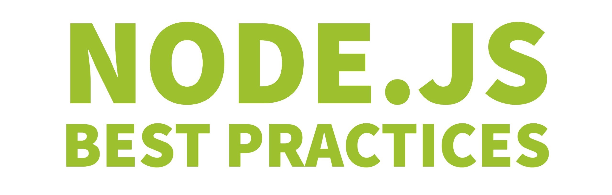

[✔]: assets/images/checkbox-small-blue.png

# Node.js 모범 사례

<h1 align="center">
  
</h1>

<br/>

<div align="center">
    
</div>

<br/>

[](https://twitter.com/nodepractices/) **트위터에서 팔로우 하세요!** [**@nodepractices**](https://twitter.com/nodepractices/)

<br/>

[:green_book: 포괄적인 Node.js 테스트 & 품질 모범사례 강의](https://testjavascript.com/)

<br/>

다른 언어로 읽기: [**CN**](./README.chinese.md), [**BR**](./README.brazilian-portuguese.md), [**RU**](./README.russian.md), [**EU**](./README.basque.md) [(**ES**, **FR**, **HE**, **KR** and **TR** 은 작업중입니다!)](#translations)

<br/>

###### [운영 위원회](#운영-위원회)와 [협력자분들](#공동-저자)에 의해 구축되고 유지되고 있습니다

# 최근 모범사례와 뉴스

- ** 프랑스어 번역!1! :** 우리의 국제 가이드에 합류한 최신 번역은 프랑스어입니다. Bienvenue(어서오세요.)

- **🇯🇵 Japanese translation:** 우리 가이드는 이제 일본어로도 번역됩니다! 뛰어난 [YukiOta](https://github.com/YukiOta)와 [Yuta Azumi](https://github.com/YA21)의 제공입니다.

- **🎊 60,000 stars!**: 우리 리포지토리는 60,100명의 개발자에게 별을 받고 신뢰를 얻었습니다. 말문이 막힐 정도입니다.

<br/><br/>

# 어서오세요! 먼저 이 3가지를 알아두세요

**1. 이 문서를 읽는 것은 베스트 Node.js 문서 수십개를 읽는 것과 같습니다. -** 이 문서는 Node.js 의 가장 일반적인 Best Practice 모범사례들을 모은 요약집 및 큐레이션입니다.

**2. 가장 큰 모음집이며, 매주 성장하고 있습니다. -** 현재 80개 이상의 모범사례들과 스타일 가이드 및 아키텍처 관련 팁들을 제공하고 있습니다. 이 문서를 계속 갱신하는 새로운 이슈들과 PR들이 매일 나오고 있습니다. 이 문서의 잘못된 코드를 고치거나 새로운 아이디어들을 제안하는 것은 매우 환영합니다. [글쓰기 지침은 여기](./.operations/writing-guidelines.md)서 확인하세요

**3. 항목 대부분은 추가적인 정보가 있습니다 -** 항목 옆쪽에 존재하는 **🔗자세히 보기** 링크에서 코드 예제, 참조 블로그 또는 기타 정보들을 확인 할 수 있습니다.

<br/><br/>

## 목차

1. [프로젝트 구조 설계 (5)](#1-프로젝트-구조-설계)
2. [에러 처리 방법 (11)](#2-에러-처리-방법)
3. [코드 스타일 (12) ](#3-코드-스타일)
4. [테스트 및 전체 품질 관리 (13) ](#4-테스트-및-전체-품질-관리)
5. [운영 환경으로 전환하기 (19) ](#5-운영-환경으로-전환하기)
6. [보안 (25)](#6-보안)
7. [성능 (2) (현재진행형 ✍️)](#7-초안-성능)

<br/><br/>

# `1. 프로젝트 구조 설계`

## ![✔] 1.1 컴포넌트 기반으로 설계하라

**핵심요약:** 큰 프로젝트에서 빠지기 쉬운 최악의 함정은 수백개의 의존성을 가진 커다란 소스코드를 유지보수하는 것이다. 그렇게 단일로 통째로 짜여진 monolith 코드는 개발자가 새로운 기능을 추가하는 속도가 느려지게 한다. 그 대신에 코드를 컴포넌트로 나누고, 각각의 컴포넌트가 자신의 폴더 혹은 할당된 코드베이스를 안에서 작고 간단한 단위로 유지되도록 해라. 아래의 '자세히 보기'를 눌러 올바른 프로젝트 구조의 예시를 확인해라.

**그렇게 하지 않을 경우:** 새로운 기능을 작성하는 개발자가 변경사항이 어떤 영향을 미치는지 알기가 힘들면 의존하고 있는 다른 컴포넌트를 망칠까 두려워 하게 되고, 이는 배포를 더 느리고 더 불안전하게 만든다. 비지니스 단위가 나눠져 있지 않으면 확장(scale-out)하기도 쉽지 않게 된다.

🔗 [**자세히 보기: 컴포넌트로 구조화하기**](./sections/projectstructre/breakintcomponents.korean.md)

<br/><br/>

## ![✔] 1.2 컴포넌트를 계층화(layer)하고, Express를 그 경계 안에 둬라

**핵심요약:** 각각의 컴포넌트는 웹, 로직, 데이터 접근 코드을 위한 객체인 '계층'을 포함해야 한다. 이것은 우려할 만한 요소들을 깨끗하게 분리할 뿐만 아니라 모의 객체(mock)를 만들어 테스트하기 굉장히 쉽게 만든다. 이것이 굉장히 일반적인 패턴임에도, API 개발자들은 웹 계층의 객체 (Express req, res)를 비지니스 로직과 데이터 계층으로 보내서 계층을 뒤섞어버리는 경향이 있다. 그렇게 하는것은 당신의 어플리케이션에 의존성을 만들고 Express에서만 접근 가능하도록 만든다.

**그렇게 하지 않을 경우:** 웹 객체와 다른 계층을 뒤섞은 앱은 테스트 코드, CRON 작업이나 Express가 아닌 다른 곳에서의 접근을 불가능하게 한다.

🔗 [**자세히 보기: 앱을 계층화하기**](./sections/projectstructre/createlayers.korean.md)

<br/><br/>

## ![✔] 1.3 공유 유틸리티들은 NPM 패키지로 감싸라 (wrap)

**핵심요약:** 커다란 코드 기반으로 구성되어있는 커다란 앱에서는 로깅, 암호화 같은 횡단 관심사(cross-cutting-concern)가 있는 유틸의 경우 당신이 쓴 코드로 감싸진 private NPM package의 형태로 노출이 되어야 한다. 이것은 여러 코드 기반과 프로젝트들에게 그것들을 공유할 수 있도록 해준다.

**그렇게 하지 않을 경우:** 당신 자신만의 배포 및 종속 바퀴(dependency wheel)를 새로이 발명해야 할 것이다.

🔗 [**자세히 보기: 기능으로 구조화 하기**](./sections/projectstructre/wraputilities.korean.md)

<br/><br/>

## ![✔] 1.4 Express의 app과 server를 분리하라

**핵심요약:** [Express](https://expressjs.com/) 앱을 통째로 하나의 큰 파일에 정의하는 나쁜 습관은 피해라 - 'Express' 정의를 최소한 둘로는 나누자: API 선언(app.js)과 네트워크 부분(WWW)으로. 더 좋은 구조는 API 선언을 컴포넌트 안에 놓는 것이다.

**그렇게 하지 않을 경우:** HTTP 요청으로만 API 테스트가 가능하게 된다 (커버리지 보고서를 생성하기가 더 느려지고 훨씬 힘들어진다). 수백줄의 코드를 하나의 파일에서 관리하는 것이 크게 즐겁지는 않을 것이다.

🔗 [**자세히 보기: Express를 'app'과 'server'로 분리하기**](./sections/projectstructre/separateexpress.korean.md)

<br/><br/>

## ![✔] 1.5 환경을 인식하는, 보안적인, 계층적인 설정을 사용하라

**핵심요약:** 완벽하고 결점이 없는 구성 설정은 (a) 파일과 환경변수 모두에서 키 값을 읽을 수 있어야하고 (b) 보안 값들은 커밋된 코드 밖에서 관리되어야하며 (c) 설정은 좀 더 쉽게 찾을 수 있도록 계층적으로 관리해야 한다. [rc](https://www.npmjs.com/package/rc), [nconf](https://www.npmjs.com/package/nconf), [config](https://www.npmjs.com/package/config), [convict](https://www.npmjs.com/package/convict)와 같이 이러한 요구사항을 동작하게 해주는 몇가지 패키지가 존재한다.

**그렇게 하지 않을 경우:** 위의 구성 요구사항 중 하나라도 만족시키지 못한다면 개발팀이나 데브옵스팀을 늪으로 몰아갈 수 있다. 십중팔구 둘 다.

🔗 [**자세히 보기: 구성 모범 사례**](./sections/projectstructre/configguide.korean.md)

<br/><br/><br/>

<p align="right"><a href="#목차">⬆ 목차로 돌아가기</a></p>

# `2. 에러 처리 방법`

## ![✔] 2.1 비동기 에러 처리시에는 async-await 혹은 promise를 사용하라

**핵심요약:** 비동기 에러를 콜백 스타일로 처리하는 것은 지옥으로 가는 급행열차나 마찬가지 (혹은 파멸의 피라미드). 당신이 코드에 줄 수 있는 가장 큰 선물은 평판이 좋은 promise 라이브러리를 사용하거나 훨신 작고 친숙한 코드 문법인 try-catch를 사용하게 해주는 async-await를 사용하는 것이다.

**그렇게 하지 않을 경우:** Node.js의 function(err, response) 콜백 스타일은 에러 처리와 일반 코드의 혼합, 코드의 과도한 중첩, 어색한 코딩 패턴 때문에 유지보수가 불가능한 코드로 가는 확실한 길이다.

🔗 [**자세히 보기: 콜백 피하기**](./sections/errorhandling/asyncerrorhandling.korean.md)

<br/><br/>

## ![✔] 2.2 내장된 Error 객체만 사용하라

**핵심요약:** 많은 사람들이 문자열이나 사용자가 임의로 정의한 타입으로 에러를 던지곤 하는데(throw), 이것은 에러처리 로직과 모듈 사이의 상호운영성을 복잡하게 한다. 당신이 promise를 거부(reject)하든, 예외를 던지든, 에러를 내던간에, 내장된 Error 객체만 이용하는 것이 균일성을 향상하고 정보의 손실을 방지해준다.

**그렇게 하지 않을 경우:** 일부 컴포넌트를 호출할때 어떤 에러의 타입이 반환될지 불확실해져서 적절한 에러처리가 매우 어려워진다. 게다가 임의적인 타입으로 에러를 나타내는 것은 스택 정보(stack trace)와 같은 중요한 에러 관련 정보 손실을 일으킬 수 있다!

🔗 [**자세히 보기: 내장된 Error 객체 사용하기**](./sections/errorhandling/useonlythebuiltinerror.korean.md)

<br/><br/>

## ![✔] 2.3 동작상의 에러와 프로그래머 에러를 구분하라

**핵심요약:** API에서 잘못된 입력을 받는 것과 같은 동작상의 에러는 에러의 영향을 완전히 이해할수 있고 신중하게 처리 할수있는 알려진 경우를 의미한다. 반면에, 정의되지 않은 변수를 읽는 것과 같은 프로그래머 에러는 어플리케이션을 안정적으로 다시 시작하게 만드는 알수 없는 코드 에러를 의미한다.

**그렇게 하지 않을 경우:** 에러가 날 때마다 어플리케이션을 다시 시작할수도 있지만, 왜 사소하고 예측가능한 동작상의 오류때문에 5000명의 온라인 사용자를 다운시키는 것인가? 그 반대도 이상적이지 않다. 알수없는 이슈 (프로그래머 에러)가 났는데 어플리케이션을 그대로 두는 것은 예측이 불가능한 반응을 일으킬 수 있다. 두 가지를 구별하면 요령있는 처신과 주어진 상황에 따른 균형잡힌 접근이 가능하다.

🔗 [**자세히 보기: 동작상의 에러와 프로그래머 에러**](./sections/errorhandling/operationalvsprogrammererror.korean.md)

<br/><br/>

## ![✔] 2.4 에러를 Express 미들웨어에서 처리하지 말고 한군데에서 집중적으로 처리해라

**핵심요약:** 관리자에게 메일을 보내거나 로깅을 하는 것과 같은 에러 처리는 에러가 발생할 때 모든 엔드포인트 (예를 들어 Express 미들웨어, cron 작업, 단위 테스트 등)가 호출하는 에러전용 중앙집중 객체로 캡슐화 되어야한다.

**그렇게 하지 않을 경우:** 한 곳에서 에러를 처리하지 않는 것은 코드 중복과 부적절한 에러처리로 이어진다.

🔗 [**자세히 보기: 중앙집중적으로 에러 처리하기**](./sections/errorhandling/centralizedhandling.korean.md)

<br/><br/>

## ![✔] 2.5 Swagger를 이용해 API 에러를 문서화하라

**핵심요약:** API를 호출자들에게 어떤 에러가 돌아올 수 있는지 미리 알려주어서 에러를 충돌없이 신중하게 처리 할 수 있게 해주어라. RESTful API같은 경우엔 Swagger 같은 API 문서화 프레임워크를 통해 이루어진다. GraphQL의 경우엔 개요(schema)와 주석을 활용할 수 있다.

**그렇게 하지 않을 경우:** API 클라이언트는 알수 없는 에러로 인한 충돌 후에 재시작을 결정할수도 있을 것이다. 참고로 당신의 API를 호출한 사람이 당신 자신 일수도 있다 (마이크로서비스 환경에서는 아주 일반적이다).

🔗 [**자세히 보기: Swagger에서 에러 문서화하기**](./sections/errorhandling/documentingusingswagger.korean.md)

<br/><br/>

## ![✔] 2.6 낯선이가 들어오면 프로세스를 적절하게 중단하라

**핵심요약:** 알수 없는 에러(프로그래머 에러, 모범사례 2.3번 참조)가 발생하면 어플리케이션의 건강상태가 불확실해진다. 일반적인 방법은 [Forever](https://www.npmjs.com/package/forever)나 [PM2](http://pm2.keymetrics.io/) 같은 '재시작' 도구로 프로세스를 다시 시작하는 것이다.

**그렇게 하지 않을 경우:** 익숙치 않은 예외가 발생하면 일부 객체가 오류 상태 (예를 들어 전역적으로 사용되지만 내부 오류로 인해 이벤트를 더이상 내보내지 않는 event emitter)라서 향후의 모든 요청을 실패시키거나 미친것처럼 작동할 수 있다.

🔗 [**자세히 보기: 프로세스 중단하기**](./sections/errorhandling/shuttingtheprocess.korean.md)

<br/><br/>

## ![✔] 2.7 에러 확인을 용이하게 해주는 안정된 로거를 사용하라

**핵심요약:** Winston, Bunyan 혹은 Log4J와 같이 자리를 잡은 로깅 도구들은 에러를 발견하고 이해하는 속도를 높여준다. 그러니 console.log은 쓰지 마라

**그렇게 하지 않을 경우:** 로그 검색 도구나 제대로 된 로그 뷰어 없이 console.log을 훑어보거나 복잡하게 꼬인 텍스트 파일을 일일이 읽어 보는 것은 야근을 부를 수 있다.

🔗 [**자세히 보기: 발전된 로거를 사용하기**](./sections/errorhandling/usematurelogger.korean.md)

<br/><br/>

## ![✔] 2.8 당신이 선호하는 테스트 프레임워크로 에러 흐름을 테스트하라

**핵심요약:** 전문적인 자동화 QA든 일반적인 수동 개발자 테스트든 당신의 코드가 긍정적인 상황에서 잘 동작할 뿐만 아니라 올바른 에러를 처리하고 반환하는지도 확실히 하라. Mocha & Chai와 같은 테스트 프레임워크를 쓰면 쉽게 처리할 수 있다 ("Gist popup"안의 코드 예제를 확인하라).

**그렇게 하지 않을 경우:** 자동이든 수동이든 테스트가 없다면 당신은 당신의 코드가 올바른 에러를 반환하는지 믿지 못할 것이다. 의미 있는 에러가 없다면 에러 처리도 없는 것이다.

🔗 [**자세히 보기: 에러 흐름 테스트하기**](./sections/errorhandling/testingerrorflows.korean.md)

<br/><br/>

## ![✔] 2.9 APM 제품을 사용하여 에러와 다운타임을 확인하라

**핵심요약:** 모니터링 및 성능 제품(APM)은 미리 알아서 코드베이스와 API를 측정하고 자동적으로 당신이 놓친 에러, 충돌, 느린 부분을 강조 표시해준다.

**그렇게 하지 않을 경우:** API의 성능과 다운타임을 측정하기위해 많은 노력을 들여야 할지도 모른다. 아마 당신은 실제 상황에서 어떤 코드 부분이 가장 느린지, 그것이 UX에 어떻게 영향을 미칠지 절대 알수없을 것이다.

🔗 [**자세히 보기: APM 제품 사용하기**](./sections/errorhandling/apmproducts.korean.md)

<br/><br/>

## ![✔] 2.10 처리되지 않은 promise 거부(unhandled promise rejection)를 잡아라

**핵심요약:** promise 안에서 발생한 예외는 개발자가 명시적으로 처리하지 않는 한 삼켜져 버려지게 된다. 당신의 코드가 `process.uncaughtException` 이벤트를 구독하고 있다고해도 마찬가지다! `process.unhandledRejection` 이벤트를 등록해서 이것을 극복해라.

**그렇게 하지 않을 경우:** 당신의 에러는 삼켜지고 어떤 흔적도 남기지 않을 것이다. 걱정할 것이 없긴 하다.

🔗 [**자세히 보기: 처리되지 않은 promise 거부 잡기**](./sections/errorhandling/catchunhandledpromiserejection.korean.md)

<br/><br/>

## ![✔] 2.11 전용 라이브러리를 이용해 인자값이 유효한지 검사하여 빠르게 실패하라(fail fast)

**핵심요약:** 나중에 처리하기가 더 힘들어지는 지저분한 버그를 피하기 위해 Assert API 입력은 당신의 Express 모범사례가 되어야 한다. 당신이 Joi와 같은 유용한 헬퍼 라이브러리를 사용하지 않는 이상 유효성 검사 코드는 일반적으로 손이 많이 간다.

**그렇게 하지 않을 경우:** 이런 상황을 생각해보자. 당신의 함수가 "Discount"라는 숫자를 받아야하는데 요청하는 사람이 넘겨주는 것을 깜빡했다. 그 후에 당신의 코드는 Discount!=0인지 아닌지 체크한다(사실 허용된 Discount의 값은 0보다 커야 한다). 그러면 사용자가 할인을 받게될 것이다. 보이는가? 엄청나게 지저분한 버그이다.

🔗 [**자세히 보기: 빠르게 실패하기**](./sections/errorhandling/failfast.korean.md)

<br/><br/><br/>

<p align="right"><a href="#목차">⬆ 목차로 돌아가기</a></p>

# `3. 코드 스타일`

## ![✔] 3.1 ESLint를 사용하라

**핵심요약:** [ESLint](https://eslint.org)는 발생 가능한 코드 에러를 체크하고 껄끄러운 간격(spacing)문제를 식별하는 것부터 프로그래머가 분별없이 에러를 던지는 것과 같은 코드의 심각한 안티 패턴을 감지하여 코드 스타일을 바꾸는 것에 대한 사실상의 표준이다. ESLint도 자동으로 코드스타일을 고칠 수 있지만 [prettier](https://www.npmjs.com/package/prettier)와 [beautify](https://www.npmjs.com/package/js-beautify)같은 수정 부분의 포맷을 맞춰주는 강력한 툴이 있고 ESLint와 함께 작동된다.

**그렇게 하지 않을 경우:** 프로그래머가 쓸데없이 간격과 각 줄의 길이(line-width) 문제에 집중하고 프로젝트의 코드스타일에 대해 과도하게 생각하느라 시간을 낭비하게 된다.

<br/><br/>

## ![✔] 3.2 Node.js에 특화된 플러그인들

**핵심요약:** vanlla JS만 지원하는 ESLinst의 표준 규칙 위에 [eslint-plugin-node](https://www.npmjs.com/package/eslint-plugin-node), [eslint-plugin-mocha](https://www.npmjs.com/package/eslint-plugin-mocha), [eslint-plugin-node-security](https://www.npmjs.com/package/eslint-plugin-security)와 같은 Node에 특화된 플러그인을 같이 사용하라.

**그렇게 하지 않을 경우:** 많은 결함이 있는 Node.js 코드 패턴들이 안중에서 벗어날 수 있다. 예를 들어 프로그래머는 변수로된 파일경로를 이용해 require(파일경로변수)로 파일을 가져올수 있다. 이것은 공격자들이 어떤 JS script도 실행시킬 수 있게 한다. Node.js linter는 그러한 패턴을 감지하고 미리 알려준다.

<br/><br/>

## ![✔] 3.3 코드 블록의 중괄호를 같은 줄에서 시작하라

**핵심요약:** 블록에서 중괄호를 여는 부분은 코드를 여는 문장과 같은 줄에 있어야 한다.

### 코드 예제

```javascript
// 좋은 예
function someFunction() {
  // 코드 블록
}

// 나쁜 예
function someFunction()
{
  // 코드 블록
}
```

**그렇게 하지 않을 경우:** 이 모범사례를 적용하지 않는 것은 아래의 StackOverflow 스레드에서 보는 바와 같이 예기치못한 결과로 이어질 수 있다.

🔗 [**자세히 보기:** "왜 결과가 중괄호의 위치에 따라 달라지는 거죠?" (Stackoverflow)](https://stackoverflow.com/questions/3641519/why-does-a-results-vary-based-on-curly-brace-placement)

<br/><br/>

## ![✔] 3.4 문장을 제대로 분리해라

당신이 문장 끝에 세미콜론을 붙이든 아니든, 제대로 문장을 끝내지 않거나 자동 세미콜론 삽입과 관련된 흔한 실수들을 알아두면 잦은 구문 오류 (syntax error)를 제거하는데 도움이 된다.

**핵심요약:** ESLint를 써서 제대로 문장을 끝내고 있는지 경각심을 불러일으켜라. [Prettier](https://prettier.io/) or [Standardjs](https://standardjs.com/)는 자동으로 이 문제를 해결해준다.

**그렇게 하지 않을 경우:** 이전 섹션에서 본것처럼 자바스크립트의 인터프리터는 세미콜론이 없으면 자동으로 문장의 끝에 세미콜론을 붙이거나, 문장이 끝났어야 함에도 끝났다고 인지하지 못하여 의도되지 않은 결과를 야기할 수 있다. 대부분의 의도하지 않은 에러들은 assignment를 사용하고 imediate invoked function expression을 사용하는 것을 피함으로써 예방할 수 있다.

### 3.4 코드 예제

```javascript
// 좋은 예
function doThing() {
    // ...
}

doThing()

// 좋은 예

const items = [1, 2, 3]
items.forEach(console.log)

// 나쁜 예 — 예외 발생
const m = new Map()
const a = [1,2,3]
[...m.values()].forEach(console.log)
> [...m.values()].forEach(console.log)
>  ^^^
> SyntaxError: Unexpected token ...

// 나쁜 예 — 예외 발생
const count = 2 // 2()를 호출하려 하지만, 2는 함수가 아니다
(function doSomething() {
  // 이쁜짓
}())
// immediate invoked function 전에 세미콜론을 놓던나, const 정의 후에 놓거나, 익명함수의 반환값을 변수에 저장하던가, 아니면 아예 IIFE를 쓰지 마라
```

🔗 [**Read more:** "Semi ESLint rule"](https://eslint.org/docs/rules/semi)
🔗 [**Read more:** "No unexpected multiline ESLint rule"](https://eslint.org/docs/rules/no-unexpected-multiline)

<br/><br/>

## ![✔] 3.5 함수에 이름을 붙여라

**핵심요약:** 클로저와 콜백을 포함한 모든 함수에 이름을 붙여라. 익명함수를 피해라. 이것은 노드 앱을 프로파일링 할때 특히 유용하다. 모든 함수를 명명하는 것은 당신이 메모리 스냅샷을 확인할때 당신이 보고있는 것이 무엇인지 쉽게 이해 할수있도록 해준다.

**그렇게 하지 않을 경우:** 당신이 익명함수에서 메모리 소비가 많다는 것을 확인 했을 때 코어 덤프(메모리 스냅샷)을 이용해 프로덕션 문제를 디버깅하는 것이 어려울 수도 있습니다.

<br/><br/>

## ![✔] 3.6 변수, 상수, 함수, 클래스의 명명 규칙(naming convention)

**핵심요약:** 상수와 변수 함수를 명명할때는 **_lowerCamelCase_** 를 사용하고 클래스를 명명 할때는 **_UpperCamelCase_**(첫 글자 대문자)를 사용하라. 이것은 일반 변수/함수와 인스턴스로 만들어야 하는 클래스를 구분하는데 도움을 것이다. 설명이 포함된 이름을 사용하되 이름을 짧게 유지하도록 해라.

**그렇게 하지 않을 경우:** 자바스크립트는 먼저 인스턴스로 만들지 않고 직접 생성자("Class")를 호출할 수 있는 세계 유일의 언어이다. 그러므로 클래스와 함수생성자는 UpperCamelCase를 통해 구분된다.

### 코드예제

```javascript
// 클래스명은 UpperCamelCase 사용
class SomeClassExample {}

// 상수명은 const 키워드와 lowerCamelCase 사용
const config = {
  key: "value",
};

// 변수와 함수 이름은 lowerCamelCase 사용
let someVariableExample = "value";
function doSomething() {}
```

<br/><br/>

## ![✔] 3.7 let보다는 const를 사용하라. var는 개나 줘라

**핵심요약:** `const`를 사용한다는 것은 변수에 한번 값이 할당되면 다시 할당할 수 없다는 것을 의미한다. `const`를 선호하는 것은 같은 변수를 다른 용도로 사용하는 것을 방지하고 당신의 코드를 더 깔끔하게 만드는데 도움을 준다. for 루프처럼 변수가 재할당 되어야 할 필요가 있으면 `let`을 사용하여 선언하라. `let`의 또 다른 중요한 부분은 선언된 변수를 사용하는 것이 변수가 정의된 블록범위(block scope) 안에서만 가능하다는 것이다. `var`는 블록범위가 아니라 함수범위(function scope)이며 이제 대신할 수 있는 const와 let이 있으므로 [ES6에서는 사용하면 안된다](https://hackernoon.com/why-you-shouldnt-use-var-anymore-f109a58b9b70).

**그렇게 하지 않을 경우:** 자주 변경되는 변수를 따라가려면 디버깅이 훨씬 더 번거로워 진다.

🔗 [**자세히 보기: JavaScript ES6+: var 혹은 let 혹은 const?**](https://medium.com/javascript-scene/javascript-es6-var-let-or-const-ba58b8dcde75)

<br/><br/>

## ![✔] 3.8 require는 맨 처음에 오게하고 함수 안에서의 사용은 피하라

**핵심요약:** 모듈을 각 파일의 시작이나 모든 함수의 앞부분 혹은 밖에서 require하라. 이 간단한 모범사례는 파일의 의존성을 맨 위에서 쉽고 빠르게 구분 할수 있게 해줄 뿐만 아니라 여러 잠재적인 문제를 피하게 해준다.

**그렇게 하지 않을 경우:** require는 Node.js에서 동기로 실행된다. 함수 안에서 호출되면 다른 요청들을 더 중요한 시간에 처리되지 못하도록 막을 수 있다. 또한 require된 모듈이나 그것의 의존 모듈이 에러를 뱉거나 서버를 다운시키면, 함수 안에서 그 모듈이 require된 것이 아닌지 가능한 아주 빠르게 찾아야 할 것이다.

<br/><br/>

## ![✔] 3.9 파일 대신 폴더를 require 해라

**핵심요약:** 폴더 안에서 모듈/라이브러리를 개발할 때, 모든 소비자가 내부를 노출하는 index.js 파일을 거치도록 해라. 이것은 모듈의 '인터페이스'역할을 하며 계약을 위반하지 않으면서 미래의 변경사항에 대해 유연하게 대처하도록 해준다.

**그렇게 하지 않을 경우:** 파일 내부의 구조 혹은 서명을 변경하면 클라이언트와의 인터페이스가 손상될 수 있다.

### 3.9 코드 예제

```javascript
// 좋은 예
module.exports.SMSProvider = require("./SMSProvider");
module.exports.SMSNumberResolver = require("./SMSNumberResolver");

// 나쁜 예
module.exports.SMSProvider = require("./SMSProvider/SMSProvider.js");
module.exports.SMSNumberResolver = require("./SMSNumberResolver/SMSNumberResolver.js");
```

<br/><br/>

## ![✔] 3.10 `===` 연산자를 사용하라

**핵심요약:** 약하고 추상적인 같음연산자 `==` 보다 엄격한 항등연산자 `===`를 선호한다. `==`는 두 변수를 공용 타입으로 변환한 후에 비교한다. `===`에는 타입 변환이 없고 두 변수가 같으려면 타입도 같아야 한다.

**그렇게 하지 않을 경우:** `==`으로 비교하는 경우 같지 않은 변수가 true로 반환 될 수있다.

### 3.10 코드 예제

```javascript
"" == "0"; // false
0 == ""; // true
0 == "0"; // true

false == "false"; // false
false == "0"; // true

false == undefined; // false
false == null; // false
null == undefined; // true

" \t\r\n " == 0; // true
```

위의 모든 문장은 `===`를 사용했다면 false를 반환 했을것이다.

<br/><br/>

## ![✔] 3.11 async-await을 사용하고 콜백을 피하라

**핵심요약:** Node 8의 LTS 버전은 현재 async-await을 완전히 지원한다. 이것은 콜백과 promise를 대체하여 비동기 코드를 다루는 새로운 방법이다. async-await은 비차단적(non-blocking)이고 비동기 코드를 동기 코드처럼 보이게 만든다. 당신의 코드에게 줄수 있는 최고의 선물은 try-catch와 같은 더 작고 친숙한 코드 구문을 제공하는 async-await을 사용하는 것이다.

**그렇게 하지 않을 경우:** 콜백 스타일로 비동기 에러를 처리하는 것은 아마도 지옥으로 가는 가장 빠른 방법일것이다. 이런 스타일은 에러를 전부 확인하게 하고 어색한 코드 중첩을 다루게하며 코드 흐름을 추론하기 어렵게 만든다.

🔗[**자세히 보기: async-await 1.0 가이드**](https://github.com/yortus/asyncawait)

<br/><br/>

## ![✔] 3.12 두꺼운(=>) 화살표 함수를 사용하라

**핵심요약:** async-await을 사용하고 함수 인자를 사용하는 것을 피하는 것이 권장되지만 promise와 콜백을 받는 예전 API를 다룰 때는 화살표 함수가 코드 구조를 더 작게해주고 루트 함수의 어휘적 맥락(lexical context)을 유지시켜 준다. (`this`라던가)

**그렇게 하지 않을 경우:** (ES5의 함수 내의) 긴 코드는 버그에 취약하고 읽기도 번거롭다.

🔗 [**Read mode: 화살표 함수를 받아들일 시간이다**](https://medium.com/javascript-scene/familiarity-bias-is-holding-you-back-its-time-to-embrace-arrow-functions-3d37e1a9bb75)

<br/><br/><br/>

<p align="right"><a href="#목차">⬆ 목차로 돌아가기</a></p>

# `4. 테스트 및 전체 품질 관리`

## ![✔] 4.1 다른건 못해도 최소한 API (컴포넌트) 테스트는 써라

**핵심요약:** 대부분의 프로젝트는 짧은 일정으로 인해 자동화 된 테스트가 없거나 후일 통제를 벗어난 이른바 "시험용 프로젝트" 라는 이유로 버려진다. 그러므로, 쓰기에도 제일 쉽고 유닛 테스트보다 더 넓게 커버할 수 있는 API 테스트를 우선으로 시작해라. ([포스트맨](https://www.getpostman.com/) 같은 도구를 이용하지 않고도 API 테스트를 쓸 수 있다.) 나중에 시간과 자원이 더 나면 그때 유닛테스트, DB 테스트, 성능 테스트 등의 좀 더 발전된 테스트 종류를 계속 더해라.

**그렇게 하지 않을 경우:** 유닛 테스트 쓰는데 시간을 몇 날 며칠을 쓰고선 시스템 커버리지가 20% 밖에 안된다는걸 깨닫게 될 수 있다.

<br/><br/>

## ![✔] 4.2 테스트 이름에 이 3가지를 포함해라

**핵심요약:** 코드 내부에 익숙하지 않은 QA 엔지니어들과 개발자들에게 따로 설명이 필요 없도록 requirement 계층에서 이미 자명하도록 해라. 무엇을 (unit under test), 어떤 환경에서, 어떤 결과를 예상하고 테스트 하는 것인지 테스트 이름에 명시해라.

**그렇게 하지 않을 경우:** 배포에 실패하였습니다, “프로덕트 추가” 라는 테스트가 실패했습니다. 이런 메시지를 보고 정확히 뭐가 잘못되었는지 알 수 있는가?

🔗 [**자세히 보기: Include 3 parts in each test name**](./sections/testingandquality/3-parts-in-name.md)

<br/><br/>

## ![✔] 4.3 AAA 패턴을 따라 테스트를 구축해라

**핵심요약:** 테스트를 다음 세가지 부분으로 명확히 나누어라: 준비 (arrange), 실행 (act), 표명 (assert). 제일 먼저 테스트를 준비하고, 그 다음 테스트 단위(unit under test)를 실행하고, 마지막은 확인 단계다. 이 구조를 따르는 것은 읽는이가 힘들여 머리를 쓰지 않고도 테스트 설계를 이해할 수 있도록 보장한다.

**그렇게 하지 않을 경우:** 매일 하루종일 주요 코드를 읽는데 시간을 오래 쓰는 것도 모자라 간단해야하는 테스트 부분에도 열심히 머리를 써야 할 것이다.

🔗 [**Read More: Structure tests by the AAA pattern**](./sections/testingandquality/aaa.md)

<br/><br/>

## ![✔] 4.4 린터를 사용해서 코드의 문제점을 찾아내라

**핵심요약:** 코드 린터를 사용해서 기본적인 품질을 확인하고 안티패턴을 초기에 찾아내라. 테스트 하기도 전에 먼저 돌리고, pre-commit git-hook으로 추가해서 문제를 검토하고 정정하는 시간을 최소화해라. [3문단](#3-코드-스타일)의 코드 스타일 관례들도 확인해라.

**그렇게 하지 않을 경우:** 안티패턴과 취약한 코드가 상용환경에 넘어갈 수도 있다.

<br/><br/>

## ![✔] 4.5 고정적인 공용 테스트 데이터나 seeds는 피하고, 테스트별로 데이타를 붙여라

**핵심요약:** 테스트간의 간섭과 결합도(coupling)를 최소화하고 테스트 흐름을 추론하기 쉽도록 테스트들은 각자 자신만의 DB 행 (row) 집합을 만들어 써야 한다. 테스트가 DB 데이터를 가져오거나 데이터가 존재한다고 간주해야 할 때마다 다른 레코드를 변형시키지 않도록 그 데이터를 직접 추가하여야 한다.

**그렇게 하지 않을 경우:** 실패하는 테스트때문에 전개(deployment)가 중단되었다고 가정해 보자. 이제 팀원들은 소중한 시간을 조사하는데 소모한 뒤 슬픈 결론을 내릴 것이다: 시스템은 잘 작동하지만, 테스트간의 상호 간섭으로 빌드 실패.

🔗 [**자세히 보기: Avoid global test fixtures**](./sections/testingandquality/avoid-global-test-fixture.md)

<br/><br/>

## ![✔] 4.6 끊임없이 취약한 dependency를 점검해라

**핵심요약:** Express같은 네임드 dependency도 알려진 취약점이 있다. 이건CI에서 매 빌드마다 호출할 수 있는 🔗 [npm audit](https://docs.npmjs.com/cli/audit)나 🔗 [snyk.io](https://snyk.io)같은 커뮤니티 혹은 상업용 도구를 사용하면 쉽게 해결할 수 있다.

**그렇게 하지 않을 경우:** 전용 도구없이 코드를 취약점 없이 깨끗하게 유지하려면 온라인 출판물들을 항상 유심히 찾아읽어야 한다. 한마디로 노가다.

<br/><br/>

## ![✔] 4.7 테스트를 태그하라 (#테스트)

**핵심요약:** 다른 종류의 테스트는 서로 다른 시나리오를 바탕으로 실행해야한다: 빌드 성공유무 테스트(quick smoke)나 IO 입출력이 없는 테스트는 개발자가 파일을 저장하거나 commit 할 때마다 실행하고, 더 포괄적인 단대단 (end-to-end) 테스트는 보통 풀리퀘스트를 제출 할 때마다 실행한다. 이건 테스트를 #cold #api #sanity 와 같은 키워드로 태그해서 원하는 테스트들만 부분적으로 grep 으로 test harness를 검색해서 실행하면 된다. 예를 들면, [모카](https://mochajs.org/)에서 sanity 테스트 그룹만 실행하고 싶다면 이렇게 하면 된다: mocha --grep 'sanity'

**그렇게 하지 않을 경우:** 개발자가 조금씩 코드를 바꿀때마다 DB 쿼리를 한다스씩 보내는 테스트까지 포함해서 전부 실행하면 개발 속도도 느려지고 개발자들도 점점 테스트를 실행하는걸 꺼리게 된다

<br/><br/>

## ![✔] 4.8 테스트 범위를 확인하여 안좋은 테스트 패턴을 잡아내라

**핵심요약:** [이스탄불](https://github.com/istanbuljs/istanbuljs)/[NYC](https://github.com/istanbuljs/nyc)같은 코드 커버리지 도구가 좋은 이유는 세가지가 있다: 무료이고 (거져먹는거다), 테스트 범위가 줄어드는것을 잡아내주고, 마지막으로 테스트 부조화를 하이라이트한다: 색으로 나타낸 코드 커버리지 리포트를 보다보면 catch 절 같이 테스트 하지 않는 부분들을 알아채기 시작할것이다. (테스트는 보통 경로만 테스트하기에 앱이 에러가 날 경우에는 어떻게 반응하는지는...) 커버리지가 일정 기준 이하로 떨어지면 빌드가 자동으로 실패하게 해라.

**그렇게 하지 않을 경우:** 코드의 상당한 범위가 테스트로 커버되지 않더라도 자동으로 측정되지 않으니 알 길이 없다.

<br/><br/>

## ![✔] 4.9 오래되어 뒤떨어진 패키지는 없는지 검사해라

**핵심요약:** 설치된 패키지중 outdated 된 패키지는 없는지 선호하는 도구 (예: 'npm outdated'나 [npm-check-updates](https://www.npmjs.com/package/npm-check-updates))를 써서 확인하고, 심할 경우 빌드가 실패하도록 CI 경로에 이 체크를 주입해라. 이를테면 설치된 패키지가 패치 commit 5개 이상 뒤쳐졌거나 (예: 로컬은 1.3.1버젼인데 repository 버젼은 1.3.8이라던가) 제작자가 deprecated 되었다고 태그하면 빌드를 죽이고 이 버젼을 배포하지 못하게 막아라.

**그렇게 하지 않을 경우:** 제작자가 직접 불안정하다고 태그한 패키지가 프로덕션에서 놀아날 수 있다

<br/><br/>

## ![✔] 4.10 프로덕션과 비슷한 환경에서 e2e 테스트를 실행해라

**핵심요약:** 실제 데이터를 쓰는 end to end 테스트는 DB같은 여러 묵직한 서비스에 의존하기에 CI 프로세스의 취약점이었다. 가능한 한 프로덕션과는 최대한 동떨어진 환경을 써라.

**그렇게 하지 않을 경우:** docker-compose 없이는 팀들이 테스트 환경별로 (각 개발자의 컴퓨터 포함) 테스트 DB를 유지하고, 환경에 따라 테스트 결과가 다르게 나오지 않도록 이 모든 DB들을 동기화해야한다.

<br/><br/>

## ![✔] 4.11 정적분석도구를 이용해서 refactor를 정기적으로 해라

**핵심요약:** 정적분석도구(static analysis tool)는 코드의 품질을 객관적으로 개선하고 코드 유지를 쉽게 해준다. 코드스멜을 감지하면 CI 빌드가 실패하도록 정적분석도구를 넣어주면 된다. 이게 단순한 린보팅다 나은 주된 이유로는 여러 파일에 걸친 맥락에서 품질을 점검할 수 있다는 점 (예: 중복된 코드 감지), 더 발달된 분석을 할 수 있다는 점 (예: 코드 복잡도), 코드 문제의 전적과 진전을 따라 볼 수 있다는 점이 있다. 쓸만한 도구의 예를 두가지를 들자면 [Sonarqube](https://www.sonarqube.org/) (2,600+ [stars](https://github.com/SonarSource/sonarqube)) 와 [Code Climate](https://codeclimate.com/) (1,500+ [stars](https://github.com/codeclimate/codeclimate))가 있다.

**그렇게 하지 않을 경우:** 아무리 반짝이는 새로나온 라이브러리나 최첨단 기능을 써봤자 코드 품질이 불량하면 버그와 성능은 못고친다

🔗 [**자세히 보기: Refactoring!**](./sections/testingandquality/refactoring.md)

<br/><br/>

## ![✔] 4.12 CI 플랫폼은 신중하게 선택해라 (Jenkins vs CircleCI vs Travis vs 나머지)

**핵심요약:** 지속적 통합 플랫폼(CICD)은 품질 관리 도구(예: 테스트, 린트)들을 돌릴 수 있게 플러그인 생태계가 활발해야 한다. 예전에는 대부분의 프로젝트들이 배우기는 어려워도 커뮤니티도 제일 크고 강력한 플랫폼을 가진 [Jenkins](https://jenkins.io/)를 기본으로 썼다. 요즘엔 [CircleCI](https://circleci.com)등의 SaaS 해결책을 쓰는게 훨씬 더 쉬워졌다. 이런 도구들은 인프라 전체를 관리하는 부담 없이도 유연한 CI 경로를 만들 수 있게 해준다. 결국에는 안전성과 빠름의 상호 절충이다 - 조심해서 선택해라.

**그렇게 하지 않을 경우:** 잘 알려지지 않은 중소 솔루션 업체를 쓰다간 흔치 않은 고급 설정을 커스터마이징 해야할 때 막혀버릴 수도 있다. 하지만 반대로, Jenkins를 택하면 인프라를 수축하는데 소중한 시간을 다 빼앗길 수도 있다.

🔗 [**자세히 보기: Choosing CI platform**](./sections/testingandquality/citools.korean.md)

## ![✔] 4.13 미들웨어들은 격리시켜 테스트해라

**핵심요약:** 여러 요청에 걸친 막대한 로직을 미들웨어가 수용하는 경우, 웹 프레임워크 전체를 깨우지 않고 격리 상태로 테스트 할만한 가치가 있다. {req, res, next} 객체들을 스텁(stub)하여 염탐(spy)하면 쉽게 달성할 수 있다.

**그렇게 하지 않을 경우:** Express 미들웨어의 버그 === 거의 모든 요청의 버그

🔗 [**자세히 보기: Test middlewares in isolation**](./sections/testingandquality/test-middlewares.md)

<br/><br/><br/>

<p align="right"><a href="#목차">⬆ 목차로 돌아가기</a></p>

# `5. 운영환경으로 전환하기`

## ![✔] 5.1. 모니터링

**핵심요약:** 모니터링은 고객이 문제를 발견하기 전에 먼저 발견하는 게임이다. 모니터링에는 분명히 전례가없는 중요성을 부여해야한다. 솔루션에 너무 많은 기능들이 들어가 있을 가능성이 있으므로 확인해야만하는 기본 항목을 내부적으로 정의하고 나서 추가적인 기능들을 살펴보고 필요한 기능들이 모두 들어있는 솔루션을 선택하라. 아래의 'gist'를 클릭하면 솔루션 개요를 볼 수 있다

**그렇게 하지 않을 경우:** 오류 === 고객의 실망. 간단하다

🔗 [**자세히 보기: 모니터링!**](./sections/production/monitoring.md)

<br/><br/>

## ![✔] 5.2. 스마트 로깅으로 투명성을 높여라

**핵심요약:** 로그는 디버그 텍스트가 모여있는 의미없는 창고일 수도 있고, 앱의 상태를 대시보드로 볼 수 있도록 만들어 줄 수 있는 유용한 데이터일 수도 있다. 원하는 정보 (예: 오류율, 트랜잭션이 서비스와 서버를 거치는 경로를 따라가기, 기타등등)를 쉽게 추출 할 수 있도록 로그를 어떻게 수집, 저장 및 분석하는지 첫날부터 미리 계획해라.

**그렇게 하지 않을 경우:** 이해하기 힘든 블랙박스가 되어버려서 필요한 정보를 추가하기 위해 모든 로그를 다시 작성하게 될것이다

🔗 [**자세히 보기: Increase transparency using smart logging**](./sections/production/smartlogging.md)

<br/><br/>

## ![✔] 5.3. 가능한 모든 것들(예: gzip, SSL)을 reverse proxy에 위임하라

**핵심요약:** Node는 gzip이나 SSL Termination과 같이 CPU 집약적인 작업에 약하다. 이런게 필요할 경우 '실제' 미들웨어 서비스인 nginx, HAproxy 혹은 클라우드 서비스를 사용해야한다

**그렇게 하지 않을 경우:** 불쌍한 싱글 스레드가 어플리케이션의 코어를 처리하는 대신 인프라 작업을 수행하느라 바빠져서 성능이 저하될 것이다

🔗 [**자세히 보기: 가능한 모든 것들(예: gzip, SSL)을 reverse proxy에 위임하라**](./sections/production/delegatetoproxy.md)

<br/><br/>

## ![✔] 5.4. 의존성을 잠궈라(Lock dependencies)

**핵심요약:** 코드는 모든 환경에서 동일해야하지만 놀랍게도 npm을 사용하면 기본적으로 환경간에 종속성이 달라질 수 있는데, 다양한 환경에서 패키지를 설치하면 패키지의 최신 패치 버전을 가져오기 때문이다. npm config 파일인 .npmrc를 사용하여이 문제를 극복해라. 각 환경에 각 패키지의 최신 버전이 아닌 정확한 버전을 저장하도록 알려준다. 또는 세밀하게 제어하려면 `npm shrinkwrap`을 사용하라. \* 업데이트 : NPM5부터는 종속성이 기본적으로 잠겨 있다. 새로운 패키지 관리자인 Yarn도 기본적으로 잠겨 있다.

**그렇게 하지 않을 경우:** QA팀은 코드를 철저히 테스트 했음에도 테스트 환경과는 다르게 작동하는 버전을 승인할 것이다. 심지어 같은 프로덕션 클러스터의 여러 서버가 서로 다른 코드를 실행할 수도 있다.

🔗 [**자세히 보기: Lock dependencies**](./sections/production/lockdependencies.md)

<br/><br/>

## ![✔] 5.5. 올바른 도구를 이용해 프로세스 가동시간을 사수해라

**핵심요약:** 프로세스는 계속 진행되어야 하며 실패시 다시 시작해야한다. 간단한 시나리오의 경우 PM2와 같은 프로세스 관리 도구로도 충분하지만 오늘날 '도커화 된' 세계에서는 클러스터 관리 도구도 고려해야한다

**그렇게 하지 않을 경우:** 명확한 전략없이 수십 개의 인스턴스와 너무 많은 도구 (클러스터 관리, 도커, PM2)를 실행하면 데브옵스가 혼란을 겪을 수 있다

🔗 [**자세히 보기: Guard process uptime using the right tool**](./sections/production/guardprocess.md)

<br/><br/>

## ![✔] 5.6. 모든 CPU를 활용하라

**핵심요약:** 기본적으로 Node 어플리케이션은 하나의 CPU 코어에서 실행되고 다른 CPU는 동작하지 않는다. 노드 프로세스를 복제하여 모든 CPU를 활용하는 것은 당신의 몫이다. 중소형 어플리케이션의 경우 노드 클러스터 또는 PM2를 사용하면 된다. 더 큰 앱의 경우 Docker 클러스터(예: K8S, ECS) 또는 Linux 초기화 시스템(예: systemd)을 기반으로하는 배포 스크립트를 사용하여 프로세스를 복제하는 것이 좋다

**그렇게 하지 않을 경우:** 앱이 사용 가능한 리소스 중 25%(!)에도 못 미치게 활용할 것이다. 일반적인 서버는 CPU 코어가 4개 이상임에도 Node를 기본형으로 배포하면 그 중 단 1 개만 사용하게 될것이다 (AWS beanstalk과 같은 PaaS 서비스 사용해도 마찬가지)

🔗 [**자세히 보기: 모든 CPU를 활용하라**](./sections/production/utilizecpu.md)

<br/><br/>

## ![✔] 5.7. ‘유지 관리용 엔드 포인트’를 따로 만들어라

**핵심요약:** 보안적으로 안전한 API에서 메모리 사용 및 REPL 등과 같은 시스템 관련 정보를 노출하라. 표준 및 실전 테스트(battle-tests) 도구를 사용하는 것이 좋기는 하지만 몇몇 유용한 정보와 작업은 코드를 통해 쉽게 수행 할 수 있다

**그렇게 하지 않을 경우:** 단지 서버 진단을 목적으로 일부 정보를 추출하기 위하여 상용서버에 코드를 배포하는 "진단용 배포"를 자주 수행하고 있게 될 것이다

🔗 [**자세히 보기: Create a ‘maintenance endpoint’**](./sections/production/createmaintenanceendpoint.md)

<br/><br/>

## ![✔] 5.8. APM을 사용하여 오류 및 가동 중지 시간을 발견하라

**핵심요약:** 어플리케이션 성능 관리 제품(Application Performance Management, APM)은 코드베이스 및 API를 사전에 측정하여 기존 모니터링 시스템을 뛰어 넘어 서비스 및 계층 전반에서 사용자 경험을 측정한다. 예를 들어 일부 APM 제품은 최종 사용자 측면에서 느리게 로드되는 트랜잭션을 강조 표시 하면서 근본 원인을 제시할 수 있다

**그렇게 하지 않을 경우:** API 성능 및 가동 중지 시간을 측정하는 데 많은 노력을 기울임에도 실전에서 가장 느린 코드 부분이 어느것인지, 그리고 이것이 UX에 미치는 영향을 알지 못할 것이다

🔗 [**자세히 보기: Discover errors and downtime using APM products**](./sections/production/apmproducts.md)

<br/><br/>

## ![✔] 5.9. 당신의 코드는 언제든 상용에 배포될수 있다

**핵심요약:** 첫날부터 끝을 염두에두고 코드를 작성하라. 다소 모호하게 들릴것 같아서 상용 유지 보수와 밀접하게 관련된 몇 가지 개발 팁을 편찬해 두었다 (아래의 gist를 클릭하라)

**그렇게 하지 않을 경우:** 세계 최고의 IT/DevOps 전문가도 형편없이 쓰여진 코드로 이루어진 시스템은 구하지 못한다

🔗 [**자세히 보기: Make your code production-ready**](./sections/production/productioncode.md)

<br/><br/>

## ![✔] 5.10. 메모리 사용량을 측정하고 보호해라

**핵심요약:** Node.js는 메모리와 관련하여 논란의 여지가 있다: v8 엔진은 메모리 사용량 (1.4GB)에 대한 제한이 있으며 노드의 코드에서 메모리 누수가 발생하는 알려진 방법이 존재하므로 노드의 프로세스 메모리를 관찰하는 것이 필수적이다. 작은 응용 프로그램에서는 Shell 명령을 사용하여 주기적으로 메모리를 측정 할 수 있지만 중대형 어플리케이션에서는 강력한 모니터링 시스템을 통해 메모리를 감시하는 것을 고려하라

**그렇게 하지 않을 경우:** [월마트](https://www.joyent.com/blog/walmart-node-js-memory-leak)에서 일어났던 것처럼 메모리가 하루에 수백 메가바이트씩 누수 될 수 있다

🔗 [**자세히 보기: 메모리 사용량 측정 및 보호**](./sections/production/measurememory.md)

<br/><br/>

## ![✔] 5.11. Node.js에서 프론트 엔드 자산을 빼라

**핵심요약:** Node는 단일 스레드 모델을 쓰기 때문에 정적 파일을 많이 처리하게 되면 성능이 많이 저하되기 때문에 전용 미들웨어(nginx, S3, CDN 등)를 사용하여 프론트 엔드 컨텐츠를 제공하는게 좋다

**그렇게 하지 않을 경우:** 단일 노드 스레드는 수백 개의 html/이미지/angular/react 파일을 스트리밍 하느라 바빠서 정작 천직인 동적 컨텐츠를 전달하는 작업에는 신경쓸 겨를이 없을것이다.

🔗 [**자세히 보기: Get your frontend assets out of Node**](./sections/production/frontendout.md)

<br/><br/>

## ![✔] 5.12. 무상태(stateless)로 운영하고, 거의 매일 서버를 재부팅하라

**핵심요약:** 어떤 유형의 데이터(예: 유저 세션, 캐시, 업로드된 파일)든 외부 데이터 저장소에 저장하라. 서버를 주기적으로 재부팅/교체하는 것을 고려하거나 명시적으로 무상태로 운영하게 만드는 Serverless 플랫폼(예: AWS Lambda)을 사용하는 것을 고려하라

**그렇게 하지 않을 경우:** 해당서버에 오류가 발생하면 해당 서버만 제거하면 되는 것이 아니라 어플리케이션의 다운타임이 발생하게된다. 게다가 특정 서버에 의존하기 때문에 수평적 확장이 힘들어질 것이다

🔗 [**자세히 보기: Be stateless, kill your Servers almost every day**](./sections/production/bestateless.md)

<br/><br/>

## ![✔] 5.13. 취약점을 자동으로 탐지하는 도구를 사용해라

**핵심요약:** Express와 같은 가장 신뢰할만한 모듈조차도 시스템을 위험에 빠뜨릴 수있는 알려진 취약점이 존재한다. 이는 취약성을 지속적으로 (로컬 또는 GitHub에서) 확인하고 경고하는 커뮤니티 및 상용 도구를 사용하면 쉽게 길들일 수 있으며 일부는 즉시 패치 할 수도 있다

**그렇게 하지 않을 경우:** 전용 도구없이 취약점으로부터 코드를 깨끗하게 유지하려면 새로운 취약점에 대한 데이터를 지속적으로 확인해야 할것이다

🔗 [**자세히 보기: Use tools that automatically detect vulnerabilities**](./sections/production/detectvulnerabilities.md)

<br/><br/>

## ![✔] 5.14. 로깅을 할때 트랜잭션 ID를 할당하라

**핵심요약:** 하나의 요청 내에서 각 로그에 동일한 식별자(transaction-id: {some value})를 할당하라. 그렇게하면 로그를 분석할때 에러 전과 후에 어떤 일이 생겼는지 쉽게 알수있다. 비동기적인 특성때문에 Node.js에서 구현하기 쉽지는 않다. 아래의 예제를 확인하라

**그렇게 하지 않을 경우:** 이전에 어떤일이 일어났는지에 대한 컨텍스트 없이 에러 로그를 확인하는 것은 문제를 해결하는 것을 더 어렵고 느리게 만든다

🔗 [**자세히 보기: Assign ‘TransactionId’ to each log statement**](./sections/production/assigntransactionid.md)

<br/><br/>

## ![✔] 5.15. `NODE_ENV=production`로 설정하라

**핵심요약:** 상용 최적화가 활성화 되어야하는지 아닌지를 표시하기 위해 `NODE_ENV`를 'production' 혹은 'development'로 설정하라. 많은 npm 패키지가 현재 환경을 확인하고 최적화한다

**그렇게 하지 않을 경우:** 이 단순한 속성을 빠뜨리면 성능이 크게 저하된다. 예를 들어 Express에서 서버 사이드 렌더링(Server Side Rendering, SSP)을 사용할때 `NODE_ENV`를 빠뜨리면 3배 느려진다

🔗 [**자세히 보기: Set NODE_ENV=production**](./sections/production/setnodeenv.md)

<br/><br/>

## ![✔] 5.16. 원자성의 자동화된 무중단 배포를 설계하라

**핵심요약:** 연구 결과에 따르면 자주 배포를 하는 팀이 상용버전에서 심각한 에러가 발생할 가능성을 낮춘다고 한다. 위험이 따르는 수동적인 과정과 서비스 다운타임이 필요하지 않은 빠르고 자동화된 배포는 배포 프로세스를 크게 향상시킨다. 간소화된 배포의 표준이 된 Docker와 CI 도구를 결합하여 이를 달성할 수 있다.

**그렇게 하지 않을 경우:** 오래걸리는 배포 작업 -> 상용버전 중지시간 및 사람에 의한 에러 -> 배포를 하는 것에 자신감이 없어진 팀 -> 더 적은 배포와 기능들

<br/><br/>

## ![✔] 5.17. Node.js의 LTS 릴리즈 버전을 사용해라

**핵심요약:** LTS 버전의 Node.js를 사용하여 중요한 버그 수정, 보안 업데이트 및 성능 향상을 받아라

**그렇게 하지 않을 경우:** 새로 발견된 버그나 취약점이 상용에서 운영중인 어플리케이션을 악용하는데 사용될 수 있으며, 다양한 모듈들에서 지원을 하지 않게 되고 유지보수하는 것이 힘들어 지게될것이다

🔗 [**자세히 보기: Use an LTS release of Node.js**](./sections/production/LTSrelease.md)

<br/><br/>

## ![✔] 5.18. 앱 내에서 로그를 라우팅하지 말라

**핵심요약:** 로그의 목적지는 개발자가 어플리케이션 코드에 하드코딩해서는 안되고, 대신 프로그램이 실행되는 실행환경에서 정의되어야 한다. 개발자는 로거 유틸리티를 이용하여 로그를 `stdout`에 작성하고 상용환경(컨테이너, 서버 등)이 해당 `stdout`스트림을 적절한 목적지(즉 Splunk, Graylog, ElasticSearch 등)로 수송해야한다

**그렇게 하지 않을 경우:** 어플리케이션 로그 라우팅 처리 === 확장성 저하, 로그 유실, 관심사의 분리 실패(Separation of Concerns, SoC)

🔗 [**자세히 보기: Log Routing**](./sections/production/logrouting.md)

<br/><br/>

## ![✔] 5.19. `npm ci`로 패키지를 설치해라

**핵심요약** 상용환경에서 쓰는 코드가 테스트할떄 쓴 패키지 버젼과 동일하다는 것을 반드시 보장해야 한다. `npm ci`를 써서 의존하는 패키지를 모두 package.json과 package-lock.json만들 따른 클린설치를 해라.

**그렇게 하지 않을 경우:** QA팀이 코드를 승인하기 전에 철저히 테스트해도 상용환경에서는 다르게 작동할것이다. 게다가 같은 프로덕션 클러스터의 다른 서버들이 서로 다른 코드를 실행할 수도 있다.

🔗 [**자세히 보기: npm ci 쓰기**](./sections/production/installpackageswithnpmci.md)

<br/><br/><br/>

<p align="right"><a href="#목차">⬆ 목차로 돌아가기</a></p>

# `6. 보안`

<div align="center">

</div>

## ![✔] 6.1. linter 보안 규칙 수용

<a href="https://www.owasp.org/index.php/Top_10-2017_A1-Injection" target="_blank"></a> <a href="https://www.owasp.org/index.php/Top_10-2017_A7-Cross-Site_Scripting_(XSS)" target="_blank"></a>

**핵심요약:** [eslint-plugin-security](https://github.com/nodesecurity/eslint-plugin-security)와 같은 보안 관련 linter 플러그인을 사용하여 보안 취약점과 문제점을 가능한 한 빨리 잡아라. 이것은 eval 사용, 자식 프로세스 호출, string literal(예: 사용자 입력)을 쓰는 모듈 불러오기 같은 보안 취약점을 잡는데 도움이 될 수 있다. 보안 linter가 잡는 코드를 보려면, 아래의 '자세히 보기'을 클릭해라.

**그렇게 하지 않을 경우:** 개발과정에서는 이해하기 쉬운 보안 약점이었음에도 상용환경에서는 주요쟁점이 된다. 또, 프로젝트가 일관된 보안 프렉티스를 따르지 않아, 취약점이 노출되거나 민감한 정보가 원격 저장소에 유출될 수 있다.

🔗 [**자세히 보기: Lint rules**](./sections/security/lintrules.md)

<br/><br/>

## ![✔] 6.2. 미들웨어로 병행연산 (concurrent) 요청들을 제한해라

<a href="https://www.owasp.org/index.php/Denial_of_Service" target="_blank"></a>

**핵심요약:** DOS 서비스 거부 공격은 흔하며 하기에도 비교적 쉽다. 클라우드 로드밸런서, 클라우드 방화벽, nginx, [rate-limiter-flexible](https://www.npmjs.com/package/rate-limiter-flexible) 패키지나, (소규모의 덜 중요한 앱의 경우) 비율제한 미들웨어(예: [express-rate-limit](https://www.npmjs.com/package/express-rate-limit))를 써서 비율제한을 시행해라.

**그렇게 하지 않을 경우:** 애플리케이션이 서비스 거부 공격을 받으면 실제 이용자들이 받는 서비스가 저하되거나 먹통이 된다.

🔗 [**자세히 보기: Implement rate limiting**](./sections/security/limitrequests.md)

<br/><br/>

## ![✔] 6.3 기밀은 설정 파일에서 빼거나 패키지를 이용해서 암호화해라

<a href="https://www.owasp.org/index.php/Top_10-2017_A6-Security_Misconfiguration" target="_blank"></a> <a href="https://www.owasp.org/index.php/Top_10-2017_A3-Sensitive_Data_Exposure" target="_blank"></a>

**핵심요약:** 기밀사항은 절대 평문 형태로 설정 파일이나 소스코드에 저장하지 말아라. 그 대신 Vault나 Kubernetes/Docker Secrets나 환경변수 같은 기밀사항 관리 시스템을 써라. 부득이하게 소스 콘트롤에 기밀사항을 저장해야 하는 경우, 반드시 암호화해서 관리해라 (rolling keys, 만료, 감사 등). pre-commit/push hook을 사용해서 실수로 기밀사항을 버젼 콘트롤에 커밋하는 것을 막아라.

**그렇게 하지 않을 경우:** 비공개 저장소라 하여도 소스 제어가 실수로 공개되면 모든 기밀사항이 그대로 드러난다. 외부관계자가 소스제어에 접근이 가능해지면 의도치 않아도 관련 시스템(데이터베이스, API, 서비스 등)에도 접근을 허락하는것과 마찬가지다.

🔗 [**자세히 보기: Secret management**](./sections/security/secretmanagement.md)

<br/><br/>

## ![✔] 6.4. ORM/ODM 라이브러리를 사용해 쿼리 주입 공격을 막아라

<a href="https://www.owasp.org/index.php/Top_10-2017_A1-Injection" target="_blank"></a>

**핵심요약:** SQL/NoSQL 주입과 같은 악의적인 공격을 막기 위해서는 ORM/ODM을 쓰거나, 데이터를 항상 이스케이프 처리 해 주거나 named or indexed parameterized queries를 지지하고, expected data type의 사용자 입력을 확인해주는 데이터베이스 라이브러리를 항상 활용해라. 자바스크립트 템플릿 문자열(template strings)이나 문자열 병합(string concatenation)으로 값을 주입하면 앱을 광범위한 취약점에 노출시키므로 절대 그대로 써서는 안된다. 평판이 좋은 Node.js 데이터 접근 라이브러리들(예: [Sequelize](https://github.com/sequelize/sequelize), [Knex](https://github.com/tgriesser/knex), [mongoose](https://github.com/Automattic/mongoose))은 모두 주입 공격을 막아주는 보호대책이 내장되어있다.

**그렇게 하지 않을 경우:** 확인되지 않거나 (unvalidated) 살균되지 않은 (unsanitized) 사용자 입력은 MangoDB for NoSQL를 쓸 때 operator injection를 초래할 수 있고, 제대로 된 위생처리 시스템이나 ORM을 쓰지 않는것은 SQL 주입 공격을 쉽게 만들어 엄청난 취약점을 만들어낼 수 있다.

🔗 [**자세히 보기: Query injection prevention using ORM/ODM libraries**](./sections/security/ormodmusage.md)

<br/><br/>

## ![✔] 6.5. 일반적인 보안 모범사례 모음

**핵심요약:** 이것은 Node.js와는 직접적으로 관련되지 않은 보안과 관련된 조언 모음집이지만, Node의 시행도 다른 언어들과 그닥 다르지 않다. 자세히 보기를 클릭해서 읽어봐라.

🔗 [**자세히 보기: Common security best practices**](./sections/security/commonsecuritybestpractices.md)

<br/><br/>

## ![✔] 6.6. HTTP 응답 헤더를 조정해서 보안을 강화해라

<a href="https://www.owasp.org/index.php/Top_10-2017_A6-Security_Misconfiguration" target="_blank"></a>

**핵심요약:** 보안 헤더를 사용해서 교차사이트 스트립팅 (XSS), 클릭재킹과 같이 자주 있는 악의적인 공격들을 막아라. [helmet](https://www.npmjs.com/package/helmet)과 같은 모듈을 사용하면 쉽게 설정할 수 있다.

**그렇게 하지 않을 경우:** 공격자들이 애플리케이션 사용자들을 직접적으로 공격할 수 있게되면 엄청난 보안 취약점을 초래할 수 있다

🔗 [**자세히 보기: Using secure headers in your application**](./sections/security/secureheaders.md)

<br/><br/>

## ![✔] 6.7. 끊임없이 자동적으로 취약한 의존성은 없는지 검사해라

<a href="https://www.owasp.org/index.php/Top_10-2017_A9-Using_Components_with_Known_Vulnerabilities" target="_blank"></a>

**핵심요약:** npm 생태계의 프로젝트들은 의존성이 여럿 있는것이 보통이다. 의존성들은 새로운 취약점들이 발견 될 때마다 고쳐야 한다. [npm audit](https://docs.npmjs.com/cli/audit)이나 [snyk](https://snyk.io/) 같은 도구들을 이용해 취약한 의존성을 감시하고 패치해라. 이런 도구들을 CI 체재와 통합시켜 취약한 의존성이 상용버젼까지 새어 나가기 전에 잡아라

**그렇게 하지 않을 경우:** 공격자가 당신의 웹 프레임워크를 감지하면 알려진 모든 취약점을 공격할 수 있다.

🔗 [**자세히 보기: Dependency security**](./sections/security/dependencysecurity.md)

<br/><br/>

## ![✔] 6.8. 암호를 처리할 때는 Node.js의 암호 라이브러리 대신 Bcrypt를 써라

<a href="https://www.owasp.org/index.php/Top_10-2017_A2-Broken_Authentication" target="_blank"></a>

**핵심요약:** 암호나 기밀사항(API keys)들은 `bcrypt` 같은 보안 해시+솔트 함수를 쓰는것이 자바스크립트 implementation을 쓰는 것보다 보안이나 성능면에서 더 낫다.

**그렇게 하지 않을 경우:** 보안함수(secure function)를 쓰지 않고 저장된 암호나 기밀사항들은 억지기법이나 사전공격에 취약해져 결국엔 다 뚫리게 된다.

🔗 [**자세히 보기: Use Bcrypt**](./sections/security/userpasswords.md)

<br/><br/>

## ![✔] 6.9. HTML, JS and CSS 출력은 이스케이프 해라

<a href="https://www.owasp.org/index.php/Top_10-2017_A7-Cross-Site_Scripting_(XSS)" target="_blank"></a>

**핵심요약:** 신뢰할 수 없는 데이터가 브라우져에 보내져 보여지기만 하는게 아니라 실행이되는것을 교차 사이트 스크립팅 (XSS) 이라고 한다. 데이터를 명백하게 절대 실행되어서는 안되는 콘텐트라고 (즉 엔코딩이라던가 이스케이프한다던가) 표시하는 것 전용 라이브러리를 써서 이것을 완화시켜라

**그렇게 하지 않을 경우:** 공격자가 악의적인 자바스크립트 코드를 당신 DB에 저장하면 불쌍한 클라이언트에게 그대로 보내질 수 있다

🔗 [**자세히 보기: Escape output**](./sections/security/escape-output.md)

<br/><br/>

## ![✔] 6.10. 들어오는 JSON 스키마를 검사해라

<a href="https://www.owasp.org/index.php/Top_10-2017_A7-Cross-Site_Scripting_(XSS)" target="_blank"></a> <a href="https://www.owasp.org/index.php/Top_10-2017_A8-Insecure_Deserialization" target="_blank"></a>

**핵심요약:** 들어오는 요청들의 body payload를 검사하여 기대에 부응하지는지 확인하고, 하지 않을경우 실패시켜버려라. [jsonschema](https://www.npmjs.com/package/jsonschema)나 [joi](https://www.npmjs.com/package/joi) 같은 JSON-기반의 경량의 validation schema를 쓰면 성가시게 매 경로마다 검사를 코딩해야 하는 일을 피할 수 있다.

**그렇게 하지 않을 경우:** 입력에 대해 너그럽고 관대하면 공격 받을 수 있는 면적이 넓어지고, 공격자에게 애플리케이션을 끌어내리는 조합을 찾을때까지 다양한 입력값을 시도해보도록 장려하는 꼴이 된다.

🔗 [**자세히 보기: Validate incoming JSON schemas**](./sections/security/validation.md)

<br/><br/>

## ![✔] 6.11. JWT 블랙리스트를 지원해라

<a href="https://www.owasp.org/index.php/Top_10-2017_A2-Broken_Authentication" target="_blank"></a>

**핵심요약:** JSON Web Token(이를테면 [Passport.js](https://github.com/jaredhanson/passport)같은)을 쓰는 경우, 기본적으로 발행된 토큰의 권한을 취소하는 메커니즘은 없다. 사용자가 악의적인 행동을 한다 해도 유효한 토큰이 있는한 막을 길이 없다. 신뢰할 수 없는 토큰 블랙리스트를 만들어 매 요청마다 검사해서 완화시켜라.

**그렇게 하지 않을 경우:** 제삼자가 만료되었거나 부적절한 토큰을 악의적으로 사용하여 애플리케이션에 접근하거나 토큰 소유자인 척 가장할 수 있다.

🔗 [**자세히 보기: Blacklist JSON Web Tokens**](./sections/security/expirejwt.md)

<br/><br/>

## ![✔] 6.12. 권한부여 억지기법 공격을 예방해라

<a href="https://www.owasp.org/index.php/Top_10-2017_A2-Broken_Authentication" target="_blank"></a>

**핵심요약:** 간단하지만 강력한 테크닉은 다음 두가지를 측량하여 권한부여 (authorization) 시도를 제한하는 것이다:

1. 첫째는 같은 사용자의 고유 아이디/이름과 IP주소로부터의 연이은 실패 시도 갯수
2. 두번째는 오랜 시간 동안 같은 IP 주소에서부터의 실패 시도 갯수. 예를 들면, 같은 IP 주소로부터 하루 사이 실패 시도가 100개라면 차단해버려라.

**그렇게 하지 않을 경우:** 공격자가 무제한으로 암호를 시도해서 특권있는 계좌에 접근할 수 있다

🔗 [**자세히 보기: Login rate limiting**](./sections/security/login-rate-limit.md)

<br/><br/>

## ![✔] 6.13. Node.js를 루트가 아닌 사용자로써 실행하라

<a href="https://www.owasp.org/index.php/Top_10-2017_A5-Broken_Access_Control" target="_blank"></a>

**핵심요약:** Node.js가 승인에 제한이 없는 루트 사용자로써 실행하는 일이 비일비재하다. 예를 들면, 도커 컨테이너 안에서는 이것이 기본적인 설정이다. 루트가 아닌 사용자를 만들어 도커 이미지에 구워넣거나 (아래예시) 프로세스를 "-u username" 플래그를 써서 이 사용자를 대신해서 실행하는것을 추천한다.

**그렇게 하지 않을 경우:** 공격자가 서버에 스크립트를 실행하는데 성공하면 로컬 머신을 마음대로 할 권리를 무제한으로 갖게 된다 (예: iptable을 바꾼다던가 트래픽 경로를 자기 서버로 변경 한다던가)

🔗 [**자세히 보기: Run Node.js as non-root user**](./sections/security/non-root-user.md)

<br/><br/>

## ![✔] 6.14. 리버스 프록시나 미들웨어를 사용해서 페이로드 크기를 제한해라

<a href="https://www.owasp.org/index.php/Top_10-2017_A8-Insecure_Deserialization" target="_blank"></a> <a href="https://www.owasp.org/index.php/Top_10-2017_A1-Injection" target="_blank"></a>

**핵심요약:** 페이로드 사이즈가 클수록, 단일 스레드가 이것을 처리하는데 더 열심히 일해야 한다. 이것은 공격자들이 엄청난 양의 요청(DOS/DDOS 공격)을 쓰지 않고도 서버를 끌어내릴 수 있는 기회를 제공한다. 가장자리(예: 방화벽, ELB)에서 들어오는 요청들의 바디 크기를 제한하거나, 소규모의 페이로드만 받아들이도록 [express body parser](https://github.com/expressjs/body-parser)를 설정해라

**그렇게 하지 않을 경우:** 애플리케이션이 커다란 요청을 처리해야하면 다른 중요한 일을 완수할 수 없게 되어 성능이 영향을 받고 DOS 공격에 취약하게 된다

🔗 [**자세히 보기: Limit payload size**](./sections/security/requestpayloadsizelimit.md)

<br/><br/>

## ![✔] 6.15. 자바스크립트 eval statement를 피하라

<a href="https://www.owasp.org/index.php/Top_10-2017_A7-Cross-Site_Scripting_(XSS)" target="_blank"></a> <a href="https://www.owasp.org/index.php/Top_10-2017_A1-Injection" target="_blank"></a> <a href="https://www.owasp.org/index.php/Top_10-2017_A4-XML_External_Entities_(XXE)" target="_blank"></a>

**핵심요약:** `eval`은 임의적인 자바스크립트 코드를 런타임시 실행하는것을 허용하기에 사악하다. 이는 성능면에서 문제가 될 뿐 아니라 사용자 입력을 근원으로 한 악의적인 자바스크립트 코드 때문에 보안면에서도 문제가 된다. 피해야 할 또다른 언어 특색으로는 `new Function` constructor 생성자가 있다. `setTimeout`와 `setInterval` 또한 절대로 동적이 자바스크립트 코드를 주어서는 안된다.

**그렇게 하지 않을 경우:** 악의적인 자바스크립트 코드가 `eval`같이 실시간으로 평가하는 자바스크립트 언어 함수에 넘어가면 페이지 안의 자바스크립트 승인을 완전히 장악하게 된다. 이 취약점은 XSS 공격 형태로 자주 나타난다.

🔗 [**자세히 보기: Avoid JavaScript eval statements**](./sections/security/avoideval.md)

<br/><br/>

## ![✔] 6.16. 악성 정규표현(RegEx)이 단일 스레드 실행을 과부하시키는것을 막아라

<a href="https://www.owasp.org/index.php/Denial_of_Service" target="_blank"></a>

**핵심요약:** 정규표현은 유용하긴 하지만 자바스크립트 애플리케이션, 특히나 Node.js 플랫폼의 경우 전체적으로 위협을 가한다. 사용자 입력 텍스트를 비교하여 처리하는데는 엄청난 양의 CPU 사이클이 요구된다. 단어 10개를 검사하는 단 하나의 요청이 이벤트 루프 전체를 6초동안 정체시키고 CPU를 🔥지를 만큼 RegEx 처리는 비효율적이다. 이 때문에,직접 정규표현 패턴을 작성하기 보다는 [validator.js](https://github.com/chriso/validator.js) 같은 써드파티 검사 패키지를 쓰거나, [safe-regex](https://github.com/substack/safe-regex)를 써서 취약한 정규표한 패턴을 감지해라

**그렇게 하지 않을 경우:** 저조하게 쓰여진 정규표현들은 이벤트 루프를 완전히 정체시킬 수 있는 정규표현 DOS 공격에 취약해진다. 예를들면, 자주 쓰이는 `moment` 패키지 또한 2017년 11월에 악성 정규표현 사용에 취약하다는 것이 발견되었다

🔗 [**자세히 보기: Prevent malicious RegEx**](./sections/security/regex.md)

<br/><br/>

## ![✔] 6.17. 변수를 사용해 모듈을 로딩하는것을 피해라

<a href="https://www.owasp.org/index.php/Top_10-2017_A7-Cross-Site_Scripting_(XSS)" target="_blank"></a> <a href="https://www.owasp.org/index.php/Top_10-2017_A1-Injection" target="_blank"></a> <a href="https://www.owasp.org/index.php/Top_10-2017_A4-XML_External_Entities_(XXE)" target="_blank"></a>

**핵심요약:** 매개변수가 사용자 입력이 원천지일 염려가 있으므로 다른 파일을 파라메터 형태의 경로로 require/import 하는것은 피해라. 이건 일반적으로 사용자 입력을 원천지로 한 다른 동적 변수로 파일이나 (즉 `fs.readFile()`) 다른 민감한 리소스에 접근할 때도 해당한다. [Eslint-plugin-security](https://www.npmjs.com/package/eslint-plugin-security) 린터를 쓰면 이런 패턴들을 초반에 잡아내어 경고해준다

**그렇게 하지 않을 경우:** 악의적인 사용자 입력이 이전에 파일시스템에 업로드되었거나 이미 시스템에 존재하는 흑화된 파일을 require 하는데 쓰이는 매개변수로 들어가게 될 수 있다.

🔗 [**자세히 보기: Safe module loading**](./sections/security/safemoduleloading.md)

<br/><br/>

## ![✔] 6.18. 위험한 코드는 샌드박스 안에서 실행해라

<a href="https://www.owasp.org/index.php/Top_10-2017_A7-Cross-Site_Scripting_(XSS)" target="_blank"></a> <a href="https://www.owasp.org/index.php/Top_10-2017_A1-Injection" target="_blank"></a> <a href="https://www.owasp.org/index.php/Top_10-2017_A4-XML_External_Entities_(XXE)" target="_blank"></a>

**핵심요약:** 런타임에 주어진 외부 코드(예: 플러그인)를 실행해야 하는 경우, 메인 코드를 플러그인으로부터 격리시켜 보호하는 샌드박스 실행 환경을 무엇이든 써라. 전용 프로세스나 (예: `cluster.fork()`), 서버리스 환경이나 샌드박스 역할을 하는 전용 npm 패키지를 사용하면 달성할 수 있다.

**그렇게 하지 않을 경우:** 플러그인이 무한 루프나, 메모리 과부화나, 민감한 프로세스 환경 변수로의 접근과 같이 무한히 가지각색으로 공격할 수 있다

🔗 [**자세히 보기: Run unsafe code in a sandbox**](./sections/security/sandbox.md)

<br/><br/>

## ![✔] 6.19. 자식 프로세스를 다룰 땐 특히 조심해라

<a href="https://www.owasp.org/index.php/Top_10-2017_A7-Cross-Site_Scripting_(XSS)" target="_blank"></a> <a href="https://www.owasp.org/index.php/Top_10-2017_A1-Injection" target="_blank"></a> <a href="https://www.owasp.org/index.php/Top_10-2017_A4-XML_External_Entities_(XXE)" target="_blank"></a>

**핵심요약:** 자식 프로세스를 쓰는것은 가능한 한 피하고, 부득이하게 써야 한다면 입력은 검사하고 무결처리해서 shell 주입 공격을 완화시켜라. 정의상 속성 집합이 있는 단일 명령어만 수행하고 shell 매개변수 확장을 허가하지 않는 `child_process.execFile` 쓰는것을 선호해라.

**그렇게 하지 않을 경우:** 순진무구하게 자식 프로세스를 썼다가는 악의적인 사용자 입력이 무결처리 되지 않은 시스템 명령어로 인한 원격 커맨드 실행이나 쉘 주입 공격을 초래할 수 있다.

🔗 [**자세히 보기: Be cautious when working with child processes**](./sections/security/childprocesses.md)

<br/><br/>

## ![✔] 6.20. 에러 세부사항은 클라이언트로부터 숨겨라

<a href="https://www.owasp.org/index.php/Top_10-2017_A6-Security_Misconfiguration" target="_blank"></a>

**핵심요약:** 통합된 express 에러 핸들러는 기본적으로 에러 세부사항을 감춘다. 허나, 당신이 커스텀 에러 처리 로직을 만들어 쓰고 있을 가능성이 높다 (많은이들이 이게 모범사례라고 여긴다). 그럴 경우 민감한 애플리케이션 세부사항을 포함할 수 있는 에러 객체를 절대로 통째로 클라이언트에 보내주지 않도록 해라

**그렇게 하지 않을 경우:** 서버 파일 경로나, 사용중인 제삼자 모듈, 그리고 그 외 애플리케이션 내부 작업 순서 같이 공격자가 악용할 수 있는 민감한 애플리케이션 세부사항이 스택트레이스에 보여지는 정보로 새어나갈 수 있다

🔗 [**자세히 보기: Hide error details from client**](./sections/security/hideerrors.md)

<br/><br/>

## ![✔] 6.21. npm이나 yarn 이중인증(2FA)을 설정해라

<a href="https://www.owasp.org/index.php/Top_10-2017_A6-Security_Misconfiguration" target="_blank"></a>

**핵심요약:** 개발 과정의 모든 단계는 다중인증(MFA: multi-factor authentication)을 사용해서 보호해야한다. npm이나 Yarn은 공격자들이 개발자 암호를 수집할 수 있는 절호의 기회다. 공격자들은 개발자의 크리덴셜을 사용하면 악의적인 코드를 다양한 프로젝트와 서비스에 널리 설치된 라이브러리에 주입할 수 있다. 공개 출판 되었다면 웹상에서도 가능하다. npm 이중인증을 활성화 해 두면 공격자들이 패키지 코드를 변경할 확률이 0에 가까워진다.

**그렇게 하지 않을 경우:** [암호를 하이재킹 당한 eslint 개발자에 대해 들어봤는가?](https://medium.com/@oprearocks/eslint-backdoor-what-it-is-and-how-to-fix-the-issue-221f58f1a8c8)

<br/><br/>

## ![✔] 6.22. 세션 미들웨어 설정을 수정해라

<a href="https://www.owasp.org/index.php/Top_10-2017_A6-Security_Misconfiguration" target="_blank"></a>

**핵심요약:** 웹 프레임워크나 장비는 각각 고유의 약점이 있다-공격자에게 어떤 웹 프레임워크를 쓰는지 알려주는 것은 그들을 돕는 꼴이 된다. 세션 미들웨어 기본설정을 쓰는 것은 `X-Powered-By` 헤더같이 모듈이나 프레임워크 관련 하이재킹 공격에 앱이 취약해지게 만든다. 테크 스택의 신분(예: Node.js, express)을 드러내는 것은 일단 감추고 봐라

**그렇게 하지 않을 경우:** 쿠키가 insecure 연결로 송신되면 공격자가 세션 ID를 보고 웹 어플리케이션 프레임워크를 식별하고, 모듈관련 취약점도 찾아낼 수 있다

🔗 [**자세히 보기: Cookie and session security**](./sections/security/sessions.md)

<br/><br/>

## ![✔] 6.23. 프로세스가 언제 충돌해야 하는지 명백히 해서 DOS 공격을 피해라

<a href="https://www.owasp.org/index.php/Denial_of_Service" target="_blank"></a>

**핵심요약:** Node 프로세스는 에러가 처리되지 않으면 충돌한다. 많은 모범사례들이 에러를 받아 처리했음에도 exit 하는것을 권장한다. Express로 예를 들자면, 비동기 에러가 발생한 경우, route를 catch clause로 감싸지 않는 한 항상 충돌로 이어진다. 이건 어떤 입력이 프로세스를 충돌시키는지 아는 공격자들이 같은 요청을 계속 보내는 공격을 할 수 있게 만들어 버린다. 이것을 바로 고칠 수 있는 방안은 없지만, 통증을 완화시킬 수 있는 방법이 몇 개 존재한다: 프로세스가 처리되지 않은 에러로 인해 충돌할 때마다 치명적인 심각성으로 경보를 발하고, 입력을 검사하며 무효한 사용자 입력으로 인한 충돌을 피하고, 모든 route들을 catch로 감싸고, 에러의 원인지가 요청이면 충돌하지 않는것을 고려해라 (에러가 global하게 나는것과 반대로)

**그렇게 하지 않을 경우:** 경험에서 우러난 추측이긴 하지만: Node.js 애플리케이션이 여럿 있을때, 모든 POST 요청에 빈 JSON body를 붙여 보내면 그중 애플리케이션이 몇 개 충돌한다. 그 시점으로부터는 계속 같은 요청을 보내면 나머지 애플리케이션들을 쉽게 흐너뜨릴 수 있다.

<br/><br/>

## ![✔] 6.24. 위험한 리디렉트는 막아라

<a href="https://www.owasp.org/index.php/Top_10-2017_A1-Injection" target="_blank"></a>

**핵심요약:** 사용자 입력을 검사하지 않는 리디렉트는 공격자가 피싱 사기나 사용자 자격 절도와 같이 악의적인 공격을 할 수 있게 한다.

**그렇게 하지 않을 경우:** 공격자가 당신이 외부 유저로부터 조달된 입력을 검사하지 않는다는 것을 발견 할 경우, 특수 조작된 포럼 링크를 포럼이나 소셜 미디어, 그 외 공공 장소에 게재해서 유저들이 클릭하도록 해서 이 취약점을 악용할 수 있다.

🔗 [**자세히 보기: Prevent unsafe redirects**](./sections/security/saferedirects.md)

<br/><br/>

## ![✔] 6.25. 기밀사항을 npm registry에 출판하는것을 막아라

<a href="https://www.owasp.org/index.php/Top_10-2017_A6-Security_Misconfiguration" target="_blank"></a>

**핵심요약:** 공공 npm 레지스트리에 기밀사항을 실수로 발행하는 것을 미리 예방해라. `.npmignore` 파일을 사용해서 특정 파일이나 폴더를 블랙리스트하거나, `package.json` 안의 `files` 배열이 화이트리스트 역할을 할 수 있다.

**그렇게 하지 않을 경우:** 프로젝트의 API key나, 암호나, 그 외 기밀사항들이 이것들을 우연히 발견한 이들 누구나에 의해 남용되면 재정적 손실이나 사칭과 같은 위험을 초래할 수 있다.

🔗 [**자세히 보기: Avoid publishing secrets**](./sections/security/avoid_publishing_secrets.md)
<br/><br/><br/>

<p align="right"><a href="#목차">⬆ Return to top</a></p>

# `7. 초안: 성능`

## 협력자들이 현재 작업중입니다. [함께 하시겠습니까?](https://github.com/goldbergyoni/nodebestpractices/issues/256)

<br/><br/>

## ![✔] 7.1. 이벤트 루프를 막지 말아라

**핵심요약:** CPU 집약적인 과제들은 거의 단일 스레드로 된 이벤드 루프를 블로킹하고 전용 스레드나 프로세스, 혹은 컨텍스트에 따라 그 외 다른 기술에 떠넘기므로 피하라.

**그렇게 하지 않을 경우:** 이벤트 루프가 블로킹되면 Node.js는 다른 요청을 처리할 수 없게 되어 동시성 (concurrent) 사용자들을 지체하게 한다. **사용자 3000명이 응답을 기다리고 있고, 콘텐츠도 제공될 준비가 되어있는데, 단 하나의 요청이 서버가 결과물을 발송하지 못하도록 블로킹 할 수 있다**

🔗 [**자세히 보기: Do not block the event loop**](./sections/performance/block-loop.md)

<br /><br /><br />

## ![✔] 7.2. Lodash같은 user-land 유틸 대신 네이티브 자바스크립트 메소드를 택해라

**핵심요약:** 네이티브 메소드 대신 `lodash` 나 `underscore` 같은 유틸 라이브러리를 쓰는 것은 불필요한 의존성이나 성능 저하를 야기할 수 있기에 보통 페날티가 붙는다.
새로운 V8 엔진과 함께 새로운 ES 기준이 도입되고부터 네이티브 메소드가 유틸리티 라이브러리보다 50% 더 능률적이라는 것을 명심해라.

**그렇게 하지 않을 경우:** 기본적으로 **이미** 내장된 코드를 쓰거나 코드를 몇줄 더 써서 파일을 몇개 더 써야 하는 것을 막을 수 있었음에도 불구하고 더 비능률적인 프로젝트를 유지해야 할 것이다.

🔗 [**자세히 보기: Native over user land utils**](./sections/performance/nativeoverutil.md)

<br/><br/><br/>

# 마일스톤

이 가이드를 관리하고 최신 버전을 유지하기 위해, 우리는 지속해서 가이드라인과 모범 사례들을 커뮤니티의 도움으로 업데이트하고 개선해 나가고 있습니다. [마일스톤](https://github.com/goldbergyoni/nodebestpractices/milestones)을 확인하시고 이 프로젝트에 기여하고 싶다면 작업중인 그룹에 참여하세요!

<br/>

## 번역

모든 번역은 커뮤니티에 의해 기여되고 있습니다. 이미 완성된 번역이나, 진행중, 새로운 번역에 대한 도움은 언제나 환영합니다!

### 번역 작업 완료

-  [브라질식 포르투갈어](./README.brazilian-portuguese.md) - [마르셀로 멜로](https://github.com/marcelosdm) 제공
-  [중국어](./README.chinese.md) - [맷 진](https://github.com/mattjin) 제공
-  [러시아어](./README.russian.md) - [알렉스 이바노브](https://github.com/contributorpw) 제공

### 번역 작업중

-  [프랑스어](https://github.com/gaspaonrocks/nodebestpractices/blob/french-translation/README.french.md) ([Discussion](https://github.com/goldbergyoni/nodebestpractices/issues/129))
-  히브리어 ([Discussion](https://github.com/goldbergyoni/nodebestpractices/issues/156))
-  [한국어](README.korean.md) - [한상범](https://github.com/uronly14me) ([Discussion](https://github.com/goldbergyoni/nodebestpractices/issues/94)) 제공
-  [스페인어](https://github.com/goldbergyoni/nodebestpractices/blob/spanish-translation/README.spanish.md) ([Discussion](https://github.com/goldbergyoni/nodebestpractices/issues/95))
-  터키어 ([Discussion](https://github.com/goldbergyoni/nodebestpractices/issues/139))

<br/><br/>

## 운영 위원회

프로젝트를 지도하고 앞으로 나아갈 방향을 제시하는데 함께 일하는 운영 위원회 일원들을 소개합니다. 추가로, 위원회원들은 각자 [Github 프로젝트](https://github.com/goldbergyoni/nodebestpractices/projects) 아래에 인행되는 프로젝트들을 인솔합니다.


[요니 골드버그](https://github.com/goldbergyoni)
<a href="https://twitter.com/goldbergyoni"></img></a>
<a href="https://goldbergyoni.com"></img></a>

미국, 유럽과 이스라엘의 고객들과 대규모 Node.js 애플리케이션 건축하는데 일하는 독립적인 Node.js 컨설턴트입니다. 모범사례 중 다수는 [goldbergyoni.com](https://goldbergyoni.com)에 처음 게재되었던 것들입니다. [@goldbergyoni](https://github.com/goldbergyoni)나 [me@goldbergyoni.com](mailto:me@goldbergyoni.com)로 요니에게 연락하세요.

<br/>


[브루노 슈플러](https://github.com/BrunoScheufler)
<a href="https://brunoscheufler.com/"></img></a>

💻 풀스택 웹 엔지니어, Node.js & GraphQL 광팬

<br/>


[카일 마틴](https://github.com/js-kyle)
<a href="https://twitter.com/kylemartin_93"></img></a>
<a href="https://www.linkedin.com/in/kylemartinnz"></img></a>

뉴질랜드에 거주하는 풀스택 개발자 & 사이트 신뢰성 엔지니어이며, 웹 애플리케이션 보안과 글로벌한 규모에서 수행하는 Node.js 애플리케이션을 설계하고 건축하는데 관심이 있습니다.

<br/>


[사기르 칸](https://github.com/sagirk)
<a href="https://twitter.com/sagir_k"></img></a>
<a href="https://sagirk.com"></img></a>
<a href="https://linkedin.com/in/sagirk"></img></a>

웹 플랫폼을 사용해 세계적으로 유명한 브랜드들을 위한 상품을 만드는 자바스크립트 및 생태계 (React, Node.js, MongoDB 외 시스템 어느 계층에서건 자바스크립트/JSON 사용과 관련된 것은 어떤것이든) 전문가 입니다. Node.js 단체의 개인 일원이며, 공동체 위원회의 웹사이트 재설계 계획에 협력하고 있습니다.

<br/>

## 공동 저자

모든 공동 저자 분들께 감사드립니다! 🙏

공동 저자들은 새로운 모범사례를 제안하거나, 사안을 분류하거나, 풀리퀘스트를 검토하는 등 리포지토리에 정기적으로 기여하는 일원들입니다. 수천명의 사람들이 더 나은 Node.js 애플리케이션을 만들 수 있도록 안내하며 돕는데 관심이 있으시다면 [기여자 지침서](./.operations/CONTRIBUTING.md)를 읽어주세요 🎉

| <a href="https://github.com/idori" target="_blank"></a> | <a href="https://github.com/TheHollidayInn" target="_blank"></a> | <a href="https://github.com/kevynb" target="_blank"></a> |
| :---------------------------------------------------------------------------------------------------------------------: | :--------------------------------------------------------------------------------------------------------------------------------: | :------------------------------------------------------------------------------------------------------------------------: |
|                                     [이도 릭터 (창립주)](https://github.com/idori)                                      |                                         [키스 홀리데이](https://github.com/TheHollidayInn)                                         |                                         [케빈 브뤼예르](https://github.com/kevynb)                                         |

### 전 공동 저자

| <a href="https://github.com/refack" target="_blank"></a> |
| :-------------------------------------------------------------------------------------------------------------------------: |
|                                        [Refael Ackermann](https://github.com/refack)                                        |

<br/>

## 기여하기

오픈소스에 참여하고 싶으시다면 지금이 바로 기회! [기여자 지침서](.operations/CONTRIBUTING.md)에서 더 자세한 내용을 확인하세요.

## 기여자 ✨

이 리포지터리에 기여해 주신 여기 이 모든 분께 감사드립니다!

<!-- ALL-CONTRIBUTORS-LIST:START - Do not remove or modify this section -->
<!-- prettier-ignore-start -->
<!-- markdownlint-disable -->
<table>
  <tbody>
    <tr>
      <td align="center" valign="top" width="14.28%"><a href="https://github.com/kevinrambaud"><br /><sub style="white-space: nowrap;overflow: hidden;text-overflow: ellipsis;"><b>Kevin Rambaud</b></sub></a><br /><a href="#content-kevinrambaud" title="Content">🖋</a></td>
      <td align="center" valign="top" width="14.28%"><a href="https://github.com/mfine15"><br /><sub style="white-space: nowrap;overflow: hidden;text-overflow: ellipsis;"><b>Michael Fine</b></sub></a><br /><a href="#content-mfine15" title="Content">🖋</a></td>
      <td align="center" valign="top" width="14.28%"><a href="http://squgeim.github.io"><br /><sub style="white-space: nowrap;overflow: hidden;text-overflow: ellipsis;"><b>Shreya Dahal</b></sub></a><br /><a href="#content-squgeim" title="Content">🖋</a></td>
      <td align="center" valign="top" width="14.28%"><a href="http://matheusrocha89.com"><br /><sub style="white-space: nowrap;overflow: hidden;text-overflow: ellipsis;"><b>Matheus Cruz Rocha</b></sub></a><br /><a href="#content-matheusrocha89" title="Content">🖋</a></td>
      <td align="center" valign="top" width="14.28%"><a href="https://bityog.github.io/Portfolio/"><br /><sub style="white-space: nowrap;overflow: hidden;text-overflow: ellipsis;"><b>Yog Mehta</b></sub></a><br /><a href="#content-BitYog" title="Content">🖋</a></td>
      <td align="center" valign="top" width="14.28%"><a href="http://kudapara.co.zw"><br /><sub style="white-space: nowrap;overflow: hidden;text-overflow: ellipsis;"><b>Kudakwashe Paradzayi</b></sub></a><br /><a href="#content-kudapara" title="Content">🖋</a></td>
      <td align="center" valign="top" width="14.28%"><a href="https://www.t1st3.com/"><br /><sub style="white-space: nowrap;overflow: hidden;text-overflow: ellipsis;"><b>t1st3</b></sub></a><br /><a href="#content-t1st3" title="Content">🖋</a></td>
    </tr>
    <tr>
      <td align="center" valign="top" width="14.28%"><a href="https://github.com/mulijordan1976"><br /><sub style="white-space: nowrap;overflow: hidden;text-overflow: ellipsis;"><b>mulijordan1976</b></sub></a><br /><a href="#content-mulijordan1976" title="Content">🖋</a></td>
      <td align="center" valign="top" width="14.28%"><a href="https://twitter.com/matchai"><br /><sub style="white-space: nowrap;overflow: hidden;text-overflow: ellipsis;"><b>Matan Kushner</b></sub></a><br /><a href="#content-matchai" title="Content">🖋</a></td>
      <td align="center" valign="top" width="14.28%"><a href="https://fabiothiroki.github.io"><br /><sub style="white-space: nowrap;overflow: hidden;text-overflow: ellipsis;"><b>Fabio Hiroki</b></sub></a><br /><a href="#content-fabiothiroki" title="Content">🖋</a></td>
      <td align="center" valign="top" width="14.28%"><a href="http://james.sumners.info/"><br /><sub style="white-space: nowrap;overflow: hidden;text-overflow: ellipsis;"><b>James Sumners</b></sub></a><br /><a href="#content-jsumners" title="Content">🖋</a></td>
      <td align="center" valign="top" width="14.28%"><a href="https://twitter.com/_DanGamble"><br /><sub style="white-space: nowrap;overflow: hidden;text-overflow: ellipsis;"><b>Dan Gamble</b></sub></a><br /><a href="#content-dan-gamble" title="Content">🖋</a></td>
      <td align="center" valign="top" width="14.28%"><a href="https://github.com/trainorpj"><br /><sub style="white-space: nowrap;overflow: hidden;text-overflow: ellipsis;"><b>PJ Trainor</b></sub></a><br /><a href="#content-trainorpj" title="Content">🖋</a></td>
      <td align="center" valign="top" width="14.28%"><a href="https://github.com/reod"><br /><sub style="white-space: nowrap;overflow: hidden;text-overflow: ellipsis;"><b>Remek Ambroziak</b></sub></a><br /><a href="#content-reod" title="Content">🖋</a></td>
    </tr>
    <tr>
      <td align="center" valign="top" width="14.28%"><a href="https://ca.non.co.il"><br /><sub style="white-space: nowrap;overflow: hidden;text-overflow: ellipsis;"><b>Yoni Jah</b></sub></a><br /><a href="#content-yonjah" title="Content">🖋</a></td>
      <td align="center" valign="top" width="14.28%"><a href="https://github.com/hazolsky"><br /><sub style="white-space: nowrap;overflow: hidden;text-overflow: ellipsis;"><b>Misha Khokhlov</b></sub></a><br /><a href="#content-hazolsky" title="Content">🖋</a></td>
      <td align="center" valign="top" width="14.28%"><a href="https://plus.google.com/+ЕвгенийОрехов/"><br /><sub style="white-space: nowrap;overflow: hidden;text-overflow: ellipsis;"><b>Evgeny Orekhov</b></sub></a><br /><a href="#content-EvgenyOrekhov" title="Content">🖋</a></td>
      <td align="center" valign="top" width="14.28%"><a href="https://github.com/gediminasml"><br /><sub style="white-space: nowrap;overflow: hidden;text-overflow: ellipsis;"><b>-</b></sub></a><br /><a href="#content-gediminasml" title="Content">🖋</a></td>
      <td align="center" valign="top" width="14.28%"><a href="http://hisaac.net"><br /><sub style="white-space: nowrap;overflow: hidden;text-overflow: ellipsis;"><b>Isaac Halvorson</b></sub></a><br /><a href="#content-hisaac" title="Content">🖋</a></td>
      <td align="center" valign="top" width="14.28%"><a href="http://www.vedrankaracic.com"><br /><sub style="white-space: nowrap;overflow: hidden;text-overflow: ellipsis;"><b>Vedran Karačić</b></sub></a><br /><a href="#content-vkaracic" title="Content">🖋</a></td>
      <td align="center" valign="top" width="14.28%"><a href="https://github.com/lallenlowe"><br /><sub style="white-space: nowrap;overflow: hidden;text-overflow: ellipsis;"><b>lallenlowe</b></sub></a><br /><a href="#content-lallenlowe" title="Content">🖋</a></td>
    </tr>
    <tr>
      <td align="center" valign="top" width="14.28%"><a href="https://github.com/nwwells"><br /><sub style="white-space: nowrap;overflow: hidden;text-overflow: ellipsis;"><b>Nathan Wells</b></sub></a><br /><a href="#content-nwwells" title="Content">🖋</a></td>
      <td align="center" valign="top" width="14.28%"><a href="https://github.com/paulovitin"><br /><sub style="white-space: nowrap;overflow: hidden;text-overflow: ellipsis;"><b>Paulo Reis</b></sub></a><br /><a href="#content-paulovitin" title="Content">🖋</a></td>
      <td align="center" valign="top" width="14.28%"><a href="https://snap.simpego.ch"><br /><sub style="white-space: nowrap;overflow: hidden;text-overflow: ellipsis;"><b>syzer</b></sub></a><br /><a href="#content-syzer" title="Content">🖋</a></td>
      <td align="center" valign="top" width="14.28%"><a href="http://sancho.dev"><br /><sub style="white-space: nowrap;overflow: hidden;text-overflow: ellipsis;"><b>David Sancho</b></sub></a><br /><a href="#content-davesnx" title="Content">🖋</a></td>
      <td align="center" valign="top" width="14.28%"><a href="https://apiforge.it"><br /><sub style="white-space: nowrap;overflow: hidden;text-overflow: ellipsis;"><b>Robert Manolea</b></sub></a><br /><a href="#content-pupix" title="Content">🖋</a></td>
      <td align="center" valign="top" width="14.28%"><a href="https://jumptoglide.com"><br /><sub style="white-space: nowrap;overflow: hidden;text-overflow: ellipsis;"><b>Xavier Ho</b></sub></a><br /><a href="#content-spaxe" title="Content">🖋</a></td>
      <td align="center" valign="top" width="14.28%"><a href="http://www.ocular-rhythm.io"><br /><sub style="white-space: nowrap;overflow: hidden;text-overflow: ellipsis;"><b>Aaron</b></sub></a><br /><a href="#content-ocularrhythm" title="Content">🖋</a></td>
    </tr>
    <tr>
      <td align="center" valign="top" width="14.28%"><a href="https://septa97.me"><br /><sub style="white-space: nowrap;overflow: hidden;text-overflow: ellipsis;"><b>Jan Charles Maghirang Adona</b></sub></a><br /><a href="#content-septa97" title="Content">🖋</a></td>
      <td align="center" valign="top" width="14.28%"><a href="https://www.cakeresume.com/allenfang"><br /><sub style="white-space: nowrap;overflow: hidden;text-overflow: ellipsis;"><b>Allen</b></sub></a><br /><a href="#content-AllenFang" title="Content">🖋</a></td>
      <td align="center" valign="top" width="14.28%"><a href="https://github.com/leonardovillela"><br /><sub style="white-space: nowrap;overflow: hidden;text-overflow: ellipsis;"><b>Leonardo Villela</b></sub></a><br /><a href="#content-leonardovillela" title="Content">🖋</a></td>
      <td align="center" valign="top" width="14.28%"><a href="https://michalzalecki.com"><br /><sub style="white-space: nowrap;overflow: hidden;text-overflow: ellipsis;"><b>Michał Załęcki</b></sub></a><br /><a href="#content-MichalZalecki" title="Content">🖋</a></td>
      <td align="center" valign="top" width="14.28%"><a href="http://www.wealthbar.com"><br /><sub style="white-space: nowrap;overflow: hidden;text-overflow: ellipsis;"><b>Chris Nicola</b></sub></a><br /><a href="#content-chrisnicola" title="Content">🖋</a></td>
      <td align="center" valign="top" width="14.28%"><a href="https://twitter.com/aecorredor"><br /><sub style="white-space: nowrap;overflow: hidden;text-overflow: ellipsis;"><b>Alejandro Corredor</b></sub></a><br /><a href="#content-aecorredor" title="Content">🖋</a></td>
      <td align="center" valign="top" width="14.28%"><a href="https://github.com/cwar"><br /><sub style="white-space: nowrap;overflow: hidden;text-overflow: ellipsis;"><b>cwar</b></sub></a><br /><a href="#content-cwar" title="Content">🖋</a></td>
    </tr>
    <tr>
      <td align="center" valign="top" width="14.28%"><a href="https://github.com/keyfoxth"><br /><sub style="white-space: nowrap;overflow: hidden;text-overflow: ellipsis;"><b>Yuwei</b></sub></a><br /><a href="#content-keyfoxth" title="Content">🖋</a></td>
      <td align="center" valign="top" width="14.28%"><a href="https://bigcodenerd.org"><br /><sub style="white-space: nowrap;overflow: hidden;text-overflow: ellipsis;"><b>Utkarsh Bhatt</b></sub></a><br /><a href="#content-utkarshbhatt12" title="Content">🖋</a></td>
      <td align="center" valign="top" width="14.28%"><a href="https://github.com/duartemendes"><br /><sub style="white-space: nowrap;overflow: hidden;text-overflow: ellipsis;"><b>Duarte Mendes</b></sub></a><br /><a href="#content-duartemendes" title="Content">🖋</a></td>
      <td align="center" valign="top" width="14.28%"><a href="http://jasonkim.ca"><br /><sub style="white-space: nowrap;overflow: hidden;text-overflow: ellipsis;"><b>Jason Kim</b></sub></a><br /><a href="#content-serv" title="Content">🖋</a></td>
      <td align="center" valign="top" width="14.28%"><a href="https://github.com/Max101"><br /><sub style="white-space: nowrap;overflow: hidden;text-overflow: ellipsis;"><b>Mitja O.</b></sub></a><br /><a href="#content-Max101" title="Content">🖋</a></td>
      <td align="center" valign="top" width="14.28%"><a href="http://sandromiguel.com"><br /><sub style="white-space: nowrap;overflow: hidden;text-overflow: ellipsis;"><b>Sandro Miguel Marques</b></sub></a><br /><a href="#content-SandroMiguel" title="Content">🖋</a></td>
      <td align="center" valign="top" width="14.28%"><a href="https://github.com/GabeKuslansky"><br /><sub style="white-space: nowrap;overflow: hidden;text-overflow: ellipsis;"><b>Gabe</b></sub></a><br /><a href="#content-GabeKuslansky" title="Content">🖋</a></td>
    </tr>
    <tr>
      <td align="center" valign="top" width="14.28%"><a href="http://ripper234.com/"><br /><sub style="white-space: nowrap;overflow: hidden;text-overflow: ellipsis;"><b>Ron Gross</b></sub></a><br /><a href="#content-ripper234" title="Content">🖋</a></td>
      <td align="center" valign="top" width="14.28%"><a href="http://www.thecodebarbarian.com"><br /><sub style="white-space: nowrap;overflow: hidden;text-overflow: ellipsis;"><b>Valeri Karpov</b></sub></a><br /><a href="#content-vkarpov15" title="Content">🖋</a></td>
      <td align="center" valign="top" width="14.28%"><a href="https://sergiobernal.com"><br /><sub style="white-space: nowrap;overflow: hidden;text-overflow: ellipsis;"><b>Sergio Bernal</b></sub></a><br /><a href="#content-imsergiobernal" title="Content">🖋</a></td>
      <td align="center" valign="top" width="14.28%"><a href="https://github.com/ntelkedzhiev"><br /><sub style="white-space: nowrap;overflow: hidden;text-overflow: ellipsis;"><b>Nikola Telkedzhiev</b></sub></a><br /><a href="#content-ntelkedzhiev" title="Content">🖋</a></td>
      <td align="center" valign="top" width="14.28%"><a href="https://github.com/vitordagamagodoy"><br /><sub style="white-space: nowrap;overflow: hidden;text-overflow: ellipsis;"><b>Vitor Godoy</b></sub></a><br /><a href="#content-vitordagamagodoy" title="Content">🖋</a></td>
      <td align="center" valign="top" width="14.28%"><a href="https://www.manishsaraan.com/"><br /><sub style="white-space: nowrap;overflow: hidden;text-overflow: ellipsis;"><b>Manish Saraan</b></sub></a><br /><a href="#content-manishsaraan" title="Content">🖋</a></td>
      <td align="center" valign="top" width="14.28%"><a href="https://github.com/uronly14me"><br /><sub style="white-space: nowrap;overflow: hidden;text-overflow: ellipsis;"><b>Sangbeom Han</b></sub></a><br /><a href="#content-uronly14me" title="Content">🖋</a></td>
    </tr>
    <tr>
      <td align="center" valign="top" width="14.28%"><a href="https://blackmatch.github.io"><br /><sub style="white-space: nowrap;overflow: hidden;text-overflow: ellipsis;"><b>blackmatch</b></sub></a><br /><a href="#content-blackmatch" title="Content">🖋</a></td>
      <td align="center" valign="top" width="14.28%"><a href="https://simmsreeve.com"><br /><sub style="white-space: nowrap;overflow: hidden;text-overflow: ellipsis;"><b>Joe Reeve</b></sub></a><br /><a href="#content-ISNIT0" title="Content">🖋</a></td>
      <td align="center" valign="top" width="14.28%"><a href="https://github.com/BusbyActual"><br /><sub style="white-space: nowrap;overflow: hidden;text-overflow: ellipsis;"><b>Ryan Busby</b></sub></a><br /><a href="#content-BusbyActual" title="Content">🖋</a></td>
      <td align="center" valign="top" width="14.28%"><a href="http://jsdecorator.com"><br /><sub style="white-space: nowrap;overflow: hidden;text-overflow: ellipsis;"><b>Iman Mohamadi</b></sub></a><br /><a href="#content-ImanMh" title="Content">🖋</a></td>
      <td align="center" valign="top" width="14.28%"><a href="https://github.com/HeeL"><br /><sub style="white-space: nowrap;overflow: hidden;text-overflow: ellipsis;"><b>Sergii Paryzhskyi</b></sub></a><br /><a href="#content-HeeL" title="Content">🖋</a></td>
      <td align="center" valign="top" width="14.28%"><a href="https://github.com/kapilepatel"><br /><sub style="white-space: nowrap;overflow: hidden;text-overflow: ellipsis;"><b>Kapil Patel</b></sub></a><br /><a href="#content-kapilepatel" title="Content">🖋</a></td>
      <td align="center" valign="top" width="14.28%"><a href="https://twitter.com/justjavac"><br /><sub style="white-space: nowrap;overflow: hidden;text-overflow: ellipsis;"><b>迷渡</b></sub></a><br /><a href="#content-justjavac" title="Content">🖋</a></td>
    </tr>
    <tr>
      <td align="center" valign="top" width="14.28%"><a href="https://github.com/hozefaj"><br /><sub style="white-space: nowrap;overflow: hidden;text-overflow: ellipsis;"><b>Hozefa</b></sub></a><br /><a href="#content-hozefaj" title="Content">🖋</a></td>
      <td align="center" valign="top" width="14.28%"><a href="https://github.com/el-ethan"><br /><sub style="white-space: nowrap;overflow: hidden;text-overflow: ellipsis;"><b>Ethan</b></sub></a><br /><a href="#content-el-ethan" title="Content">🖋</a></td>
      <td align="center" valign="top" width="14.28%"><a href="https://github.com/milkdeliver"><br /><sub style="white-space: nowrap;overflow: hidden;text-overflow: ellipsis;"><b>Sam</b></sub></a><br /><a href="#content-milkdeliver" title="Content">🖋</a></td>
      <td align="center" valign="top" width="14.28%"><a href="https://github.com/ArlindXh"><br /><sub style="white-space: nowrap;overflow: hidden;text-overflow: ellipsis;"><b>Arlind</b></sub></a><br /><a href="#content-ArlindXh" title="Content">🖋</a></td>
      <td align="center" valign="top" width="14.28%"><a href="https://github.com/ttous"><br /><sub style="white-space: nowrap;overflow: hidden;text-overflow: ellipsis;"><b>Teddy Toussaint</b></sub></a><br /><a href="#content-ttous" title="Content">🖋</a></td>
      <td align="center" valign="top" width="14.28%"><a href="http://ardern.io"><br /><sub style="white-space: nowrap;overflow: hidden;text-overflow: ellipsis;"><b>Lewis</b></sub></a><br /><a href="#content-LewisArdern" title="Content">🖋</a></td>
      <td align="center" valign="top" width="14.28%"><a href="https://gabriellidenor.com/"><br /><sub style="white-space: nowrap;overflow: hidden;text-overflow: ellipsis;"><b>Gabriel Lidenor </b></sub></a><br /><a href="#content-GabrielLidenor" title="Content">🖋</a></td>
    </tr>
    <tr>
      <td align="center" valign="top" width="14.28%"><a href="https://github.com/animir"><br /><sub style="white-space: nowrap;overflow: hidden;text-overflow: ellipsis;"><b>Roman</b></sub></a><br /><a href="#content-animir" title="Content">🖋</a></td>
      <td align="center" valign="top" width="14.28%"><a href="https://github.com/Francozeira"><br /><sub style="white-space: nowrap;overflow: hidden;text-overflow: ellipsis;"><b>Francozeira</b></sub></a><br /><a href="#content-Francozeira" title="Content">🖋</a></td>
      <td align="center" valign="top" width="14.28%"><a href="https://twitter.com/invvard"><br /><sub style="white-space: nowrap;overflow: hidden;text-overflow: ellipsis;"><b>Invvard</b></sub></a><br /><a href="#content-Invvard" title="Content">🖋</a></td>
      <td align="center" valign="top" width="14.28%"><a href="https://romulogarofalo.github.io/"><br /><sub style="white-space: nowrap;overflow: hidden;text-overflow: ellipsis;"><b>Rômulo Garofalo</b></sub></a><br /><a href="#content-romulogarofalo" title="Content">🖋</a></td>
      <td align="center" valign="top" width="14.28%"><a href="http://thoqbk.github.io/"><br /><sub style="white-space: nowrap;overflow: hidden;text-overflow: ellipsis;"><b>Tho Q Luong</b></sub></a><br /><a href="#content-thoqbk" title="Content">🖋</a></td>
      <td align="center" valign="top" width="14.28%"><a href="https://github.com/Qeneke"><br /><sub style="white-space: nowrap;overflow: hidden;text-overflow: ellipsis;"><b>Burak Shen</b></sub></a><br /><a href="#content-Qeneke" title="Content">🖋</a></td>
      <td align="center" valign="top" width="14.28%"><a href="http://www.happy-css.com"><br /><sub style="white-space: nowrap;overflow: hidden;text-overflow: ellipsis;"><b>Martin Muzatko</b></sub></a><br /><a href="#content-MartinMuzatko" title="Content">🖋</a></td>
    </tr>
    <tr>
      <td align="center" valign="top" width="14.28%"><a href="https://github.com/autoboxer"><br /><sub style="white-space: nowrap;overflow: hidden;text-overflow: ellipsis;"><b>Jared Collier</b></sub></a><br /><a href="#content-autoboxer" title="Content">🖋</a></td>
      <td align="center" valign="top" width="14.28%"><a href="http://hiltonmeyer.com"><br /><sub style="white-space: nowrap;overflow: hidden;text-overflow: ellipsis;"><b>Hilton Meyer</b></sub></a><br /><a href="#content-bikingbadger" title="Content">🖋</a></td>
      <td align="center" valign="top" width="14.28%"><a href="http://kr.vuejs.org"><br /><sub style="white-space: nowrap;overflow: hidden;text-overflow: ellipsis;"><b>ChangJoo Park(박창주)</b></sub></a><br /><a href="#content-ChangJoo-Park" title="Content">🖋</a></td>
      <td align="center" valign="top" width="14.28%"><a href="https://github.com/MasahiroSakaguchi"><br /><sub style="white-space: nowrap;overflow: hidden;text-overflow: ellipsis;"><b>Masahiro Sakaguchi</b></sub></a><br /><a href="#content-MasahiroSakaguchi" title="Content">🖋</a></td>
      <td align="center" valign="top" width="14.28%"><a href="https://github.com/TheHollidayInn"><br /><sub style="white-space: nowrap;overflow: hidden;text-overflow: ellipsis;"><b>Keith Holliday</b></sub></a><br /><a href="#content-TheHollidayInn" title="Content">🖋</a></td>
      <td align="center" valign="top" width="14.28%"><a href="https://www.coreycleary.me"><br /><sub style="white-space: nowrap;overflow: hidden;text-overflow: ellipsis;"><b>coreyc</b></sub></a><br /><a href="#content-coreyc" title="Content">🖋</a></td>
      <td align="center" valign="top" width="14.28%"><a href="http://maxcubing.wordpress.com"><br /><sub style="white-space: nowrap;overflow: hidden;text-overflow: ellipsis;"><b>Maximilian Berkmann</b></sub></a><br /><a href="#content-Berkmann18" title="Content">🖋</a></td>
    </tr>
    <tr>
      <td align="center" valign="top" width="14.28%"><a href="https://github.com/DouglasMV"><br /><sub style="white-space: nowrap;overflow: hidden;text-overflow: ellipsis;"><b>Douglas Mariano Valero</b></sub></a><br /><a href="#content-DouglasMV" title="Content">🖋</a></td>
      <td align="center" valign="top" width="14.28%"><a href="https://github.com/marcelosdm"><br /><sub style="white-space: nowrap;overflow: hidden;text-overflow: ellipsis;"><b>Marcelo Melo</b></sub></a><br /><a href="#content-marcelosdm" title="Content">🖋</a></td>
      <td align="center" valign="top" width="14.28%"><a href="https://twitter.com/mperk_"><br /><sub style="white-space: nowrap;overflow: hidden;text-overflow: ellipsis;"><b>Mehmet Perk</b></sub></a><br /><a href="#content-mperk" title="Content">🖋</a></td>
      <td align="center" valign="top" width="14.28%"><a href="https://github.com/ryanouyang"><br /><sub style="white-space: nowrap;overflow: hidden;text-overflow: ellipsis;"><b>ryan ouyang</b></sub></a><br /><a href="#content-ryanouyang" title="Content">🖋</a></td>
      <td align="center" valign="top" width="14.28%"><a href="https://github.com/shabeer-mdy"><br /><sub style="white-space: nowrap;overflow: hidden;text-overflow: ellipsis;"><b>Shabeer</b></sub></a><br /><a href="#content-shabeer-mdy" title="Content">🖋</a></td>
      <td align="center" valign="top" width="14.28%"><a href="https://github.com/halfzebra"><br /><sub style="white-space: nowrap;overflow: hidden;text-overflow: ellipsis;"><b>Eduard Kyvenko</b></sub></a><br /><a href="#content-halfzebra" title="Content">🖋</a></td>
      <td align="center" valign="top" width="14.28%"><a href="http://deyvisonrocha.com"><br /><sub style="white-space: nowrap;overflow: hidden;text-overflow: ellipsis;"><b>Deyvison Rocha</b></sub></a><br /><a href="#content-deyvisonrocha" title="Content">🖋</a></td>
    </tr>
    <tr>
      <td align="center" valign="top" width="14.28%"><a href="http://twitter.com/georgemamer"><br /><sub style="white-space: nowrap;overflow: hidden;text-overflow: ellipsis;"><b>George Mamer</b></sub></a><br /><a href="#content-georgem3" title="Content">🖋</a></td>
      <td align="center" valign="top" width="14.28%"><a href="https://github.com/leimonio"><br /><sub style="white-space: nowrap;overflow: hidden;text-overflow: ellipsis;"><b>Konstantinos Leimonis</b></sub></a><br /><a href="#content-leimonio" title="Content">🖋</a></td>
      <td align="center" valign="top" width="14.28%"><a href="https://github.com/Zybax"><br /><sub style="white-space: nowrap;overflow: hidden;text-overflow: ellipsis;"><b>Oliver Lluberes</b></sub></a><br /><a href="#translation-Zybax" title="Translation">🌍</a></td>
      <td align="center" valign="top" width="14.28%"><a href="https://stackoverflow.com/story/tiendq"><br /><sub style="white-space: nowrap;overflow: hidden;text-overflow: ellipsis;"><b>Tien Do</b></sub></a><br /><a href="#content-tiendq" title="Content">🖋</a></td>
      <td align="center" valign="top" width="14.28%"><a href="http://singh1114.github.io/"><br /><sub style="white-space: nowrap;overflow: hidden;text-overflow: ellipsis;"><b>Ranvir Singh</b></sub></a><br /><a href="#content-singh1114" title="Content">🖋</a></td>
      <td align="center" valign="top" width="14.28%"><a href="https://github.com/collierrgbsitisfise"><br /><sub style="white-space: nowrap;overflow: hidden;text-overflow: ellipsis;"><b>Vadim Nicolaev</b></sub></a><br /><a href="#content-collierrgbsitisfise" title="Content">🖋</a> <a href="#translation-collierrgbsitisfise" title="Translation">🌍</a></td>
      <td align="center" valign="top" width="14.28%"><a href="https://github.com/germangamboa95"><br /><sub style="white-space: nowrap;overflow: hidden;text-overflow: ellipsis;"><b>German Gamboa Gonzalez</b></sub></a><br /><a href="#content-germangamboa95" title="Content">🖋</a></td>
    </tr>
    <tr>
      <td align="center" valign="top" width="14.28%"><a href="https://github.com/AbdelrahmanHafez"><br /><sub style="white-space: nowrap;overflow: hidden;text-overflow: ellipsis;"><b>Hafez</b></sub></a><br /><a href="#content-AbdelrahmanHafez" title="Content">🖋</a></td>
      <td align="center" valign="top" width="14.28%"><a href="http://linkedin.com/in/chandiran-dmc"><br /><sub style="white-space: nowrap;overflow: hidden;text-overflow: ellipsis;"><b>Chandiran</b></sub></a><br /><a href="#content-chandiran-dmc" title="Content">🖋</a></td>
      <td align="center" valign="top" width="14.28%"><a href="https://github.com/VinayaSathyanarayana"><br /><sub style="white-space: nowrap;overflow: hidden;text-overflow: ellipsis;"><b>VinayaSathyanarayana</b></sub></a><br /><a href="#content-VinayaSathyanarayana" title="Content">🖋</a></td>
      <td align="center" valign="top" width="14.28%"><a href="https://www.kimkern.de"><br /><sub style="white-space: nowrap;overflow: hidden;text-overflow: ellipsis;"><b>Kim Kern</b></sub></a><br /><a href="#content-kiwikern" title="Content">🖋</a></td>
      <td align="center" valign="top" width="14.28%"><a href="https://kennethfreitas.github.io/"><br /><sub style="white-space: nowrap;overflow: hidden;text-overflow: ellipsis;"><b>Kenneth Freitas</b></sub></a><br /><a href="#content-kennethfreitas" title="Content">🖋</a></td>
      <td align="center" valign="top" width="14.28%"><a href="https://github.com/songe"><br /><sub style="white-space: nowrap;overflow: hidden;text-overflow: ellipsis;"><b>songe</b></sub></a><br /><a href="#content-songe" title="Content">🖋</a></td>
      <td align="center" valign="top" width="14.28%"><a href="http://ksed.dev"><br /><sub style="white-space: nowrap;overflow: hidden;text-overflow: ellipsis;"><b>Kirill Shekhovtsov</b></sub></a><br /><a href="#content-Ksedline" title="Content">🖋</a></td>
    </tr>
    <tr>
      <td align="center" valign="top" width="14.28%"><a href="https://github.com/SerzN1"><br /><sub style="white-space: nowrap;overflow: hidden;text-overflow: ellipsis;"><b>Serge</b></sub></a><br /><a href="#content-SerzN1" title="Content">🖋</a></td>
      <td align="center" valign="top" width="14.28%"><a href="https://github.com/keyrwinz"><br /><sub style="white-space: nowrap;overflow: hidden;text-overflow: ellipsis;"><b>keyrwinz</b></sub></a><br /><a href="#content-keyrwinz" title="Content">🖋</a></td>
      <td align="center" valign="top" width="14.28%"><a href="https://github.com/nDmitry"><br /><sub style="white-space: nowrap;overflow: hidden;text-overflow: ellipsis;"><b>Dmitry Nikitenko</b></sub></a><br /><a href="#content-nDmitry" title="Content">🖋</a></td>
      <td align="center" valign="top" width="14.28%"><a href="https://bushuai.cc"><br /><sub style="white-space: nowrap;overflow: hidden;text-overflow: ellipsis;"><b>bushuai</b></sub></a><br /><a href="https://github.com/goldbergyoni/nodebestpractices/pulls?q=is%3Apr+reviewed-by%3Abushuai" title="Reviewed Pull Requests">👀</a> <a href="#content-bushuai" title="Content">🖋</a></td>
      <td align="center" valign="top" width="14.28%"><a href="https://stackoverflow.com/users/1348195/benjamin-gruenbaum"><br /><sub style="white-space: nowrap;overflow: hidden;text-overflow: ellipsis;"><b>Benjamin Gruenbaum</b></sub></a><br /><a href="#content-benjamingr" title="Content">🖋</a></td>
      <td align="center" valign="top" width="14.28%"><a href="https://github.com/byeze"><br /><sub style="white-space: nowrap;overflow: hidden;text-overflow: ellipsis;"><b>Ezequiel</b></sub></a><br /><a href="#translation-byeze" title="Translation">🌍</a></td>
      <td align="center" valign="top" width="14.28%"><a href="https://github.com/juaoose"><br /><sub style="white-space: nowrap;overflow: hidden;text-overflow: ellipsis;"><b>Juan José Rodríguez</b></sub></a><br /><a href="#translation-juaoose" title="Translation">🌍</a></td>
    </tr>
    <tr>
      <td align="center" valign="top" width="14.28%"><a href="https://github.com/OrBin"><br /><sub style="white-space: nowrap;overflow: hidden;text-overflow: ellipsis;"><b>Or Bin</b></sub></a><br /><a href="#content-OrBin" title="Content">🖋</a></td>
      <td align="center" valign="top" width="14.28%"><a href="https://twitter.com/andreoav07"><br /><sub style="white-space: nowrap;overflow: hidden;text-overflow: ellipsis;"><b>Andreo Vieira</b></sub></a><br /><a href="#content-andreoav" title="Content">🖋</a></td>
      <td align="center" valign="top" width="14.28%"><a href="https://github.com/mikicho"><br /><sub style="white-space: nowrap;overflow: hidden;text-overflow: ellipsis;"><b>Michael Solomon</b></sub></a><br /><a href="#content-mikicho" title="Content">🖋</a></td>
      <td align="center" valign="top" width="14.28%"><a href="https://github.com/jimmycallin"><br /><sub style="white-space: nowrap;overflow: hidden;text-overflow: ellipsis;"><b>Jimmy Callin</b></sub></a><br /><a href="#content-jimmycallin" title="Content">🖋</a></td>
      <td align="center" valign="top" width="14.28%"><a href="https://www.linkedin.com/in/siddharthofficial/"><br /><sub style="white-space: nowrap;overflow: hidden;text-overflow: ellipsis;"><b>Siddharth</b></sub></a><br /><a href="#content-w01fS" title="Content">🖋</a></td>
      <td align="center" valign="top" width="14.28%"><a href="https://ryansmith.tech/"><br /><sub style="white-space: nowrap;overflow: hidden;text-overflow: ellipsis;"><b>Ryan Smith</b></sub></a><br /><a href="#content-ryan3E0" title="Content">🖋</a></td>
      <td align="center" valign="top" width="14.28%"><a href="https://de.linkedin.com/in/tom-boettger"><br /><sub style="white-space: nowrap;overflow: hidden;text-overflow: ellipsis;"><b>Tom Boettger</b></sub></a><br /><a href="#content-bttger" title="Content">🖋</a></td>
    </tr>
    <tr>
      <td align="center" valign="top" width="14.28%"><a href="https://github.com/jormaechea"><br /><sub style="white-space: nowrap;overflow: hidden;text-overflow: ellipsis;"><b>Joaquín Ormaechea</b></sub></a><br /><a href="#translation-jormaechea" title="Translation">🌍</a></td>
      <td align="center" valign="top" width="14.28%"><a href="https://github.com/dfrzuz"><br /><sub style="white-space: nowrap;overflow: hidden;text-overflow: ellipsis;"><b>dfrzuz</b></sub></a><br /><a href="#translation-dfrzuz" title="Translation">🌍</a></td>
      <td align="center" valign="top" width="14.28%"><a href="https://github.com/victor-homyakov"><br /><sub style="white-space: nowrap;overflow: hidden;text-overflow: ellipsis;"><b>Victor Homyakov</b></sub></a><br /><a href="#content-victor-homyakov" title="Content">🖋</a></td>
      <td align="center" valign="top" width="14.28%"><a href="http://joshuahemphill.com"><br /><sub style="white-space: nowrap;overflow: hidden;text-overflow: ellipsis;"><b>Josh</b></sub></a><br /><a href="#content-josh-hemphill" title="Content">🖋</a> <a href="#security-josh-hemphill" title="Security">🛡️</a></td>
      <td align="center" valign="top" width="14.28%"><a href="https://github.com/alec-francis"><br /><sub style="white-space: nowrap;overflow: hidden;text-overflow: ellipsis;"><b>Alec Francis</b></sub></a><br /><a href="#content-alec-francis" title="Content">🖋</a></td>
      <td align="center" valign="top" width="14.28%"><a href="https://github.com/arjun6610"><br /><sub style="white-space: nowrap;overflow: hidden;text-overflow: ellipsis;"><b>arjun6610</b></sub></a><br /><a href="#content-arjun6610" title="Content">🖋</a></td>
      <td align="center" valign="top" width="14.28%"><a href="https://github.com/jan-osch"><br /><sub style="white-space: nowrap;overflow: hidden;text-overflow: ellipsis;"><b>Jan Osch</b></sub></a><br /><a href="#content-jan-osch" title="Content">🖋</a></td>
    </tr>
    <tr>
      <td align="center" valign="top" width="14.28%"><a href="https://github.com/thiagotrs"><br /><sub style="white-space: nowrap;overflow: hidden;text-overflow: ellipsis;"><b>Thiago Rotondo Sampaio</b></sub></a><br /><a href="#translation-thiagotrs" title="Translation">🌍</a></td>
      <td align="center" valign="top" width="14.28%"><a href="https://github.com/Alexsey"><br /><sub style="white-space: nowrap;overflow: hidden;text-overflow: ellipsis;"><b>Alexsey</b></sub></a><br /><a href="#content-Alexsey" title="Content">🖋</a></td>
      <td align="center" valign="top" width="14.28%"><a href="https://github.com/13luismb"><br /><sub style="white-space: nowrap;overflow: hidden;text-overflow: ellipsis;"><b>Luis A. Acurero</b></sub></a><br /><a href="#translation-13luismb" title="Translation">🌍</a></td>
      <td align="center" valign="top" width="14.28%"><a href="https://lromano97.github.io/"><br /><sub style="white-space: nowrap;overflow: hidden;text-overflow: ellipsis;"><b>Lucas Romano</b></sub></a><br /><a href="#translation-lromano97" title="Translation">🌍</a></td>
      <td align="center" valign="top" width="14.28%"><a href="https://github.com/denisecase"><br /><sub style="white-space: nowrap;overflow: hidden;text-overflow: ellipsis;"><b>Denise Case</b></sub></a><br /><a href="#content-denisecase" title="Content">🖋</a></td>
      <td align="center" valign="top" width="14.28%"><a href="http://stackoverflow.com/story/elektronik"><br /><sub style="white-space: nowrap;overflow: hidden;text-overflow: ellipsis;"><b>Nick Ribal</b></sub></a><br /><a href="#content-elektronik2k5" title="Content">🖋</a> <a href="https://github.com/goldbergyoni/nodebestpractices/pulls?q=is%3Apr+reviewed-by%3Aelektronik2k5" title="Reviewed Pull Requests">👀</a></td>
      <td align="center" valign="top" width="14.28%"><a href="https://github.com/0xflotus"><br /><sub style="white-space: nowrap;overflow: hidden;text-overflow: ellipsis;"><b>0xflotus</b></sub></a><br /><a href="#content-0xflotus" title="Content">🖋</a></td>
    </tr>
    <tr>
      <td align="center" valign="top" width="14.28%"><a href="https://www.dijonkitchen.org/"><br /><sub style="white-space: nowrap;overflow: hidden;text-overflow: ellipsis;"><b>Jonathan Chen</b></sub></a><br /><a href="#content-dijonkitchen" title="Content">🖋</a></td>
      <td align="center" valign="top" width="14.28%"><a href="https://github.com/dilansri"><br /><sub style="white-space: nowrap;overflow: hidden;text-overflow: ellipsis;"><b>Dilan Srilal</b></sub></a><br /><a href="#content-dilansri" title="Content">🖋</a></td>
      <td align="center" valign="top" width="14.28%"><a href="https://vectree.ru"><br /><sub style="white-space: nowrap;overflow: hidden;text-overflow: ellipsis;"><b>vladthelittleone</b></sub></a><br /><a href="#translation-vladthelittleone" title="Translation">🌍</a></td>
      <td align="center" valign="top" width="14.28%"><a href="https://www.nikolaso.com"><br /><sub style="white-space: nowrap;overflow: hidden;text-overflow: ellipsis;"><b>Nik Osvalds</b></sub></a><br /><a href="#content-nosvalds" title="Content">🖋</a></td>
      <td align="center" valign="top" width="14.28%"><a href="https://github.com/kdaniel21"><br /><sub style="white-space: nowrap;overflow: hidden;text-overflow: ellipsis;"><b>Daniel Kiss</b></sub></a><br /><a href="https://github.com/goldbergyoni/nodebestpractices/commits?author=kdaniel21" title="Documentation">📖</a></td>
      <td align="center" valign="top" width="14.28%"><a href="https://twitter.com/forresst17"><br /><sub style="white-space: nowrap;overflow: hidden;text-overflow: ellipsis;"><b>Forresst</b></sub></a><br /><a href="#content-forresst" title="Content">🖋</a></td>
      <td align="center" valign="top" width="14.28%"><a href="https://github.com/svenheden"><br /><sub style="white-space: nowrap;overflow: hidden;text-overflow: ellipsis;"><b>Jonathan Svenheden</b></sub></a><br /><a href="#content-svenheden" title="Content">🖋</a></td>
    </tr>
    <tr>
      <td align="center" valign="top" width="14.28%"><a href="https://github.com/AustrisC"><br /><sub style="white-space: nowrap;overflow: hidden;text-overflow: ellipsis;"><b>AustrisC</b></sub></a><br /><a href="#content-AustrisC" title="Content">🖋</a></td>
      <td align="center" valign="top" width="14.28%"><a href="https://github.com/cisco0808"><br /><sub style="white-space: nowrap;overflow: hidden;text-overflow: ellipsis;"><b>kyeongtae kim</b></sub></a><br /><a href="#translation-cisco0808" title="Translation">🌍</a></td>
      <td align="center" valign="top" width="14.28%"><a href="https://keybase.io/651z9pz968v2accj"><br /><sub style="white-space: nowrap;overflow: hidden;text-overflow: ellipsis;"><b>007</b></sub></a><br /><a href="#content-6gx7iycn53ioq2e8apk1j1ypwov4giui" title="Content">🖋</a></td>
      <td align="center" valign="top" width="14.28%"><a href="http://www.anediaz.com"><br /><sub style="white-space: nowrap;overflow: hidden;text-overflow: ellipsis;"><b>Ane Diaz de Tuesta</b></sub></a><br /><a href="#translation-anediaz" title="Translation">🌍</a> <a href="#content-anediaz" title="Content">🖋</a></td>
      <td align="center" valign="top" width="14.28%"><a href="http://yukioh.net"><br /><sub style="white-space: nowrap;overflow: hidden;text-overflow: ellipsis;"><b>YukiOta</b></sub></a><br /><a href="#translation-YukiOta" title="Translation">🌍</a></td>
      <td align="center" valign="top" width="14.28%"><a href="https://www.yeovilhospital.co.uk/"><br /><sub style="white-space: nowrap;overflow: hidden;text-overflow: ellipsis;"><b>Frazer Smith</b></sub></a><br /><a href="#content-Fdawgs" title="Content">🖋</a></td>
      <td align="center" valign="top" width="14.28%"><a href="https://github.com/rluvaton"><br /><sub style="white-space: nowrap;overflow: hidden;text-overflow: ellipsis;"><b>Raz Luvaton</b></sub></a><br /><a href="#content-rluvaton" title="Content">🖋</a></td>
    </tr>
    <tr>
      <td align="center" valign="top" width="14.28%"><a href="https://github.com/YA21"><br /><sub style="white-space: nowrap;overflow: hidden;text-overflow: ellipsis;"><b>Yuta Azumi</b></sub></a><br /><a href="#content-YA21" title="Content">🖋</a></td>
      <td align="center" valign="top" width="14.28%"><a href="https://github.com/andrewjbarbour"><br /><sub style="white-space: nowrap;overflow: hidden;text-overflow: ellipsis;"><b>andrewjbarbour</b></sub></a><br /><a href="#content-andrewjbarbour" title="Content">🖋</a></td>
      <td align="center" valign="top" width="14.28%"><a href="https://MasujimaRyohei.jp"><br /><sub style="white-space: nowrap;overflow: hidden;text-overflow: ellipsis;"><b>mr</b></sub></a><br /><a href="#content-MasujimaRyohei" title="Content">🖋</a></td>
      <td align="center" valign="top" width="14.28%"><a href="https://github.com/kubanac95"><br /><sub style="white-space: nowrap;overflow: hidden;text-overflow: ellipsis;"><b>Aleksandar</b></sub></a><br /><a href="#content-kubanac95" title="Content">🖋</a></td>
      <td align="center" valign="top" width="14.28%"><a href="http://vincentjonathan.com"><br /><sub style="white-space: nowrap;overflow: hidden;text-overflow: ellipsis;"><b>Owl</b></sub></a><br /><a href="#content-SuspiciousLookingOwl" title="Content">🖋</a></td>
      <td align="center" valign="top" width="14.28%"><a href="https://github.com/yedidyas"><br /><sub style="white-space: nowrap;overflow: hidden;text-overflow: ellipsis;"><b>Yedidya Schwartz</b></sub></a><br /><a href="#content-yedidyas" title="Content">🖋</a> <a href="#example-yedidyas" title="Examples">💡</a></td>
      <td align="center" valign="top" width="14.28%"><a href="https://github.com/ariel-diaz"><br /><sub style="white-space: nowrap;overflow: hidden;text-overflow: ellipsis;"><b>ari</b></sub></a><br /><a href="#content-ariel-diaz" title="Content">🖋</a></td>
    </tr>
    <tr>
      <td align="center" valign="top" width="14.28%"><a href="http://www.koenigthomas.de/"><br /><sub style="white-space: nowrap;overflow: hidden;text-overflow: ellipsis;"><b>Thomas König</b></sub></a><br /><a href="#content-Vispercept" title="Content">🖋</a></td>
      <td align="center" valign="top" width="14.28%"><a href="https://github.com/coocos"><br /><sub style="white-space: nowrap;overflow: hidden;text-overflow: ellipsis;"><b>Kalle Lämsä</b></sub></a><br /><a href="#content-coocos" title="Content">🖋</a></td>
      <td align="center" valign="top" width="14.28%"><a href="http://math.cat"><br /><sub style="white-space: nowrap;overflow: hidden;text-overflow: ellipsis;"><b>Wyatt</b></sub></a><br /><a href="#content-ZhyMC" title="Content">🖋</a></td>
      <td align="center" valign="top" width="14.28%"><a href="http://libkhadir.fr"><br /><sub style="white-space: nowrap;overflow: hidden;text-overflow: ellipsis;"><b>KHADIR Tayeb</b></sub></a><br /><a href="#content-tkhadir" title="Content">🖋</a></td>
      <td align="center" valign="top" width="14.28%"><a href="https://github.com/shankarregmi"><br /><sub style="white-space: nowrap;overflow: hidden;text-overflow: ellipsis;"><b>Shankar Regmi</b></sub></a><br /><a href="#content-shankarregmi" title="Content">🖋</a></td>
      <td align="center" valign="top" width="14.28%"><a href="https://github.com/codebyshubham"><br /><sub style="white-space: nowrap;overflow: hidden;text-overflow: ellipsis;"><b>Shubham</b></sub></a><br /><a href="#content-codebyshubham" title="Content">🖋</a></td>
      <td align="center" valign="top" width="14.28%"><a href="http://lucalves.me/"><br /><sub style="white-space: nowrap;overflow: hidden;text-overflow: ellipsis;"><b>Lucas Alves</b></sub></a><br /><a href="#content-lucalves" title="Content">🖋</a></td>
    </tr>
    <tr>
      <td align="center" valign="top" width="14.28%"><a href="https://github.com/benjaminudoh10"><br /><sub style="white-space: nowrap;overflow: hidden;text-overflow: ellipsis;"><b>Benjamin</b></sub></a><br /><a href="#content-benjaminudoh10" title="Content">🖋</a></td>
      <td align="center" valign="top" width="14.28%"><a href="https://www.yjoer.com"><br /><sub style="white-space: nowrap;overflow: hidden;text-overflow: ellipsis;"><b>Yeoh Joer</b></sub></a><br /><a href="#content-yjoer" title="Content">🖋</a></td>
      <td align="center" valign="top" width="14.28%"><a href="https://blog.miigon.net"><br /><sub style="white-space: nowrap;overflow: hidden;text-overflow: ellipsis;"><b>Miigon</b></sub></a><br /><a href="#content-Miigon" title="Content">🖋</a></td>
      <td align="center" valign="top" width="14.28%"><a href="http://brainstorage.me/Egregor2011"><br /><sub style="white-space: nowrap;overflow: hidden;text-overflow: ellipsis;"><b>Rostislav Bogorad</b></sub></a><br /><a href="#content-Egregor2011" title="Content">🖋</a></td>
      <td align="center" valign="top" width="14.28%"><a href="https://github.com/Flouse"><br /><sub style="white-space: nowrap;overflow: hidden;text-overflow: ellipsis;"><b>Flouse</b></sub></a><br /><a href="#content-Flouse" title="Content">🖋</a></td>
      <td align="center" valign="top" width="14.28%"><a href="http://taranttini.com"><br /><sub style="white-space: nowrap;overflow: hidden;text-overflow: ellipsis;"><b>Tarantini Pereira</b></sub></a><br /><a href="#content-taranttini" title="Content">🖋</a></td>
      <td align="center" valign="top" width="14.28%"><a href="https://github.com/kzmat"><br /><sub style="white-space: nowrap;overflow: hidden;text-overflow: ellipsis;"><b>Kazuki Matsuo</b></sub></a><br /><a href="#content-kzmat" title="Content">🖋</a></td>
    </tr>
    <tr>
      <td align="center" valign="top" width="14.28%"><a href="https://github.com/burkybang"><br /><sub style="white-space: nowrap;overflow: hidden;text-overflow: ellipsis;"><b>Adam Smith</b></sub></a><br /><a href="#content-burkybang" title="Content">🖋</a></td>
      <td align="center" valign="top" width="14.28%"><a href="https://codekodo.tistory.com"><br /><sub style="white-space: nowrap;overflow: hidden;text-overflow: ellipsis;"><b>Dohyeon Ko</b></sub></a><br /><a href="#content-k906506" title="Content">🖋</a></td>
      <td align="center" valign="top" width="14.28%"><a href="https://github.com/vlad99902"><br /><sub style="white-space: nowrap;overflow: hidden;text-overflow: ellipsis;"><b>Vladislav Legkov</b></sub></a><br /><a href="#content-vlad99902" title="Content">🖋</a></td>
      <td align="center" valign="top" width="14.28%"><a href="http://kerolloz.github.io"><br /><sub style="white-space: nowrap;overflow: hidden;text-overflow: ellipsis;"><b>Kerollos Magdy</b></sub></a><br /><a href="#content-kerolloz" title="Content">🖋</a></td>
      <td align="center" valign="top" width="14.28%"><a href="https://www.linkedin.com/in/erez-lieberman-b90b7219/"><br /><sub style="white-space: nowrap;overflow: hidden;text-overflow: ellipsis;"><b>Erez Lieberman</b></sub></a><br /><a href="#content-erezLieberman" title="Content">🖋</a></td>
      <td align="center" valign="top" width="14.28%"><a href="https://www.linkedin.com/in/breno-macedo-ernani-de-s%C3%A1-110223158/"><br /><sub style="white-space: nowrap;overflow: hidden;text-overflow: ellipsis;"><b>Breno Macedo</b></sub></a><br /><a href="#content-breno404" title="Content">🖋</a></td>
      <td align="center" valign="top" width="14.28%"><a href="https://github.com/JFernando122"><br /><sub style="white-space: nowrap;overflow: hidden;text-overflow: ellipsis;"><b>Fernando Flores</b></sub></a><br /><a href="#translation-JFernando122" title="Translation">🌍</a></td>
    </tr>
    <tr>
      <td align="center" valign="top" width="14.28%"><a href="https://www.linkedin.com/in/rafaelconcept/"><br /><sub style="white-space: nowrap;overflow: hidden;text-overflow: ellipsis;"><b>Rafael Brito</b></sub></a><br /><a href="#translation-rafaelconcept" title="Translation">🌍</a></td>
      <td align="center" valign="top" width="14.28%"><a href="https://emiliano-peralta-portfolio.vercel.app/"><br /><sub style="white-space: nowrap;overflow: hidden;text-overflow: ellipsis;"><b>Emiliano Peralta</b></sub></a><br /><a href="#translation-emiperalta" title="Translation">🌍</a></td>
      <td align="center" valign="top" width="14.28%"><a href="https://lannex.github.io"><br /><sub style="white-space: nowrap;overflow: hidden;text-overflow: ellipsis;"><b>Shin, SJ</b></sub></a><br /><a href="#content-lannex" title="Content">🖋</a></td>
      <td align="center" valign="top" width="14.28%"><a href="http://www.benjaminforster.com"><br /><sub style="white-space: nowrap;overflow: hidden;text-overflow: ellipsis;"><b>Benjamin Forster</b></sub></a><br /><a href="#content-e-e-e" title="Content">🖋</a></td>
      <td align="center" valign="top" width="14.28%"><a href="https://github.com/DanieleFedeli"><br /><sub style="white-space: nowrap;overflow: hidden;text-overflow: ellipsis;"><b>Daniele Fedeli</b></sub></a><br /><a href="#content-DanieleFedeli" title="Content">🖋</a></td>
      <td align="center" valign="top" width="14.28%"><a href="https://github.com/djob195"><br /><sub style="white-space: nowrap;overflow: hidden;text-overflow: ellipsis;"><b>djob195</b></sub></a><br /><a href="#content-djob195" title="Content">🖋</a></td>
      <td align="center" valign="top" width="14.28%"><a href="https://github.com/antspk"><br /><sub style="white-space: nowrap;overflow: hidden;text-overflow: ellipsis;"><b>antspk</b></sub></a><br /><a href="#content-antspk" title="Content">🖋</a></td>
    </tr>
    <tr>
      <td align="center" valign="top" width="14.28%"><a href="https://jjy0821.tistory.com/"><br /><sub style="white-space: nowrap;overflow: hidden;text-overflow: ellipsis;"><b>정진영</b></sub></a><br /><a href="#content-jjy821" title="Content">🖋</a></td>
      <td align="center" valign="top" width="14.28%"><a href="https://github.com/kkk-cashwalk"><br /><sub style="white-space: nowrap;overflow: hidden;text-overflow: ellipsis;"><b>kkk-cashwalk</b></sub></a><br /><a href="#content-kkk-cashwalk" title="Content">🖋</a></td>
      <td align="center" valign="top" width="14.28%"><a href="https://github.com/apainintheneck"><br /><sub style="white-space: nowrap;overflow: hidden;text-overflow: ellipsis;"><b>apainintheneck</b></sub></a><br /><a href="#content-apainintheneck" title="Content">🖋</a></td>
      <td align="center" valign="top" width="14.28%"><a href="https://github.com/koyanyaroo"><br /><sub style="white-space: nowrap;overflow: hidden;text-overflow: ellipsis;"><b>Fajar Budhi Iswanda</b></sub></a><br /><a href="#content-koyanyaroo" title="Content">🖋</a></td>
      <td align="center" valign="top" width="14.28%"><a href="https://github.com/jutiger"><br /><sub style="white-space: nowrap;overflow: hidden;text-overflow: ellipsis;"><b>이주호</b></sub></a><br /><a href="#content-jutiger" title="Content">🖋</a></td>
      <td align="center" valign="top" width="14.28%"><a href="https://github.com/MisterSingh"><br /><sub style="white-space: nowrap;overflow: hidden;text-overflow: ellipsis;"><b>Singh</b></sub></a><br /><a href="#content-MisterSingh" title="Content">🖋</a></td>
      <td align="center" valign="top" width="14.28%"><a href="https://github.com/Alex-Dumitru"><br /><sub style="white-space: nowrap;overflow: hidden;text-overflow: ellipsis;"><b>Alex Dumitru</b></sub></a><br /><a href="#content-Alex-Dumitru" title="Content">🖋</a></td>
    </tr>
    <tr>
      <td align="center" valign="top" width="14.28%"><a href="https://github.com/lykhatskyi"><br /><sub style="white-space: nowrap;overflow: hidden;text-overflow: ellipsis;"><b>Anton Lykhatskyi</b></sub></a><br /><a href="#content-lykhatskyi" title="Content">🖋</a></td>
      <td align="center" valign="top" width="14.28%"><a href="https://github.com/EverythingAvailable"><br /><sub style="white-space: nowrap;overflow: hidden;text-overflow: ellipsis;"><b>sangwonlee</b></sub></a><br /><a href="#content-EverythingAvailable" title="Content">🖋</a></td>
      <td align="center" valign="top" width="14.28%"><a href="https://github.com/euberdeveloper"><br /><sub style="white-space: nowrap;overflow: hidden;text-overflow: ellipsis;"><b>Eugenio Berretta</b></sub></a><br /><a href="#content-euberdeveloper" title="Content">🖋</a></td>
      <td align="center" valign="top" width="14.28%"><a href="https://github.com/soranakk"><br /><sub style="white-space: nowrap;overflow: hidden;text-overflow: ellipsis;"><b>soranakk</b></sub></a><br /><a href="#content-soranakk" title="Content">🖋</a></td>
      <td align="center" valign="top" width="14.28%"><a href="https://github.com/backend-joonyoung"><br /><sub style="white-space: nowrap;overflow: hidden;text-overflow: ellipsis;"><b>고준영</b></sub></a><br /><a href="#content-backend-joonyoung" title="Content">🖋</a> <a href="https://github.com/goldbergyoni/nodebestpractices/commits?author=backend-joonyoung" title="Code">💻</a></td>
      <td align="center" valign="top" width="14.28%"><a href="https://github.com/GuilhermePortella"><br /><sub style="white-space: nowrap;overflow: hidden;text-overflow: ellipsis;"><b>Guilherme Portella </b></sub></a><br /><a href="#content-GuilhermePortella" title="Content">🖋</a></td>
      <td align="center" valign="top" width="14.28%"><a href="https://www.youtube.com/channel/UCBxzOQd2v9wWfiMDrf_RQ7A"><br /><sub style="white-space: nowrap;overflow: hidden;text-overflow: ellipsis;"><b>André Esser</b></sub></a><br /><a href="#content-Esser50K" title="Content">🖋</a></td>
    </tr>
    <tr>
      <td align="center" valign="top" width="14.28%"><a href="https://github.com/ShiChenCong"><br /><sub style="white-space: nowrap;overflow: hidden;text-overflow: ellipsis;"><b>Scc</b></sub></a><br /><a href="#translation-ShiChenCong" title="Translation">🌍</a></td>
      <td align="center" valign="top" width="14.28%"><a href="https://www.mauroaccornero.it"><br /><sub style="white-space: nowrap;overflow: hidden;text-overflow: ellipsis;"><b>Mauro Accornero</b></sub></a><br /><a href="#content-mauroaccornero" title="Content">🖋</a></td>
      <td align="center" valign="top" width="14.28%"><a href="https://github.com/no-yan"><br /><sub style="white-space: nowrap;overflow: hidden;text-overflow: ellipsis;"><b>no-yan</b></sub></a><br /><a href="#content-no-yan" title="Content">🖋</a></td>
    </tr>
  </tbody>
</table>

<!-- markdownlint-restore -->
<!-- prettier-ignore-end -->

<!-- ALL-CONTRIBUTORS-LIST:END -->
