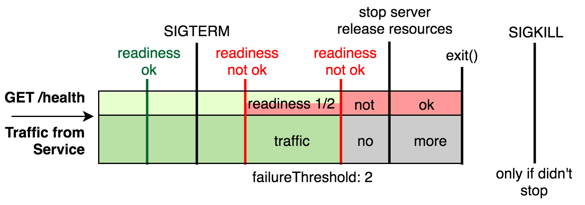

# Shutdown gracefully

<br/><br/>

### One Paragraph Explainer

In a Dockerized runtime like Kubernetes, containers are born and die frequently. This happens not only when errors are thrown but also for good reasons like relocating containers, replacing them with a newer version and more. It's achieved by sending a notice (SIGTERM signal) to the process with a 30 second grace period. This puts a challenge on the developer to ensure the app is handling the ongoing requests and clean-up resources in a timely fashion. Otherwise thousands of sad users will not get a response. Implementation-wise, the shutdown code should wait until all ongoing requests are flushed out and then clean-up resources. Easier said than done, practically it demands orchestrating several parts: Tell the LoadBalancer that the app is not ready to serve more requests (via health-check), wait for existing requests to be done, avoid handling new requests, clean-up resources and finally log some useful information before dying. If Keep-Alive connections are being used, the clients must also be notified that a new connection should be established - A library like [Stoppable](https://github.com/hunterloftis/stoppable) can greatly help achieving this.

<br/><br/>


### Code Example – Placing Node.js as the root process allows passing signals to the code (see [bootstrap using node](./bootstrap-using-node.md))

<details>

<summary><strong>Dockerfile</strong></summary>

```dockerfile
FROM node:12-slim

# Build logic comes here

CMD ["node", "index.js"]
#This line above will make Node.js the root process (PID1)

```

</details>

<br/><br/>

### Code Example – Using Tiny process manager to forward signals to Node

<details>

<summary><strong>Dockerfile</strong></summary>

```dockerfile
FROM node:12-slim

# Build logic comes here

ENV TINI_VERSION v0.19.0
ADD https://github.com/krallin/tini/releases/download/${TINI_VERSION}/tini /tini
RUN chmod +x /tini
ENTRYPOINT ["/tini", "--"]

CMD ["node", "index.js"]
#Now Node will run a sub-process of TINI which acts as PID1

```

</details>

<br/><br/>

### Code Example Anti Pattern – Using npm scripts to initialize the process

<details>

<summary><strong>Dockerfile</strong></summary>

```dockerfile
FROM node:12-slim

# Build logic comes here

CMD ["npm", "start"]
#Now Node will run a sub-process of npm and won't receive signals

```

</details>

<br/><br/>

### Example - The shutdown phases

From the blog, [Rising Stack](https://blog.risingstack.com/graceful-shutdown-node-js-kubernetes/)


