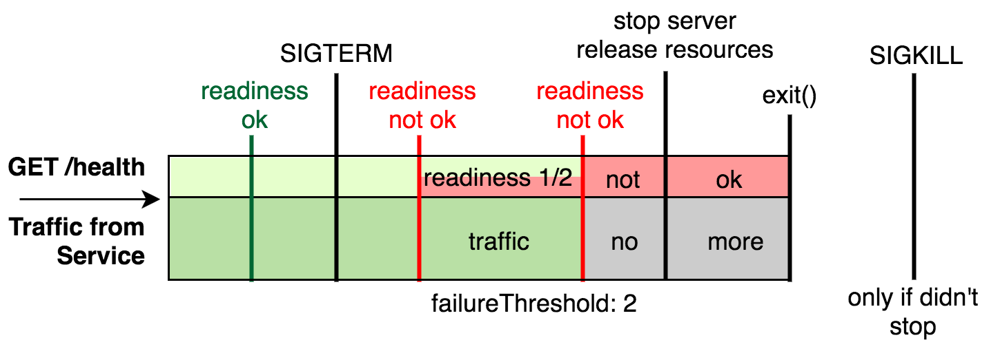

# М'яке завершення роботи

<br/><br/>

### Пояснення за один абзац

У Docker-середовищі виконання, такому як Kubernetes, контейнери часто народжуються та вмирають. Це відбувається не лише при виникненні помилок, але й з поважних причин, таких як переміщення контейнерів, заміна їх новішою версією тощо. Це досягається надсиланням повідомлення (сигнал SIGTERM) процесу з 30-секундним періодом очікування. Це ставить перед розробником завдання забезпечити, щоб застосунок обробляв поточні запити та своєчасно очищав ресурси. Інакше тисячі засмучених користувачів не отримають відповіді. З точки зору реалізації, код завершення повинен чекати, поки всі поточні запити будуть завершені, а потім очистити ресурси. Легше сказати, ніж зробити — практично це вимагає оркестрування кількох частин: Повідомити LoadBalancer, що застосунок не готовий обслуговувати більше запитів (через health-check), дочекатися завершення існуючих запитів, уникнути обробки нових запитів, очистити ресурси та, нарешті, записати корисну інформацію перед завершенням. Якщо використовуються Keep-Alive з'єднання, клієнти також повинні бути повідомлені про необхідність встановлення нового з'єднання — бібліотека на кшталт [Stoppable](https://github.com/hunterloftis/stoppable) може значно допомогти в досягненні цього.

<br/><br/>


### Приклад коду – Розміщення Node.js як кореневого процесу дозволяє передавати сигнали до коду (див. [bootstrap using node](./bootstrap-using-node.ukrainian.md))

<details>

<summary><strong>Dockerfile</strong></summary>

```dockerfile
FROM node:12-slim

# Логіка збірки йде тут

CMD ["node", "index.js"]
#Цей рядок вище зробить Node.js кореневим процесом (PID1)

```

</details>

<br/><br/>

### Приклад коду – Використання Tiny менеджера процесів для пересилання сигналів до Node

<details>

<summary><strong>Dockerfile</strong></summary>

```dockerfile
FROM node:12-slim

# Логіка збірки йде тут

ENV TINI_VERSION v0.19.0
ADD https://github.com/krallin/tini/releases/download/${TINI_VERSION}/tini /tini
RUN chmod +x /tini
ENTRYPOINT ["/tini", "--"]

CMD ["node", "index.js"]
#Тепер Node буде працювати як підпроцес TINI, який діє як PID1

```

</details>

<br/><br/>

### Приклад коду Антипатерн – Використання npm-скриптів для ініціалізації процесу

<details>

<summary><strong>Dockerfile</strong></summary>

```dockerfile
FROM node:12-slim

# Логіка збірки йде тут

CMD ["npm", "start"]
#Тепер Node буде працювати як підпроцес npm і не отримуватиме сигнали

```

</details>

<br/><br/>

### Приклад - Фази завершення

З блогу [Rising Stack](https://blog.risingstack.com/graceful-shutdown-node-js-kubernetes/)



