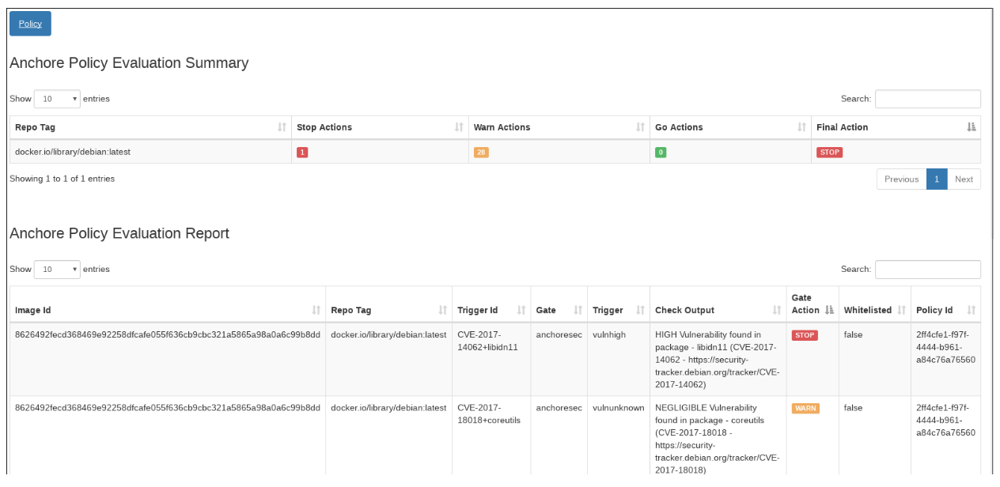

# Scan the entire image before production

<br/><br/>

### One Paragraph Explainer

Scanning the code for vulnerabilities is a valuable act but it doesn't cover all the potential threats. Why? Because vulnerabilities also exist on the OS level and the app  might execute those binaries like Shell, Tarball,  OpenSSL. Also, vulnerable dependencies might be injected after the code scan (i.e. supply chain attacks) - hence scanning the final image just before production is in order. This idea resembles E2E tests - after testing the various pieces in-isolation, it's valuable to finally check the assembled deliverable. There are 3 main scanner families: Local/CI binaries with a cached vulnerabilities DB, scanners as a service in the cloud and a niche of tools which scan during the docker build itself. The first group is the most popular and usually the fastest - Tools like [Trivvy](https://github.com/aquasecurity/trivy), [Anchore](https://github.com/anchore/anchore) and [Snyk](https://support.snyk.io/hc/en-us/articles/360003946897-Container-security-overview) are worth exploring. Most CI vendors provide a local plugin that facilitates the interaction with these scanners. It should be noted that these scanners cover a lot of ground and therefore will show findings in almost every scan - consider setting a high threshold bar to avoid getting overwhelmed

<br/><br/>

### Code Example – Scanning with Trivvy

<details>

<summary><strong>Bash</strong></summary>

```console
$ sudo apt-get install rpm
$ wget https://github.com/aquasecurity/trivy/releases/download/{TRIVY_VERSION}/trivy_{TRIVY_VERSION}_Linux-64bit.deb
$ sudo dpkg -i trivy_{TRIVY_VERSION}_Linux-64bit.deb
$ trivy image [YOUR_IMAGE_NAME]
```

</details>

<br/><br/>

### Report Example – Docker scan results (By Anchore)

