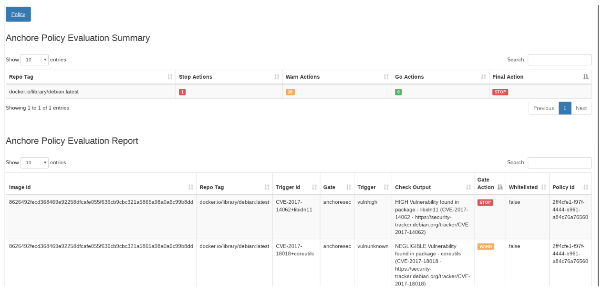

# Скануйте весь образ перед продакшеном

<br/><br/>

### Пояснення за один абзац

Сканування коду на вразливості — цінна дія, але вона не покриває всі потенційні загрози. Чому? Тому що вразливості також існують на рівні ОС, і застосунок може виконувати ці бінарні файли, такі як Shell, Tarball, OpenSSL. Також вразливі залежності можуть бути впроваджені після сканування коду (тобто атаки на ланцюг постачання) — отже, сканування кінцевого образу безпосередньо перед продакшеном є обов'язковим. Ця ідея нагадує E2E-тести — після тестування різних частин ізольовано, цінно остаточно перевірити зібраний продукт. Є 3 основні сімейства сканерів: Локальні/CI бінарні файли з кешованою БД вразливостей, сканери як сервіс у хмарі та ніша інструментів, які сканують під час самої збірки docker. Перша група найпопулярніша і зазвичай найшвидша — такі інструменти, як [Trivvy](https://github.com/aquasecurity/trivy), [Anchore](https://github.com/anchore/anchore) та [Snyk](https://support.snyk.io/hc/en-us/articles/360003946897-Container-security-overview), варто дослідити. Більшість CI-вендорів надають локальний плагін, який полегшує взаємодію з цими сканерами. Слід зазначити, що ці сканери покривають багато областей і тому показуватимуть знахідки майже при кожному скануванні — розгляньте встановлення високого порогу, щоб уникнути перевантаження

<br/><br/>

### Приклад коду – Сканування за допомогою Trivvy

<details>

<summary><strong>Bash</strong></summary>

```console
$ sudo apt-get install rpm
$ wget https://github.com/aquasecurity/trivy/releases/download/{TRIVY_VERSION}/trivy_{TRIVY_VERSION}_Linux-64bit.deb
$ sudo dpkg -i trivy_{TRIVY_VERSION}_Linux-64bit.deb
$ trivy image [YOUR_IMAGE_NAME]
```

</details>

<br/><br/>

### Приклад звіту – Результати сканування Docker (від Anchore)



