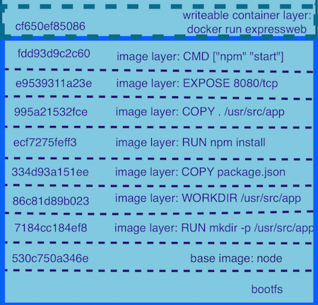

# Leverage caching to reduce build times

## One paragraph explainer

Docker images are a combination of layers, each instruction in your Dockerfile creates a layer. The docker daemon can reuse those layers between builds if the instructions are identical or in the case of a `COPY` or `ADD` files used are identical. ⚠️ If the cache can't be used for a particular layer all the subsequent layers will be invalidated too. That's why order is important. It is crucial to layout your Dockerfile correctly to reduce the number of moving parts in your build; the less updated instructions should be at the top and the ones constantly changing (like app code) should be at the bottom. It's also important to think that instructions that trigger long operation should be close to the top to ensure they happen only when really necessary (unless it changes every time you build your docker image). Rebuilding a whole docker image from cache can be nearly instantaneous if done correctly.



* Image taken from [Digging into Docker layers](https://medium.com/@jessgreb01/digging-into-docker-layers-c22f948ed612) by jessgreb01*

### Rules

#### Avoid LABEL that change all the time 

If you have a label containing the build number at the top of your Dockerfile, the cache will be invalidated at every build 

```Dockerfile
#Beginning of the file
FROM node:10.22.0-alpine3.11 as builder

# Don't do that here!
LABEL build_number="483"

#... Rest of the Dockerfile
```

#### Have a good .dockerignore file

[**See: On the importance of docker ignore**](./docker-ignore.md)

The docker ignore avoids copying files that could bust our cache logic, like tests results reports, logs or temporary files.

#### Install "system" packages first

It is recommended to create a base docker image that has all the system packages you use. If you **really** need to install packages using `apt`,`yum`,`apk` or the likes, this should be one of the first instructions. You don't want to reinstall make,gcc or g++ every time you build your node app.
**Do not install package only for convenience, this is a production app.**

#### First, only ADD your package.json and your lockfile

```Dockerfile
COPY "package.json" "package-lock.json" "./"
RUN npm ci
```

The lockfile and the package.json change less often. Copying them first will keep the `npm install` step in the cache, this saves precious time. 

### Then copy your files and run build step (if needed) 

```Dockerfile
COPY . .
RUN npm run build
```

## Examples

### Basic Example with node_modules needing OS dependencies
```Dockerfile
#Create node image version alias
FROM node:10.22.0-alpine3.11 as builder

RUN apk add --no-cache \
    build-base \
    gcc \
    g++ \
    make

USER node
WORKDIR /app
COPY "package.json" "package-lock.json" "./"
RUN npm ci --production
COPY . "./"


FROM node as app

USER node
WORKDIR /app
COPY --from=builder /app/ "./"
RUN npm prune --production

CMD ["node", "dist/server.js"]
```


### Example with a build step (when using typescript for example)
```Dockerfile
#Create node image version alias
FROM node:10.22.0-alpine3.11 as builder

RUN apk add --no-cache \
    build-base \
    gcc \
    g++ \
    make

USER node
WORKDIR /app
COPY "package.json" "package-lock.json" "./"
RUN npm ci
COPY . .
RUN npm run build


FROM node as app

USER node
WORKDIR /app
# Only copying the files that we need
COPY --from=builder /app/node_modules node_modules
COPY --from=builder /app/package.json .
COPY --from=builder /app/dist dist
RUN npm prune --production

CMD ["node", "dist/server.js"]
```

## Useful links

Docker docs: https://docs.docker.com/develop/develop-images/dockerfile_best-practices/#leverage-build-cache