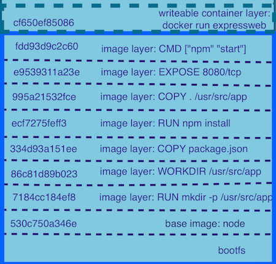

# Використовуйте кешування для скорочення часу збірки

## Пояснення за один абзац

Docker-образи — це комбінація шарів, кожна інструкція у вашому Dockerfile створює шар. Docker daemon може повторно використовувати ці шари між збірками, якщо інструкції ідентичні або у випадку `COPY` або `ADD` використовувані файли ідентичні. ⚠️ Якщо кеш не може бути використаний для певного шару, всі наступні шари також будуть інвалідовані. Ось чому порядок важливий. Критично важливо правильно розташувати ваш Dockerfile, щоб зменшити кількість рухомих частин у вашій збірці; менш оновлювані інструкції повинні бути вгорі, а ті, що постійно змінюються (як код застосунку), повинні бути внизу. Також важливо думати, що інструкції, які запускають довгі операції, повинні бути близько до верху, щоб гарантувати, що вони відбуваються лише коли дійсно необхідно (якщо це не змінюється кожного разу, коли ви будуєте свій docker-образ). Перебудова цілого docker-образу з кешу може бути майже миттєвою, якщо зроблено правильно.



* Зображення взято з [Digging into Docker layers](https://medium.com/@jessgreb01/digging-into-docker-layers-c22f948ed612) від jessgreb01*

### Правила

#### Уникайте LABEL, які постійно змінюються 

Якщо у вас є мітка, що містить номер збірки на початку вашого Dockerfile, кеш буде інвалідований при кожній збірці 

```Dockerfile
#Початок файлу
FROM node:10.22.0-alpine3.11 as builder

# Не робіть цього тут!
LABEL build_number="483"

#... Решта Dockerfile
```

#### Майте хороший .dockerignore файл

[**Див.: Про важливість docker ignore**](./docker-ignore.ukrainian.md)

Docker ignore уникає копіювання файлів, які можуть порушити нашу логіку кешування, таких як звіти про результати тестів, логи або тимчасові файли.

#### Спочатку встановлюйте "системні" пакети

Рекомендується створити базовий docker-образ, який має всі системні пакети, які ви використовуєте. Якщо вам **дійсно** потрібно встановлювати пакети за допомогою `apt`,`yum`,`apk` або подібних, це повинна бути одна з перших інструкцій. Ви не хочете перевстановлювати make, gcc або g++ кожного разу, коли будуєте свій node-застосунок.
**Не встановлюйте пакети лише для зручності, це продакшен-застосунок.**

#### Спочатку додайте лише ваш package.json та lockfile

```Dockerfile
COPY "package.json" "package-lock.json" "./"
RUN npm ci
```

Lockfile та package.json змінюються рідше. Копіювання їх першими збереже крок `npm install` в кеші, це економить дорогоцінний час. 

### Потім копіюйте ваші файли та запускайте крок збірки (якщо потрібно) 

```Dockerfile
COPY . .
RUN npm run build
```

## Приклади

### Базовий приклад з node_modules, що потребують залежностей ОС
```Dockerfile
#Створюємо псевдонім версії node-образу
FROM node:10.22.0-alpine3.11 as builder

RUN apk add --no-cache \
    build-base \
    gcc \
    g++ \
    make

USER node
WORKDIR /app
COPY "package.json" "package-lock.json" "./"
RUN npm ci --production
COPY . "./"


FROM node as app

USER node
WORKDIR /app
COPY --from=builder /app/ "./"
RUN npm prune --production

CMD ["node", "dist/server.js"]
```


### Приклад з кроком збірки (при використанні typescript, наприклад)
```Dockerfile
#Створюємо псевдонім версії node-образу
FROM node:10.22.0-alpine3.11 as builder

RUN apk add --no-cache \
    build-base \
    gcc \
    g++ \
    make

USER node
WORKDIR /app
COPY "package.json" "package-lock.json" "./"
RUN npm ci
COPY . .
RUN npm run build


FROM node as app

USER node
WORKDIR /app
# Копіюємо лише потрібні файли
COPY --from=builder /app/node_modules node_modules
COPY --from=builder /app/package.json .
COPY --from=builder /app/dist dist
RUN npm prune --production

CMD ["node", "dist/server.js"]
```

## Корисні посилання

Документація Docker: https://docs.docker.com/develop/develop-images/dockerfile_best-practices/#leverage-build-cache

