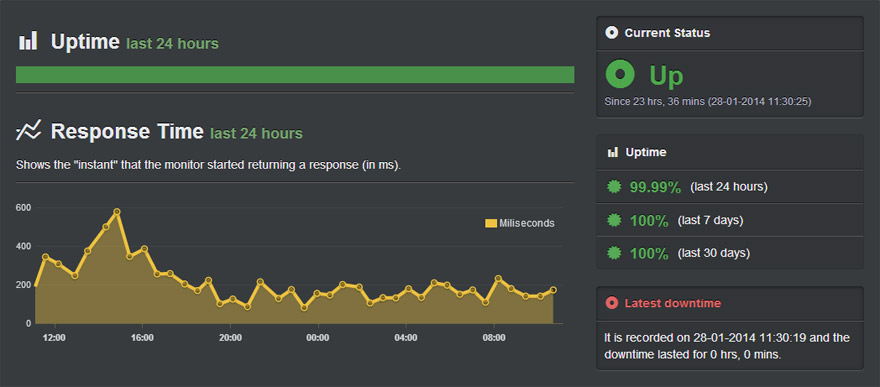

# Descubra erros e downtime usando APM

### Explicação em um Parágrafo

Exceção != Erro. O tratamento de erros tradicional pressupõe a existência de Exceção, mas os erros de aplicativo podem vir na forma de caminhos de código lento, tempo de inatividade (downtime) da API, falta de recursos computacionais e muito mais. É aqui que os produtos APM são úteis, pois permitem detectar uma ampla variedade de problemas "enterrados" de forma proativa e com uma configuração mínima. Entre os recursos comuns dos produtos APM estão, por exemplo, alertas quando a API HTTP retorna erros, detecta quando o tempo de resposta da API cai abaixo de um limite, detecção de 'códigos suspeitos', formas de monitorar recursos do servidor, painel de inteligência operacional com métricas de TI e muitos outros recursos úteis. A maioria dos fornecedores oferece um plano gratuito.

### Wikipédia sobre APM

Nos campos de tecnologia da informação e gerenciamento de sistemas, o Application Performance Management (APM) é o monitoramento e gerenciamento de desempenho e disponibilidade de aplicativos de software. O APM se esforça para detectar e diagnosticar problemas complexos de desempenho do aplicativo para manter um nível esperado de serviço. APM é "a tradução de métricas de TI em significado de negócios ([i.e.] value)". Principais produtos e segmentos.

### Entendendo o mercado de APM

Os produtos APM constituem 3 segmentos principais:

1. Monitoramento de sites ou APIs - serviços externos que monitoram constantemente o tempo de atividade e o desempenho por meio de solicitações HTTP. Pode ser configurado em poucos minutos. A seguir estão alguns candidatos selecionados: [Pingdom](https://www.pingdom.com/), [Uptime Robot](https://uptimerobot.com/) e [New Relic](https://newrelic.com) / monitoramento de aplicativos)

2. Instrumentação de código - família de produtos que exige a incorporação de um agente no aplicativo para usar recursos como detecção de código lento, estatísticas de exceção, monitoramento de desempenho e muito mais. A seguir estão alguns candidatos selecionados: New Relic, App Dynamics.

3. Painel de inteligência operacional - essa linha de produtos está focada em auxiliar a equipe de operações com métricas e conteúdo de curadoria que ajuda a ficar facilmente a par do desempenho do aplicativo. Isso geralmente envolve a agregação de várias fontes de informações (logs de aplicativos, logs do BD, log de servidores, etc.) e o trabalho de design do painel inicial. A seguir estão alguns candidatos selecionados: [Datadog](https://www.datadoghq.com/), [Splunk](https://www.splunk.com/), [Zabbix](https: //www.zabbix. com /).

 ### Exemplo: UpTimeRobot.Com - Painel de monitoramento de site

 ### Example: AppDynamics.Com – monitoramento de ponta a ponta combinado com instrumentação de código

