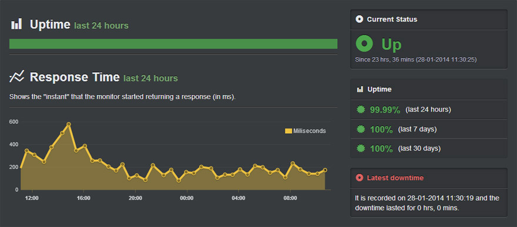
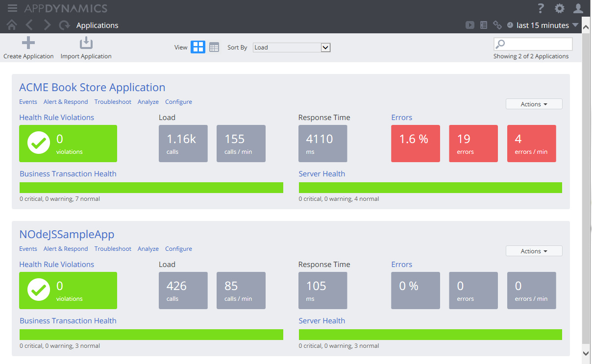

# Découvrez les erreurs et les indisponibilités à l'aide des produits de gestion de la performance applicative

### Un paragraphe d'explication

Exception != Erreur. Le traitement traditionnel des erreurs suppose l'existence d'une exception en raison d'un problème lié au code, mais les erreurs d'application peuvent se présenter sous la forme de parcours de code lents, d'indisponibilité de l'API, de manque de ressources de calcul, etc. C’est là que les produits de gestion de la performance applicative (En anglais Application Performance Management : APM) sont utiles car ils permettent de détecter de manière proactive une grande variété de problèmes « cachés » avec une configuration minimale. Parmi les caractéristiques communes des produits APM, on trouve par exemple les alertes lorsque l'API HTTP renvoie des erreurs, la détection lorsque le temps de réponse de l'API tombe en dessous d'un certain seuil, la détection des « [codes smells](https://fr.wikipedia.org/wiki/Code_smell) », les fonctionnalités de surveillance des ressources du serveur, le tableau de bord de l'intelligence opérationnelle avec des mesures informatiques et plusieurs autres fonctionnalités utiles. La plupart des fournisseurs proposent un forfait gratuit.

### APM sur Wikipédia

Dans les domaines des technologies de l'information et de la gestion des systèmes, « Application Performance Management » (APM) est la surveillance et la gestion des performances et de la disponibilité des applications logicielles. APM s'efforce de détecter et de diagnostiquer les problèmes de performances des applications complexes pour maintenir un niveau de service souhaité. APM est « la traduction des métriques informatiques en signification métier (c'est-à-dire en valeur) ».

### Comprendre le marché APM

Les produits APM regroupent 3 pôles principaux :

1. Surveillance de site Web ou d'API - services externes qui surveillent constamment la disponibilité et les performances via des requêtes HTTP. Peut être installé en quelques minutes. Voici quelques candidats sélectionnés : [Pingdom](https://www.pingdom.com/), [Uptime Robot](https://uptimerobot.com/) et [New Relic](https://newrelic.com/application-monitoring).

2. Instrumentation de code - famille de produits qui nécessite d'incorporer un agent dans l'application pour utiliser les fonctionnalités telles que la détection de code lent, les statistiques d'exception, la surveillance des performances et bien d'autres. Voici quelques candidats sélectionnés : New Relic, App Dynamics.

3. Tableau de bord de l'intelligence opérationnelle - cette gamme de produits vise à faciliter la tâche de l'équipe d'exploitation avec des mesures et un contenu organisé qui permettent de rester facilement au fait de la performance des applications. Cela implique généralement l'agrégation de plusieurs sources d'informations (journaux d'application, journaux de base de données, journaux des serveurs, etc.) et le travail de conception du tableau de bord initial. Voici quelques candidats sélectionnés : [Datadog](https://www.datadoghq.com/), [Splunk](https://www.splunk.com/), [Zabbix](https://www.zabbix.com/).

 ### Exemple : UpTimeRobot.Com - Tableau de bord de surveillance de site Web

 ### Exemple : AppDynamics.Com - Surveillance de bout en bout combinée à une instrumentation de code

