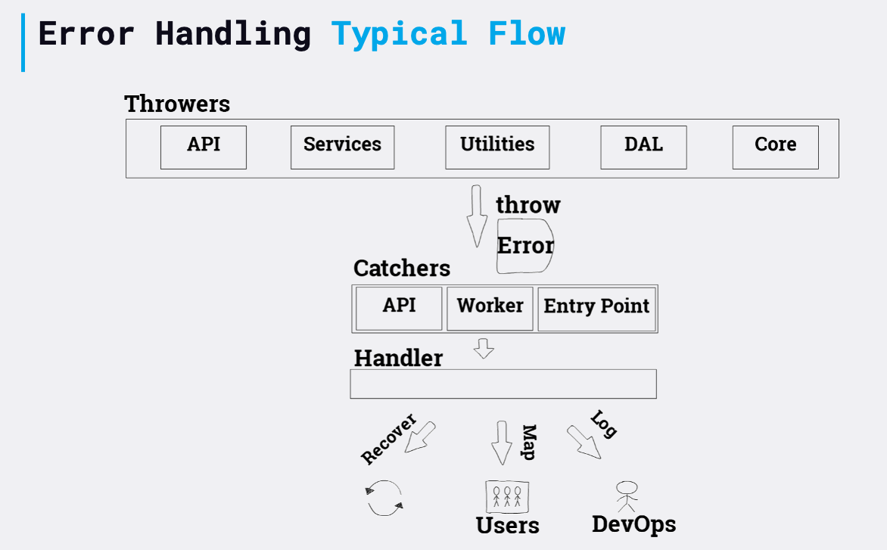

# Gérez les erreurs de manière centralisée, pas dans les middlewares

### Un paragraphe d'explication

Sans un objet dédié au traitement des erreurs, les risques de traitement incohérent des erreurs sont plus grands : les erreurs lancées à l'intérieur des requêtes web peuvent être traitées différemment de celles qui sont levées lors de la phase de démarrage et de celles qui sont levées par les jobs planifiés. Cela peut conduire à certains types d'erreurs qui sont mal gérés. Cet objet unique de traitement des erreurs est chargé de rendre l'erreur visible, par exemple, en écrivant dans un journal bien formaté, en envoyant des mesures à l'aide d'un produit de surveillance (comme [Prometheus](https://prometheus.io/), [CloudWatch](https://aws.amazon.com/cloudwatch/), [DataDog](https://www.datadoghq.com/) et [Sentry](https://sentry.io/)) et de décider si le processus doit planter. La plupart des frameworks web fournissent un mécanisme de middleware pour la détection des erreurs - une erreur typique consiste à placer le code de gestion des erreurs dans ce middelware. Ce faisant, vous ne pourrez pas réutiliser le même gestionnaire pour les erreurs qui sont détectées dans différents scénarios comme les tâches planifiées, les abonnés à la file d'attente des messages et les exceptions non détectées. Par conséquent, le middleware de gestion des erreurs ne doit que capturer les erreurs et les transmettre au gestionnaire. Un flux typique de traitement des erreurs pourrait être : un module lance une erreur -> le routeur API capture l'erreur -> il propage l'erreur au middleware (par exemple ou à un autre mécanisme de capture d'erreur au niveau de la requête) qui est responsable de la capture des erreurs -> un gestionnaire d'erreur centralisé est appelé.

### Exemple de code - un flux d'erreur typique

<details>
<summary><strong>Javascript</strong></summary>

```javascript
// Strate de la DAL, nous ne gérons pas les erreurs ici
DB.addDocument(newCustomer, (error, result) => {
  if (error)
    throw new Error('Une bonne explication de l\'erreur à cet endroit', autres parametres utiles)
});

// Code de l'API route, nous interceptons les erreurs synchrone et asynchrone et les transmettons au middleware
try {
  customerService.addNew(req.body).then((result) => {
    res.status(200).json(result);
  }).catch((error) => {
    next(error)
  });
}
catch (error) {
  next(error);
}

// Gestion des erreurs du middleware, nous déléguons la gestion au gestionnaire d'erreurs centralisé
app.use(async (err, req, res, next) => {
  await errorHandler.handleError(err, res);//Le gestionnaire d'erreur enverra une réponse
});

process.on("uncaughtException", error => {
  errorHandler.handleError(error);
});

process.on("unhandledRejection", (reason) => {
  errorHandler.handleError(reason);
});
```
</details>

<details>
<summary><strong>Typescript</strong></summary>

```typescript
// Strate de la DAL, nous ne gérons pas les erreurs ici
DB.addDocument(newCustomer, (error: Error, result: Result) => {
  if (error)
    throw new Error('Une bonne explication de l\'erreur à cet endroit', autres parametres utiles)
});

// Code de l'API route, nous interceptons les erreurs synchrone et asynchrone et les transmettons au middleware
try {
  customerService.addNew(req.body).then((result: Result) => {
    res.status(200).json(result);
  }).catch((error: Error) => {
    next(error)
  });
}
catch (error) {
  next(error);
}

// Gestion des erreurs du middleware, nous déléguons la gestion au gestionnaire d'erreurs centralisé
app.use(async (err: Error, req: Request, res: Response, next: NextFunction) => {
  await errorHandler.handleError(err, res);
});

process.on("uncaughtException", (error:Error) => {
  errorHandler.handleError(error);
});

process.on("unhandledRejection", (reason) => {
  errorHandler.handleError(reason);
});
```
</details>


### Exemple de code - gestion des erreurs dans un objet dédié

<details>
<summary><strong>Javascript</strong></summary>

```javascript
module.exports.handler = new errorHandler();

function errorHandler() {
  this.handleError = async (error, responseStream) => {
    await logger.logError(error);
    await fireMonitoringMetric(error);
    await crashIfUntrustedErrorOrSendResponse(error, responseStream);
  };
}
```
</details>

<details>
<summary><strong>Typescript</strong></summary>

```typescript
class ErrorHandler {
  public async handleError(error: Error, responseStream: Response): Promise<void> {
    await logger.logError(error);
    await fireMonitoringMetric(error);
    await crashIfUntrustedErrorOrSendResponse(error, responseStream);
  };
}

export const handler = new ErrorHandler();
```
</details>


### Contre exemple de code - gestion des erreurs dans le middleware

<details>
<summary><strong>Javascript</strong></summary>

```javascript
// middleware traitant l'erreur directement, qui va gérer les tâches Cron et tester les erreurs ?
app.use((err, req, res, next) => {
  logger.logError(err);
  if (err.severity == errors.high) {
    mailer.sendMail(configuration.adminMail, 'Une erreur critique s\'est produite', err);
  }
  if (!err.isOperational) {
    next(err);
  }
});
```
</details>


<details>
<summary><strong>Typescript</strong></summary>

```typescript
// middleware traitant l'erreur directement, qui va gérer les tâches Cron et tester les erreurs ?
app.use((err: Error, req: Request, res: Response, next: NextFunction) => {
  logger.logError(err);
  if (err.severity == errors.high) {
    mailer.sendMail(configuration.adminMail, 'Une erreur critique s\'est produite', err);
  }
  if (!err.isOperational) {
    next(err);
  }
});
```
</details>

### Illustration : Les acteurs et le flux du traitement des erreurs



### Citation de blog : « Parfois, les niveaux inférieurs ne peuvent rien faire d'utile, sauf propager l'erreur à leur appelant »

Extrait du blog de Joyent classé en 1ere position pour les mots clés “Node.js error handling”

> …Vous pouvez finir par gérer la même erreur à plusieurs niveaux de la pile. Cela se produit lorsque les niveaux inférieurs ne peuvent rien faire d'autre d'utile que de propager l'erreur à leur appelant, qui propage l'erreur à son appelant et ainsi de suite. Souvent, seul l'appelant de niveau supérieur sait quelle est la réponse appropriée, que ce soit pour réessayer l'opération, signaler une erreur à l'utilisateur ou autre chose. Mais cela ne signifie pas que vous devez essayer de signaler toutes les erreurs à une seule fonction de rappel de niveau supérieur, car cette fonction de rappel elle-même ne peut pas savoir dans quel contexte l'erreur s'est produite.…

### Citation de blog : « Gérer chaque erreur individuellement entraînerait une énorme duplication »

Extrait du blog de JS Recipes classé en 17eme position pour les mots clés “Node.js error handling”

> ……Uniquement dans le contrôleur api.js de Hackathon Starter, il y a plus de 79 occurrences d'objets d'erreur. Gérer chaque erreur individuellement entraînerait une énorme duplication de code. La meilleure chose à faire est de déléguer toute la logique de gestion des erreurs à un middleware Express…

### Citation de blog : « les erreurs HTTP n'ont pas leur place dans le code de votre base de données »

Extrait du blog de Daily JS classé en 14eme position pour les mots clés “Node.js error handling”

> ……Vous devez définir des propriétés utiles dans les objets d'erreur, mais utilisez ces propriétés de manière cohérente. Et ne traversez pas les flux : les erreurs HTTP n'ont pas leur place dans le code de votre base de données. Ou pour les développeurs dans les navigateurs, les erreurs Ajax ont une place dans le code qui parle au serveur, mais pas dans le code qui traite les templates de Mustache…
