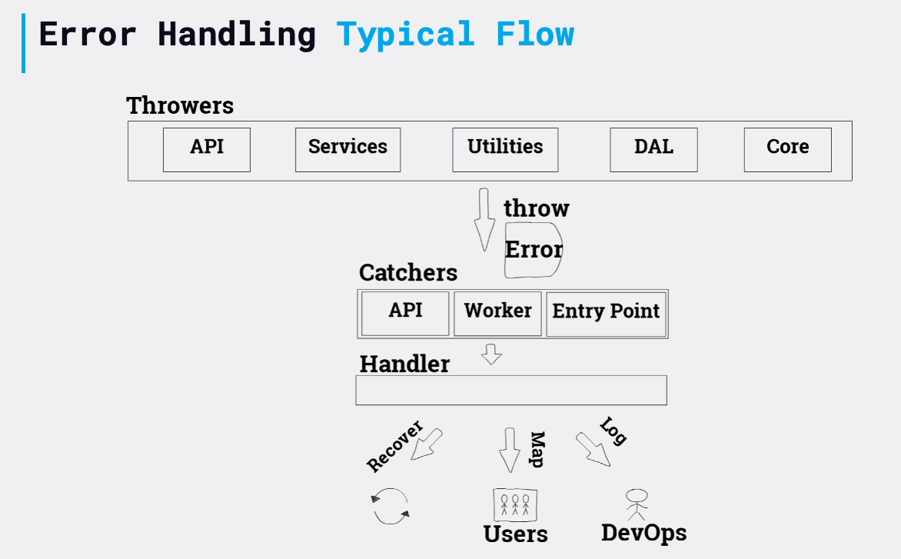

# Обробляйте помилки централізовано. Не в межах проміжного ПЗ

### Пояснення за один абзац

Без єдиного спеціального об’єкта для обробки помилок зростає ймовірність неузгодженої обробки помилок: помилки, які виникають у веб-запитах, можуть оброблятися інакше, ніж ті, що виникають під час фази запуску та ті, що виникають під час запланованих завдань. Це може призвести до деяких типів помилок, якими неправильно керують. Цей єдиний об’єкт обробника помилок відповідає за те, щоб зробити помилку видимою, наприклад, записуючи в добре відформатований реєстратор, запускаючи метрики за допомогою певного продукту моніторингу (наприклад, [Prometheus](https://prometheus.io/), [CloudWatch] (https://aws.amazon.com/cloudwatch/), [DataDog](https://www.datadoghq.com/) і [Sentry](https://sentry.io/)) і вирішити, чи процес повинен вийти з ладу. Більшість веб-фреймворків забезпечують механізм уловлювання помилок проміжного програмного забезпечення. Типовою помилкою є розміщення коду обробки помилок у цьому проміжному програмному забезпеченні. Зробивши це, ви не зможете повторно використовувати той самий обробник для помилок, які виявлені в різних сценаріях, як-от заплановані завдання (scheduled jobs), абоненти черги (message queue) повідомлень і неперехоплені винятки. Отже, проміжне програмне забезпечення (middleware) помилок має лише виловлювати помилки та пересилати їх обробнику. Типовий процес обробки помилок може бути таким: якийсь модуль видає помилку -> API-маршрутизатор виявляє помилку -> він поширює помилку на проміжне програмне забезпечення (наприклад, або інший механізм для виявлення помилок на рівні запиту), який відповідає за виявлення помилок -> викликається централізований обробник помилок.

### Приклад коду – типовий потік помилок

<details>
<summary><strong>Javascript</strong></summary>

```javascript
// Рівень DAL, тут ми не обробляємо помилки
DB.addDocument(newCustomer, (error, result) => {
  if (error) 
      throw new Error('Чудове пояснення помилок міститься тут', 'інші параметри')
});

// Код маршруту API, ми виявляємо помилки синхронізації та асинхронізації та пересилаємо до проміжного програмного забезпечення
try {
  customerService.addNew(req.body).then((result) => {
    res.status(200).json(result);
  }).catch((error) => {
    next(error)
  });
}
catch (error) {
  next(error);
}

// Проміжне програмне забезпечення обробки помилок, ми делегуємо обробку централізованому обробнику помилок
app.use(async (err, req, res, next) => {
  await errorHandler.handleError(err, res); //Обробник помилок надішле відповідь
});

process.on("uncaughtException", error => {
  errorHandler.handleError(error);
});

process.on("unhandledRejection", (reason) => {
  errorHandler.handleError(reason);
});
```
</details>

<details>
<summary><strong>Typescript</strong></summary>

```typescript
// Рівень DAL, тут ми не обробляємо помилки
DB.addDocument(newCustomer, (error: Error, result: Result) => {
  if (error) 
      throw new Error('Чудове пояснення помилок міститься тут', 'інші параметри')
});

// Код маршруту API, ми виявляємо помилки синхронізації та асинхронізації та пересилаємо до проміжного програмного забезпечення
try {
  customerService.addNew(req.body).then((result: Result) => {
    res.status(200).json(result);
  }).catch((error: Error) => {
    next(error)
  });
}
catch (error) {
  next(error);
}

// Проміжне програмне забезпечення обробки помилок, ми делегуємо обробку централізованому обробнику помилок
app.use(async (err: Error, req: Request, res: Response, next: NextFunction) => {
  await errorHandler.handleError(err, res);
});

process.on("uncaughtException", (error:Error) => {
  errorHandler.handleError(error);
});

process.on("unhandledRejection", (reason) => {
  errorHandler.handleError(reason);
});
```
</details>


### Приклад коду – обробка помилок у виділеному об'єкті

<details>
<summary><strong>Javascript</strong></summary>

```javascript
module.exports.handler = new errorHandler();

function errorHandler() {
  this.handleError = async (error, responseStream) => {
    await logger.logError(error);
    await fireMonitoringMetric(error);
    await crashIfUntrustedErrorOrSendResponse(error, responseStream);
  };
}
```
</details>

<details>
<summary><strong>Typescript</strong></summary>

```typescript
class ErrorHandler {
  public async handleError(error: Error, responseStream: Response): Promise<void> {
    await logger.logError(error);
    await fireMonitoringMetric(error);
    await crashIfUntrustedErrorOrSendResponse(error, responseStream);
  };
}

export const handler = new ErrorHandler();
```
</details>


### Приклад коду – Anti Pattern: обробка помилок у проміжному програмному забезпеченні (middleware)

<details>
<summary><strong>Javascript</strong></summary>

```javascript
// проміжне програмне забезпечення безпосередньо обробляє помилку, хто буде обробляти завдання Cron і помилки тестування?
app.use((err, req, res, next) => {
  logger.logError(err);
  if (err.severity == errors.high) {
    mailer.sendMail(configuration.adminMail, 'Critical error occured', err);
  }
  if (!err.isOperational) {
    next(err);
  }
});
```
</details>


<details>
<summary><strong>Typescript</strong></summary>

```typescript
// проміжне програмне забезпечення безпосередньо обробляє помилку, хто буде обробляти завдання Cron і помилки тестування?
app.use((err: Error, req: Request, res: Response, next: NextFunction) => {
  logger.logError(err);
  if (err.severity == errors.high) {
    mailer.sendMail(configuration.adminMail, 'Critical error occured', err);
  }
  if (!err.isOperational) {
    next(err);
  }
});
```
</details>

 ### Ілюстрація: Обробка помилок 



### Цитвта з блогу: "Іноді нижчі рівні не можуть зробити нічого корисного, окрім як поширити помилку своєму абоненту"

З блогу Joyent, 1 місце за ключовими словами «обробка помилок Node.js»

> …Ви можете завершити обробку тієї самої помилки на кількох рівнях стеку. Це трапляється, коли нижчі рівні не можуть зробити нічого корисного, крім передачі помилки своєму абоненту, який поширює помилку своєму абоненту тощо. Часто лише абонент верхнього рівня знає, якою є відповідна відповідь, будь то повторна спроба операції, повідомлення про помилку користувачеві чи щось інше. Але це не означає, що ви повинні намагатися повідомляти про всі помилки єдиному зворотному виклику верхнього рівня, тому що цей зворотній виклик сам по собі не може знати, у якому контексті сталася помилка...

### Цитвта з блогу: "Опрацювання кожної помилки окремо призведе до величезного дублювання"

З блогу JS Recipes отримав 17 місце за ключовими словами «обробка помилок Node.js»

> ……Лише в контролері Hackathon Starter api.js існує понад 79 випадків помилкових об’єктів. Обробка кожної помилки окремо призведе до величезної кількості дублювання коду. Наступне найкраще, що ви можете зробити, це делегувати всю логіку обробки помилок проміжному програмному забезпеченню Express…

### Цитвта з блогу: "Помилкам HTTP не місце в коді бази даних"

З блогу Daily JS отримав 14 місце за ключовими словами «обробка помилок Node.js

> ……Вам слід встановити корисні властивості в об’єктах помилок, але використовувати такі властивості послідовно. І не перетинайте потоки: помилкам HTTP не місце в коді вашої бази даних. Або для розробників браузерів, помилки Ajax мають місце в коді, який спілкується з сервером, але не в коді, який обробляє шаблони Moustache…
