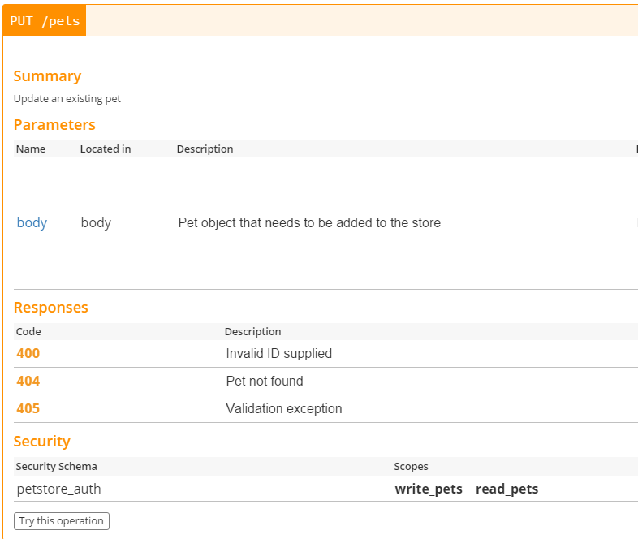

# Documentez les erreurs de l'API à l'aide de Swagger ou GraphQL

### Un paragraphe d'explication

Les API REST renvoient des résultats à l'aide de codes d'état HTTP, il est absolument nécessaire que l'utilisateur de l'API soit informé non seulement du schéma de l'API, mais également des erreurs potentielles - l'appelant peut alors détecter une erreur et la gérer avec tact. Par exemple, la documentation de votre API peut indiquer à l'avance que l'état HTTP 409 est renvoyé lorsque le nom du client existe déjà (en supposant que l'API enregistre de nouveaux utilisateurs) afin que l'appelant puisse rendre en conséquence la meilleure expérience utilisateur pour la situation donnée. Swagger est une norme qui définit le schéma de la documentation de l'API offrant un éco-système d'outils permettant de créer facilement de la documentation en ligne, consulter les copies écrans ci-dessous.

Si vous avez déjà adopté GraphQL pour vos points de terminaison de l'API, votre schéma contient déjà des garanties strictes quant à la nature des erreurs à rechercher ([celles décrites dans la spécification](https://facebook.github.io/graphql/June2018/#sec-Errors)) et comment elles doivent être traités par vos outils côté client. De plus, vous pouvez également les compléter avec une documentation basée sur des commentaires.

### Exemple d'erreur GraphQL

> Cet exemple utilise [SWAPI](https://graphql.org/swapi-graphql), l'API de Star Wars.

```graphql
# devrait échouer car l'id n'est pas valide
{
  film(id: "1ZmlsbXM6MQ==") {
    title
  }
}
```

```json
{
  "errors": [
    {
      "message": "Aucune entrée dans le cache local pour https://swapi.co/api/films/.../",
      "locations": [
        {
          "line": 2,
          "column": 3
        }
      ],
      "path": [
        "film"
      ]
    }
  ],
  "data": {
    "film": null
  }
}
```

### Citation de blog : « Vous devez dire à vos appelants quelles erreurs peuvent se produire »

Extrait du blog de Joyent classé en 1ere position pour les mots clés “Node.js logging”

 > Nous avons parlé de la façon de gérer les erreurs, mais lorsque vous écrivez une nouvelle fonction, comment envoyez-vous des erreurs au code qui a appelé votre fonction ? … Si vous ne savez pas quelles erreurs peuvent se produire ou si vous ne savez pas ce qu'elles signifient, alors votre programme ne peut être correct que par accident. Donc, si vous écrivez une nouvelle fonction, vous devez dire à vos appelants quelles erreurs peuvent se produire et ce qu'elles signifient…

### Outil utile : créateur de documentation en ligne Swagger


