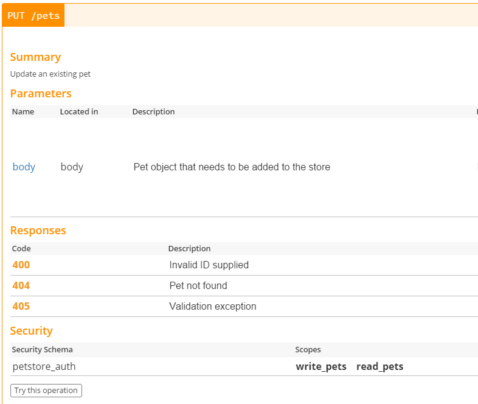

# Swagger または GraphQL を利用して API のエラーをドキュメント化する

### 一段落説明

REST API は HTTP ステータスコードを利用して結果を返しますが、API の利用者は、API のスキーマだけでなく潜在的なエラーについても意識しておくことが絶対に必要です ー そうすることで、利用者がエラーを捕捉して機転の利いた処理をできるかもしれません。例えばAPI ドキュメントに、（API が新規ユーザーを登録しようとしていると仮定して）顧客名が既に存在する場合に、HTTP ステータス 409 が返されることを前もって記載しておくことで、呼び出し元はそれに応じて最適な UX を提供することができるようになります。Swagger は API ドキュメントのスキーマを定義する標準仕様であり、オンラインで簡単にドキュメントを作成することを可能にするツール群を提供しています。下部のスクリーンショットを参照して下さい。

もし既に API エンドポイントとして GraphQL を採用している場合、スキーマは、エラーがどのように見えるか（[仕様書に記載されています](https://facebook.github.io/graphql/June2018/#sec-Errors)）や、クライアントサイドのツールでどのように処理されるべきかについて、厳密な保証をしています。さらに、コメントベースのドキュメントでそれらを補足することもできます。

### GraphQL エラー例

> この例は、スターウォーズ API として知れられている [SWAPI](https://graphql.org/swapi-graphql) を使用しています

```graphql
# id が無効な値のため、失敗するはずです
{
  film(id: "1ZmlsbXM6MQ==") {
    title
  }
}
```

```json
{
  "errors": [
    {
      "message": "No entry in local cache for https://swapi.co/api/films/.../",
      "locations": [
        {
          "line": 2,
          "column": 3
        }
      ],
      "path": [
        "film"
      ]
    }
  ],
  "data": {
    "film": null
  }
}
```

### ブログ引用: "You have to tell your callers what errors can happen"（どのようなエラーが起こりうるか、呼び出す側に示さなければなりません）

ブログ Joyent（“Node.js logging”というキーワードで 1 位）より

 > これまでエラー処理の方法について話してきましたが、新たな関数を書くときに、どのようにしてその関数を呼び出したコードにエラーを届けるのでしょうか？…もしどのようなエラーが起こりうるかを知らなかったり、またそのエラーが意味することがわからなかった場合、プログラムは、偶然を除けば正しいものにはなりえません。ですから、もしあなたが新たな関数を書くのであれば、どのようなエラーが起こりうるか、そしてそれらの意味することを呼び出し側に示さなければなりません…

### 便利ツール: Swagger Online Documentation Creator


