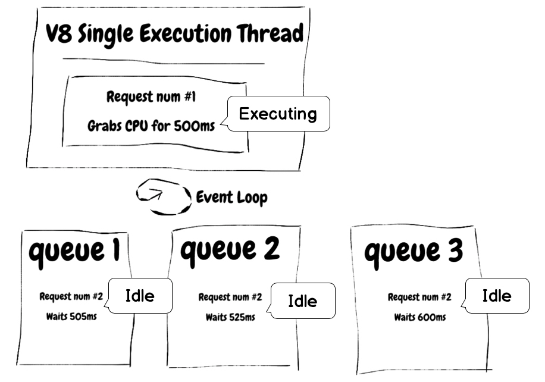

# Ez blokeatu gertaeren begizta

<br/><br/>

Nodek gertaeren begizta nagusiki hari bakarraren barruan kudeatzen du, hainbat ilaren artean txandakatuz. Prozesu horretan, bada eragile bat baino gehiago gertaeren begizta geldiaraz dezakeena, hala nola konplexutasun handiko ekintzak, json fitxategi handien sintaxi analisiak, logikaren erabilera sorta oso handietan, seguruak ez diren adierazpen erregularren kontsultak eta sarrera/irteera operazio garrantzitsuak. Ekidin ataza intentsibo horiek PUZetik zerbitzu dedikatu batera pasatzea (adibidez, ataza zerbitzaria) edo ataza luzeak urrats txikietan banatzea eta gero Worker Pool erabiltzea. Horiexek dira gertaeren begizta blokeatzea ekiditeko bideetako batzuk.

### Adibidea: gertaeren begizta blokeatzea

Ikusi [Node Clinic](https://clinicjs.org/documentation/doctor/05-fixing-event-loop-problem)-en adibide bat

```javascript
function lokartu(ms) {
  const etorkizuna = Date.now() + ms;
  while (Date.now() < etorkizuna);
}

server.get("/", (req, res, next) => {
  lokartu(30);
  res.send({});
  next();
});
```

Aplikazio honen probak egitean, 'while' komandoak sortutako latentzia ikusiko dugu

### Egikaritu proben segida

`clinic doctor --on-port 'autocannon localhost:$PORT' -- node slow-event-loop`

### Emaitzak

```
┌────────────┬────────┬────────┬────────┬────────┬────────────────┬──────────┬───────────┐
│ Statistika │ 2.5%   │ 50%    │ 97.5%  │ 99%    │ Baztazbestekoa │ Stdev    │ Max       │
├────────────┼────────┼────────┼────────┼────────┼────────────────┼──────────┼───────────┤
│ Latentzia  │ 270 ms │ 300 ms │ 328 ms │ 331 ms │    300.56 ms   │ 38.55 ms │ 577.05 ms │
└────────────┴────────┴────────┴────────┴────────┴────────────────┴──────────┴───────────┘
┌────────────┬────────┬────────┬────────┬────────┬────────────────┬──────────┬───────────┐
│ Statistika │ 1%     │ 2.5%   │ 50%    │ 97.5%  │ Baztazbestekoa │ Stdev    │ Min       │
├────────────┼────────┼────────┼────────┼────────┼────────────────┼──────────┼───────────┤
│ Req/Sec    │ 31     │ 31     │ 33     │ 34     │    32.71       │ 1.01     │ 31        │
├────────────┼────────┼────────┼────────┼────────┼────────────────┼──────────┼───────────┤
```

## Gertaeren begiztaren irudia



> Hemen duzu oinarrizko arau bat zure Node zerbitzaria azkarra izaten jarraitzeko: Node azkarra da une jakin batean bezero bakoitzarekin lotutako lana "txikia" denean.
> [Ez blokeatu gertaeren begizta (edota atazen begizta) | Node.js](https://nodejs.org/en/docs/guides/dont-block-the-event-loop/)

> Gehiengo batek huts egiten du beren lehenengo NodeJS aplikazioak egiterako orduan, gertaeren begizta, erroreen kudeaketa eta asinkronoaren inguruko kontzeptuak ez ulertzeagatik.
> [Gertaeren begiztaren jarraibide egokiak — NodeJS gertaeren begizta, 5.partea](https://jsblog.insiderattack.net/event-loop-best-practices-nodejs-event-loop-part-5-e29b2b50bfe2)
