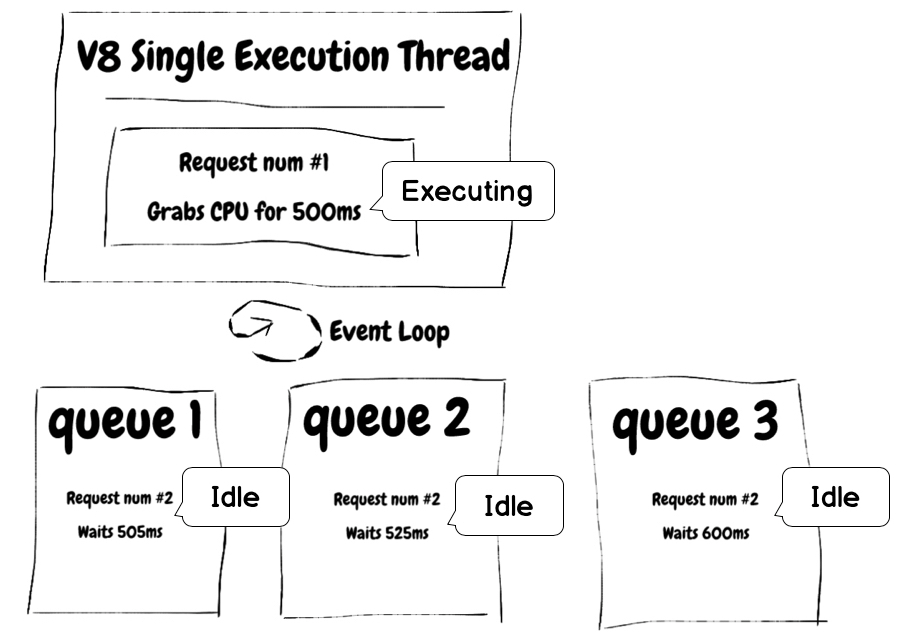

# イベントループをブロックしない

<br/><br/>

Node はほとんどの場合、複数のキューをローテーションする単一のスレッド上でイベントループを処理します。複雑度の高い操作、大きな json の解析、巨大な配列へのロジックの適用、安全ではない正規表現クエリ、そして大きな IO 操作は、イベントループを停止させる原因となる操作です。これを避けるために、CPU集約的なタスクを専用サービス（ジョブサーバーなど）にオフロードしたり、長いタスクを小さなステップに分けてワーカープールを使用したりすることは、イベントループをブロックしないようにする方法のいくつかの例です。

### 例: イベントループをブロックする
[Node Clinic](https://clinicjs.org/documentation/doctor/05-fixing-event-loop-problem) の例を見てみましょう。
```javascript
function sleep (ms) {
  const future = Date.now() + ms
  while (Date.now() < future);
}

server.get('/', (req, res, next) => {
  sleep(30)
  res.send({})
  next()
})
```

そして、このアプリをベンチマークしてみると、長時間の while ループによるレイテンシを確認することができます。

### ベンチマークの実行 
`clinic doctor --on-port 'autocannon localhost:$PORT' -- node slow-event-loop`

### 結果

```
─────────┬────────┬────────┬────────┬────────┬───────────┬──────────┬───────────┐
│ Stat    │ 2.5%   │ 50%    │ 97.5%  │ 99%    │ Avg       │ Stdev    │ Max       │
├─────────┼────────┼────────┼────────┼────────┼───────────┼──────────┼───────────┤
│ Latency │ 270 ms │ 300 ms │ 328 ms │ 331 ms │ 300.56 ms │ 38.55 ms │ 577.05 ms │
└─────────┴────────┴────────┴────────┴────────┴───────────┴──────────┴───────────┘
┌───────────┬─────────┬─────────┬─────────┬────────┬─────────┬───────┬─────────┐
│ Stat      │ 1%      │ 2.5%    │ 50%     │ 97.5%  │ Avg     │ Stdev │ Min     │
├───────────┼─────────┼─────────┼─────────┼────────┼─────────┼───────┼─────────┤
│ Req/Sec   │ 31      │ 31      │ 33      │ 34     │ 32.71   │ 1.01  │ 31      │
├───────────┼─────────┼─────────┼─────────┼────────┼─────────┼───────┼─────────┤
```

## イベントループのイメージ図


>ここに、Node サーバを高速に保つための良い経験則があります: Node は、与えられた時間にそれぞれのクライアントに関連する作業が 「小さい」 場合に高速です。
>[イベントループ（またはワーカープール）をブロックしない | Node.js](https://nodejs.org/en/docs/guides/dont-block-the-event-loop/)

> イベントループ、エラー処理、非同期などの概念を理解していないことが原因で、ほとんどの人が最初の数回の NodeJS アプリで失敗します。
[イベントループのベストプラクティス - NodeJS イベントループ Part 5](https://jsblog.insiderattack.net/event-loop-best-practices-nodejs-event-loop-part-5-e29b2b50bfe2)
