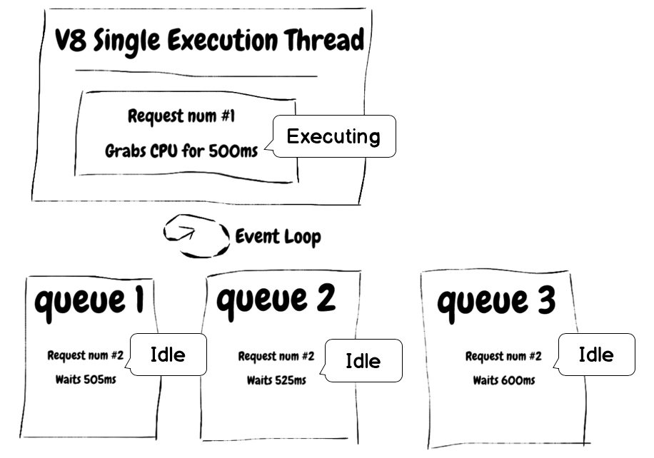

# Не блокуйте цикл подій

<br/><br/>

Node обробляє Event Loop переважно в одному потоці, обертаючись через кілька черг. Операції з високою складністю, парсинг великих JSON, застосування логіки до величезних масивів, небезпечні regex-запити та великі IO-операції — це деякі з операцій, які можуть призвести до зупинки Event Loop. Уникайте цього, вивантажуючи CPU-інтенсивні завдання на виділений сервіс (наприклад, job-сервер), або розбиваючи довгі завдання на маленькі кроки та використовуючи Worker Pool — це деякі приклади того, як уникнути блокування Event Loop.

### Приклад: блокування event loop
Розглянемо приклад з [Node Clinic](https://clinicjs.org/documentation/doctor/05-fixing-event-loop-problem).
```javascript
function sleep (ms) {
  const future = Date.now() + ms
  while (Date.now() < future);
}

server.get('/', (req, res, next) => {
  sleep(30)
  res.send({})
  next()
})
```

І коли ми тестуємо продуктивність цього застосунку, ми починаємо бачити затримку, спричинену довгим циклом while.

### Запуск бенчмарку 
`clinic doctor --on-port 'autocannon localhost:$PORT' -- node slow-event-loop`

### Результати

```
┌─────────┬────────┬────────┬────────┬────────┬───────────┬──────────┬───────────┐
│ Stat    │ 2.5%   │ 50%    │ 97.5%  │ 99%    │ Avg       │ Stdev    │ Max       │
├─────────┼────────┼────────┼────────┼────────┼───────────┼──────────┼───────────┤
│ Latency │ 270 ms │ 300 ms │ 328 ms │ 331 ms │ 300.56 ms │ 38.55 ms │ 577.05 ms │
└─────────┴────────┴────────┴────────┴────────┴───────────┴──────────┴───────────┘
┌───────────┬─────────┬─────────┬─────────┬────────┬─────────┬───────┬─────────┐
│ Stat      │ 1%      │ 2.5%    │ 50%     │ 97.5%  │ Avg     │ Stdev │ Min     │
├───────────┼─────────┼─────────┼─────────┼────────┼─────────┼───────┼─────────┤
│ Req/Sec   │ 31      │ 31      │ 33      │ 34     │ 32.71   │ 1.01  │ 31      │
├───────────┼─────────┼─────────┼─────────┼────────┼─────────┼───────┼─────────┤
```

## Зображення Event Loop



### "Ось гарне правило для підтримки швидкості вашого Node сервера: _Node швидкий, коли робота, пов'язана з кожним клієнтом у будь-який момент часу, є 'малою'_."
З документації Node.js - [Don't Block the Event Loop (or the Worker Pool)](https://nodejs.org/en/docs/guides/dont-block-the-event-loop/)

> Секрет масштабованості Node.js полягає в тому, що він використовує невелику кількість потоків для обслуговування багатьох клієнтів.
> Якщо Node.js може обійтися меншою кількістю потоків, то він може витратити більше часу та пам'яті вашої системи на роботу з клієнтами, а не на оплату накладних витрат на потоки (пам'ять, перемикання контексту).
> Але оскільки Node.js має лише кілька потоків, ви повинні структурувати свій застосунок, щоб використовувати їх розумно.
> 
> Ось гарне правило для підтримки швидкості вашого Node.js сервера: Node.js швидкий, коли робота, пов'язана з кожним клієнтом у будь-який момент часу, є "малою".
> Це стосується зворотних викликів у Event Loop та завдань у Worker Pool.

### "Більшість людей провалюють свої перші кілька NodeJS застосунків лише через нерозуміння таких концепцій, як Event Loop, обробка помилок та асинхронність"
З блогу Deepal - [Event Loop Best Practices — NodeJS Event Loop Part 5](https://blog.insiderattack.net/event-loop-best-practices-nodejs-event-loop-part-5-e29b2b50bfe2)

