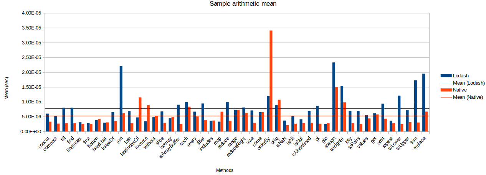
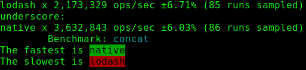

# Hobetsi jatorrizko JS metodoak Lodash bezalako erabiltzaileen baliabideak baino

<br/><br/>

### Azalpena

Batzuetan, hobe da  jatorrizko metodoak erabiltzea _lodash_ edo _underscore_ bezalako liburutegiak erabili beharra izatea baino, liburutegi horiek errendimendu galera bat ekar baitezakete eta beharrezko baino memoria gehiago erabili. Jatorrizko funtzioak erabiltzeak [%50 inguruko erabateko irabazia](https://github.com/Berkmann18/NativeVsUtils/blob/master/analysis.xlsx) lor dezake, adibidez, funtzio hauek: `Array.concat`, `Array.fill`, `Array.filter`, `Array.map`, `(Array|String).indexOf`, `Object.find`, …


<!-- konparaketa hemen: https://gist.github.com/Berkmann18/3a99f308d58535ab0719ac8fc3c3b8bb-->

<br/><br/>

### Abididea: konparaketa probak - Lodash versus V8 (jatorrizkoa)

Beheko grafikoak [Lodashen metodo ugariren proben erreferentzien](https://github.com/Berkmann18/NativeVsUtils/blob/master/nativeVsLodash.ods) batez bestekoa erakusten du. Horrek erakusten du Lodash metodoek batez beste %146,23 denbora gehiago behar dutela V8 metodoen ataza berdinak burutzeko.



### Kode adibidea: `_.concat`/`Array.concat`en proba

```javascript
const _ = require("lodash");
const __ = require("underscore");
const Suite = require("benchmark").Suite;
const opts = require("./utils"); //cf. https://github.com/Berkmann18/NativeVsUtils/blob/master/utils.js

const concatSuite = new Suite("concat", opts);
const array = [0, 1, 2];

concatSuite
  .add("lodash", () => _.concat(array, 3, 4, 5))
  .add("underscore", () => __.concat(array, 3, 4, 5))
  .add("native", () => array.concat(3, 4, 5))
  .run({ async: true });
```

Non hau bueltatzen duen:



[Hemen](https://github.com/Berkmann18/NativeVsUtils/blob/master/index.txt) duzu proba erreferentzia puntuen zerrenda luzeago bat edo, bestela, [egikaritu hau](https://github.com/Berkmann18/NativeVsUtils/blob/master/index.js), hori bera erakutsiko dizu, baina koloretan.

### Blog aipua: "(baliteke) Ez duzu Lodash/Underscoreren beharrik (ez izatea)"

[Lodash eta Underscoren  inguruko gaiei buruzko txostena](https://github.com/you-dont-need/You-Dont-Need-Lodash-Underscore).

> JavaScripten baliabideen liburutegi moderno bikainak dira Lodash eta Underscore, eta Front-end garatzaileen artean oso erabiliak. Hala ere, nabigatzaile modernoak jomugatzat dituzunean, pentsa dezakezu ECMAScript5ek [ES5] eta ECMAScript2015ek [ES6] badituztela jatorriz funtzio horietako asko. Zure proiektuak menpekotasun gutxiago edukitzea nahi baduzu, eta argi badaukazu zein nabilgatzaile duzun helburutzat, baliteke behar ez izatea Lodash/Underscore.

### Adibidea: jatorrizkoak ez diren metodoak erabiltzeko linting-a

Badago [ESLint plugin](https://www.npmjs.com/package/eslint-plugin-you-dont-need-lodash-underscore) bat behar ez dituzun liburutegiak atzeman eta aholkuak ematen dizkizuna (behean duzu adibidea).<br/> Plugin hori erabili nahi baduzu, gehitu `eslint-plugin-you-dont-need-lodash-underscore` plugina zure ESLint ezarpen fitxategiari:

```json
{
  "extends": ["plugin:you-dont-need-lodash-underscore/compatible"]
}
```

### Adibidea: linter bat erabiliz, atzeman beharrezko ez diren v8 funtzionalitateen erabilera

Eman begirada bat azpiko fitxategiari:

```js
const _ = require("lodash");
// ESLintek azpiko lerroa markatuko du iradokizun batekin
console.log(_.map([0, 1, 2, 4, 8, 16], (x) => `d${x}`));
```

Hementxe dago ESLintek bistaratuko lukeena YDNLU plugina erabiliz.


Noski, adibide horrek ez du errealista ematen egungo kodeek dutena kontutan hartuta, baina bai balio du ulertzeko.
