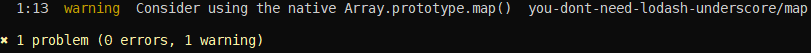

# Prefira métodos nativos ao invés de utilitários do usuário como Lodash


<br/><br/>

### Explicação em um Parágrafo

Às vezes, usar métodos nativos é melhor do que requerir `lodash` ou `underscore`, porque isso não levará a um aumento de desempenho e usará mais espaço do que o necessário.
O desempenho usando métodos nativos resulta em um [ganho geral de 50%](https://github.com/Berkmann18/NativeVsUtils/blob/master/analysis.xlsx) que inclui os seguintes métodos: `Array.concat`, `Array.fill`, `Array.filter`, `Array.map`, `(Array|String).indexOf`, `Object.find`, ...


<!-- compare aqui: https://gist.github.com/Berkmann18/3a99f308d58535ab0719ac8fc3c3b8bb-->

<br/><br/>

### Exemplo: comparação de benchmark - Lodash vs V8 (Nativo)
O gráfico abaixo mostra a [média dos benchmarks para uma variedade de métodos do Lodash](https://github.com/Berkmann18/NativeVsUtils/blob/master/nativeVsLodash.ods), Isso mostra que os métodos Lodash levam em média 146,23% mais tempo para completar as mesmas tarefas que os métodos V8.


### Exemplo de código – teste de Benchmark com `_.concat`/`Array.concat`
```javascript
const _ = require('lodash'),
  __ = require('underscore'),
  Suite = require('benchmark').Suite,
  opts = require('./utils'); //cf. https://github.com/Berkmann18/NativeVsUtils/blob/master/utils.js

const concatSuite = new Suite('concat', opts);
const array = [0, 1, 2];

concatSuite.add('lodash', () => _.concat(array, 3, 4, 5))
  .add('underscore', () => __.concat(array, 3, 4, 5))
  .add('native', () => array.concat(3, 4, 5))
  .run({ 'async': true });
```

Que retornará isso:


Você pode encontrar uma lista maior de benchmarks [aqui](https://github.com/Berkmann18/NativeVsUtils/blob/master/index.txt) ou alternativamente [executar isso](https://github.com/Berkmann18/NativeVsUtils/blob/master/index.js) que mostraria o mesmo porém com cores.

### Citação de Blog: "Você (talvez) não precisa de Lodash/Underscore"

Do [repositório sobre esse assunto que foca em Lodash e Underscore](https://github.com/you-dont-need/You-Dont-Need-Lodash-Underscore).

 > O Lodash e o Underscore são ótimas bibliotecas de utilitários JavaScript moderno e são amplamente utilizados por desenvolvedores front-end. No entanto, quando você está focando nos navegadores modernos, você pode descobrir que existem muitos métodos que já são suportados nativamente graças ao ECMAScript5 [ES5] e ao ECMAScript2015 [ES6]. Se você quer que seu projeto exija menos dependências, e você conhece claramente o seu navegador de destino, talvez você não precise do Lodash/Underscore.

### Exemplo: Linting para uso de métodos não nativos
Existe um [plugin de ESLint](https://www.npmjs.com/package/eslint-plugin-you-dont-need-lodash-underscore) que detecta onde você está usando bibliotecas, mas não precisa, alertando com sugestões (veja o exemplo abaixo).<br/>
A maneira de configurá-lo é adicionando o plugin `eslint-plugin-you-dont-need-lodash-underscore` no seu arquivo de configuração do ESLint:
```json
{
  "extends": [
    "plugin:you-dont-need-lodash-underscore/compatible"
  ]
}
```

### Exemplo: detectando uso de utilidades não nativas do v8 usando um linter
Considere o arquivo abaixo:
```js
const _ = require('lodash');
// O ESLint sinalizará a linha acima com uma sugestão
console.log(_.map([0, 1, 2, 4, 8, 16], x => `d${x}`));
```
Aqui está o que o ESLint produziria ao usar o plugin YDNLU.


Naturalmente, o exemplo acima não parece realista, considerando o que bases de código reais teriam, mas você entendeu a idéia.
