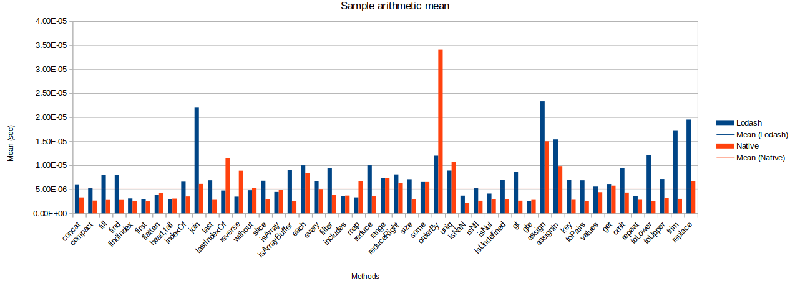
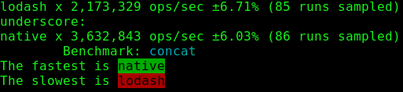
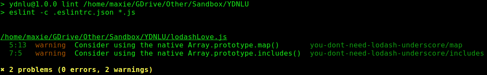

# Надавайте перевагу нативним JS методам над сторонніми утилітами, такими як Lodash


<br/><br/>

### Пояснення за один абзац
Іноді використання нативних методів краще, ніж підключення _lodash_ або _underscore_, оскільки ці бібліотеки можуть призвести до втрати продуктивності або займати більше місця, ніж потрібно.
Продуктивність при використанні нативних методів дає [загальний приріст ~50%](https://github.com/Berkmann18/NativeVsUtils/blob/master/analysis.xlsx), що включає наступні методи: `Array.concat`, `Array.fill`, `Array.filter`, `Array.map`, `(Array|String).indexOf`, `Object.find`, ...


<!-- comp here: https://gist.github.com/Berkmann18/3a99f308d58535ab0719ac8fc3c3b8bb-->

<br/><br/>

### Приклад: порівняння бенчмарків - Lodash vs V8 (Native)
Графік нижче показує [середнє значення бенчмарків для різних методів Lodash](https://github.com/Berkmann18/NativeVsUtils/blob/master/nativeVsLodash.ods), це демонструє, що методи Lodash в середньому потребують на 146.23% більше часу для виконання тих самих завдань, що й методи V8.



### Приклад коду – Тест бенчмарку на `_.concat`/`Array.concat`
```javascript
const _ = require('lodash');
const __ = require('underscore');
const Suite = require('benchmark').Suite;
const opts = require('./utils'); //див. https://github.com/Berkmann18/NativeVsUtils/blob/master/utils.js

const concatSuite = new Suite('concat', opts);
const array = [0, 1, 2];

concatSuite.add('lodash', () => _.concat(array, 3, 4, 5))
  .add('underscore', () => __.concat(array, 3, 4, 5))
  .add('native', () => array.concat(3, 4, 5))
  .run({ 'async': true });
```

Що повертає це:



Ви можете знайти більший список бенчмарків [тут](https://github.com/Berkmann18/NativeVsUtils/blob/master/index.txt) або альтернативно [запустити це](https://github.com/Berkmann18/NativeVsUtils/blob/master/index.js), що покаже те саме, але з кольорами.

### Цитата з блогу: "Вам не потрібен (можливо не потрібен) Lodash/Underscore"

З [репозиторію на цю тему, який фокусується на Lodash та Underscore](https://github.com/you-dont-need/You-Dont-Need-Lodash-Underscore).

 > Lodash та Underscore — чудові сучасні JavaScript бібліотеки утиліт, і вони широко використовуються Front-end розробниками. Однак, коли ви орієнтуєтесь на сучасні браузери, ви можете виявити, що багато методів вже підтримуються нативно завдяки ECMAScript5 [ES5] та ECMAScript2015 [ES6]. Якщо ви хочете, щоб ваш проект мав менше залежностей, і ви чітко знаєте свій цільовий браузер, тоді вам може не знадобитися Lodash/Underscore.

### Приклад: Лінтинг для використання ненативних методів
Є [ESLint плагін](https://www.npmjs.com/package/eslint-plugin-you-dont-need-lodash-underscore), який виявляє, де ви використовуєте бібліотеки, але не потребуєте їх, попереджаючи вас з пропозиціями (див. приклад нижче).<br/>
Спосіб налаштування — додати плагін `eslint-plugin-you-dont-need-lodash-underscore` до вашого файлу конфігурації ESLint:
```json
{
  "extends": [
    "plugin:you-dont-need-lodash-underscore/compatible"
  ]
}
```

### Приклад: виявлення використання не-v8 утиліт за допомогою лінтера
Розглянемо файл нижче:
```js
const _ = require('lodash');
// ESLint позначить рядок вище з пропозицією
console.log(_.map([0, 1, 2, 4, 8, 16], x => `d${x}`));
```
Ось що ESLint виведе при використанні плагіна YDNLU.


Звичайно, приклад вище не виглядає реалістичним, враховуючи, що мали б реальні кодові бази, але ви розумієте ідею.

