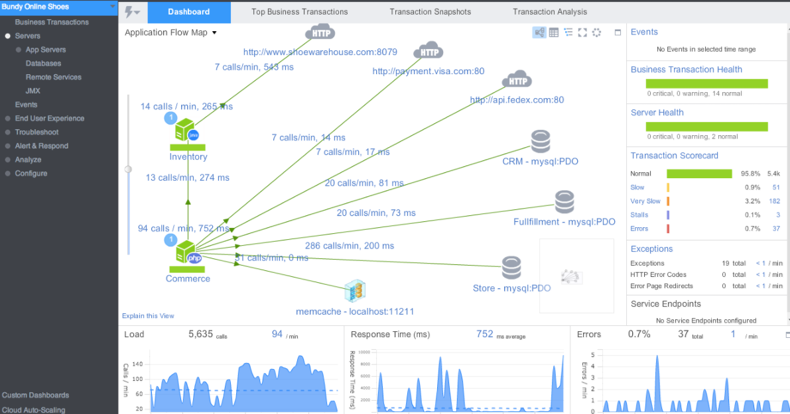

# Une expérience utilisateur sûre avec les produits APM

  

### Un paragraphe d'explication

APM (NdT, « Application Performance Monitoring » : surveillance des performances des applications) fait référence à une famille de produits qui vise à surveiller les performances des applications de bout en bout, également du point de vue du client. Alors que les solutions de surveillance classiques se concentrent sur les exceptions et les mesures techniques autonomes (par exemple, le suivi des erreurs, les points de terminaison de serveur lents, etc.), dans le monde réel, notre application pourrait décevoir des utilisateurs sans aucune erreur de code, par exemple, si certains services du middleware fonctionnent très lentement. Les produits APM mesurent l'expérience utilisateur de bout en bout, par exemple, prenons un système qui englobe l'interface utilisateur frontale et de multiples services distribués - certains produits APM peuvent dire à quelle vitesse s'effectue une transaction qui traverse plusieurs niveaux. Ils peuvent indiquer si l'expérience utilisateur est solide et indiquer le problème. Cette offre attrayante a un prix relativement élevé, elle est donc recommandée pour les produits à grande échelle et complexes qui nécessitent d'aller au-delà de la simple surveillance.

  

### Exemple APM – un produit commercial qui visualise les performances des applications interservices

  

### Exemple APM – un produit commercial qui met l'accent sur le score de l'expérience utilisateur

  

### Exemple APM – un produit commercial qui met en évidence les chemins de code lents

