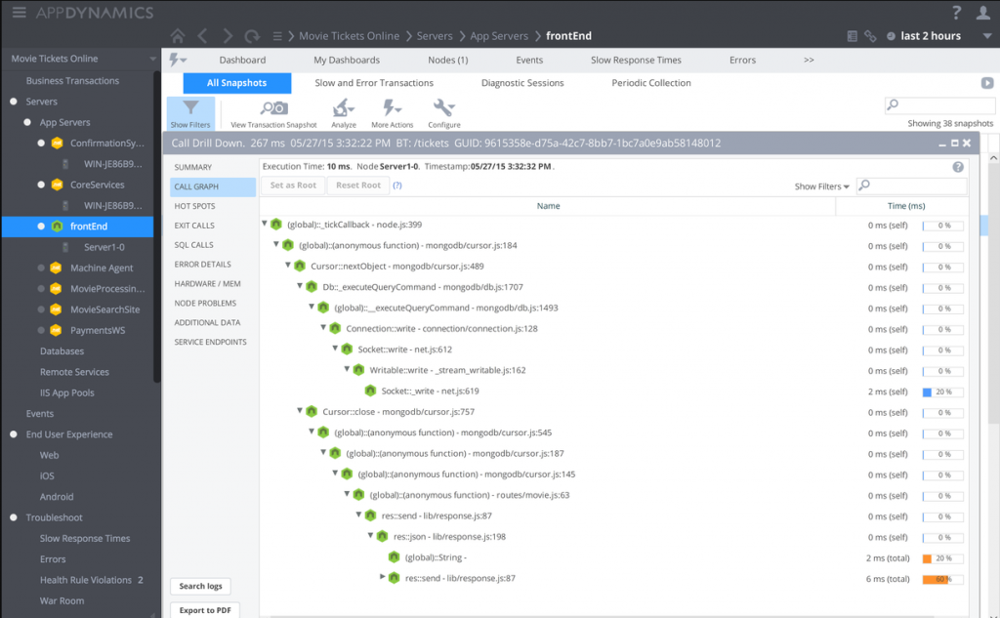

# 확실한 사용자 관점의 APM 제품

  

### 한문단 설명

APM (어플리케이션 성능 모니터링)은 고객의 관점에서도 애플리케이션 성능을 처음부터 끝까지 모니터링 하는 제품군을 나타낸다. 기존의 모니터링 솔루션은 예외 및 독립형 기술 지표에 중점을 두었다 (예를들어 에러 트래킹, 서버 엔트포인트의 속도 저하 등) 현실에서 코드의 문제는 없으나, 사용자의 실망을 초래할 수 있는데, 예를 들면 미들웨어 서비스가 느리게 수행되는 경우이다. APM은 사용자의 관점에서 처음부터 끝까지 측정한다. 예를들어, 프론트엔드 UI와 여러 분산 서비스를 포괄하는 시스템을 제공하는 경우 일부 APM 제품은 여러 계층에 걸친 트랜잭션이 각각 얼마나 빠르게 이루어 지는지 알 수 있다. 그것은 사용자의 관점에서 견고한지, 문제가 있는지 알 수 있다. 이 매력적인 제품은 상대적으로 고가에 제공된다. 따라서 단순한 모니터링을 넘어 대규모 및 복잡한 어플레케이션에 권장된다.

  

### APM 예시 – 서비스간 앱 성능을 시각화 하는 제품

  

### APM 예시 – 사용자의 관점에서 지표를 강조하는 제품

  

### APM 예시 – 느린 코드의 경로를 강조하는 제품

