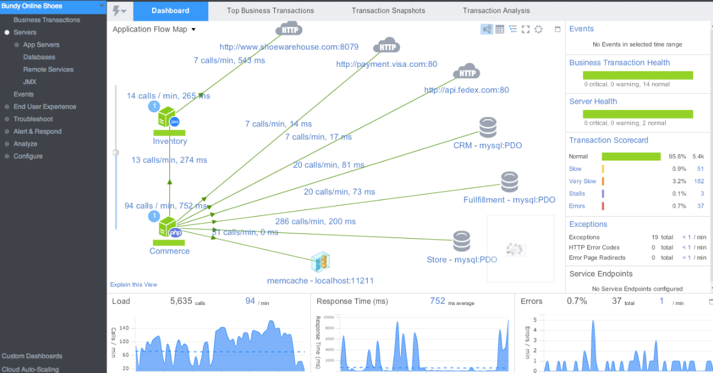
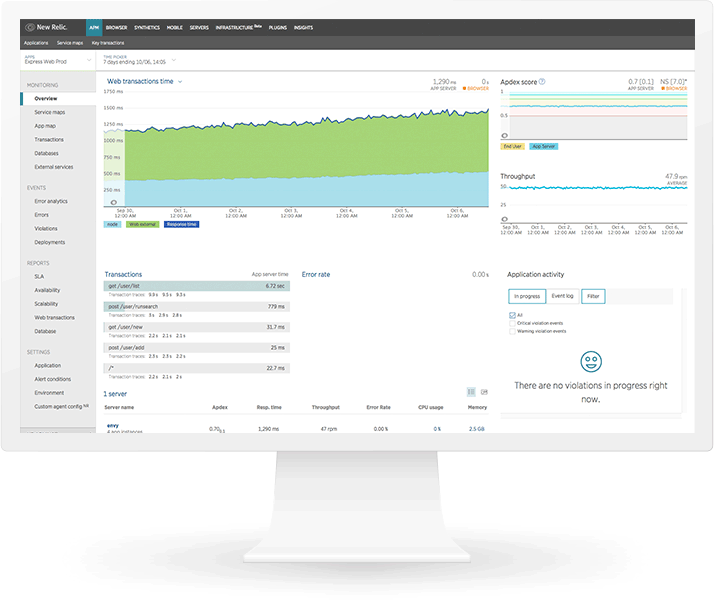
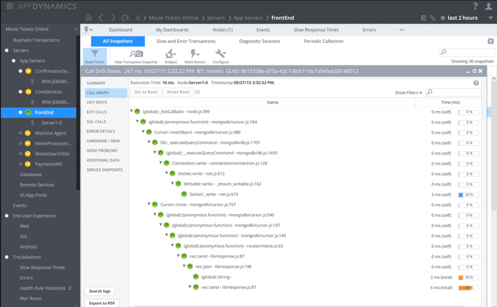

# Zapewnij użytkownikom wygodę korzystania z produktów APM

  

### Wyjaśnienie jednym akapitem

APM (application performance monitoring) odnosi się do rodziny produktów, która ma na celu monitorowanie wydajności aplikacji od początku do końca, również z perspektywy klienta. Podczas gdy tradycyjne rozwiązania monitorujące koncentrują się na wyjątkach i niezależnych pomiarach technicznych (np. śledzeniu błędów, powolnych punktach końcowych serwera itp.), w prawdziwym świecie nasza aplikacja może tworzyć rozczarowanych użytkowników bez żadnych wyjątków kodu, na przykład, jeśli niektóre usługi oprogramowania pośredniego działają naprawdę wolno. Produkty APM mierzą wrażenia użytkownika end-to-end, na przykład, biorąc pod uwagę system, który obejmuje interfejs użytkownika frontend i wiele usług rozproszonych - niektóre produkty APM mogą powiedzieć, jak szybko trwa transakcja obejmująca wiele poziomów. Może stwierdzić, czy wrażenia użytkownika są solidne i wskazać problem. Ta atrakcyjna oferta ma stosunkowo wysoką cenę, dlatego jest zalecana do dużych i złożonych produktów, które wymagają wykraczania poza proste monitorowanie.

  

### APM przykład - produkt komercyjny, który wizualizuje wydajność aplikacji między usługami

  

### APM przykład - produkt komercyjny, który podkreśla ocenę doświadczenia użytkownika

  

### APM przykład - produkt komercyjny, który wyróżnia wolne ścieżki kodu

