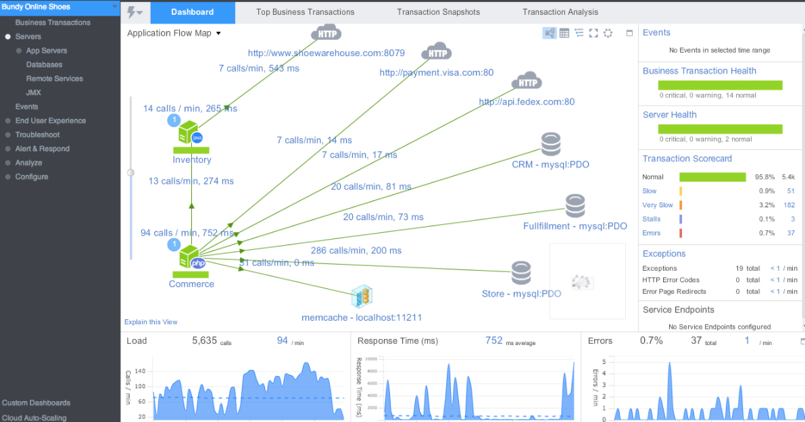
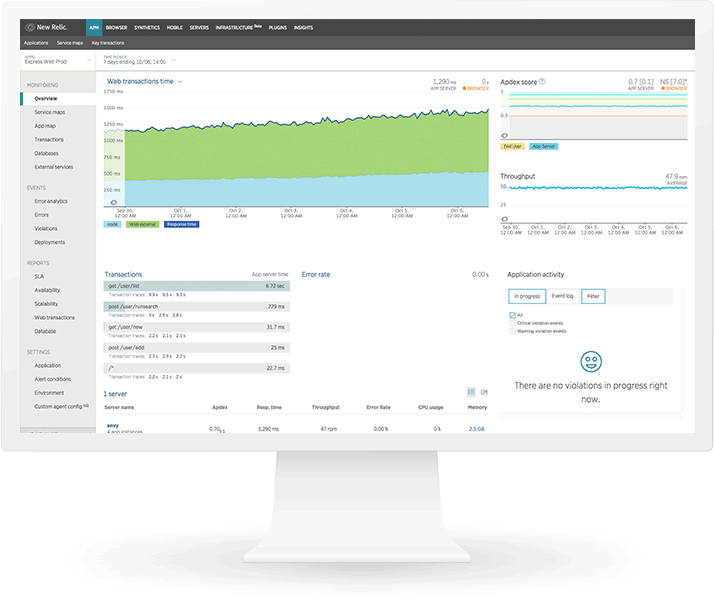
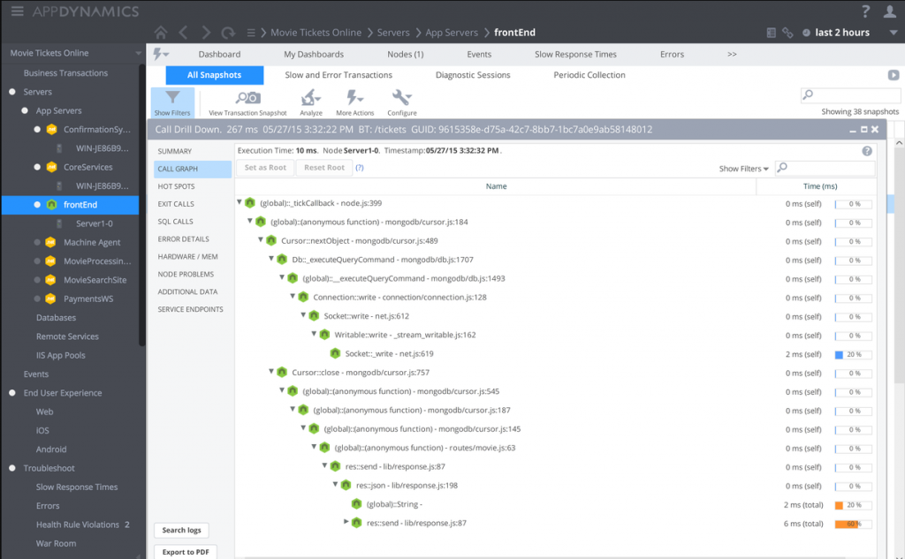

# Забезпечте досвід користувача за допомогою APM продуктів

  

### Пояснення за один абзац

APM (application performance monitoring — моніторинг продуктивності додатків) відноситься до сімейства продуктів, які мають на меті моніторинг продуктивності додатку від початку до кінця, також з точки зору клієнта. Тоді як традиційні рішення моніторингу зосереджуються на виключних ситуаціях та окремих технічних метриках (наприклад, відстеження помилок, повільні серверні кінцеві точки тощо), у реальному світі наш додаток може створювати розчарованих користувачів без будь-яких виключних ситуацій коду, наприклад, якщо якийсь middleware сервіс працював дуже повільно. APM продукти вимірюють досвід користувача від початку до кінця, наприклад, для системи, яка охоплює frontend UI і кілька розподілених сервісів — деякі APM продукти можуть сказати, як швидко тривала транзакція, що охоплює кілька рівнів. Вони можуть сказати, чи досвід користувача є якісним, і вказати на проблему. Ця приваблива пропозиція має відносно високий цінник, тому рекомендується для великомасштабних і складних продуктів, які потребують виходу за межі прямолінійного моніторингу.

  

### Приклад APM – комерційний продукт, що візуалізує продуктивність крос-сервісного додатку

  

### Приклад APM – комерційний продукт, що наголошує на оцінці досвіду користувача

  

### Приклад APM – комерційний продукт, що виділяє повільні шляхи коду

