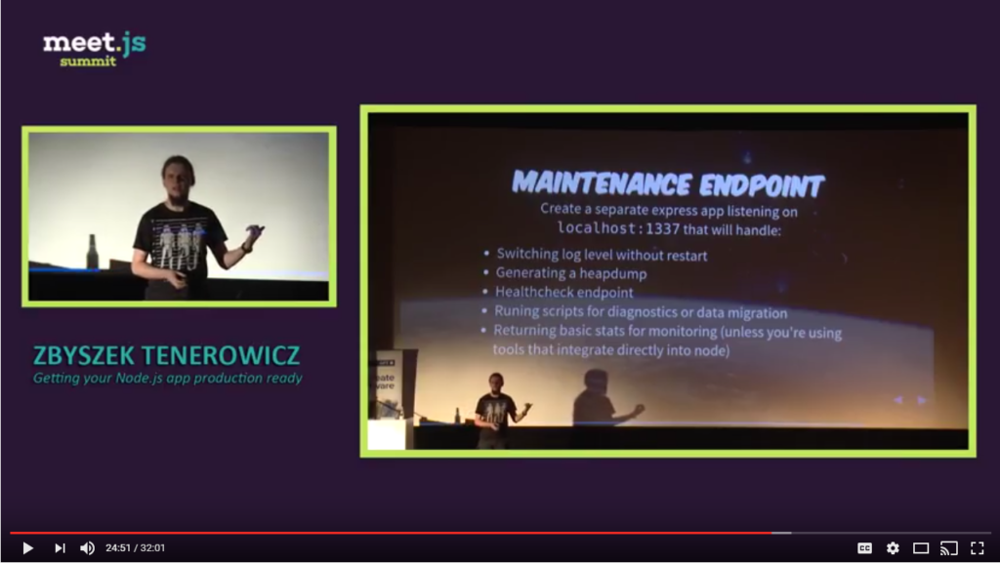

# Utwórz punkt końcowy konserwacji

<br/><br/>

### Wyjaśnienie jednym akapitem

Punkt końcowy konserwacji to wysoce bezpieczny interfejs API HTTP, który jest częścią kodu aplikacji, a jego celem jest wykorzystanie go przez zespół operacyjny / produkcyjny do monitorowania i udostępniania funkcji konserwacji. Na przykład może zwrócić zrzut stosu (migawkę pamięci) procesu, zgłosić, czy występują wycieki pamięci, a nawet pozwolić na bezpośrednie wykonywanie poleceń REPL. Ten punkt końcowy jest potrzebny tam, gdzie konwencjonalne narzędzia DevOps (produkty do monitorowania, logi itp.) Nie zbierają niektórych określonych informacji lub nie kupujesz / nie instalujesz takich narzędzi. Złotą zasadą jest stosowanie profesjonalnych i zewnętrznych narzędzi do monitorowania i utrzymania produkcji, które są zwykle bardziej niezawodne i dokładne. To powiedziawszy, mogą wystąpić przypadki, w których ogólne narzędzia nie wyodrębnią informacji specyficznych dla Node lub aplikacji - na przykład, jeśli chcesz wygenerować migawkę pamięci w momencie, gdy GC zakończy cykl - kilka bibliotek npm chętnie to zrobi za Ciebie, ale popularne narzędzia do monitorowania prawdopodobnie nie będą miały tej funkcji. Ważne jest, aby zachować ten punkt końcowy jako prywatny i dostępny tylko dla administratorów, ponieważ może on stać się celem ataku DDOS.

<br/><br/>

### Przykład kodu: generowanie zrzutu sterty za pomocą kodu

```javascript
const heapdump = require('heapdump');

// Check if request is authorized 
function isAuthorized(req) {
    // ...
}

router.get('/ops/heapdump', (req, res, next) => {
    if (!isAuthorized(req)) {
        return res.status(403).send('You are not authorized!');
    }

    logger.info('About to generate heapdump');

    heapdump.writeSnapshot((err, filename) => {
        console.log('heapdump file is ready to be sent to the caller', filename);
        fs.readFile(filename, 'utf-8', (err, data) => {
            res.end(data);
        });
    });
});
```

<br/><br/>

### Polecane źródła

[Getting your Node.js app production ready (Slides)](http://naugtur.pl/pres3/node2prod)

▶ [Getting your Node.js app production ready (Video)](https://www.youtube.com/watch?v=lUsNne-_VIk)


