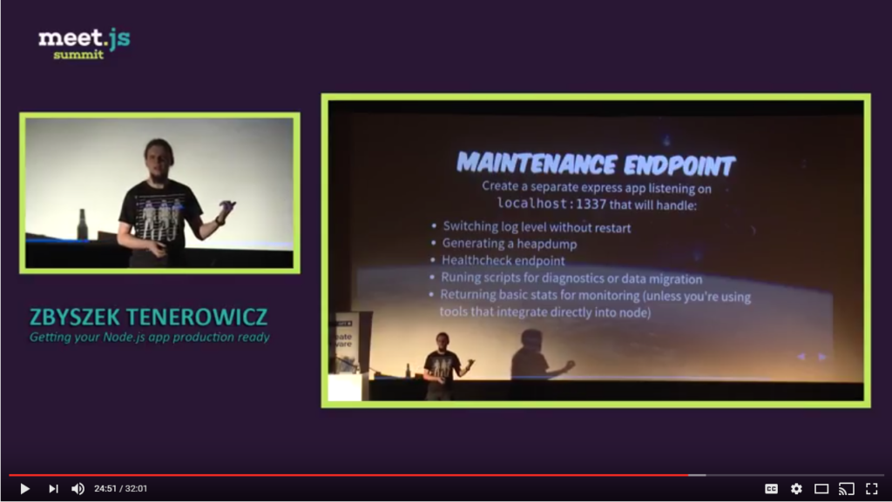

# Створіть ендпоінт для обслуговування

<br/><br/>

### Пояснення за один абзац

Ендпоінт для обслуговування — це високозахищений HTTP API, який є частиною коду застосунку, і його призначення — використовуватися командою ops/production для моніторингу та надання функціональності обслуговування. Наприклад, він може повертати дамп купи (знімок пам'яті) процесу, повідомляти про наявність витоків пам'яті та навіть дозволяти виконувати REPL-команди безпосередньо. Цей ендпоінт потрібен там, де звичайні DevOps-інструменти (продукти моніторингу, логи тощо) не можуть зібрати певний тип інформації, або ви вирішили не купувати/встановлювати такі інструменти. Золоте правило — використовувати професійні та зовнішні інструменти для моніторингу та підтримки продакшену, вони зазвичай більш надійні та точні. Тим не менш, ймовірно, будуть випадки, коли загальні інструменти не зможуть витягти інформацію, специфічну для Node або вашого застосунку — наприклад, якщо ви хочете згенерувати знімок пам'яті в момент, коли GC завершив цикл — кілька npm-бібліотек із задоволенням виконають це для вас, але популярні інструменти моніторингу, ймовірно, пропустять цю функціональність. Важливо тримати цей ендпоінт приватним і доступним лише для адміністраторів, оскільки він може стати ціллю DDOS-атаки.

<br/><br/>

### Приклад коду: генерація дампу купи через код

```javascript
const heapdump = require('heapdump');

// Перевірка, чи запит авторизований
function isAuthorized(req) {
    // ...
}

router.get('/ops/heapdump', (req, res, next) => {
    if (!isAuthorized(req)) {
        return res.status(403).send('Ви не авторизовані!');
    }

    logger.info('Збираємося згенерувати heapdump');

    heapdump.writeSnapshot((err, filename) => {
        console.log('файл heapdump готовий до відправки', filename);
        fs.readFile(filename, 'utf-8', (err, data) => {
            res.end(data);
        });
    });
});
```

<br/><br/>

### Рекомендовані ресурси

[Getting your Node.js app production ready (Слайди)](http://naugtur.pl/pres3/node2prod)

▶ [Getting your Node.js app production ready (Відео)](https://www.youtube.com/watch?v=lUsNne-_VIk)



