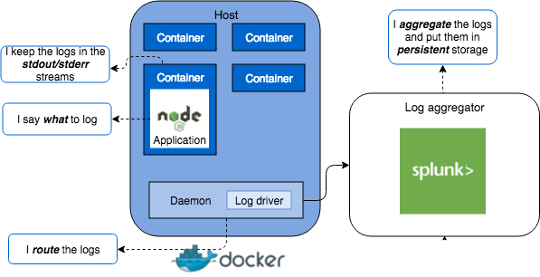

# Код вашего приложения не должен обрабатывать журналы маршрутизации

<br/><br/>

### Объяснение в один абзац

Код приложения не должен обрабатывать маршрутизацию журналов, вместо этого должен использовать утилиту ведения журнала для записи в `stdout/stderr`. "Маршрутизация журналов" означает сбор и отправку журналов в другое место, отличное от вашего приложения или процесса приложения, например, запись журналов в файл, базу данных и т.д. Причина этого в основном двоякая: 1) разделение проблемы и 2) [12-фактор лучших методов для современных приложений](https://12factor.net/logs).

Мы часто думаем о "разделении интересов" в части кода между сервисами и между самими сервисами, но это относится и к более "инфраструктурным" компонентам. Код вашего приложения не должен обрабатывать то, что должно обрабатываться инфраструктурой/средой исполнения (чаще всего в наши дни, контейнерами). Что произойдет, если вы определите местоположения журналов в своем приложении, но позже вам нужно будет изменить это местоположение? Это приводит к изменению кода и развертыванию. При работе с контейнерными/облачными платформами контейнеры могут раскручиваться и закрываться при масштабировании в соответствии с требованиями к производительности, поэтому мы не можем быть уверены, где будет находиться файл журнала. Среда выполнения (контейнер) должна решить, куда вместо этого будут направлены файлы журнала. Приложение должно просто записывать то, что ему нужно, в `stdout`/`stderr`, а среда выполнения должна быть настроена так, чтобы он брал поток журналов оттуда и направлял его туда, куда он должен идти. Кроме того, те члены команды, которым необходимо указать и/или изменить места назначения журналов, часто не являются разработчиками приложений, но являются частью DevOps и могут не иметь представления о коде приложения. Это мешает им легко вносить изменения.

<br/><br/>

### Пример кода - антипаттерн: журнал маршрутизации тесно связан с приложением

```javascript
const { createLogger, transports, winston } = require('winston');
/**
   * Requiring `winston-mongodb` will expose
   * `winston.transports.MongoDB`
   */
require('winston-mongodb');
 
// log to two different files, which the application now must be concerned with
const logger = createLogger({
  transports: [
    new transports.File({ filename: 'combined.log' }),
  ],
  exceptionHandlers: [
    new transports.File({ filename: 'exceptions.log' })
  ]
});
 
// log to MongoDB, which the application now must be concerned with
winston.add(winston.transports.MongoDB, options);
```
Делая это таким образом, приложение теперь обрабатывает как логику приложения/бизнес, так и логику маршрутизации журнала!

<br/><br/>

### Пример кода - Улучшенная обработка журнала + пример Docker
В приложении:
```javascript
const logger = new winston.Logger({
  level: 'info',
  transports: [
    new (winston.transports.Console)()
  ]
});

logger.log('info', 'Test Log Message with some parameter %s', 'some parameter', { anything: 'This is metadata' });
```
Затем в Docker-контейнере `daemon.json`:
```json5
{
  "log-driver": "splunk", // just using Splunk as an example, it could be another storage type
  "log-opts": {
    "splunk-token": "",
    "splunk-url": "",
    //...
  }
}
```
Таким образом, этот пример выглядит как `log -> stdout -> Docker container -> Splunk`

<br/><br/>

### Блог "O'Reilly"

Из блога [O'Reilly](https://www.oreilly.com/ideas/a-cloud-native-approach-to-logs),
> Когда у вас есть фиксированное количество экземпляров на фиксированном количестве серверов, кажется, что хранение журналов на диске имеет смысл. Однако, когда ваше приложение может динамически переходить от 1 запущенного экземпляра к 100, и вы не знаете, где запущены эти экземпляры, вам необходимо, чтобы ваш облачный провайдер занимался агрегированием этих журналов от вашего имени.

<br/><br/>

### Цитата из "12-Factor"

Из [12-Factor best practices for logging](https://12factor.net/logs),
> Двенадцатикратное приложение никогда не занимается маршрутизацией или хранением своего выходного потока. Оно не должено пытаться писать или управлять лог-файлами. Вместо этого каждый запущенный процесс записывает свой поток событий, без буферизации, в стандартный вывод.
 
> При промежуточном или производственном развертывании поток каждого процесса будет захвачен средой выполнения, сопоставлен со всеми другими потоками из приложения и направлен в одно или несколько конечных мест назначения для просмотра и долгосрочного архивирования. Эти архивные пункты назначения не видны и не могут быть изменены приложением, а полностью управляются средой выполнения.

<br/><br/>

### Пример: обзор архитектуры с использованием Docker и Splunk в качестве примера



<br/><br/>
