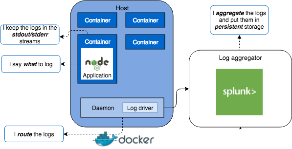

# Код вашого застосунку не повинен займатися маршрутизацією логів

<br/><br/>

### Пояснення за один абзац

Код застосунку не повинен займатися маршрутизацією логів, а натомість повинен використовувати утиліту логування для запису в `stdout/stderr`. "Маршрутизація логів" означає збір та передачу логів в інше місце, ніж ваш застосунок або процес застосунку, наприклад, запис логів у файл, базу даних тощо. Причина цього здебільшого двояка: 1) розділення відповідальностей і 2) [найкращі практики 12-Factor для сучасних застосунків](https://12factor.net/logs).

Ми часто думаємо про "розділення відповідальностей" у термінах частин коду між сервісами та між самими сервісами, але це стосується і більш "інфраструктурних" компонентів. Код вашого застосунку не повинен обробляти те, що повинно оброблятися інфраструктурою/середовищем виконання (найчастіше сьогодні — контейнерами). Що станеться, якщо ви визначите місця розташування логів у своєму застосунку, але пізніше вам потрібно буде змінити це місце? Це призведе до зміни коду та розгортання. При роботі з контейнерними/хмарними платформами контейнери можуть запускатися та зупинятися при масштабуванні відповідно до вимог продуктивності, тому ми не можемо бути впевнені, де опиниться файл логу. Середовище виконання (контейнер) повинно вирішувати, куди маршрутизувати файли логів. Застосунок повинен просто логувати те, що йому потрібно, в `stdout` / `stderr`, а середовище виконання повинно бути налаштоване для збору потоку логів звідти та маршрутизації туди, куди потрібно. Крім того, ті в команді, кому потрібно вказати та/або змінити місця призначення логів, часто не є розробниками застосунків, а є частиною DevOps, і вони можуть не бути знайомі з кодом застосунку. Це заважає їм легко вносити зміни.

<br/><br/>

### Приклад коду – Антипатерн: маршрутизація логів тісно пов'язана з застосунком

```javascript
const { createLogger, transports, winston } = require('winston');
/**
   * Підключення `winston-mongodb` експортує
   * `winston.transports.MongoDB`
   */
require('winston-mongodb');
 
// логування в два різні файли, про які тепер повинен турбуватися застосунок
const logger = createLogger({
  transports: [
    new transports.File({ filename: 'combined.log' }),
  ],
  exceptionHandlers: [
    new transports.File({ filename: 'exceptions.log' })
  ]
});
 
// логування в MongoDB, про що тепер повинен турбуватися застосунок
winston.add(winston.transports.MongoDB, options);
```
Роблячи це таким чином, застосунок тепер обробляє як логіку застосунку/бізнесу, ТАК І логіку маршрутизації логів!

<br/><br/>

### Приклад коду – Краща обробка логів + приклад Docker
У застосунку:
```javascript
const logger = new winston.Logger({
  level: 'info',
  transports: [
    new (winston.transports.Console)()
  ]
});

logger.log('info', 'Test Log Message with some parameter %s', 'some parameter', { anything: 'This is metadata' });
```
Потім, у docker-контейнері `daemon.json`:
```json5
{
  "log-driver": "splunk", // просто використовуємо Splunk як приклад, це може бути інший тип сховища
  "log-opts": {
    "splunk-token": "",
    "splunk-url": "",
    //...
  }
}
```
Отже, цей приклад виглядає як `log -> stdout -> Docker container -> Splunk`

<br/><br/>

### Цитата з блогу: "O'Reilly"

З [блогу O'Reilly](https://www.oreilly.com/ideas/a-cloud-native-approach-to-logs),
 > Коли у вас є фіксована кількість екземплярів на фіксованій кількості серверів, зберігання логів на диску здається розумним. Однак, коли ваш застосунок може динамічно переходити від 1 запущеного екземпляра до 100, і ви не маєте уявлення, де ці екземпляри працюють, вам потрібен ваш хмарний провайдер, щоб він займався агрегацією цих логів від вашого імені.

<br/><br/>

### Цитата: "12-Factor"

З [найкращих практик 12-Factor для логування](https://12factor.net/logs),
 > Застосунок twelve-factor ніколи не турбується про маршрутизацію або зберігання свого вихідного потоку. Він не повинен намагатися писати або керувати файлами логів. Натомість кожен запущений процес пише свій потік подій, небуферизований, в stdout.
 
 > У staging або production розгортаннях потік кожного процесу буде захоплений середовищем виконання, об'єднаний разом з усіма іншими потоками від застосунку та маршрутизований до одного або кількох кінцевих пунктів призначення для перегляду та довгострокового архівування. Ці архівні пункти призначення не видимі або налаштовувані застосунком, і натомість повністю керуються середовищем виконання.

<br/><br/>

 ### Приклад: Огляд архітектури з використанням Docker та Splunk як приклад



<br/><br/>

