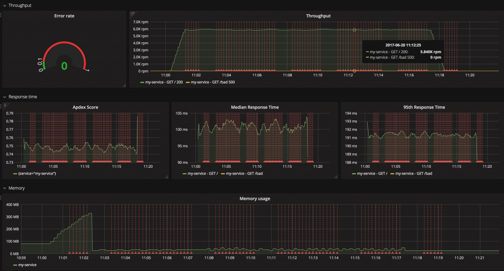

# Surveillance !

  

### Un paragraphe d'explication

Au niveau le plus élémentaire, la surveillance signifie que vous pouvez facilement identifier quand de mauvaises choses se produisent en production. Par exemple, en étant averti par email ou Slack. Le défi est de choisir le bon ensemble d'outils qui répondra à vos besoins sans vous ruiner. Permettez-moi de vous suggérer de commencer par définir l'ensemble des paramètres de base qui doivent être surveillés pour garantir un état sain - CPU, RAM du serveur, RAM du processus de Node (moins de 1,4 GB), le nombre d'erreurs dans la dernière minute, le nombre de redémarrages du processus , temps de réponse moyen. Ensuite, passez en revue certaines fonctionnalités avancées dont vous pourriez avoir envie et ajoutez-les à votre liste de souhaits. Quelques exemples d'une fonction de surveillance de luxe : profilage de base de données, mesure interservices (c.-à-d. mesurer les transactions commerciales), intégration frontale, exposer les données brutes aux clients BI personnalisés, notifications Slack et bien d'autres.

La réalisation des fonctionnalités avancées nécessite une configuration longue ou l'achat d'un produit commercial tel que Datadog, newrelic et similaires. Malheureusement, atteindre même les bases n'est pas une promenade de santé car certaines mesures sont liées au matériel (CPU) et d'autres vivent dans le processus de Node (erreurs internes), donc tous les outils simples nécessitent une configuration supplémentaire. Par exemple, les solutions de surveillance des fournisseurs de cloud (par exemple [AWS CloudWatch](https://aws.amazon.com/cloudwatch/), [Google StackDriver](https://cloud.google.com/stackdriver/)) vous informeront immédiatement de la métrique du matériel, mais rien du comportement de l'application interne. À l'autre extrémité, les solutions basées sur les journaux telles que ElasticSearch manquent par défaut de la vue matérielle. La solution consiste à étendre votre choix avec des mesures manquantes, par exemple, un choix populaire consiste à envoyer des journaux d'application à la [pile Elastic](https://www.elastic.co/products) et à configurer un agent supplémentaire (par exemple [Beat](https://www.elastic.co/products)) pour partager des informations liées au matériel pour obtenir une image complète.

  

### Exemple de surveillance : tableau de bord par défaut AWS cloudwatch. Difficile d'extraire des mesures intégrées à l'application

  

### Exemple de surveillance : tableau de bord par défaut de StackDriver. Difficile d'extraire des mesures intégrées à l'application

  

### Exemple de surveillance : Grafana comme couche d'interface utilisateur qui visualise les données brutes

  

### Ce que disent les autres blogueurs

Extrait du blog de [Rising Stack](https://blog.risingstack.com/node-js-performance-monitoring-with-prometheus/) :

> …Nous vous recommandons de surveiller ces signaux pour tous vos services :
> Taux d'erreur : parce que les erreurs sont confrontées à l'utilisateur et affectent immédiatement vos clients.
> Temps de réponse : car la latence affecte directement vos clients et votre entreprise.
> Débit : le trafic vous aide à comprendre le contexte de l'augmentation des taux d'erreur et de la latence également.
> Saturation : il indique à quel point votre service est « saturé ». Si l'utilisation du processeur est de 90%, votre système peut-il gérer plus de trafic ? …
