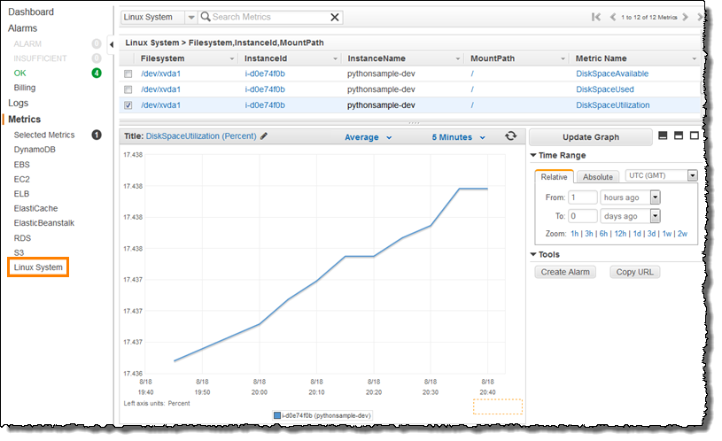
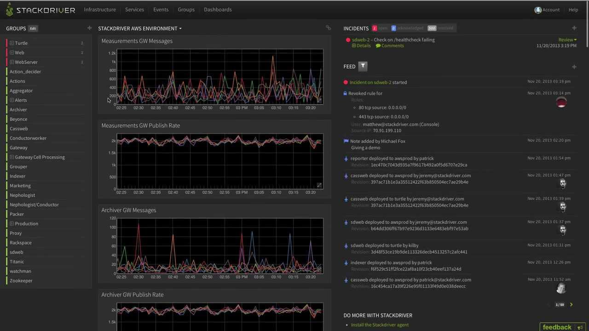
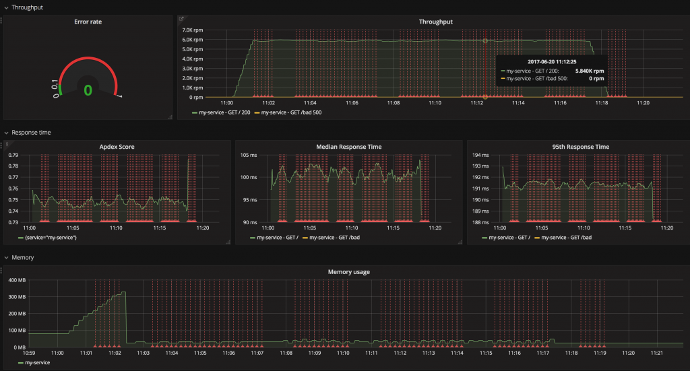

# Monitorowanie!

  

### Wyjaśnienie jednym akapitem

Na bardzo podstawowym poziomie monitorowanie oznacza *łatwe* rozpoznanie, kiedy coś złego dzieje się na produkcji. Na przykład, otrzymując powiadomienie e-mailem lub Slack. Wyzwanie polega na wybraniu odpowiedniego zestawu narzędzi, które spełnią Twoje wymagania bez rozbijania banku. Mogę zasugerować, zacznij od zdefiniowania podstawowego zestawu wskaźników, które należy obserwować, aby zapewnić zdrowy stan - procesor, pamięć RAM serwera, pamięć RAM procesu węzła (mniej niż 1,4 GB), liczba błędów w ostatniej chwili, liczba ponownych uruchomień procesu, średni czas reakcji. Następnie zapoznaj się z zaawansowanymi funkcjami, które mogą ci się spodobać, i dodaj do swojej listy życzeń. Niektóre przykłady luksusowej funkcji monitorowania: profilowanie BD, pomiar między usługami (tj. mierzenie transakcji biznesowej), integracja frontendu, udostępnianie surowych danych niestandardowym klientom BI, powiadomienia Slack i wiele innych.

Osiągnięcie zaawansowanych funkcji wymaga długiej konfiguracji lub zakupu komercyjnego produktu, takiego jak Datadog, NewRelic i tym podobne. Niestety, osiągnięcie nawet podstaw nie jest spacerem w parku, ponieważ niektóre metryki są związane ze sprzętem (CPU), a inne żyją w procesie węzła (błędy wewnętrzne), dlatego wszystkie proste narzędzia wymagają dodatkowej konfiguracji. Na przykład rozwiązania do monitorowania dostawców w chmurze (np. [AWS CloudWatch](https://aws.amazon.com/cloudwatch/), [Google StackDriver](https://cloud.google.com/stackdriver/)) poinformują Cię natychmiast o metrykach sprzętowych, ale nie o wewnętrznym zachowaniu aplikacji. Z drugiej strony w rozwiązaniach opartych na logach, takich jak ElasticSearch, domyślnie brakuje widoku sprzętu. Rozwiązaniem jest zwiększenie wyboru o brakujące dane, na przykład popularnym wyborem jest wysyłanie dzienników aplikacji do [Elastic stack](https://www.elastic.co/products) i konfigurowanie dodatkowego agenta (np. [Beat](https://www.elastic.co/products)) w celu udostępnienia informacji związanych ze sprzętem w celu uzyskania pełnego obrazu.

  

### Przykład monitorowania: domyślny pulpit nawigacyjny AWS Cloudwatch. Trudno wyodrębnić dane w aplikacji

  

### Przykład monitorowania: domyślny pulpit nawigacyjny StackDriver. Trudno wyodrębnić dane w aplikacji

  

### Przykład monitorowania: Grafana jako warstwa interfejsu użytkownika, która wizualizuje surowe dane

  

### Co mówią inni blogerzy

Z bloga [Rising Stack](https://blog.risingstack.com/node-js-performance-monitoring-with-prometheus/):

> …We recommend you to watch these signals for all of your services:
> Error Rate: Because errors are user facing and immediately affect your customers.
> Response time: Because the latency directly affects your customers and business.
> Throughput: The traffic helps you to understand the context of increased error rates and the latency too.
> Saturation: It tells how “full” your service is. If the CPU usage is 90%, can your system handle more traffic? …
