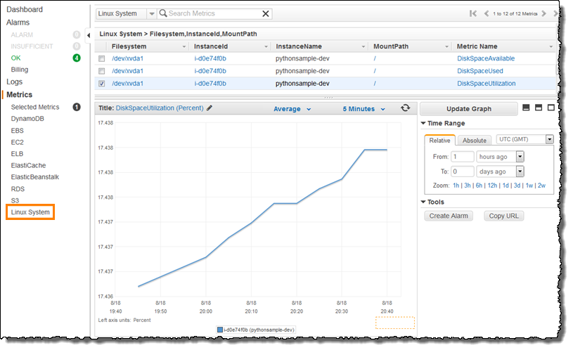
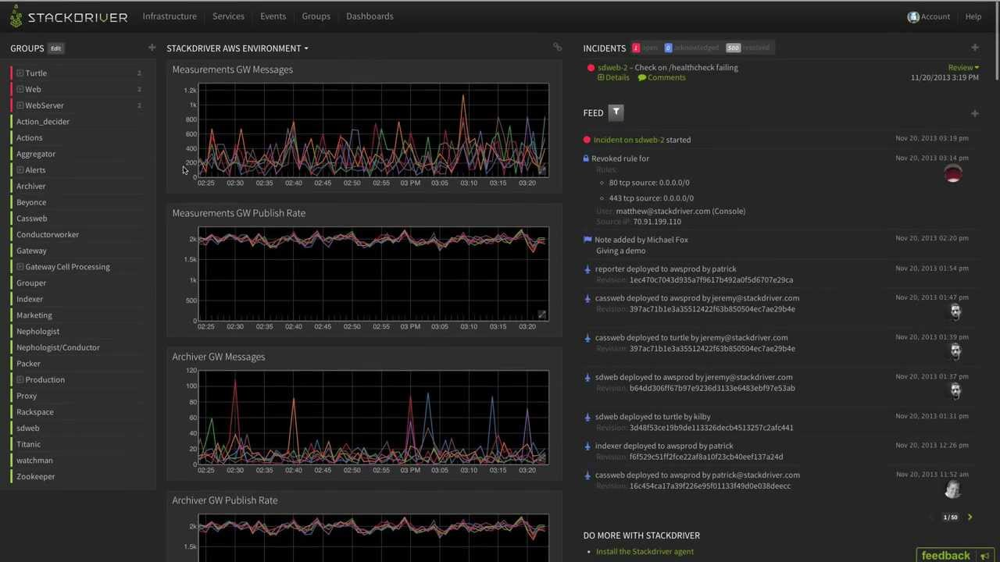
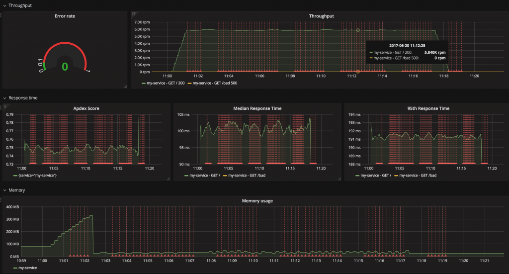

# Моніторинг!

  

### Пояснення за один абзац

На найбазовішому рівні моніторинг означає, що ви можете *легко* визначити, коли на продакшені відбуваються погані речі. Наприклад, отримуючи сповіщення електронною поштою або в Slack. Завдання полягає в тому, щоб вибрати правильний набір інструментів, який задовольнить ваші вимоги, не розоряючи вас. Дозвольте запропонувати, почніть з визначення основного набору метрик, які необхідно відстежувати для забезпечення здорового стану — CPU, RAM сервера, RAM процесу Node (менше 1.4 ГБ), кількість помилок за останню хвилину, кількість перезапусків процесу, середній час відповіді. Потім перегляньте деякі розширені функції, які вам можуть сподобатися, і додайте до свого списку бажань. Деякі приклади розкішних функцій моніторингу: профілювання БД, крос-сервісне вимірювання (тобто вимірювання бізнес-транзакцій), інтеграція з фронтендом, експорт сирих даних для кастомних BI-клієнтів, сповіщення в Slack та багато іншого.

Досягнення розширених функцій вимагає тривалого налаштування або придбання комерційного продукту, такого як Datadog, NewRelic тощо. На жаль, досягнення навіть базових речей — не легка прогулянка, оскільки деякі метрики пов'язані з апаратним забезпеченням (CPU), а інші живуть всередині node-процесу (внутрішні помилки), тому всі прості інструменти вимагають додаткового налаштування. Наприклад, рішення моніторингу хмарних провайдерів (наприклад, [AWS CloudWatch](https://aws.amazon.com/cloudwatch/), [Google StackDriver](https://cloud.google.com/stackdriver/)) негайно повідомлять вам про метрики апаратного забезпечення, але не про внутрішню поведінку застосунку. З іншого боку, рішення на основі логів, такі як ElasticSearch, за замовчуванням не мають огляду апаратного забезпечення. Рішення полягає в доповненні вашого вибору відсутніми метриками, наприклад, популярним вибором є відправка логів застосунку до [Elastic stack](https://www.elastic.co/products) та налаштування додаткового агента (наприклад, [Beat](https://www.elastic.co/products)) для обміну інформацією, пов'язаною з апаратним забезпеченням, щоб отримати повну картину.

  

### Приклад моніторингу: панель AWS cloudwatch за замовчуванням. Важко витягти метрики з застосунку

  

### Приклад моніторингу: панель StackDriver за замовчуванням. Важко витягти метрики з застосунку

  

### Приклад моніторингу: Grafana як UI-шар, що візуалізує сирі дані

  

### Що кажуть інші блогери

З блогу [Rising Stack](https://blog.risingstack.com/node-js-performance-monitoring-with-prometheus/):

> …Ми рекомендуємо вам відстежувати ці сигнали для всіх ваших сервісів:
> Частота помилок: Тому що помилки видимі користувачам і безпосередньо впливають на ваших клієнтів.
> Час відповіді: Тому що затримка безпосередньо впливає на ваших клієнтів та бізнес.
> Пропускна здатність: Трафік допомагає вам зрозуміти контекст підвищеної частоти помилок та затримки.
> Насиченість: Вона показує, наскільки "повний" ваш сервіс. Якщо використання CPU становить 90%, чи може ваша система обробити більше трафіку? …

