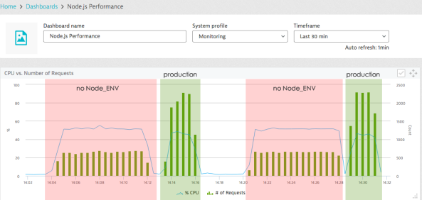

# Définissez NODE_ENV = production

<br/><br/>

### Un paragraphe d'explication

Les variables d'environnement de processus sont un ensemble de paires de clé-valeur mises à la disposition de tout programme en cours d'exécution, généralement à des fins de configuration. Bien que toutes les variables puissent être utilisées, Node encourage d'utiliser par convention une variable appelée NODE_ENV pour signaler si nous sommes en production en ce moment. Cette indication permet aux composants de fournir de meilleurs diagnostics pendant le développement, par exemple en désactivant la mise en cache ou en diffusant des déclarations verbeuses dans le journal. Tout outil de déploiement moderne (Chef, Puppet, CloudFormation, autres) permet de définir des variables d'environnement pendant le déploiement.

<br/><br/>

### Exemple de code : définition et lecture de la variable d'environnement NODE_ENV

```shell script
// Définition des variables d environnement en bash avant de lancer le processus node
$ NODE_ENV=development
$ node
```

```javascript
// Lecture de la variable d'environnement à l'aide d'un code
if (process.env.NODE_ENV === 'production')
    useCaching = true;
```

<br/><br/>

### Ce que disent les autres blogueurs

Extrait du blog de [dynatrace](https://www.dynatrace.com/blog/the-drastic-effects-of-omitting-node_env-in-your-express-js-applications/) :
> ...Dans Node.js, il y a une convention pour définir le mode actuel, c'est d'utiliser une variable appelée NODE_ENV. Nous constatons qu'en fait, il lit NODE_ENV et se met par défaut en « development » si elle n'est pas définie. Nous voyons clairement qu'en définissant NODE_ENV sur production, le nombre de requêtes que Node.js peut traiter augmente d'environ deux tiers alors que l'utilisation du CPU diminue même légèrement. *Permettez-moi d'insister sur ce point : en mettant NODE_ENV sur production, votre application est 3 fois plus rapide !*



<br/><br/>
