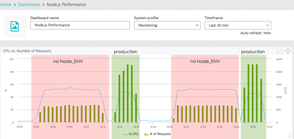

# Ustaw NODE_ENV = production

<br/><br/>

### Wyjaśnienie jednym akapitem

Procesowe zmienne środowiskowe to zestaw par klucz-wartość udostępniony dowolnemu działającemu programowi, zwykle w celach konfiguracyjnych. Mimo że można używać dowolnych zmiennych, Node zachęca do korzystania ze zmiennej o nazwie NODE_ENV w celu oznaczenia, czy obecnie jesteśmy w produkcji. To określenie umożliwia komponentom lepszą diagnostykę podczas programowania, na przykład poprzez wyłączenie buforowania lub wysyłanie pełnych instrukcji dziennika. Każde nowoczesne narzędzie do wdrażania - Chef, Puppet, CloudFormation i inne - obsługuje ustawianie zmiennych środowiskowych podczas wdrażania

<br/><br/>

### Przykład kodu: ustawianie i odczytywanie zmiennej środowiskowej NODE_ENV

```shell script
// Setting environment variables in bash before starting the node process
$ NODE_ENV=development
$ node
```

```javascript
// Reading the environment variable using code
if (process.env.NODE_ENV === 'production')
    useCaching = true;
```

<br/><br/>

### Co mówią inni blogerzy

Z bloga [dynatrace](https://www.dynatrace.com/blog/the-drastic-effects-of-omitting-node_env-in-your-express-js-applications/):
> ...In Node.js there is a convention to use a variable called NODE_ENV to set the current mode. We see that it, in fact, reads NODE_ENV and defaults to ‘development’ if it isn’t set. We clearly see that by setting NODE_ENV to production the number of requests Node.js can handle jumps by around two-thirds while the CPU usage even drops slightly. *Let me emphasize this: Setting NODE_ENV to production makes your application 3 times faster!*



<br/><br/>
