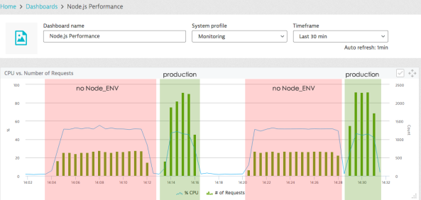

# Встановіть NODE_ENV = production

<br/><br/>

### Пояснення за один абзац

Змінні середовища процесу — це набір пар ключ-значення, доступних будь-якій запущеній програмі, зазвичай для цілей конфігурації. Хоча можна використовувати будь-які змінні, Node заохочує конвенцію використання змінної під назвою NODE_ENV для позначення того, чи ми зараз у продакшені. Це визначення дозволяє компонентам надавати кращу діагностику під час розробки, наприклад, вимикаючи кешування або видаючи детальні записи логів. Будь-який сучасний інструмент розгортання – Chef, Puppet, CloudFormation та інші – підтримує встановлення змінних середовища під час розгортання

<br/><br/>

### Приклад коду: Встановлення та читання змінної середовища NODE_ENV

```shell script
// Встановлення змінних середовища в bash перед запуском node-процесу
$ NODE_ENV=development
$ node
```

```javascript
// Читання змінної середовища за допомогою коду
if (process.env.NODE_ENV === 'production')
    useCaching = true;
```

<br/><br/>

### Що кажуть інші блогери

З блогу [dynatrace](https://www.dynatrace.com/blog/the-drastic-effects-of-omitting-node_env-in-your-express-js-applications/):
> ...У Node.js є конвенція використовувати змінну під назвою NODE_ENV для встановлення поточного режиму. Ми бачимо, що вона насправді читає NODE_ENV і за замовчуванням встановлюється в 'development', якщо не задана. Ми чітко бачимо, що при встановленні NODE_ENV в production кількість запитів, які Node.js може обробити, зростає приблизно на дві третини, тоді як використання CPU навіть трохи знижується. *Дозвольте підкреслити це: Встановлення NODE_ENV в production робить ваш застосунок в 3 рази швидшим!*



<br/><br/>


З блогу Synk [10 best practices to containerize Node.js web applications with Docker](https://snyk.io/blog/10-best-practices-to-containerize-nodejs-web-applications-with-docker/#:~:text=Some%20frameworks%20and,As%20an%20example):
> ...Деякі фреймворки та бібліотеки можуть вмикати оптимізовану конфігурацію, придатну для продакшену, лише якщо ця змінна середовища NODE_ENV встановлена в production. Відкладаючи нашу думку про те, чи це хороша або погана практика для фреймворків, важливо знати це.

<br/><br/>

