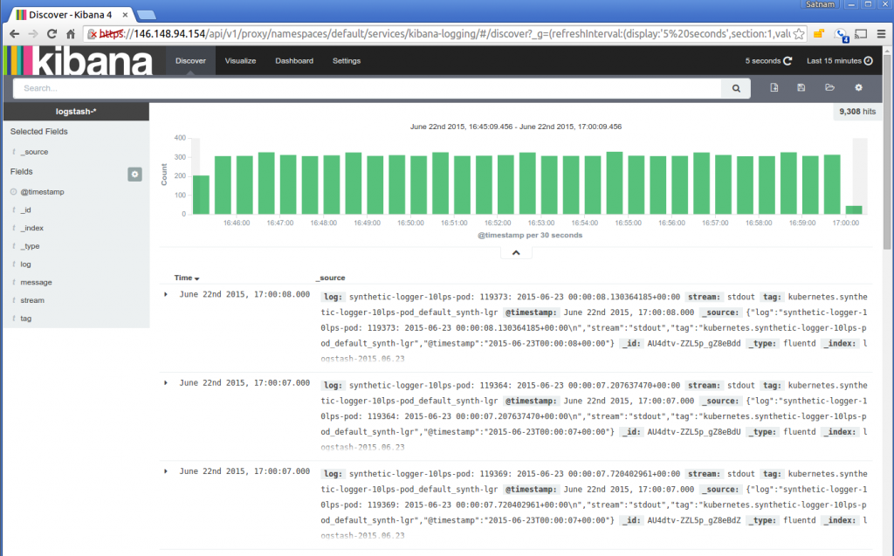
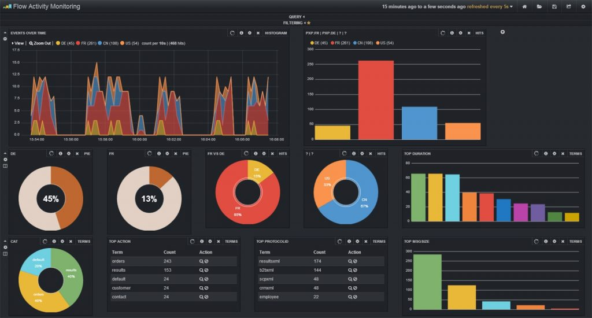

# Rendez votre application plus claire à l'aide de journaux intelligents

  

### Un paragraphe d'explication

Puisque vous produisez de toute façon des relevés de log et que vous avez manifestement besoin d'une interface qui regroupe les informations de production et qui vous permette de suivre les erreurs et les mesures de base (par exemple, combien d'erreurs se produisent chaque heure ? Quel est le point de terminaison de votre API le plus lent ?), pourquoi ne pas investir un effort modéré dans un framework robuste de log qui cochera toutes les cases ? Pour y parvenir, il faut prendre une décision réfléchie en trois étapes :

**1. enregistrement intelligent** – au minimum, vous devez utiliser une bibliothèque de journalisation réputée comme [Winston](https://github.com/winstonjs/winston), [Bunyan](https://github.com/trentm/node-bunyan) et écrire des informations significatives à chaque début et fin de transaction. Pensez également à formater les relevés du journal en JSON et à fournir toutes les propriétés contextuelles (par exemple, l'ID utilisateur, le type d'opération, etc.) afin que l'équipe d'exploitation puisse agir sur ces champs. Incluez également un ID de transaction unique sur chaque ligne de journal, pour plus d'informations, reportez-vous à l'un des points suivants « Attribuez un ID de transaction à chaque relevé du journal ». Un dernier point à considérer, c'est également d'inclure un agent qui enregistre les ressources système de la mémoire et du processeur comme Elastic Beat.

**2. agrégation intelligente** – une fois que vous disposez d'informations complètes sur le système de fichiers de votre serveur, il est temps de les pousser périodiquement vers un système qui agrège, facilite et visualise ces données. Elastic stack, par exemple, est un choix populaire et gratuit qui offre tous les composants pour agréger et visualiser les données. De nombreux produits commerciaux offrent des fonctionnalités similaires, mais ils réduisent considérablement le temps d'installation et ne nécessitent pas d'hébergement.

**3. visualisation intelligente** – maintenant que l'information est agrégée et consultable, on ne peut être que satisfait de la puissance d'une recherche facile dans les logs mais cela peut aller beaucoup plus loin sans codage ni effort. Nous pouvons maintenant afficher d'importantes mesures opérationnelles comme le taux d'erreur, le CPU moyen au cours de la journée, le nombre de nouveaux utilisateurs qui se sont inscrits au cours de la dernière heure et toute autre mesure qui aide à gérer et à améliorer notre application.

  

### Exemple de visualisation : Kibana (faisant partie de Elastic stack) facilite la recherche avancée sur le contenu des journaux

  

### Exemple de visualisation : Kibana (qui fait partie de Elastic stack) visualise les données sur la base des journaux

  

### Citation de blog : « Exigences pour un enregistreur de journal »

Extrait du blog [Strong Loop](https://strongloop.com/strongblog/compare-node-js-logging-winston-bunyan/) :

> Permet d'identifier quelques exigences (pour un outil de journalisation) :
1. Chaque ligne du journal est horodatée. Celle-ci est assez explicite - vous devriez pouvoir dire quand chaque entrée du journal s'est produite.
2. Le format d'enregistrement doit être facilement assimilable par les humains ainsi que par les machines.
3. Permet plusieurs flux de destination configurables. Par exemple, vous pouvez écrire des journaux de trace dans un fichier, mais lorsqu'une erreur se produit, cela écrit dans le même fichier, puis dans le fichier d'erreur et envoi un e-mail en même temps…

  

  
