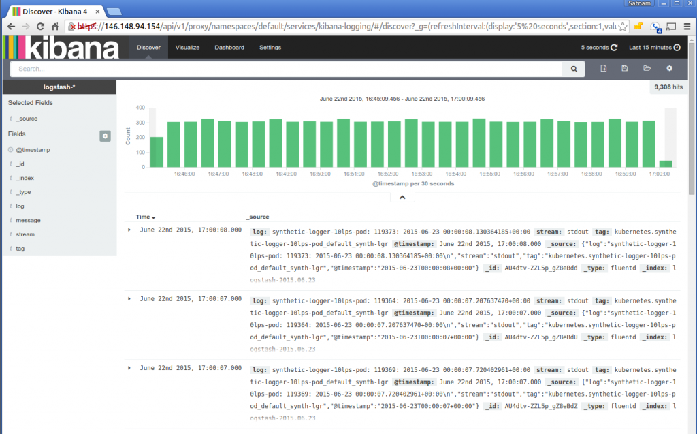
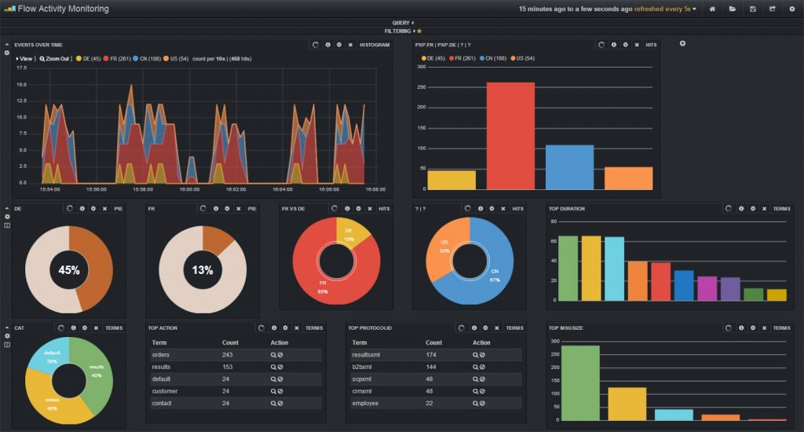

# Зробіть ваш застосунок прозорим за допомогою розумних логів

  

### Пояснення за один абзац

Оскільки ви все одно виводите записи логів і вам очевидно потрібен якийсь інтерфейс, який обгортає продакшен-інформацію, де ви можете відстежувати помилки та основні метрики (наприклад, скільки помилок відбувається щогодини і який ваш найповільніший API-ендпоінт), чому б не вкласти помірні зусилля в надійний фреймворк логування, який відзначить усі пункти? Досягнення цього вимагає продуманого рішення в три кроки:

**1. розумне логування** – як мінімум вам потрібно використовувати авторитетну бібліотеку логування, таку як [Winston](https://github.com/winstonjs/winston), [Bunyan](https://github.com/trentm/node-bunyan), та записувати значущу інформацію на початку та в кінці кожної транзакції. Розгляньте також форматування записів логів як JSON та надання всіх контекстних властивостей (наприклад, id користувача, тип операції тощо), щоб операційна команда могла діяти на основі цих полів. Також включайте унікальний id транзакції в кожен рядок логу, для отримання додаткової інформації зверніться до пункту нижче "Записуйте transaction-id в лог". Останній момент, який варто розглянути — це також включення агента, який логує системні ресурси, такі як пам'ять та CPU, наприклад Elastic Beat.

**2. розумна агрегація** – коли у вас є вичерпна інформація у файловій системі вашого сервера, час періодично передавати її до системи, яка агрегує, полегшує та візуалізує ці дані. Elastic stack, наприклад, є популярним і безкоштовним вибором, який пропонує всі компоненти для агрегації та візуалізації даних. Багато комерційних продуктів надають подібну функціональність, лише вони значно скорочують час налаштування та не вимагають хостингу.

**3. розумна візуалізація** – тепер інформація агрегована та доступна для пошуку, можна задовольнитися лише можливістю легко шукати логи, але це може піти набагато далі без кодування або витрачання багато зусиль. Тепер ми можемо показувати важливі операційні метрики, такі як частота помилок, середнє використання CPU протягом дня, скільки нових користувачів зареєструвалося за останню годину, та будь-яку іншу метрику, яка допомагає керувати та покращувати наш застосунок.

  

### Приклад візуалізації: Kibana (частина Elastic stack) полегшує розширений пошук по вмісту логів

  

### Приклад візуалізації: Kibana (частина Elastic stack) візуалізує дані на основі логів

  

### Цитата з блогу: Вимоги до Logger

З блогу [Strong Loop](https://strongloop.com/strongblog/compare-node-js-logging-winston-bunyan/):

> Давайте визначимо кілька вимог (до logger):
> 1. Мітка часу для кожного рядка логу. Це досить зрозуміло – ви повинні мати можливість визначити, коли відбувся кожен запис логу.
> 2. Формат логування повинен легко засвоюватися як людьми, так і машинами.
> 3. Дозволяє кілька налаштовуваних потоків призначення. Наприклад, ви можете записувати trace-логи в один файл, але коли виникає помилка, записувати в той самий файл, потім у файл помилок і надсилати електронний лист одночасно…

  

  

