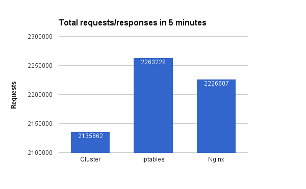

# Utilisez tous les cœurs du CPU

  

### Un paragraphe d'explication

Il n'est pas surprenant que dans sa forme de base, Node fonctionne sur un unique thread=un unique processus=un seul CPU. Payer pour du matériel costaud avec 4 ou 8 CPU et n'en utiliser qu'un seul semble fou, non ? La solution la plus rapide qui convient aux applications de taille moyenne est l'utilisation du module Cluster de Node qui, en 10 lignes de code, génère un processus pour chaque cœur logique et achemine les requêtes entre les processus dans un style à tour de rôle. Mieux encore, utilisez PM2 qui enrobe le module de clustering avec une interface simple et une interface utilisateur de surveillance sympa. Bien que cette solution fonctionne bien pour les applications traditionnelles, elle pourrait ne pas convenir aux applications qui exigent des performances de premier ordre et un flux DevOps robuste. Pour ces cas d'utilisation avancés, envisagez de répliquer le processus NODE à l'aide d'un script de déploiement personnalisé et d'équilibrage (NdT, « balancing ») en utilisant un outil spécialisé tel que nginx ou utilisez un moteur de conteneur tel que AWS ECS ou Kubernetees qui disposent de fonctionnalités avancées pour le déploiement et la réplication des processus.

  

### Comparaison : équilibrage à l'aide du cluster de Node vs nginx

  

### Ce que disent les autres blogueurs

* Extrait de la [documentation de Node.js](https://nodejs.org/api/cluster.html#cluster_how_it_works):
> ... La seconde approche, les clusters de Node, devrait, en théorie, donner les meilleures performances. Dans la pratique, cependant, la distribution a tendance à être très déséquilibrée en raison des aléas du planificateur du système d'exploitation. Des charges ont été observées où plus de 70% de toutes les connexions se sont uniquement terminées sur deux processus, sur un total de huit ...

* Extrait du blog de [StrongLoop](https://strongloop.com/strongblog/best-practices-for-express-in-production-part-two-performance-and-reliability/):
> ... Le clustering est rendu possible avec le module de cluster de Node. Cela permet à un processus maître de générer des processus de travail et de répartir les connexions entrantes entre les processus de travail. Cependant, plutôt que d'utiliser directement ce module, il est préférable d'utiliser l'un des nombreux outils qui le font automatiquement pour vous; par exemple node-pm ou cluster-service ...

* Extrait de l'article [Performance de l'équilibre de charge du processus Node.js : comparaison entre le module de cluster, iptables et Nginx](https://medium.com/@fermads/node-js-process-load-balancing-comparing-cluster-iptables-and-nginx-6746aaf38272) de Medium
> ... Le cluster Node est simple à implémenter et à configurer, les choses sont conservées dans le domaine Node sans dépendre d'autres logiciels. N'oubliez pas que votre processus maître fonctionnera presque autant que vos processus de travail et avec un peu moins de taux de requête que les autres solutions. ...
