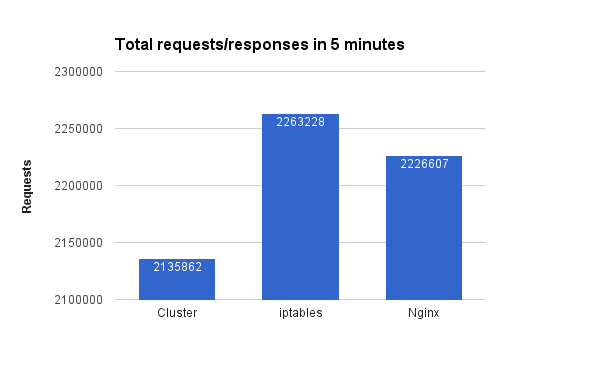

# Використовуйте всі ядра CPU

  

### Пояснення за один абзац

Можливо, не стане несподіванкою, що у своїй базовій формі Node працює на одному потоці=одному процесі=одному CPU. Платити за потужне обладнання з 4 або 8 CPU і використовувати лише один звучить божевільно, правда? Найшвидше рішення, яке підходить для застосунків середнього розміру — використання модуля Cluster Node, який у 10 рядках коду створює процес для кожного логічного ядра та маршрутизує запити між процесами в стилі round-robin. Ще краще — використовуйте PM2, який обгортає модуль кластеризації простим інтерфейсом та крутим UI моніторингу. Хоча це рішення добре працює для традиційних застосунків, воно може бути недостатнім для застосунків, які вимагають найвищої продуктивності та надійного DevOps-потоку. Для цих просунутих випадків розгляньте реплікацію NODE-процесу за допомогою кастомного скрипта розгортання та балансування за допомогою спеціалізованого інструменту, такого як nginx, або використовуйте контейнерний рушій, такий як AWS ECS або Kubernetes, які мають розширені функції для розгортання та реплікації процесів.

  

### Порівняння: Балансування за допомогою модуля cluster Node vs nginx

  

### Що кажуть інші блогери

* З [документації Node.js](https://nodejs.org/api/cluster.html#cluster_how_it_works):
> ... Другий підхід, кластери Node, теоретично повинен давати найкращу продуктивність. На практиці, однак, розподіл має тенденцію бути дуже незбалансованим через примхи планувальника операційної системи. Спостерігалися навантаження, де понад 70% усіх з'єднань опинялися лише в двох процесах з восьми ...

* З блогу [StrongLoop](https://strongloop.com/strongblog/best-practices-for-express-in-production-part-two-performance-and-reliability/):
> ... Кластеризація стає можливою завдяки модулю cluster Node. Це дозволяє майстер-процесу створювати робочі процеси та розподіляти вхідні з'єднання між робітниками. Однак замість прямого використання цього модуля набагато краще використовувати один з багатьох інструментів, які роблять це за вас автоматично; наприклад node-pm або cluster-service ...

* З публікації Medium [Node.js process load balance performance: comparing cluster module, iptables, and Nginx](https://medium.com/@fermads/node-js-process-load-balancing-comparing-cluster-iptables-and-nginx-6746aaf38272)
> ... Node cluster простий у реалізації та налаштуванні, речі залишаються в межах Node без залежності від іншого програмного забезпечення. Просто пам'ятайте, що ваш майстер-процес буде працювати майже так само багато, як ваші робочі процеси, і з трохи меншою частотою запитів, ніж інші рішення ...

