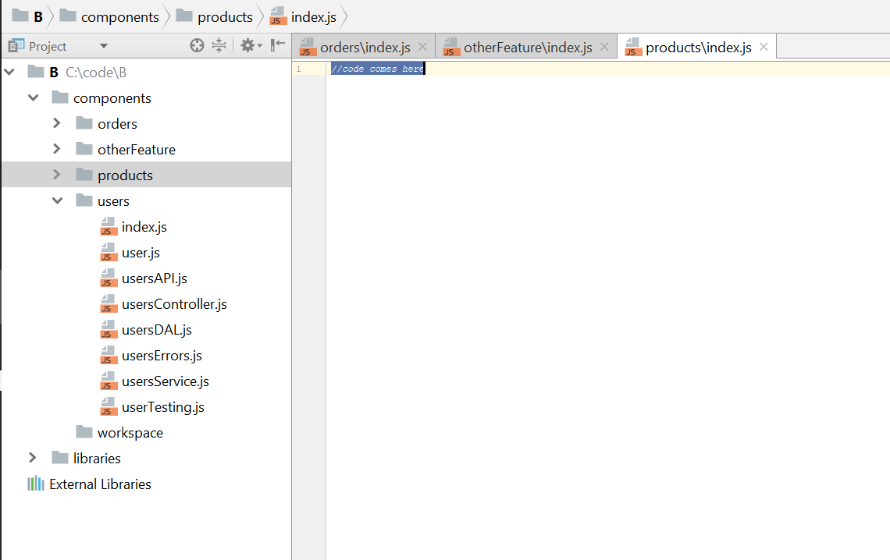
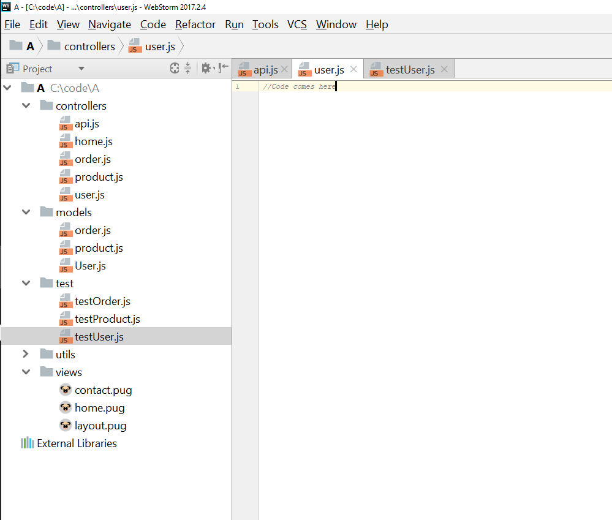

# Antolatu zure proiektua atal eta osagai txikiagotan

  

### Azalpena

Tamaina ertaineko nahiz handiko aplikazioetarako, monolitoak benetan kaltegarriak dira. Menpekotasun asko dituen software handi bat edukitzea zaila da hausnartzeko eta maiz espageti kodea eragiten du. Arkitekto azkarrek ere, piztia mantsotzeko eta zatikatzeko haina gaitasun dituztenek, diseinuan esfortzu mental handiak egiten dituzte, eta aldaketa bakoitzak menpeko beste objektuekiko eragina arretaz aztertzea eskatzen du. Azken  irtenbidea software txikia garatzean datza: banandu kode pila osoa fitxategiak beste inorekin partekatzen ez dituzten aparteko osagaietan, bakoitza fitxategi gutxi batzuekin osatua egonik (APIa, zerbitzuak, datuen sarbidea, egiaztatzeak, etab.) oso erraza da hausnartzeko. Askok 'mikrozerbitzu' egitura deitzen diote horri, garrantzitsua da ulertzea mikrozerbitzuak oinarri sorta bat direla eta ez derrigorrez jarraitu beharreko zehaztapenak. Printzipio ugari erabil ditzakezu mikrozerbitzudun egitura handi batean edota gutxi batzuk soilik. Biak dira zuzenak zure softwarearen konplexutasuna baxua den bitartean. Gutxienez, egin zenezakeen beste zerbait da osagaien artean oinarrizko mugak sortzea, zure proiektuaren erroan karpeta bat egokitzea osagai logiko bakoitzarentzat eta autonono bihurtzea: beste osagaiek haren funtzionalitatea erabili ahal izango dute soilik bere interfaze publikotik edo APItik pasatuz. Hori oinarrizkoa da zure osagaiak sinpleak izateko, menpekotasunen korapiloa ekiditeko eta zure aplikazioa mikrozerbitzu egitura handietarako prestatzeko.
  

### Blog aipua: "Eskalatzeak aplikazio osoaren eskalatzea eskatzen du"

[MartinFowler.com](https://martinfowler.com/articles/microservices.html) bloga

> Aplikazio monolitikoak arrakastatsuak izan daitezke, baina jendeak gero eta frustrazio gehiago ditu beraiekin, batez ere gero eta aplikazio gehiago inplementatzen direlako lainoan. Aldaketa zikloak elkarrekin lotuta daude: aplikazioaren zati txiki batean egindako aldaketak monolito osoa birsortzea eta inplementatzea eskatzen du. Askotan zaila da denbora aurrera joan ahala moduluzko egitura egokia mantentzea, modulu batean bakarrik eragina izango dituzten aldaketak mantentzea. Eskalatzeak aplikazio osoaren eskalatzea eskatzen du
  

### Blog aipua: "Zergatik egiten du garrasi zure aplikazioaren egiturak?"

[uncle-bob](https://blog.cleancoder.com/uncle-bob/2011/09/30/Screaming-Architecture.html) bloga

> ...Liburutegi baten egitura begiratuko bazenu, ziurrenik sarrera handi batekin aurkituko zinateke, erregistro bulego lekuekin, irakurketa lekuekin, biltzar toki txikiekin, eta liburutegiko liburu guztiak edukitzeko beste apal dituzten galeria ugarirekin. Egitura horrek honakoa oihukatu beharko luke: Liburutegia. 

Beraz, zer oihukatzen du zure aplikazioaren egiturak? Zure direktorioko egituraren maila altuena eta maila altueneko paketeko iturburu fitxategiak begiratzen dituzunean, zer oihukatzen dute: Osasun Sistema, Kontabilitate Sistema edo Inbentarioa Kudeatzeko Sistema? Edo zera oihukatzen al dute: Rails, Spring/Hibernate edo ASP?

  

### Zuzena: antolatu zure proiektua aparteko osagaietan

  

### Okerra: taldekatu zure fitxategiak rol teknikoen arabera

