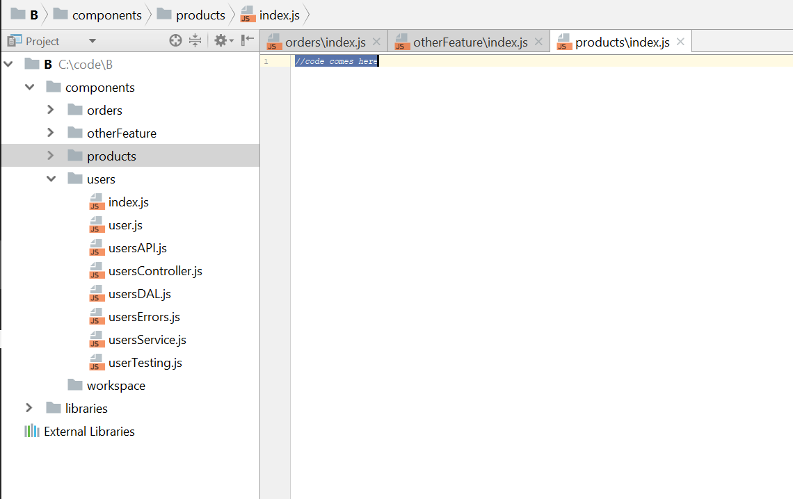
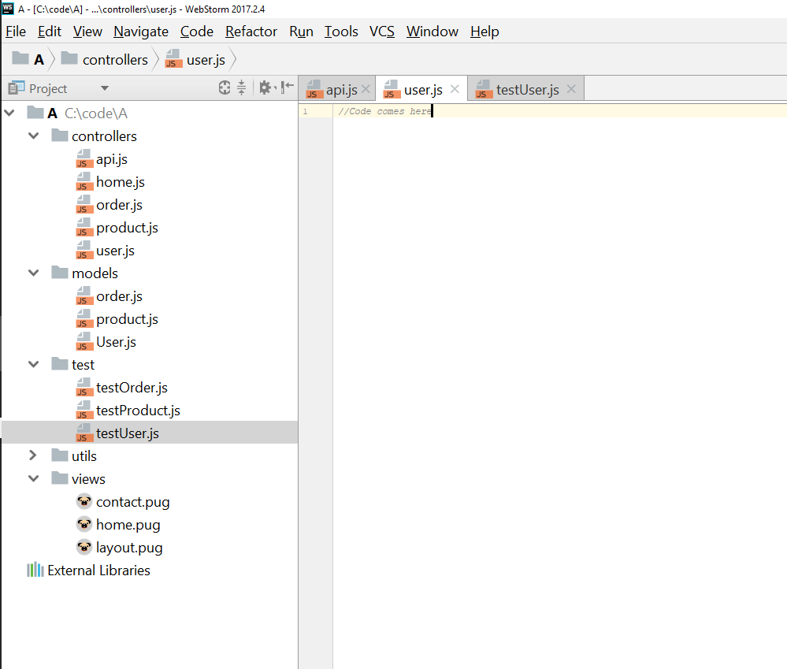

# Структуруйте своє рішення за компонентами

  

### Пояснення за один абзац

Для додатків середнього розміру та більше моноліти — це справді погано — одне велике програмне забезпечення з багатьма залежностями просто важко аналізувати і часто призводить до спагеті-коду. Навіть ті розумні архітектори, які вміють приборкати звіра і «модуляризувати» його — витрачають великі розумові зусилля на проектування і кожна зміна вимагає ретельної оцінки впливу на інші залежні об'єкти. Найкраще рішення — розробляти маленьке програмне забезпечення: розділіть весь стек на самодостатні компоненти, які не діляться файлами з іншими, кожен складається з дуже невеликої кількості файлів (наприклад, API, сервіс, доступ до даних, тест тощо), тому про це дуже легко міркувати. Дехто може називати це архітектурою «мікросервісів» — важливо розуміти, що мікросервіси — це не специфікація, якій потрібно слідувати, а скоріше набір принципів. Ви можете прийняти багато принципів у повноцінну архітектуру мікросервісів або прийняти лише кілька. Обидва варіанти хороші, поки ви тримаєте складність програмного забезпечення на низькому рівні. Найменше, що вам слід зробити — це створити базові межі між компонентами, призначити папку в корені вашого проекту для кожного бізнес-компонента і зробити його самодостатнім — іншим компонентам дозволяється споживати його функціональність лише через його публічний інтерфейс або API. Це є основою для підтримки простоти ваших компонентів, уникнення пекла залежностей і прокладання шляху до повноцінних мікросервісів у майбутньому, коли ваш додаток виросте

  

### Цитата з блогу: "Масштабування вимагає масштабування всього додатку"

 З блогу MartinFowler.com

 > Монолітні додатки можуть бути успішними, але все більше людей відчувають розчарування від них — особливо коли все більше додатків розгортаються в хмарі. Цикли змін пов'язані разом — зміна, внесена в невелику частину додатку, вимагає перебудови і розгортання всього моноліту. З часом часто важко підтримувати хорошу модульну структуру, що ускладнює збереження змін, які повинні впливати лише на один модуль, у межах цього модуля. Масштабування вимагає масштабування всього додатку, а не лише тих частин, які потребують більше ресурсів.

   

### Добре: Структуруйте своє рішення за самодостатніми компонентами

   

### Погано: Групуйте файли за технічною роллю

