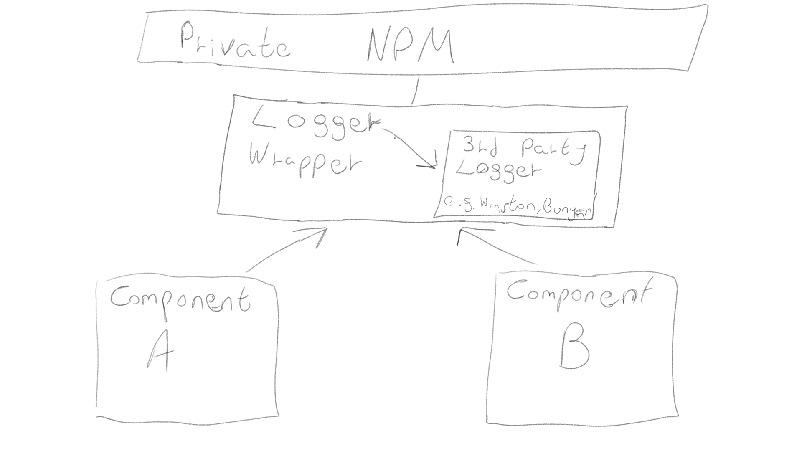

# Externalisez les utilitaires communs en paquets NPM

  

### Un paragraphe d'explication

Une fois que vous commencez à vous développer et que vous avez différents composants sur différents serveurs qui consomment des utilitaires similaires, vous devez commencer à gérer les dépendances - comment pouvez-vous conserver une copie de votre code utilitaire et laisser plusieurs composants consommateurs l'utiliser et le déployer ? Eh bien, il y a un outil pour ça, ça s'appelle npm ... Commencez par emballer des paquets d'utilitaires tiers avec votre propre code pour le rendre facilement remplaçable à l'avenir et publiez votre propre code en tant que package npm privé. Désormais, toute votre base de code peut importer ce code et bénéficier d'un outil de gestion des dépendances gratuit. Il est possible de publier des packages npm pour votre propre usage privé sans le partager publiquement à l'aide de [modules privés](https://docs.npmjs.com/private-modules/intro), [registre privé](https://npme.npmjs.com/docs/tutorials/npm-enterprise-with-nexus.html) ou de [paquets npm locaux](https://medium.com/@arnaudrinquin/build-modular-application-with-npm-local-modules-dfc5ff047bcc).

  

### Partage de vos propres utilitaires communs entre les environnements et les composants

