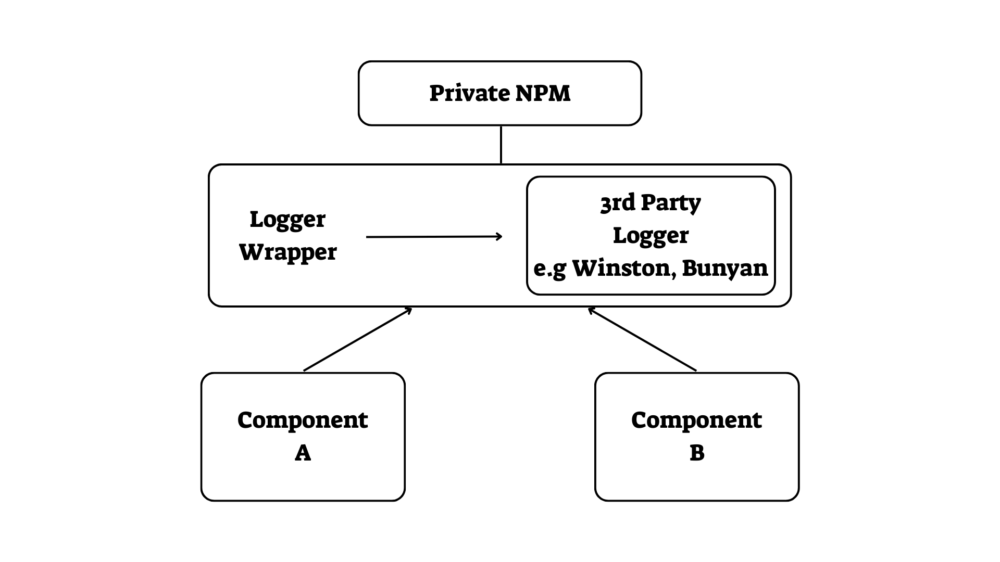

# 一般的なユーティリティを npm パッケージとしてラップする

  

### 一段落説明

成長を始めて、似たようなユーティリティを使用する異なるサーバ上の異なるコンポーネントを持つようになったら、依存関係の管理を始めなければなりません。- ユーティリティコードのコピーを1つにして、複数のコンシューマコンポーネントに使用させてデプロイするにはどうすれば良いでしょう? そのためのツールとして、npm と呼ばれるものがあります。サードパーティのユーティリティパッケージを独自のコードでラップして、将来的に簡単に置き換えられるようにし、独自のコードをプライベートな npm パッケージとして公開することから始めましょう。そうすることで、あなたのすべてのコードベースは、コードをインポートすることができ、無料の依存関係管理ツールの恩恵を受けることができます。[private modules](https://docs.npmjs.com/private-modules/intro) や [private registry](https://npme.npmjs.com/docs/tutorials/npm-enterprise-with-nexus.html)、[local npm packages](https://medium.com/@arnaudrinquin/build-modular-application-with-npm-local-modules-dfc5ff047bcc) を使うことで、自分だけのプライベートな利用だけのために npm パッケージを公開することができます。

  

### 環境やコンポーネント横断で独自の共通ユーティリティを共有する

