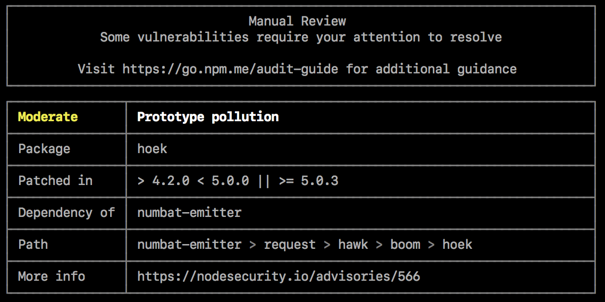
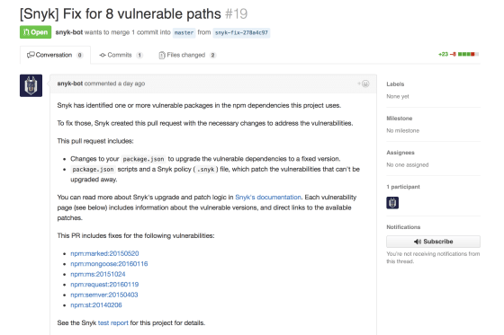
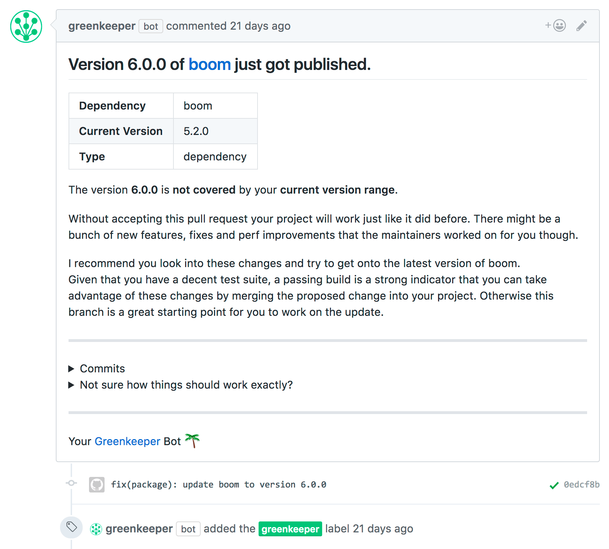

# Etengabe eta automatikoki ikuskatu mendekotasun ba ote dagoen zaurgarritik

### Azalpena

Node.js aplikazio gehienak inork egindako npm edo Yarn modulu ugarietan oinarritzen dira, pakete erregistro ezagunak biak, garatzeko erraztasuna eta azkartasuna dituzte eta. Hala ere, abantaila horren alde txarra da ahulezia ezezagunak dituela zure aplikazioan sartuz gero haren segurtasunari arriskuak eragin ahal dizkiona, hau da, OWASP web aplikazioen segurtasun arrisku larrien zerrendan duten lekuagatik ezagunak direnak.

Node.js aplikazioetan tresna ugari erabil daitezke hirugarrenen paketeetan ahulak diren aplikazioak identifikatzen laguntzeko, zure proiektuan sartzeko arriskua arintze aldera . Horiek aldizka CLI tresnetatik erabil daitezke edo zure aplikazioaren eraikuntza prozesuaren barruan sartu.

### Edukien taula

- [NPM audit](#npm-audit)
- [Snyk](#snyk)
- [Greenkeeper](#greenkeeper)
- [Baliabide osagarriak](#baliabide-osagarriak)

### NPM Audit

`npm audit` NPM @ 6-rekin batera sartutako cli tresna berria da.

Npm auditoretza exekutatzeak segurtasun ahultasunen txostena sortuko du kaltetutako paketearen izenarekin, zaurgarritasunaren larritasunarekin eta deskribapenarekin, bidearekin eta bestelako informazioarekin, eta, gainera, ahultasunak konpontzeko adabakiak aplikatzeko aginduak emango ditu, eskuragarri egonez gero.

🔗 [Irakurri: NPM bloga](https://docs.npmjs.com/getting-started/running-a-security-audit)

### Snyk

Snykek funtzio aberatsa duen CLI bat eskaintzen du, baita GitHub integrazioa ere. Horrekin Snyk urrunago doa eta, ahultasunak jakinarazteaz gain, ahuleziak konpontzen dituen erauzte eskaera berriak ere sortzen ditu automatikoki, adabakiak ahulezia ezagunetarako kaleratzen baitira.

Snyken webgune aberatsak mendekotasunak ad-hoc ebaluatzeko aukera ere ematen du GitHub biltegiarekin edo npm moduluaren URLarekin hornituta. Ahuleziak dituzten npm paketeak ere bila ditzakezu zuzenean.

Synk GitHub integrazioaren irteeraren adibide bat, erauzte eskaera automatikoki sortuz:

🔗 [ Irakurri hemen: Snyk webgunea](https://snyk.io/)

🔗 [Irakurri: Synk onlineko tresna npm paketeak eta GitHub moduluak egiaztatzeko](https://snyk.io/test)

### Greenkeeper

Greenkeeper denbora errealeko menpekotasunen eguneratzeak eskaintzen dituen zerbitzua da, aplikazioak seguruago mantentzen dituena, eguneratutako eta adabakitako menpekotasun bertsioak erabiliz beti.

Greenkeeperrek biltegi baten `package.json` fitxategian zehaztutako npm menpekotasunak ikusten ditu eta automatikoki laneko adar bat sortzen du menpekotasunen eguneratze bakoitzarekin. Biltegirako CI suite exekutatuko da aplikazioan eguneratutako menpekotasun bertsiorako aldaketa aldakorrak agerian uzteko. IEk huts egiten badu menpekotasunaren eguneratzea dela eta, gai argia eta zehatza sortzen da enkantean jarri nahi den biltegian, uneko eta eguneratutako paketeen bertsioak azalduz, informazioarekin eta eguneratutako bertsioaren konpromiso historiarekin batera.

Greenkeeper GitHub integrazioaren irteeraren adibide bat erauzte eskaera automatikoki sortuz:

🔗 [Irakurri: Greenkeeper webgunea](https://greenkeeper.io/)

### Baliabide osagarriak

🔗 [Rising Stack bloga: Node.jsren menpekotasun arriskuak](https://blog.risingstack.com/controlling-node-js-security-risk-npm-dependencies/)

🔗 [NodeSource Bloga: npmen  segurtasuna hobetzea](https://nodesource.com/blog/how-to-reduce-risk-and-improve-security-around-npm)
