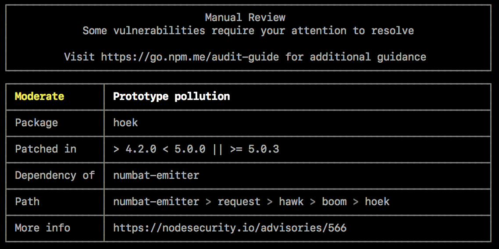
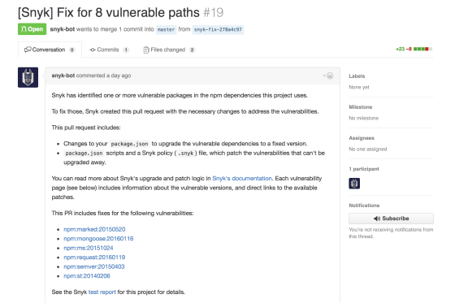
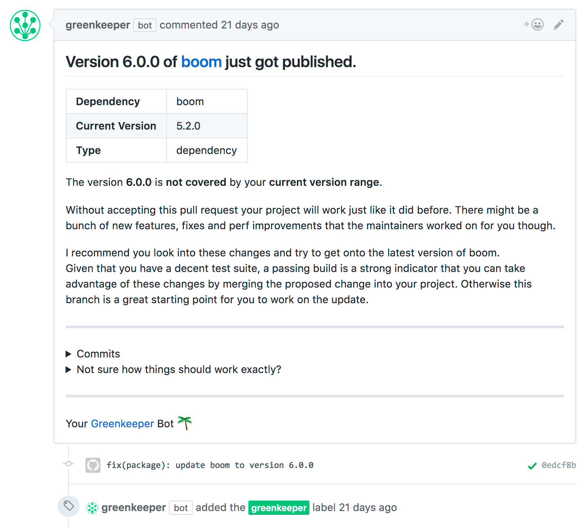

# Постійно та автоматично перевіряйте на наявність вразливих залежностей

### Пояснення за один абзац

Більшість додатків Node.js значною мірою покладаються на велику кількість сторонніх модулів з npm або Yarn, обох популярних реєстрів пакетів, завдяки простоті та швидкості розробки. Однак недоліком цієї переваги є ризики безпеки від включення невідомих вразливостей у ваш додаток, що є ризиком, визнаним його місцем у списку найкритичніших ризиків безпеки веб-додатків OWASP.

Існує ряд інструментів, доступних для допомоги в ідентифікації сторонніх пакетів у додатках Node.js, які були визначені спільнотою як вразливі, щоб зменшити ризик їх впровадження у ваш проект. Їх можна використовувати періодично з інструментів CLI або включати як частину процесу збірки вашого додатку.

### Зміст

- [NPM audit](#npm-audit)
- [Snyk](#snyk)
- [Greenkeeper](#greenkeeper)
- [Додаткові ресурси](#додаткові-ресурси)

### NPM Audit

`npm audit` — це новий інструмент CLI, представлений з NPM@6.

Запуск `npm audit` створить звіт про вразливості безпеки з назвою вразливого пакета, серйозністю вразливості та описом, шляхом та іншою інформацією, а також, якщо доступно, командами для застосування патчів для усунення вразливостей.

🔗 [Детальніше: NPM блог](https://docs.npmjs.com/getting-started/running-a-security-audit)

### Snyk

Snyk пропонує багатофункціональний CLI, а також інтеграцію з GitHub. Snyk йде далі і на додаток до сповіщення про вразливості також автоматично створює нові pull-запити, що виправляють вразливості, коли випускаються патчі для відомих вразливостей.

Багатофункціональний веб-сайт Snyk також дозволяє проводити оцінку залежностей за запитом при наданні репозиторію GitHub або URL npm модуля. Ви також можете шукати npm пакети, які мають вразливості, напряму.

Приклад автоматично створеного pull-запиту інтеграції Snyk GitHub:

🔗 [Детальніше: веб-сайт Snyk](https://snyk.io/)

🔗 [Детальніше: онлайн-інструмент Snyk для перевірки npm пакетів і модулів GitHub](https://snyk.io/test)

### Greenkeeper

Greenkeeper — це сервіс, який пропонує оновлення залежностей в реальному часі, що робить додаток більш безпечним, завжди використовуючи найновіші та виправлені версії залежностей.

Greenkeeper відстежує npm залежності, вказані у файлі `package.json` репозиторію, і автоматично створює робочу гілку з кожним оновленням залежності. Потім запускається CI набір репозиторію для виявлення будь-яких критичних змін для оновленої версії залежності в додатку. Якщо CI завершується невдачею через оновлення залежності, в репозиторії створюється чіткий і стислий issue, що описує поточну та оновлену версії пакета, разом з інформацією та історією комітів оновленої версії.

Приклад автоматично створеного pull-запиту інтеграції Greenkeeper GitHub:

🔗 [Детальніше: веб-сайт Greenkeeper](https://greenkeeper.io/)

### Додаткові ресурси

🔗 [Rising Stack Blog: Ризики залежностей Node.js](https://blog.risingstack.com/controlling-node-js-security-risk-npm-dependencies/)

🔗 [NodeSource Blog: Покращення безпеки npm](https://nodesource.com/blog/how-to-reduce-risk-and-improve-security-around-npm)

