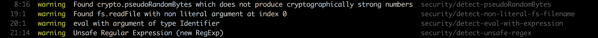

# Adoptez les règles de sécurité du linter

### Un paragraphe d'explication

Les plugins de sécurité pour ESLint et TSLint tels que [eslint-plugin-security](https://github.com/nodesecurity/eslint-plugin-security) et [tslint-config-security](https://www.npmjs.com/package/tslint-config-security) offrent des contrôles de sécurité du code basés sur un certain nombre de vulnérabilités connues, telles que les RegEx non sécurisées, l'utilisation non sécurisée de `eval()`et les noms de fichiers non littéraux utilisés lors de l'accès au système de fichiers dans une application. L'utilisation de hooks de git comme [pre-git](https://github.com/bahmutov/pre-git) permet de renforcer les règles de contrôle des sources avant qu'elles ne soient distribuées à distance, l'une d'entre elles pouvant être de vérifier qu'aucun secret n'a été ajouté au contenu des sources.

### Exemple `eslint-plugin-security`

Quelques exemples de règles de pratiques non sécurisées détectées par `eslint-plugin-security`:

`detect-pseudoRandomBytes`

```javascript
const insecure = crypto.pseudoRandomBytes(5);
```

`detect-non-literal-fs-filename`

```javascript
const path = req.body.userinput;
fs.readFile(path);
```

`detect-eval-with-expression`

```javascript
const userinput = req.body.userinput;
eval(userinput);
```

`detect-non-literal-regexp`

```javascript
const unsafe = new RegExp('/(x+x+)+y/)');
```

Un exemple de l'exécution de `eslint-plugin-security` sur un projet Node.js avec des pratiques de code non sécurisées ci-dessus :



### Ce que disent les autres blogueurs

Extrait du blog de [Adam Baldwin](https://www.safaribooksonline.com/blog/2014/03/28/using-eslint-plugins-node-js-app-security/) :
> Lint ne doit pas être un simple outil pour faire respecter des règles pédantes sur les espaces, les points-virgules ou l'instruction eval. ESLint fournit un framework puissant pour éliminer une grande variété de modèles potentiellement dangereux dans votre code (expressions régulières, validation d'entrée, etc.). Je pense qu'il constitue un nouvel outil puissant qui mérite d'être pris en considération par les développeurs JavaScript soucieux de la sécurité.
