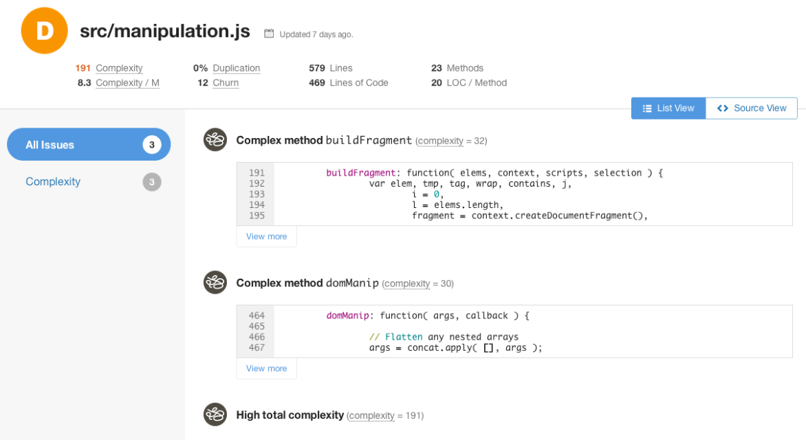
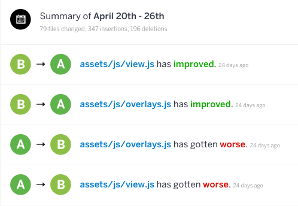
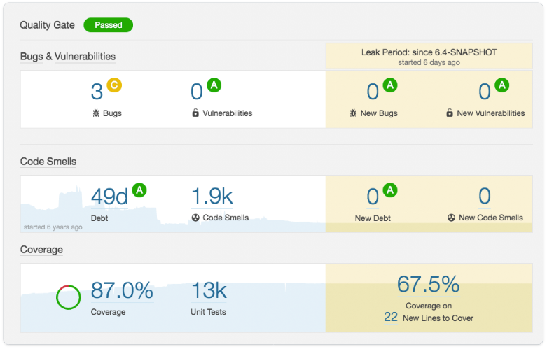

# 제목 입력

<br/><br/>

### 한 문단 설명(One Paragraph Explainer)

텍스트 입력

<br/><br/>

### 코드 예제 - 설명

```javascript
code here
```

<br/><br/>

### 코드 예제 - 또 다른 예시

```javascript
code here
```

<br/><br/>

### 블로그 인용: "제목"

pouchdb.com 블로그에서 발췌.
"Node Promises" 키워드 기준 상위11위에 랭크됨.

> …여기에 인용문 입력

<br/><br/>

### 예시: CodeClimate(상용)을 활용한 복잡한 메서드 분석



### 예시: CodeClimate(상용)을 활용한 코드 분석 동향 및 이력



### 예시: SonarQube(상용)을 활용한 코드 분석 요약 및 동향



<br/><br/>
