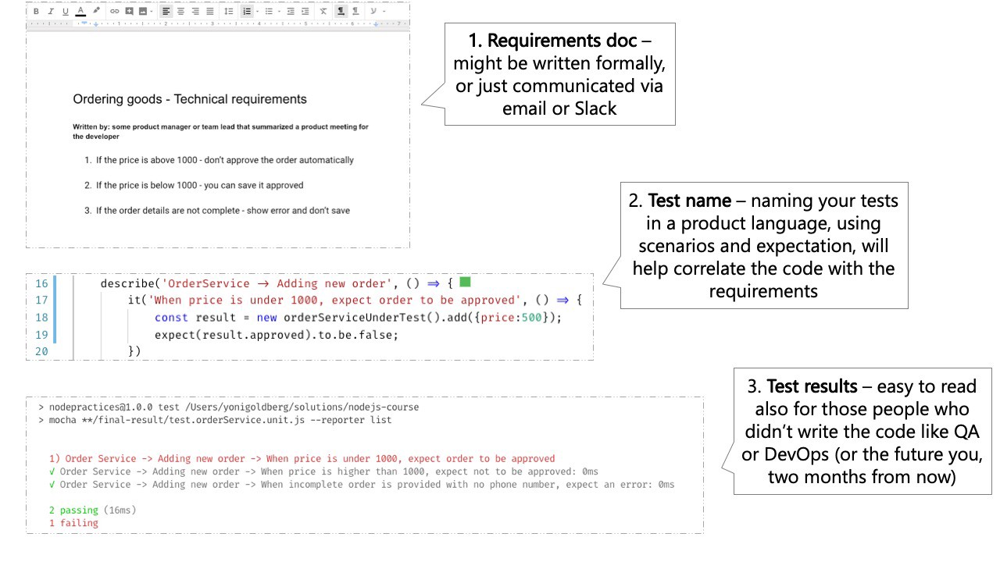

# Incluez 3 parties dans chaque nom de test

<br/><br/>

### Un paragraphe d'explication

Un rapport de test devrait indiquer si la révision actuelle de l'application satisfait aux exigences des personnes qui ne sont pas nécessairement familières avec le code : le testeur, l'ingénieur DevOps qui déploie et vous dans deux ans. Cela peut être mieux réalisé si les tests décrivent le niveau d'exigence et comprennent 3 parties :

(1) Qu'est-ce qui est testé ? Par exemple, la méthode `ProductsService.addNewProduct`

(2) Dans quelles circonstances et dans quel scénario ? Par exemple, aucun prix n'est transmis à la méthode

(3) Quel est le résultat attendu ? Par exemple, le nouveau produit n'est pas approuvé<br/><br/>

<br/><br/>

### Exemple de code : un nom de test qui comprend 3 parties
```javascript
//1. unité testée
describe('Service Produits', () => {
  describe('Ajoute un nouveau produit', () => {
    //2. scénario et 3. attente
    it('Quand aucun prix n\'est spécifié, alors le statut du produit est en attente d\'approbation', () => {
      const newProduct = new ProductService().add(...);
      expect(newProduct.status).to.equal('validationEnAttente');
    });
  });
});
```

<br/><br/>

### Contre exemple de code : il faut lire l'intégralité du code du test pour comprendre l'intention
```javascript
describe('Service Produits', () => {
  describe('Ajoute un nouveau produit', () => {
    it('Devrait retourner le bon statut', () => {
      //hmm, quelle est cette vérification de test ? quels sont le scénario et les attentes ?
      const newProduct = new ProductService().add(...);
      expect(newProduct.status).to.equal('validationEnAttente');
    });
  });
});
```

<br/><br/>

###  « Un exemple à suivre : le rapport de test ressemble au document des spécifications »

 [Extrait du blog de « 30 bonnes pratiques de test avec Node.js » par Yoni Goldberg](https://medium.com/@me_37286/yoni-goldberg-javascript-nodejs-testing-best-practices-2b98924c9347)

 

<br/><br/>
