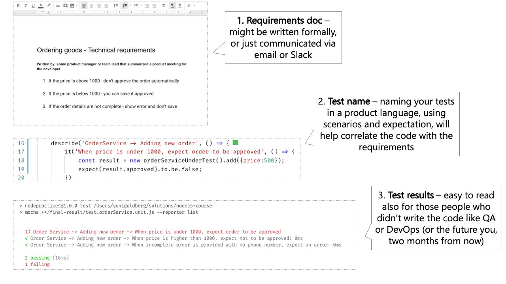

# Include 3 parts in each test name

<br/><br/>

### One Paragraph Explainer

A test report should tell whether the current application revision satisfies the requirements for the people who are not necessarily familiar with the code: the tester, the DevOps engineer who is deploying and the future you two years from now. This can be achieved best if the tests speak at the requirements level and include 3 parts:

(1) What is being tested? For example, the ProductsService.addNewProduct method

(2) Under what circumstances and scenario? For example, no price is passed to the method

(3) What is the expected result? For example, the new product is not approved

<br/><br/>

### Code example: a test name that incluces 3 parts
```javascript
//1. unit under test
describe('Products Service', () => {
  describe('Add new product', () => {
    //2. scenario and 3. expectation
    it('When no price is specified, then the product status is pending approval', () => {
      const newProduct = new ProductService().add(...);
      expect(newProduct.status).to.equal('pendingApproval');
    });
  });
});
```

<br/><br/>

### Code Example – Anti Pattern: one must read the entire test code to understand the intent 
```javascript
describe('Products Service', () => {
  describe('Add new product', () => {
    it('Should return the right status', () => {
      //hmm, what is this test checking? what are the scenario and expectation?
      const newProduct = new ProductService().add(...);
      expect(newProduct.status).to.equal('pendingApproval');
    });
  });
});
```

<br/><br/>

###  "Doing It Right Example: The test report resembles the requirements document"

 [From the blog "30 Node.js testing best practices" by Yoni Goldberg](https://medium.com/@me_37286/yoni-goldberg-javascript-nodejs-testing-best-practices-2b98924c9347)

 

<br/><br/>
