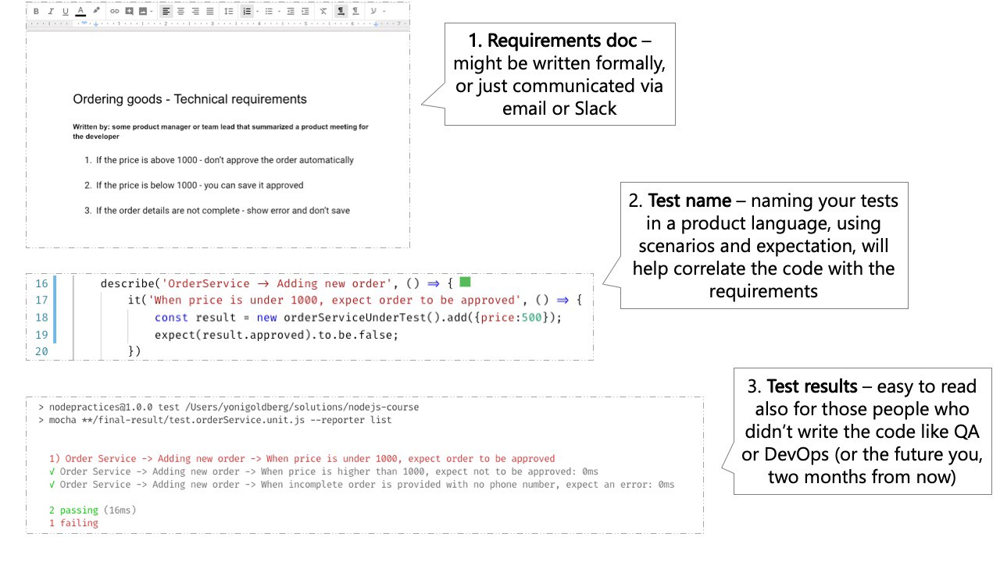

# Включайте 3 частини в кожну назву тесту

<br/><br/>

### Пояснення за один абзац

Звіт про тестування повинен показувати, чи поточна версія додатку відповідає вимогам для людей, які не обов'язково знайомі з кодом: тестувальника, DevOps-інженера, який виконує розгортання, і майбутнього вас через два роки. Це найкраще досягається, якщо тести говорять на рівні вимог і включають 3 частини:

(1) Що тестується? Наприклад, метод ProductsService.addNewProduct

(2) За яких обставин і сценаріїв? Наприклад, ціна не передається в метод

(3) Який очікуваний результат? Наприклад, новий продукт не схвалено

<br/><br/>

### Приклад коду: назва тесту, що включає 3 частини
```javascript
//1. тестований модуль
describe('Products Service', () => {
  describe('Add new product', () => {
    //2. сценарій і 3. очікування
    it('When no price is specified, then the product status is pending approval', () => {
      const newProduct = new ProductService().add(...);
      expect(newProduct.status).to.equal('pendingApproval');
    });
  });
});
```

<br/><br/>

### Приклад коду – Антипатерн: потрібно прочитати весь код тесту, щоб зрозуміти намір
```javascript
describe('Products Service', () => {
  describe('Add new product', () => {
    it('Should return the right status', () => {
      //хм, що перевіряє цей тест? який сценарій і очікування?
      const newProduct = new ProductService().add(...);
      expect(newProduct.status).to.equal('pendingApproval');
    });
  });
});
```

<br/><br/>

###  "Правильний приклад: Звіт про тестування нагадує документ вимог"

 [З блогу "30 Node.js testing best practices" від Yoni Goldberg](https://medium.com/@me_37286/yoni-goldberg-javascript-nodejs-testing-best-practices-2b98924c9347)

 

<br/><br/>

