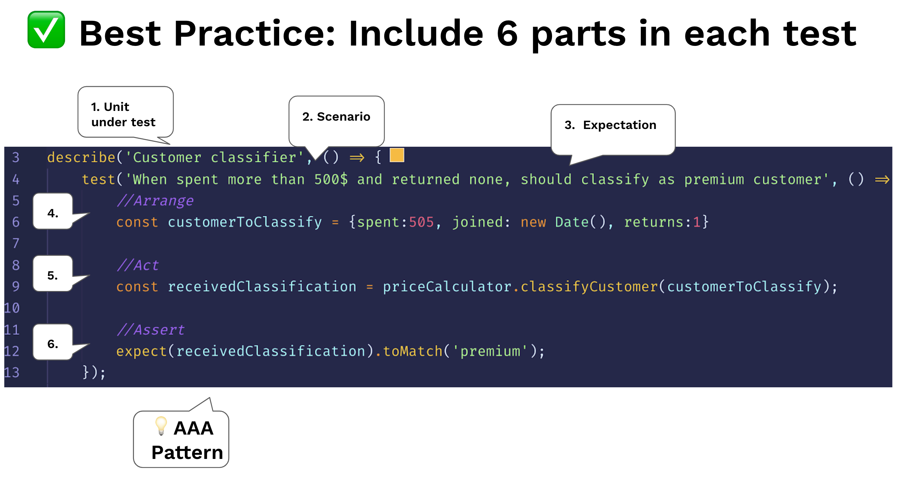

# Structure tests by the AAA pattern

<br/><br/>

### One Paragraph Explainer
Our biggest testing challenge is the lack of headspace - we already have the production code keeping us super-busy. For this reason the testing code must stay dead-simple and easy to understand. When reading a test case - it shouldn't feel like reading imperative code (loops, inheritance) rather more like HTML - a declarative experience. To achieve this, keep the AAA convention so the readers' mind will parse the test intent effortlessly. There are some other similar formats to this pattern, like XUnit 'Setup, Exercise, Verify, Teardown'. These are the three A:

The 1st A - Arrange: All the setup code to bring the system to the scenario the test aims to simulate. This might include instantiating the unit under test constructor, adding DB records, mocking/stubbing on objects and any other preparation code

The 2nd A - Act: Execute the unit under test. Usually 1 line of code

The 3rd A - Assert: Ensure that the received value satisfies the expectation. Usually 1 line of code


<br/><br/>

### Code example: a test structured with the AAA pattern
```javascript
describe.skip('Customer classifier', () => {
    test('When customer spent more than 500$, should be classified as premium', () => {
        //Arrange
        const customerToClassify = {spent:505, joined: new Date(), id:1}
        const DBStub = sinon.stub(dataAccess, 'getCustomer')
            .reply({id:1, classification: 'regular'});

        //Act
        const receivedClassification = customerClassifier.classifyCustomer(customerToClassify);

        //Assert
        expect(receivedClassification).toMatch('premium');
    });
});
```

<br/><br/>

### Code Example – Anti Pattern: no separation, one bulk, harder to interpret
```javascript
test('Should be classified as premium', () => {
    const customerToClassify = {spent:505, joined: new Date(), id:1}
    const DBStub = sinon.stub(dataAccess, 'getCustomer')
        .reply({id:1, classification: 'regular'});
    const receivedClassification = customerClassifier.classifyCustomer(customerToClassify);
    expect(receivedClassification).toMatch('premium');
});
```

<br/><br/>

###  "Include 6 parts in each test"

 [From the blog "30 Node.js testing best practices" by Yoni Goldberg](https://medium.com/@me_37286/yoni-goldberg-javascript-nodejs-testing-best-practices-2b98924c9347)

 

<br/><br/>

### "It is important for the test reader to be able to quickly determine what behavior the test is verifying"
From the book [XUnit Patterns](http://xunitpatterns.com/Four%20Phase%20Test.html):

> It is important for the test reader to be able to quickly determine what behavior the test is verifying. It can be very confusing when various behaviors of the system under test (SUT) are being invoked, some to set up the pre-test state (fixture) of the SUT, others to exercise the SUT and yet others to verify the post-test state of the SUT. Clearly identifying the four phases makes the intent of the test much easier to see.

<br/><br/>

### "A useful technique [...] is that writing the Assert first is a great place to start."
From the article [Arrange, Act, Assert](https://xp123.com/articles/3a-arrange-act-assert/) by Bill Wake which first observed and named the pattern

> **Where to Begin?**
>
> You might think that the Arrange is the natural thing to write first, since it comes first.
When I’m systematically working through an object’s behaviors, I may write the Act line first. 
>
> But a useful technique I learned from Jim Newkirk is that writing the Assert first is a great place to start. When you have a new behavior you know you want to test, Assert First lets you start by asking “Suppose it worked; how would I be able to tell?” With the Assert in place, you can do what Industrial Logic calls “Frame First” and lean on the IDE to “fill in the blanks.” 

<br/><br/>

### "Once you get used to this pattern, you can read and understand the tests more easily"
From the book [Unit Testing, Principles, Practices, and Patterns](https://freecontent.manning.com/making-better-unit-tests-part-1-the-aaa-pattern/)
> The 3A pattern is simple and provides a uniform structure for all tests in the suite. This uniform structure is one of its biggest advantages: once you get used to this pattern, you can read and understand the tests more easily. That, in turn, reduces the maintenance cost for your entire test suite.
